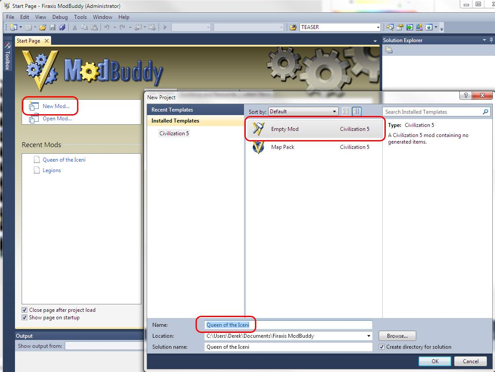
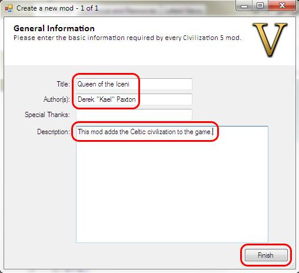
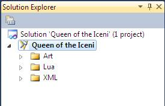
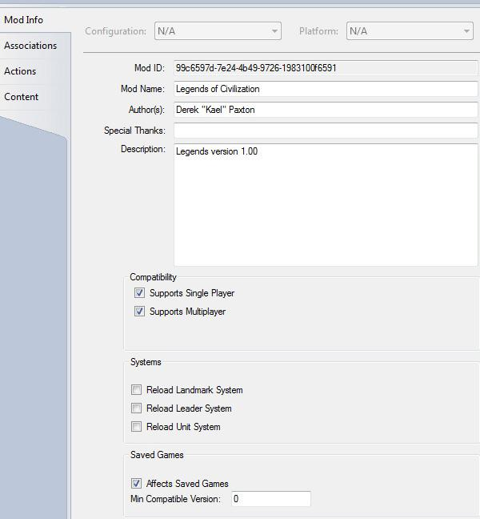
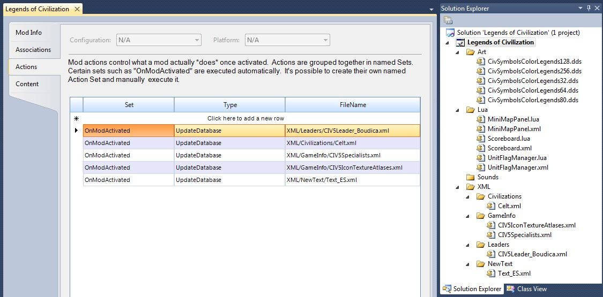
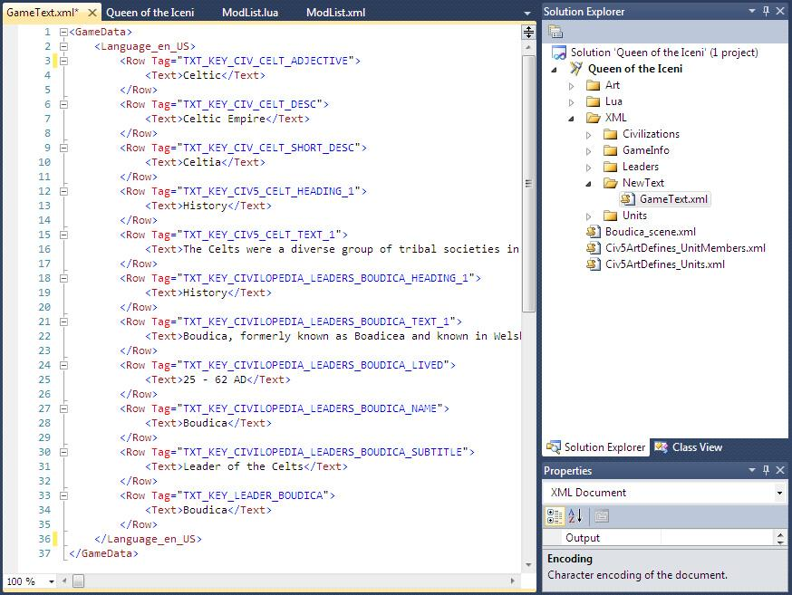

## Creating a Mod

### ModBuddy

ModBuddy is the primary modding tool Firaxis provides to make modding easier than it has been in prior versions. ModBuddy is a full featured XML and Lua editor with plugins built to handle building Civ5 mod project, publish mods and templates to make modding easier.

#### Creating a Mod

Follow these steps to get started on your own mod. (Screen shots may differ slightly from the release version since I'm using beta versions of all the tools to create this document).

1. Load ModBuddy (the Sid Meier's Civilization V SDK).



2. From the Main menu of ModBuddy select "New Mod"

3. Select "Empty Mod", give our Mod a name and click "OK".

4. On the general information screen enter the mod's title, author and description. Note that the Mod's title and description have to be at least 8 characters long. In this example I've selected "Legends of Civilization" and the title, put my name in as the author and put in a brief description.

Once that is done select "Next".



That is all you need to create a new mod. The mod doesn't do anything yet, we will get to that later sections.

#### Organizing Your Project

There is no required directory structure for your mod project in ModBuddy. Modders can places the files where it is convenient for them and their project. Many people may start by creating files at the root of the project but as the project grows having all the files in one location can be frustrating and waste the modders time.



Renaming, moving and deleting files, if you want to reorganize them later, is fairly easy to do (files aren't typically referenced by their path).

I would recommend creating three folders off of your project, Art, Lua and XML. These serve as a good base for separating the different types of files we will be working with. Within the Art, Lua and XML folders I tend to follow the same directory structure that Firaxis used with Civilization V because, it's as good as any other, and it helps me remember where things are if things are setup consistently. For example, beneath the XML directory I created a Civilizations directory to place the new civilization XML files.

There isn't any reason to create directories if there aren't any files within them. So if your mod doesn't have any art files don't bother creating an Art directory. If your mod doesn't have any XML Leaders files then don't bother creating an XML/Leaders directory.

Note: This is one way to organize your project. It is equally valid to organize your project by your assets instead of asset types. You could, for example, have a directory for each Civilization you are adding to the game. That directory would contain all the civilization XML, leader XML, unique unit XML, art, audio and Lua files required for that civilization.

#### Mod Properties

Right click on Mod icon in the Solution Explorer and select properties to view the mod properties. This is where the mod instructions are setup, and modders should become familiar with the options here (especially the Actions tab) to configure and enable the features their mod needs.



**Mod Info** - This contains all the setup information you entered when creating your mod. It can be updated if you add new members to your team, you want to modify the description, or add thanks to more people. This is what people see when they browse for mods.

**Compatibility** - By default mods are listed as being compatible with Single Player and Multiplayer. Unchecking these boxes removes that compatibility. Checking or unchecking this box doesn't change the mod at all (unchecking Supports Multiplayer doesn't change a mod to make it work in multiplayer) it only controls the options available with that mod for those users.

**Systems** - The art system is loaded before mods are. So if your mod changes landmarks, leaders or units then these options need to be selected to allow the game to reload those graphics. As an example a later mod in this document will change the scale of unit models. That change won't take effect if we don't have "Reload Unit System" checked.

**Saved Games** - If the mod effects save games then this option has to be selected. It is selected by default. Unchecking this option means that saves created when this mod is running can be loaded by the base game without the mod in place. This is possible only for UI and balance mods that don't add or remove assets to the game. If you add anything, such as a new civilization, then your mod will affect save games (since the base game doesn't have your civilization and will crash trying to reference it). As with compatibility checking or unchecking this box doesn't change your mod, it doesn't make your save games any more or less compatible with the base game.

**Associations** - This is where associations are made to other mods. there are three types:
- Dependencies - Mods that are required before you mod can load.
- References - Optional mods that can be loaded to work with your mod (important if you are using a partially exclusive or totally exclusive mod).
- Blocks - Mods listed here cannot be loaded with your mod.

**Actions** - Actions are required to tell the game which files need to be run when your mod loads. By default, having files included with your mod won't change anything unless there is an action here to update the database with your file. Remember that XML isn't directly used by the game engine, the game engine uses the database, so our mod has to update the database with our XML files.

The most common "Set" you will need is "OnModActivated" (meaning to happen when the mod loads) and the most common type is "UpdateDatabase" (to apply the specified xml file). An example of a mod with applied xml files is in the following screenshot:



**Content** - The content screen specifies special file types within the mod much as the Actions screen is used for database updates. The following content types are available:
- CityViewUIAddin- Adds the UI to the City View root
- Custom- A custom UI which is added as an entry to the "Custom Game" menu.
- DiplomacyUIAddin- Adds the UI to the Leaderhead root (base diplomacy screen).
- InGameUIAddin- Adds to the UI of the main game interface.
- Map- A world builder map (this doesn't have to be defined for this map to be usable, only for it to be published and for any UI's to know about it).
- MapScript- A Lua map script (this doesn't have to be defined for this map to be usable, only for it to be published and for any UI's to know about it).

#### Creating an Object

Creating new assets with ModBuddy is very simple. This document will go through some detailed "how to" procedures later. But the overall process is that an xml file is created in ModBuddy. Within that XML file there must be a GameData element. Within that GameData element (meaning between the start tag of `<GameData>` and end tag of `</GameData>`) there must be an element that sets the asset type. Within the Element that sets the assets type there must be a Row element, and within the Row element is where all the object specific attributes exist as elements.

The following is a sample of adding a new goody hut entry. The line numbers are simply for reference, they wouldn't exist in the real XML.

```xml
1. <GameData>
2.      <GoodyHuts>
3.          <Row>
4.              <Type>GOODY_SKELETON</Type>
                <Description>TXT_KEY_GOODY_SKELETON</Description>
                <Sound>AS2D_GOODY_WARRIOR</Sound>
                <UnitClass>UNITCLASS_SKELETON</UnitClass>
5.          </Row>
6.      </GoodyHuts>
7. </GameData>
```

1. The first line is the start of the GameData element. This is what tells the game that we are going to be passing in some new XML.

2. Next we have an opening depending on the type of asset we are creating. If we are creating a civilization, then it is `<Civilizations>`, it we are creating a leader then it `<Leaders>`, it's a unit it is `<Units>`. the easiest way to see what the opening tag should be is to look at the definition of an existing version of that asset type. In this example I'm using the definition for a goody hut. The file name in ModBuddy isn't important, the directory in ModBuddy isn't important. This entry is how the game knows what sort of asset we are creating.

3. `<Row>` is the XML tag that tells the system that we are going to start an entry for the type defined in the prior line.

4. This is the beginning of the object specific attributes. The exact attributes vary depending on the object type. Check out similar assets for examples, and the schema at the beginning of the XML files to see what's available.

5. Every element we start with XML must be closed. We have to tell the system that we are done with the Row element. To close the `<Row>` element we add a `</Row>` tag.

6. Just as we needed to close the Row element we also need to close the `<GoodyHuts>` element. In this case with a `</GoodHuts>` tag.

7. Finally we close the `<GameData>` element with `</GameData>`.

The above example show an assets that only has one table. But most of the assets in Civilization V have multiple tables. Consider the following for the engineer specialist:

```xml
<GameData>
    <Specialists>
        <Row>
            <Type>SPECIALIST_ENGINEER</Type>
            <Description>TXT_KEY_SPECIALIST_ENGINEER</Description>
            <Strategy>TXT_KEY_SPECIALIST_ENGINEER_STRATEGY</Strategy>
            <GreatPeopleTitle>TXT_KEY_SPECIALIST_ENGINEER_TITLE</GreatPeopleTitle>
            <Visible>true</Visible>
            <Cost>0</Cost>
            <GreatPeopleUnitClass>UNITCLASS_ENGINEER</GreatPeopleUnitClass>
            <GreatPeopleRateChange>3</GreatPeopleRateChange>
            <IconAtlas>CITIZEN_ATLAS</IconAtlas>
            <PortraitIndex>1</PortraitIndex>
        </Row>
    </Specialists>
    <SpecialistYields>
        <Row>
            <SpecialistType>SPECIALIST_ENGINEER</SpecialistType>
            <YieldType>YIELD_PRODUCTION</YieldType>
            <Yield>1</Yield>
        </Row>
    </SpecialistYields>
</GameData>
```

Here we have two tables, Specialists and SpecialistYields. Although slightly more complex for formatting (and different than how this was handled in Civilization IV) these tables are defined within the schema the top of the file. The only real disadvantage to this method is sometimes it's difficult to see all the attributes that pertain to a specific asset. The resources file, for example, has 7 tables, making it a bit of a pain to find all the attributes that are set for a specific attribute. So make sure when you copy the information for an asset, you get all the information in the file for it. Even if it is in more than one table.

#### Updating an Object

Sometimes you don't want to add a new asset, you just want to change an asset in the base game. This is as simple as adding an `<Update>` element between the asset tags (where the `<Row>` element typically goes).

An Update element has two child elements, a `<Set`> element and a `<Where>` element.

**Set** - This element uses an XML attribute to determine what change is going to take place. Such as `<Set Combat="20"/>`.

**Where** - This element determines our matching condition. Where we want the change to take place. Such as <Where Type="UNIT_JAPANESE_SAMURAI"/>.

Note that there is no difference (from an XML perspective) between `<Set Combat="20"></Set>` and `<Set Combat="20"/>`. Including the / as the last character in the tag is another way to mark that element closed. We don't commonly do it because we need to include data between the start and end tag. but in cases like these where there is no data between the tags it's slightly more clean to end the element in the start tag.

Let's put it together for a change. In Civ5 Engineer specialists and Citizens both increase production by 1. But in our mod we want Engineers to boost production by 2. This is the SpecialistYields table in Civ5 (the part that sets the Engineer's yield is highlighted in blue):

```xml
<GameData>
    <SpecialistYields>
        <Row>
            <SpecialistType>SPECIALIST_CITIZEN</SpecialistType>
            <YieldType>YIELD_PRODUCTION</YieldType>
            <Yield>1</Yield>
        </Row>
        <Row>
            <SpecialistType>SPECIALIST_MERCHANT</SpecialistType>
            <YieldType>YIELD_GOLD</YieldType>
            <Yield>2</Yield>
        </Row>
        <Row>
            <SpecialistType>SPECIALIST_SCIENTIST</SpecialistType>
            <YieldType>YIELD_SCIENCE</YieldType>
            <Yield>3</Yield>
        </Row>
        <Row>
            <SpecialistType>SPECIALIST_ENGINEER</SpecialistType>
            <YieldType>YIELD_PRODUCTION</YieldType>
            <Yield>1</Yield>
        </Row>
    </SpecialistYields>
</GameData>
```

In order to change the Yield to 2 we need the following update (the line numbers are just for reference, they should not exist in real code):

```xml
1. <GameData>
2.     <SpecialistYields>
3.         <Update>
4.             <Set Yield="2"/>
5.             <Where SpecialistType="SPECIALIST_ENGINEER"/>
6.         </Update>
7.     </SpecialistYields>
8. </GameData>
```

1. This is the start of the GameData element. This is what tells the game that we are going to be passing in some new XML.

2. Next we have the name of the table. The table we are updating is SpecialistYields, so the opening element is `<SpecilaistYields>`.

3. On an add operation we had `<Row>` at this level to show we were going to start a new entry. But, to update an asset we use the `<Update>` tag here.

4. As discussed above there are two elements inside the `<Update>` tag. The first is Set. In this example we are setting the Yield to 2 with `<Set Yield="2"/>`.

5. This is the condition part of the update expression. The update already knows to set Yield to 2, but this is where we tell it which Yield to set to 2. In this case `<Where SpecialistType="SPECIALIST_ENGINEER"/>` tells it to set Yields to 2 if the SpecialistType element equals SPECiALIST_ENGINEER.

6. This is the end of the `<Update>` element.

7. This is the end of the `<SpecialistYields>` element.

8. This is the end of the `<GameData>` element.

#### Multiple Condition Updates

Sometimes we will want our update to check on more than one element before applying the update. Assume that we want to change the Food yield from Whales from 1 to 2. Consider the following sample from the Resource_YieldChanges table:

```xml
<Resource_YieldChanges>
    <Row>
        <ResourceType>RESOURCE_BANANA</ResourceType>
        <YieldType>YIELD_FOOD</YieldType>
        <Yield>1</Yield>
    </Row>
    <Row>
        <ResourceType>RESOURCE_WHALE</ResourceType>
        <YieldType>YIELD_FOOD</YieldType>
        <Yield>1</Yield>
    </Row>
    <Row>
        <ResourceType>RESOURCE_WHALE</ResourceType>
        <YieldType>YIELD_GOLD</YieldType>
        <Yield>1</Yield>
    </Row>
</Resource_YieldChanges>
```

We may try the following to accomplish this:

```xml
<GameData>
    <Resource_YieldChanges>
        <Update>
            <Set Yield="2"/>
            <Where ResourceType="RESOURCE_WHALE"/>
        </Update>
    </Resource_YieldChanges>
<GameData>
```

But since the above matches both on the Food and the Gold Rows (the green and the blue in the sample), both of those yields would be increased to 2.

```xml
<GameData>
    <Resource_YieldChanges>
        <Update>
            <Set Yield="2"/>
            <Where YieldType="YIELD_FOOD"/>
        </Update>
    </Resource_YieldChanges>
<GameData>
```

But in this case we would set the Food yields to 2 for all resources, including Bananas (in red) and Whales (in green) in our sample.

We need the ability to set a multi-conditional argument which we can do by adding multiple attributes to the Where element as in the following:

```xml
<GameData>
    <Resource_YieldChanges>
        <Update>
            <Set Yield="2"/>
            <Where ResourceType="RESOURCE_WHALE" YieldType="YIELD_FOOD"/>
        </Update>
    </Resource_YieldChanges>
<GameData>
```

Notice that in the above there is no logical qualifier between the two attributes. Attributes are "Anded" together, elements must match all of them before the Set is applied. If you want to use "Or" logic (the Set is applied if either condition is valid) then you should create separate update element that checks for each criteria.

#### Deleting an Object

Deleting an asset requires us to use the Delete element with an attribute to match on instead of the Row element.

For example the following code would remove the America civilization from the game:

```xml
<GameData>
    <Civilizations>
        <Delete type="CIVILIZATION_AMERICA"/>
    </Civilizations>
</GameData>
```

After being introduced to add and updates this syntax should be familiar. It doesn't matter what element the Delete matches on (in the example I use type), but be careful that if you are using a non-unique element. If you are deleting all the civilizations with the ARTSTYLE_EUROPEAN Art Style Type (`<Delete ArtStyleType="ARTSTYLE_EUROPEAN"/>`) then they will all be deleted. If another mod the player has loaded modifies an ArtStyleType to ARTSTYLE_EUROPEAN, then that civilization will be deleted by your mod. If another mod adds a civilization that is set to ARTSTYLE_EUROPEAN then your mod will delete it.

The most important thing to remember when deleting assets is that all references to that asset also need to be cleaned up or your mod will have errors loading. References in Civ5 are unidirectional, one asset refers to another, the assets don't refer to each other. Sometimes which asset refers to which isn't obvious. For example the civilization file refers to the unique unit (CIVILIZATION_AMERICA refers to UNIT_AMERICAN_B17) but the unique unit doesn't refer to the civilization it belong to. So you could delete CIVILIZATION_AMERICA without any errors. But if you deleted UNIT_AMERICAN_B17 by itself you would get an error when CIVILIZATION_AMERICA tried to reference it.

These references are the most difficult part of deleting assets since it's often difficult to tell what assets refer to the asset we are deleting. Especially if other mods refer to the assets we are deleting, for example if another mod adds a unit that require the Steam Power technology, but you have deleted that technology. Because of this if we delete base assets it's probably best if your mod is an exclusive mod. You can't assume compatibility if you are removing base assets from the game.

Another option is to disable assets without deleting them. The ability to do this varies depending in the Asset type. If you were removing a civilization it may be best just to make it non-playable:

```xml
<GameData>
    <Civilizations>
        <Update>
            <Set Playable="0" />
            <Where Type="CIVILIZATION_AMERICA" />
        </Update>
    </Civilizations>
</GameData>
```

A delete with no conditions matches on everything, so it deleted on everything. The following removes all civilizations from the game.

```xml
<GameData>
    <Civilizations>
        <Delete />
    </Civilizations>
<GameData>
```

Deleting all the assets is also a big step. Remember that order in the file matters. So if you were to add a civilization after deleting all of them with the above code, then you would want the add to happen after the total delete. If you add your civilization before the delete then your new civ will be deleted too. This will also delete any assets from mods loaded before your mod that added civilizations.

#### How to: Add Text

Text is an asset type similar to civilizations, leaders and units. The asset type for English is `<Language_en_US>`, just as the asset type for civilizations is `<Civilizations>`. The `<Row>` element is used to add new text, but with text we have to include an attribute with the `<Row>` element to assign the Tag.



In the screenshot we have added new text tags in ModBuddy. The Tag is how the game refers to the text string, the entry in `<Text></Text>` is what the game will display for this language when that text string is referenced. For example, with the above when TXT_KEY_CIV_CELT_DESC is referenced (as we will see in the How to: Add a Civilization section of this document) the game will display "Celtic Empire" when English is the active language.

To add the above follow these steps:

1. Create an XML folder off of the root of your project if you don't already have one. This isn't required but helps us organize our project.

2. Create a New Text folder under the XML folder. Again, this isn't required but helps us organize our project. I choose "New Text" as the folder name because that's what Firaxis called their text folder. Through this would still work regardless of the folder name.

3. Add an XML file under the New Text folder and rename it GameText.xml. As with the above this name isn't required, but it helps us to know that this is the XML file where we will store our text definitions. It would work as well if we called it Legends_text.xml, Celt_Civ_text.xml, Cabbage.xml or any file name.

4. Fill the file with the text definitions as in the screenshot above. Let's take a look at one of the values:

```xml
<GameData>
    <Language_en_US>
        <Row Tag="TXT_KEY_CIV_CELT_DESC">
            <Text>Celtic Empire</Text>
        </Row>
    </Language_en_US>
</GameData>
```

In the above section there is a new Language_en_US (English text) asset being added. The text decode will be used whenever TXT_KEY_CIV_CELT_DESC is used in the XML it will be displayed (to players with the English language selected) as "Celtic Empire".

#### Changing Text Strings

We may also want to change existing text strings in the base game. You overwrite the existing definition the same as changing any attribute. To begin you may want to look at the former text string definition. You can find base game text strings somewhere beneath "`<install directory>\assets\Gameplay\XML\NewText\`".

Looking through those files we can find the following text string definitions in CIV5ModdingText.xml:

```xml
<Row Tag="TXT_KEY_MODDING_LIKE_IT">
    <Text>Like it</Text>
</Row>
<Row Tag="TXT_KEY_MODDING_FLAG_MODERATION">
    <Text>Report</Text>
</Row>
```

If you want to have some fun (or suspect your mod is so offensive that you will get more report clicks than Likes) you can reverse these text strings by including the following in your mod:

```xml
<GameData>
    <Language_en_US>
        <Update>
            <Where Tag=" TXT_KEY_MODDING_LIKE_IT "/>
            <Set Text="Report"/>
        </Update>
        <Update>
            <Where Tag=" TXT_KEY_MODDING_FLAG_MODERATION"/>
            <Set Text="Like It"/>
        </Update>
    </Language_en_US>
</GameData>
```

Just like when changing other attributes we can use Update to change text definitions. The attribute we need to match on to do this is "Tag".
