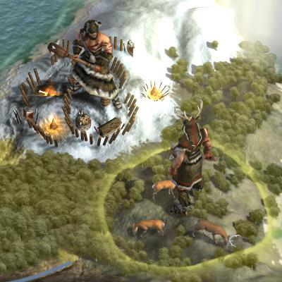
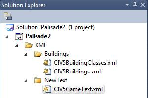
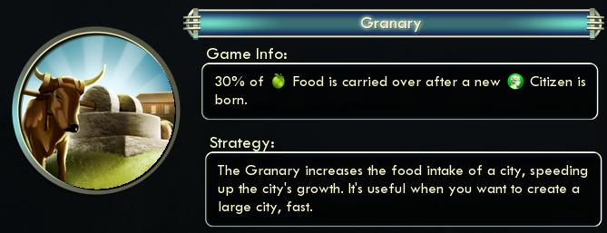
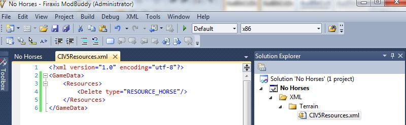
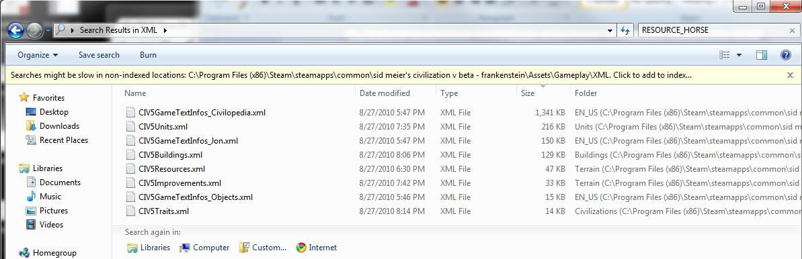
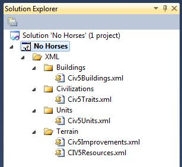
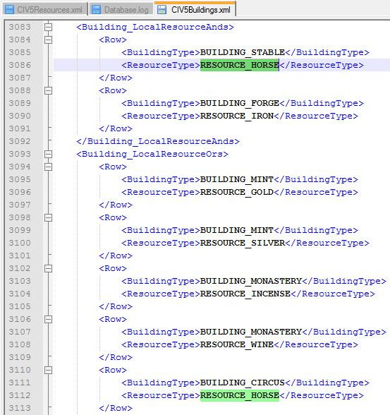

#### 如何改变艺术家的定义

This document won't cover creating art assets for Civ5. Firaxis has an SDK tool called Nexus for that, but I am the wrong guy to cover it.

But we will go through the art definitions. There are two parts. The first, UnitArtInfo, is for the formation as a whole. The unit definition points to this layer, it specifies how many units (and what sort of units) make up the formation. The entire file is too long to include here, but this is one sample from it.

```xml
<UnitArtInfos>
    <UnitArtInfo>
        <Type>ART_DEF_UNIT_BARBARIAN_EURO</Type>
        <Formation>Barbarian</Formation>
        <DamageStates>1</DamageStates>
        <UnitMemberArt>
            <MemberType>ART_DEF_UNIT_MEMBER_BARBARIAN_EURO_ALPHA</MemberType>
            <MemberCount>2</MemberCount>
        </UnitMemberArt>
        <UnitMemberArt>
            <MemberType>ART_DEF_UNIT_MEMBER_BARBARIAN_EURO_BRAVO</MemberType>
            <MemberCount>4</MemberCount>
        </UnitMemberArt>
        <UnitMemberArt>
            <MemberType>ART_DEF_UNIT_MEMBER_BARBARIAN_EURO_CHARLIE</MemberType>
            <MemberCount>4</MemberCount>
        </UnitMemberArt>
    </UnitArtInfo>
</UnitArtInfos>
```

Notice that this is the first XML definition we have covered that doesn't start with the `<GameData>` field. Unit art info isn't fully integrated into the database, so dealing with it is a bit different than the other XML assets.

The above definition for ART_DEF_UNIT_BARBARIAN_EURO contains ten units in its formation. Two EURO_ALPHA unit models, four EURO_BRAVO models and four EURO_CHARLIE models. Firaxis has different models makeup the formations so it doesn't look like a clone army. To see more about those models we need to check out the UnitMemberArtInfo definitions:

```xml
<UnitMemberArtInfos>
    <UnitMemberArtInfo>
        <Type>ART_DEF_UNIT_MEMBER_BARBARIAN_EURO_ALPHA</Type>
        <fScale>0.14</fScale>
        <Granny>Assets/Units/Barbarian/Barbarian_EURO/Barbarian_EURO_Alpha.fxsxml</Granny>
        <Combat>
            <Defaults>ART_DEF_TEMPLATE_SOLDIER</Defaults>
            <Weapon>
                <WeaponTypeTag>BLUNT</WeaponTypeTag>
                <WeaponTypeSoundOverrideTag>BLUNT</WeaponTypeSoundOverrideTag>
            </Weapon>
            <Weapon>
                <Usage>Vs_City ShortRange</Usage>
                <fVisKillStrengthMin>10.0</fVisKillStrengthMin>
                <fVisKillStrengthMax>20.0</fVisKillStrengthMax>
                <WeaponTypeTag>FLAMING_ARROW</WeaponTypeTag>
            </Weapon>
        </Combat>
        <MaterialTypeTag>CLOTH</MaterialTypeTag>
        <MaterialTypeSoundOverrideTag>FLESH</MaterialTypeSoundOverrideTag>
    </UnitMemberArtInfo>
    <UnitMemberArtInfo>
        <Type>ART_DEF_UNIT_MEMBER_BARBARIAN_EURO_BRAVO</Type>
        <fScale>0.14</fScale>
        <Granny>Assets/Units/Barbarian/Barbarian_EURO/Barbarian_EURO_Bravo.fxsxml</Granny>
        <Combat>
            <Defaults>ART_DEF_TEMPLATE_SOLDIER</Defaults>
            <Weapon>
                <WeaponTypeTag>BLUNT</WeaponTypeTag>
                <WeaponTypeSoundOverrideTag>BLUNT</WeaponTypeSoundOverrideTag>
            </Weapon>
            <Weapon>
                <Usage>Vs_City ShortRange</Usage>
                <fVisKillStrengthMin>10.0</fVisKillStrengthMin>
                <fVisKillStrengthMax>20.0</fVisKillStrengthMax>
                <WeaponTypeTag>FLAMING_ARROW</WeaponTypeTag>
            </Weapon>
        </Combat>
        <MaterialTypeTag>CLOTH</MaterialTypeTag>
        <MaterialTypeSoundOverrideTag>FLESH</MaterialTypeSoundOverrideTag>
    </UnitMemberArtInfo>
    <UnitMemberArtInfo>
        <Type>ART_DEF_UNIT_MEMBER_BARBARIAN_EURO_CHARLIE</Type>
        <fScale>0.14</fScale>
        <Granny>Assets/Units/Barbarian/Barbarian_EURO/Barbarian_EURO_Charlie.fxsxml</Granny>
        <Combat>
            <Defaults>ART_DEF_TEMPLATE_SOLDIER</Defaults>
            <Weapon>
                <WeaponTypeTag>BLUNT</WeaponTypeTag>
                <WeaponTypeSoundOverrideTag>BLUNT</WeaponTypeSoundOverrideTag>
            </Weapon>
            <Weapon>
                <Usage>Vs_City ShortRange</Usage>
                <fVisKillStrengthMin>10.0</fVisKillStrengthMin>
                <fVisKillStrengthMax>20.0</fVisKillStrengthMax>
                <WeaponTypeTag>FLAMING_ARROW</WeaponTypeTag>
            </Weapon>
        </Combat>
        <MaterialTypeTag>CLOTH</MaterialTypeTag>
        <MaterialTypeSoundOverrideTag>FLESH</MaterialTypeSoundOverrideTag>
    </UnitMemberArtInfo>
</UnitMemberArtInfos>
```

There are three UnitMemberArtInfo definitions in the above. Each sets the fScale (how large the unit model is) links to the actual art file (in the Granny attribute) and contains the tags used for the sound and animation effects.

Personally I'm not a huge fan of the large ten unit formations. The battles do look cool, but it's hard to distinguish all the small units on the map. So with this mod we are going to change from formations of ten units to a single large unit model.

One of the differences with the UnitArtInfo and UnitMemberArtInfo, since they aren't in the database, is that we can't use the `<Update>` function one them. We have to provide a complete copy of the modified file. Also because the unit system is loaded before the mod is we need to set "Reload Unit System" in our mod properties to have our changed unit model definitions take effect.

To do that we first have to change the UnitArtInfo for each unit to switch them to one member. Again I won't include the entire file here, but just our barbarian warrior example.

```xml
<UnitArtInfos>
    <UnitArtInfo>
        <Type>ART_DEF_UNIT_BARBARIAN_EURO</Type>
        <Formation>Barbarian</Formation>
        <DamageStates>1</DamageStates>
        <!-- blue area -->
        <UnitMemberArt>
            <MemberType>ART_DEF_UNIT_MEMBER_BARBARIAN_EURO_BRAVO</MemberType>
            <MemberCount>1</MemberCount>
        </UnitMemberArt>
        <!-- end of blue area -->
    </UnitArtInfo>
</UnitArtInfos>
```

And secondly we need to change the definition for our ART_DEF_UNIT_MEMBER_BARBARIAN_EURO_BRAVO to increase its size.

```xml
<UnitMemberArtInfos>
    <UnitMemberArtInfo>
        <Type>ART_DEF_UNIT_MEMBER_BARBARIAN_EURO_BRAVO</Type>
        <!-- blue area -->
        <fScale>0.32</fScale>
        <!-- end of blue area -->
        <Granny>Assets/Units/Barbarian/Barbarian_EURO/Barbarian_EURO_Bravo.fxsxml</Granny>
        <Combat>
            <Defaults>ART_DEF_TEMPLATE_SOLDIER</Defaults>
            <Weapon>
                <WeaponTypeTag>BLUNT</WeaponTypeTag>
                <WeaponTypeSoundOverrideTag>BLUNT</WeaponTypeSoundOverrideTag>
            </Weapon>
            <Weapon>
                <Usage>Vs_City ShortRange</Usage>
                <fVisKillStrengthMin>10.0</fVisKillStrengthMin>
                <fVisKillStrengthMax>20.0</fVisKillStrengthMax>
                <WeaponTypeTag>FLAMING_ARROW</WeaponTypeTag>
            </Weapon>
        </Combat>
        <MaterialTypeTag>CLOTH</MaterialTypeTag>
        <MaterialTypeSoundOverrideTag>FLESH</MaterialTypeSoundOverrideTag>
    </UnitMemberArtInfo>
</UnitMemberArtInfos>
```

The only change to the above is highlighted in blue. The fScale of the unit was changed from 0.12 to 0.32, so it's almost three times the size of normal.

One of the big advantages of switching from the larger formations to a single larger units is it leaves us with some unused unit art models. Before the barbarian unit formation was made up of three different unit models, Alpha, Bravo and Charlie. In our new barbarian formation we are using the Bravo model. So we have the Alpha model (which sports a cool deerskin antler headdress which is perfect for our Gaelic Warrior unit) available for use.



In the prior section, when we created our Gaelic Warrior we used the art definition of ART_DEF_UNIT_GAELIC_WARRIOR, now we need to add that definition to the UnitArtInfo.

```xml
<UnitArtInfos>
    <UnitArtInfo>
        <Type>ART_DEF_UNIT_GAELIC_WARRIOR</Type>
        <Formation>LooseCivilian</Formation>
        <DamageStates>1</DamageStates>
        <UnitMemberArt>
            <MemberType>ART_DEF_UNIT_MEMBER_BARBARIAN_EURO_ALPHA</MemberType>
            <MemberCount>1</MemberCount>
        </UnitMemberArt>
    </UnitArtInfo>
</UnitArtInfos>
```

We don't need to change the UnitMemberArtInfo since that definition hasn't changed. Instead this tells the game to use the ART_DEF_UNIT_MEMBER_BARBARIAN_EURO_ALPHA model as a single unit formation when the ART_DEF_UNIT_GAELIC_WARRIOR definition is set.

#### 如何添加建筑

Buildings are easy to add to the game. In this example we will add a palisade as an early defensive building. The palisade won't require any techs, so it's available from the first turn, and can't be built in any era except the Ancient Era (during later eras player should be using walls, castles and other powerful defensive buildings).



To do this we only need to update three tables. The first is Buildings table from CIV5Buildings.xml. The following adds the Palisade building to the game:

```xml
<GameData>
    <Buildings>
        <Row>
            <Type>BUILDING_PALISADE</Type>
            <BuildingClass>BUILDINGCLASS_PALISADE</BuildingClass>
            <Cost>60</Cost>
            <GoldMaintenance>1</GoldMaintenance>
            <Help>TXT_KEY_BUILDING_PALISADE_STRATEGY</Help>
            <Description>TXT_KEY_BUILDING_PALISADE</Description>
            <Civilopedia>TXT_KEY_CIV5_BUILDINGS_PALISADE_TEXT</Civilopedia>
            <Strategy>TXT_KEY_BUILDING_PALISADE_STRATEGY</Strategy>
            <ArtDefineTag>ART_DEF_BUILDING_WALLS</ArtDefineTag>
            <MaxStartEra>ERA_ANCIENT</MaxStartEra>
            <MinAreaSize>-1</MinAreaSize>
            <AllowsRangeStrike>true</AllowsRangeStrike>
            <Defense>250</Defense>
            <CityWall>true</CityWall>
            <HurryCostModifier>25</HurryCostModifier>
            <IconAtlas>BW_ATLAS_1</IconAtlas>
            <NeverCapture>true</NeverCapture>
            <PortraitIndex>32</PortraitIndex>
        </Row>
    </Buildings>
</GameData>
```

Civ5 uses Buildingclasses for the replacement buildings used as unique buildings, for example the Market and Bazaar are both BUILDINGCLASS_MARKET. That way all the AI and logic can be programmed using BUILDINGCLASS_MARKET and the game can translate that to mean a Market for most civilizations and a Bazaar for Arabian players.

The next entry is the BuildingClasses table in the CIV5BuildingClasses.xml file:

```xml
<GameData>
    <BuildingClasses>
        <Row>
            <Type>BUILDINGCLASS_PALISADE</Type>
            <DefaultBuilding>BUILDING_PALISADE</DefaultBuilding>
            <Description>TXT_KEY_BUILDING_PALISADE</Description>
        </Row>
    </BuildingClasses>
</GameData>
```

And finally we need the text strings to support the building we added. There are three new tags we referenced in the above building definition.

```xml
<GameData>
    <Language_en_US>
        <Row Tag="TXT_KEY_BUILDING_PALISADE">
            <Text>Palisade</Text>
        </Row>
        <Row Tag="TXT_KEY_BUILDING_PALISADE_STRATEGY">
            <Text>Palisade's provide an early defense against attackers. Though they are less expensive than walls, they provide only half the defense.</Text>
        </Row>
        <Row Tag="TXT_KEY_CIV5_BUILDINGS_PALISADE_TEXT">
            <Text>Built of little more than mud and raw lumber palisades were as vulnerable to the weather as they were to enemy attack. Yet they remained popular in border cities if only because they made the people behind them feel more secure.</Text>
        </Row>
    </Language_en_US>
</GameData>
```

That's it, a complete mod that adds a new building to the game, that is modular (can be used with other mods without compatibility issues) and can be created an published within 5-10 minutes.

#### 如何修改建筑

Let's assume we want to change the way that some buildings work in the game. Currently a Granary adds food to the city it is in and Hospital's allow a city to carry over 50% of its food after a population increase.

The following is the base definition for a Granary:

```xml
<Buildings>
    <Row>
        <Type>BUILDING_GRANARY</Type>
        <BuildingClass>BUILDINGCLASS_GRANARY</BuildingClass>
        <FreeStartEra>ERA_RENAISSANCE</FreeStartEra>
        <Cost>100</Cost>
        <GoldMaintenance>1</GoldMaintenance>
        <PrereqTech>TECH_POTTERY</PrereqTech>
        <Help>TXT_KEY_BUILDING_GRANARY_STRATEGY</Help>
        <Description>TXT_KEY_BUILDING_GRANARY</Description>
        <Civilopedia>TXT_KEY_CIV5_BUILDINGS_GRANARY_TEXT</Civilopedia>
        <Strategy>TXT_KEY_BUILDING_GRANARY_STRATEGY</Strategy>
        <ArtDefineTag>ART_DEF_BUILDING_GRANARY</ArtDefineTag>
        <MinAreaSize>-1</MinAreaSize>
        <ConquestProb>66</ConquestProb>
        <HurryCostModifier>25</HurryCostModifier>
        <IconAtlas>BW_ATLAS_1</IconAtlas>
        <PortraitIndex>0</PortraitIndex>
    </Row>
</Buildings>
<Building_YieldChanges>
    <Row>
        <BuildingType>BUILDING_GRANARY</BuildingType>
        <YieldType>YIELD_FOOD</YieldType>
        <Yield>2</Yield>
    </Row>
</Building_YieldChanges>
```

And the following is the base definition for a Hospital:

```xml
<Buildings>
    <Row>
        <Type>BUILDING_HOSPITAL</Type>
        <BuildingClass>BUILDINGCLASS_HOSPITAL</BuildingClass>
        <Cost>400</Cost>
        <GoldMaintenance>2</GoldMaintenance>
        <PrereqTech>TECH_BIOLOGY</PrereqTech>
        <Help>TXT_KEY_BUILDING_HOSPITAL_HELP</Help>
        <Description>TXT_KEY_BUILDING_HOSPITAL</Description>
        <Civilopedia>TXT_KEY_BUILDING_HOSPITAL_PEDIA</Civilopedia>
        <Strategy>TXT_KEY_BUILDING_HOSPITAL_STRATEGY</Strategy>
        <ArtDefineTag>ART_DEF_BUILDING_HOSPITAL</ArtDefineTag>
        <FoodKept>50</FoodKept>
        <MinAreaSize>-1</MinAreaSize>
        <ConquestProb>66</ConquestProb>
        <HurryCostModifier>0</HurryCostModifier>
        <IconAtlas>BW_ATLAS_1</IconAtlas>
        <PortraitIndex>45</PortraitIndex>
    </Row>
</Buildings>
```

The nice thing about the `<update>` tag is that you only have to specify exactly what you want to change. To change the definitions for these create a new files in the mod called /XML/Buildings/CIV5Buildings.xml and add that file to update the database in the Mod's properties as we have done with all of our other changes. As with the others the filename and directory path doesn't matter except to help us organize our mod.

If we want the Granary to keep 30% of the food after a population growth, and we want to remove that ability from the Hospital and replace it with the ability to grant the Medic promotion to any units trained there we need to add the following XML to our new CIV5Buildings.xml file:

```xml
<GameData>
    <Buildings>
        <Update>
            <Set FoodKept="30"/>
            <Where Type="BUILDING_GRANARY"/>
        </Update>
        <Update>
            <Set Help="TXT_KEY_BUILDING_GRANARY_HELP"/>
            <Where Type="BUILDING_GRANARY"/>
        </Update>
        <Update>
            <Set FoodKept="0"/>
            <Where Type="BUILDING_HOSPITAL"/>
        </Update>
        <Update>
            <Set TrainedFreePromotion="PROMOTION_MEDIC"/>
            <Where Type="BUILDING_HOSPITAL"/>
        </Update>
    </Buildings>
</GameData>
```

The above XML makes four changes. The first is to set the FoodKept attribute of Granaries to 30 (so 30% of the food is kept after population growth). The second sets the Help attribute of Granaries to TXT_KEY_BUILDING_GRANARY_HELP. Granaries don't normally have a Help string, but we will need one so players know about the functionality we are adding. The third removes the FoodKept ability from Hospitals by setting it to 0. And the fourth is to set the TrainedFreePromotion attribute of Hospitals to PROMOTION_MEDIC, so new units trained in a city with a Hospital start with the Medic promotion.

Not only is this very simple to read, and see exactly what you have changed (in prior versions all of the xml would need to be replaced so you would need to use a compare utility to see what was changed) it also makes the changes very modular. One mod can allow Granaries to store food after growth, another could modify the Granary's cost and a third could change the Granary to a different tech.

We also need a few text strings to support this. We will need to add the new TXT_KEY_BUILDING_GRANARY_HELP text string, and we need to update the already existing TXT_KEY_BUILDING_HOSPITAL_HELP text string.

```xml
<GameData>
    <Language_en_US>
        <Row Tag="TXT_KEY_BUILDING_GRANARY_HELP">
           <Text>30% of [ICON_FOOD] Food is carried over after a new [ICON_CITIZEN] Citizen is born.</Text>
        </Row>
        <Update>
            <Where Tag="TXT_KEY_BUILDING_HOSPITAL_HELP"/>
            <Set Text="All newly-trained Units in this City receive the [COLOR_POSITIVE_TEXT]Medic[ENDCOLOR] Promotion, increasing the heal rate of this unit and all adjacent units by 1 per turn."/>
        </Update>
    <Language_en_US>
<GameData>
```

Notice that the Granary string is a new string, as we added for other assets. But the Hospital string is an update operation, which we need to change the base text string to the new one.



The process covered in this section is as valid for leaders, units and other assets as it is for buildings. The `<Update>` element is an easy way for modders to change existing base game assets in a modular way.

#### 如何移除资源

Removing a resource is a good example of removing any referenced asset from Civ5. Resources are referenced by units, buildings, improvements, and other sources. So simply deleting the asset will cause errors or the game to crash.

If we want to remove horses from the game (and it wasn't for these references) the following mod would work:



But when this mod is loaded the game crashes and we get the following errors in the Database.log file:

```
[66897.643] Validating Foreign Key Constraints...
[66897.659] Invalid Reference on Building_LocalResourceAnds.ResourceType - "RESOURCE_HORSE" does not exist in Resources
[66897.659] Invalid Reference on Building_LocalResourceOrs.ResourceType - "RESOURCE_HORSE" does not exist in Resources
[66897.659] Invalid Reference on Trait_ResourceQuantityModifiers.ResourceType - "RESOURCE_HORSE" does not exist in Resources
[66897.674] Invalid Reference on Improvement_ResourceTypes.ResourceType - "RESOURCE_HORSE" does not exist in Resources
[66897.674] Invalid Reference on Improvement_ResourceType_Yields.ResourceType - "RESOURCE_HORSE" does not exist in Resources
[66897.674] Invalid Reference on Resource_YieldChanges.ResourceType - "RESOURCE_HORSE" does not exist in Resources
[66897.674] Invalid Reference on Resource_Flavors.ResourceType - "RESOURCE_HORSE" does not exist in Resources
[66897.674] Invalid Reference on Resource_TerrainBooleans.ResourceType - "RESOURCE_HORSE" does not exist in Resources
[66897.674] Invalid Reference on Resource_TerrainBooleans.ResourceType - "RESOURCE_HORSE" does not exist in Resources
[66897.674] Invalid Reference on Resource_TerrainBooleans.ResourceType - "RESOURCE_HORSE" does not exist in Resources
[66897.674] Invalid Reference on Resource_QuantityTypes.ResourceType - "RESOURCE_HORSE" does not exist in Resources
[66897.674] Invalid Reference on Resource_QuantityTypes.ResourceType - "RESOURCE_HORSE" does not exist in Resources
[66897.674] Invalid Reference on Unit_ResourceQuantityRequirements.ResourceType - "RESOURCE_HORSE" does not exist in Resources
[66897.674] Invalid Reference on Unit_ResourceQuantityRequirements.ResourceType - "RESOURCE_HORSE" does not exist in Resources
[66897.674] Invalid Reference on Unit_ResourceQuantityRequirements.ResourceType - "RESOURCE_HORSE" does not exist in Resources
[66897.674] Invalid Reference on Unit_ResourceQuantityRequirements.ResourceType - "RESOURCE_HORSE" does not exist in Resources
[66897.674] Invalid Reference on Unit_ResourceQuantityRequirements.ResourceType - "RESOURCE_HORSE" does not exist in Resources
[66897.674] Invalid Reference on Unit_ResourceQuantityRequirements.ResourceType - "RESOURCE_HORSE" does not exist in Resources
[66897.674] Invalid Reference on Unit_ResourceQuantityRequirements.ResourceType - "RESOURCE_HORSE" does not exist in Resources
[66897.674] Invalid Reference on Unit_ResourceQuantityRequirements.ResourceType - "RESOURCE_HORSE" does not exist in Resources
[66897.674] Invalid Reference on Unit_ResourceQuantityRequirements.ResourceType - "RESOURCE_HORSE" does not exist in Resources
[66897.674] Invalid Reference on Unit_ResourceQuantityRequirements.ResourceType - "RESOURCE_HORSE" does not exist in Resources
[66897.674] Failed Validation.
```

The problem is the existing references to non-existing Horses. Although the Database.log file gives us some indication of where the errors are coming from, the easiest way to find out what files contain a reference to RESOURSE_HORSE is a file search.

To do that I start in the "`<Civ5 install dir>\Assets\Gameplay\XML`" directory and do a search for RESOURCE_HORSE and select to have my search include file contents. Doing so gives me the following:



We don't need to worry about the text files. The text files are only string decodes, they don't reference anything. The fact that RESOURCE_HORSE exists in them is only part of a longer text string. That leaves us with: CIV5Units.xml, CIV5Buildings.xml, CIV5Resources.xml, CIV5Improvements.xml and Civ5Traits.xml.



My next step is to create xml files for each of the files I have to supply updates for. As stated in earlier sections, we could have all these changes in a single file and the folder and file names don't matter. I prefer to maintain Civ5's structure and filenames because it is easier for me to remember, but a single XML file called RemoveHorses.xml is just as valid.

Once we have the blank files we have to look through the original version to see what reference we need to remove. We will start with Civ5Buildings.xml.

A search of Civ5Buildings.xml shows two references to RESOURCE_HORSE. It is in the Building_LocalResourceAnds table for Stables, and in the Building_LocalResourceOrs table for the Circus. Both of these references will need to be removed by our mod before it will be able to load.



The following xml for our Mod's Civ5Buildings.xml will remove both of the references.

```xml
<GameData>
    <Building_LocalResourceAnds>
        <Delete ResourceType="RESOURCE_HORSE"/>
    </Building_LocalResourceAnds>
    <Building_LocalResourceOrs>
        <Delete ResourceType="RESOURCE_HORSE"/>
    </Building_LocalResourceOrs>
</GameData>
```

And we need to do the same thing for the Traits, Units, Improvements and Resources files, which leaves us with the following.

Civ5Traits.xml:

```xml
<GameData>
    <Trait_ResourceQuantityModifiers>
        <Delete ResourceType="RESOURCE_HORSE"/>
    </Trait_ResourceQuantityModifiers>
</GameData>
```

Civ5Units.xml:

```xml
<GameData>
    <Unit_ResourceQuantityRequirements>
        <Delete ResourceType="RESOURCE_HORSE"/>
    </Unit_ResourceQuantityRequirements>
</GameData>
```

Civ5Improvements.xml:

```xml
<GameData>
    <Improvement_ResourceTypes>
        <Delete ResourceType="RESOURCE_HORSE"/>
    </Improvement_ResourceTypes>
    <Improvement_ResourceType_Yields>
        <Delete ResourceType="RESOURCE_HORSE"/>
    </Improvement_ResourceType_Yields>
</GameData>
```

Civ5Resources.xml:

```xml
<GameData>
    <Resources>
        <Delete type="RESOURCE_HORSE"/>
    </Resources>
    <Resource_YieldChanges>
        <Delete ResourceType="RESOURCE_HORSE"/>
    </Resource_YieldChanges>
    <Resource_Flavors>
        <Delete ResourceType="RESOURCE_HORSE"/>
    </Resource_Flavors>
    <Resource_TerrainBooleans>
        <Delete ResourceType="RESOURCE_HORSE"/>
    </Resource_TerrainBooleans>
    <Resource_QuantityTypes>
        <Delete ResourceType="RESOURCE_HORSE"/>
    </Resource_QuantityTypes>
</GameData>
```

Once the above changes are made we will have a mod that removes horses, and all the references to horses from the game. Keep in mind that this mod will not be compatible with other mods that reference horses. If for example a mod adds a new mounted unit that has a resource require of horses. Which is why mods that delete base assets should be marked exclusive.