#### 如何用 Lua 禁用单位图标

In Civilization V Units have a Unit Icon floating above them. We are going to add the ability to disable that unit icon.

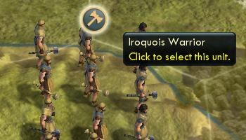

First we have to find what Lua file controls the unit icon. There is no easy reference for this, it takes a bit of searching. Fortunately Firaxis has used fairly explanatory names, the unit icon is controlled by the UnitFlagManager.lua and UnitFlagManager.xml files. These are both in the `<Civilization V>\assets\UI\InGame` directory.

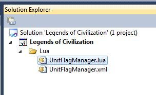

First we need to add two new files to our project. Unlike XML files it is important that we maintain the same names for Lua files so rename the new files to UnitFlagManager.lua and UnitFlagManager.xml and delete the contents of both. It doesn't matter what folder these files are placed in, but to keep things well organized I created a Lua folder and added both files beneath it.

Now copy the contents of the normal UnitFlagManager.lua and UnitFlagManager.xml into our empty project copies. Lua is not as modular as XML (InGameUIAddin allows some modular Lua changes but it is limited) so the entire file needs to be copied for changes to happen.

There is more than one way to disable the Unit Icon, and different programmers will prefer different methods. But here is one way we can disable it. The UpdateVisibility() function in UnitFlagManager.lua is:

```lua
UpdateVisibility = function( self )
    if InStrategicView() then
        local bVisible = self.m_IsCurrentlyVisible and self.m_IsGarrisoned and g_GarrisonedUnitFlagsInStrategicView and not self.m_IsInvisible;
        self.m_Instance.Anchor:SetHide(not bVisible);
        else
        self.m_Instance.Anchor:SetHide(not (self.m_IsCurrentlyVisible and not self.m_IsInvisible));
    end
end,
```

Looking at this code we can see that if the game is in the Strategic view then the Unit Icon is displayed if the unit is visible, garrisoned and the unit isn't invisible. If we aren't in the strategic view then the unit icon is shown if the unit is visible and not invisible.

The easiest way to disable the Unit Icon is with the following change:

```lua
UpdateVisibility = function( self )
    if InStrategicView() then
        local bVisible = self.m_IsCurrentlyVisible and self.m_IsGarrisoned and g_GarrisonedUnitFlagsInStrategicView and not self.m_IsInvisible;
        self.m_Instance.Anchor:SetHide(not bVisible);
    else
        -- Modified by Kael 07/17/2010 to disable the Unit Icon
        -- self.m_Instance.Anchor:SetHide(not (self.m_IsCurrentlyVisible and not self.m_IsInvisible));
        self.m_Instance.Anchor:SetHide(true);
        -- End Modify
    end
end,
```

In the above code we have simply set the Unit Icon to always be hidden when the game isn't in the strategic view. In strategic view the same rules are used for displaying the Unit Icon. Also note that I have commented the change to include who made the change, when I changed it, and why I changed it. I also kept an original copy of the line in case I want to back my change out later or see what it was set to (without having to go to the original file).

I could publish my mod now and it would be a mod with disabled Unit Icons. But it isn't a very elegant solution. It would be better if the player had the ability to enable and disable the Unit Icon according to his preference. To do that let's add a new menu option to the MiniMap Options panel so that players can choose if they want to display the Unit Icon.

First we will need to extend our code change so that we use a variable instead of simply setting the Anchor Hide to true.

```lua
UpdateVisibility = function( self )
    if InStrategicView() then
        local bVisible = self.m_IsCurrentlyVisible and self.m_IsGarrisoned and g_GarrisonedUnitFlagsInStrategicView and not self.m_IsInvisible;
        self.m_Instance.Anchor:SetHide(not bVisible);
    else
        -- Modified by Kael 07/17/2010 to disable the Unit Icon
        -- self.m_Instance.Anchor:SetHide(not (self.m_IsCurrentlyVisible and not self.m_IsInvisible));
        self.m_Instance.Anchor:SetHide(not (self.m_IsCurrentlyVisible and not self.m_IsInvisible) or bHideUnitIcon);
        -- End Modify
    end
end,
```

In this version rather than simply setting the Unit Icon to always be hidden when the player isn't in the Strategic View, we are using a variable to control it. If bHideUnitIcon is true it will act exactly like our previous code, hiding the Unit Icon. If bHideUnitIcon is false it will act exactly like the games default code.

We will need to set bHideUnitIcon's default value by adding the following at the top of UnitFlagManager.lua:

```lua
-- Added by Kael 07/17/2010 to disable the Unit Icon
local bHideUnitIcon = true;
-- End Add
```


Note that I selected true as the default value for bHideUnitIcon so that Unit Icon's will start hidden. This is a good time to load our mod and make sure that the Unit Icon is hidden.
5. We will need a text string for our menu option. Create a new XML folder. Beneath it create a NewText folder. And in that folder create a new file called GameText.xml. The file structure is just for our organization, it mirrors the file structure of CIV5's xml files. The file name doesn't matter either (the GameData tag in the file is what matters). This would work if it was called stuff.xml at the root of the project.
6. Replace any default text in the projects GameText.xml with the following:

```xml
<?xml version="1.0" encoding="utf-8"?>
<GameData>
    <Language_en_US>
        <Row Tag="TXT_KEY_MAP_OPTIONS_HIDE_UNIT_ICON">
            <Text>Hide Unit Icons</Text>
        </Row>
    </Language_en_US>
</GameData>
```

The above is a simple text string replacement. Whenever the game is set to English and encounters TXT_KEY_MAP_OPTIONS_HIDE_UNIT_ICON it will replace it with "Hide Unit Icons".

7. To add the option to enable/disable Unit Icon we will need to add two more file to our project, MiniMapPanel.lua and MiniMapPanel.xml. Just as with the UnitFlagManager files we will want to create two new empty files, rename them MiniMapPanel.lua and MiniMapPanel.xml and copy the contents of the original files into our project copies.

8. Modify the projects MiniMapPanel.xml to add the new checkbox.

```xml
<Grid ID="OptionsPanel" Anchor="R,B" Size="300,300" Color="White.256" Style="Grid9DetailSix140" Padding="30,46" Hidden="true" ConsumeMouse="1" >
    <Stack Anchor="C,C" Padding="0" Offset="0,5" StackGrowth="Bottom" ID="MainStack" >
        <Stack Anchor="C,T" Offset="0,0" Padding="0" StackGrowth="Bottom" ID="StrategicStack" >
            <Label Anchor="L,T" ColorSet="Beige_Black" Font="TwCenMT18" Offset="0,5" FontStyle="Shadow" ID="OverlayName" String="TXT_KEY_STRAT_OVERLAY"/>
            <PullDown Style="GenericPullDown" ScrollThreshold="256" Offset="0,5" Size="210,27" SpaceForScroll="0" ID="OverlayDropDown"/>
            <Label Anchor="L,T" ColorSet="Beige_Black" Font="TwCenMT18" Offset="0,5" FontStyle="Shadow" ID="IconName" String="TXT_KEY_STRAT_ICON_MODE"/>
            <PullDown Style="GenericPullDown" ScrollThreshold="256" Offset="0,5" Size="210,27" SpaceForScroll="0" ID="IconDropDown"/>
            <CheckBox Anchor="L,T" TextAnchorSide="Right" Offset="0,0" TextOffset="40,0" IsChecked="1" ID="ShowFeatures" String="TXT_KEY_STRAT_FEATURES" />
            <CheckBox Anchor="L,T" TextAnchorSide="Right" Offset="0,0" TextOffset="40,0" IsChecked="1" ID="ShowFogOfWar" String="TXT_KEY_STRAT_FOW" />
            <Box Anchor="C,T" Offset="0,5" Size="175,1" Color="Beige,120" />
        </Stack>
        <CheckBox Anchor="L,T" TextAnchorSide="Right" Offset="0,0" TextOffset="40,0" IsChecked="0" ID="ShowRecommendation" String="TXT_KEY_MAP_OPTIONS_RECOMMENDATIONS" />
        <CheckBox Anchor="L,T" TextAnchorSide="Right" Offset="0,0" TextOffset="40,0" IsChecked="0" ID="ShowResources" String="TXT_KEY_MAP_OPTIONS_RESOURCE_ICONS" />
        <CheckBox Anchor="L,T" TextAnchorSide="Right" Offset="0,0" TextOffset="40,0" IsChecked="0" ID="ShowYield" String="TXT_KEY_MAP_OPTIONS_YIELD_ICONS" />
        <CheckBox Anchor="L,T" TextAnchorSide="Right" Offset="0,0" TextOffset="40,0" IsChecked="0" ID="ShowGrid" String="TXT_KEY_MAP_OPTIONS_HEX_GRID" />
        <!-- Modified by Kael 07/15/2010-->
        <CheckBox Anchor="L,T" TextAnchorSide="Right" Offset="0,0" TextOffset="40,0" IsChecked="1" ID="HideUnitIcon" String="TXT_KEY_MAP_OPTIONS_HIDE_UNIT_ICON" />
        <!-- End Modify-->
        <Box Anchor="C,T" Size="210,1" Color="0,0,0,0" />
    </Stack>
</Grid>
```

Note in the above that the change is still commented, but that commenting syntax is different in XML. A comment starts with "`<!--`" and ends with a "`-->`". The important setting in the added line are IsChecked="1", which means that the checkbox defaults to being checked. The ID of the checkbox is "HideUnitIcon" and the string that is displayed with it is "TXT_KEY_MAP_OPTIONS_HIDE_UNIT_ICON".

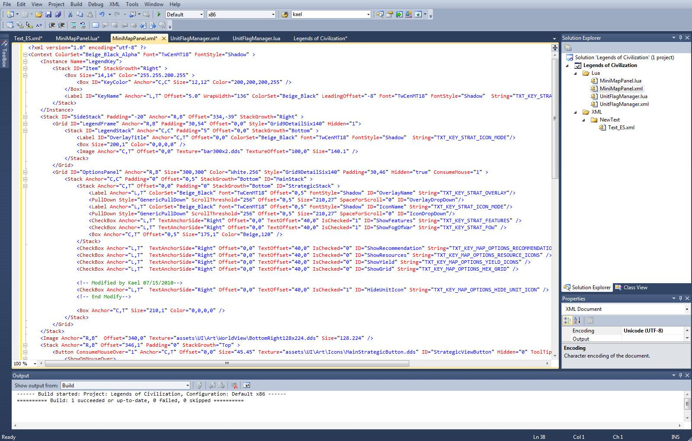

9. We have disabled unit icons by default and added a menu option to allow players to enable/disable unit icons. But the menu option doesn't do anything yet. When a player clicks the Hide Unit Icons checkbox it should toggle the bHideUnitIcon variable we created in the UntiFlagManager.lua file.

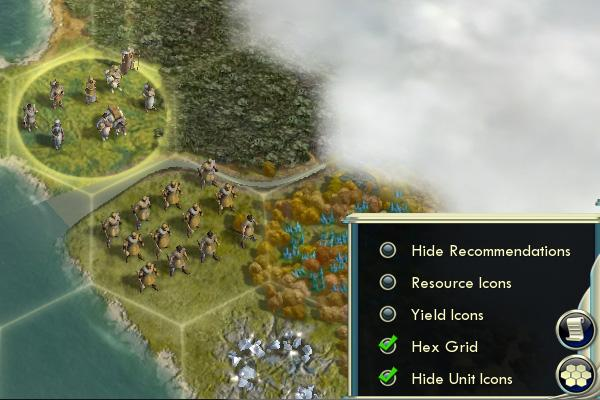

Lua scripts can't directly call functions in other scripts. If we want one Lua script to call a function in another we have to use LuaEvents. At the start of UnitFlagManager.lua we need to create a new LuaEvent as follows:

```lua
-- Added by Kael 07/16/2010
local bHideUnitIcon = true;

LuaEvents.ToggleHideUnitIcon.Add(
function()
    if (bHideUnitIcon) then
    bHideUnitIcon = false;
    else
    bHideUnitIcon = true;
    end
end);
-- End Add
```

The LuaEvents.ToggleHideUnitIcon() function can now be called by external Lua scripts and change the value in this Lua script.

10. We need the menu option we created to call LuaEvents.ToggleHideUnitIcon(). To do that we add the following to our projects MiniMapPanel.lua file:

```lua
-- Added by Kael 07/16/2010
function OnHideUnitIconChecked( bIsChecked )
    LuaEvents.ToggleHideUnitIcon();
    Events.StrategicViewStateChanged();
end
Controls.HideUnitIcon:RegisterCheckHandler( OnHideUnitIconChecked );
-- End Add
```

The above code registers a trigger with the HideUnitIcon (that is the ID of the checkbox we added in MiniMapPanel.xml file) checkbox. If it is checked it calls the local OnHideUnitIconChecked function. The OnHideUnitIcon checked function calls the ToggleHideIcon() LuaEvent and the Events.StrategicViewStateChanged() function. StrategicViewStateChanged() forces the flag to be redrawn, this way the game won't wait for the next time that unit is updated to add or remove the flag, it will happen as soon as the player clicks the checkbox.

That is it, a complete mod that adds the ability for players to enable and disable the unit icons through a menu option on the minimap panel. In it we covered how to add text strings, how to modify Lua scripts in our project, how to tie Lua functions to xml objects and how to call functions in one Lua script from other through LuaEvents. Once these basics are understood the hardest part becomes figuring out which script and function controls the processes we want to change (how did we know that UnitIcons were controlled by UnitFlagManager.lua) and what functions to call to do what we need (how did we know that StrategicViewStateChanged() would update the unit flags). For me that meant experimenting and reading through lots of files.

In the beginning it may take a few hours to do something like the above (it took me quite a few). But hopefully this document reduces that time considerably. And now that I understand what I had to do here my next change will be much faster.

#### 如何用 InGameUIAddin 制作模块化的 UI 变化

There is a way to create modular Lua changes through InGameUIAddin. As of this writing this functionality is limited, it can add new UI components, but it can't remove or modify existing UI components. To remove or modify existing UI components you will need to replace the Lua and XML files as we did in the "How to: Disable Unit Icons with Lua" section.

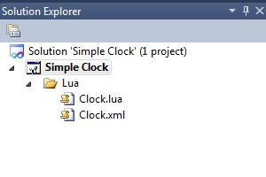

In this example we will add a clock to the interface. We start by adding a Clock.lua and Clock.xml file to the project. These are not replacement files, so the names don't matter. As with all Lua UI changes we need a paired XML and Lua file. The XML file provides the structure and settings, the Lua file provides the code.

First we will fill in the Clock.xml file:

```xml
<Context ColorSet="Beige_Black" Font="TwCenMT20" FontStyle="Shadow" >
    <Label Anchor="C,T" Offset="0,10" Font="TwCenMT20" ColorSet="Beige_Black_Alpha" FontStyle="Shadow" ID="ClockLabel"/>
</Context>
```

The above defines a new label with the ID of "ClockLabel". We can see the font (TwCenMT20), color (Beige_Black_Alpha) and location (centered at the top of the screen, with an offset 0 to the left and 10 down) for the label.

But at this point this is an empty label. We need Clock.lua to populate it with the time. For Clock.lua we can use the following:

```lua
ContextPtr:SetUpdate(function()
    local t = os.date("%I:%M");
    Controls.ClockLabel:SetString(t);
end);
```

ContextPtr:SetUpdate runs on each screen update. The above function adds this function to that process. It assigns the hour and minute to the "t" string, then sets the ClockLabel in the XML definition to that string.

Our next step is that we need to have our UI changed loaded when the mod loads, similar to how XML needs an OnModActivated and UpdateDatabase function on the actions tab for the Mod properties. For InGameUIAddin changes we have to go to Content tab of Mod Properties and specify that this is an InGameUIAddin change, and the Lua file we want activated (the matching XML file doesn't need to be specified).

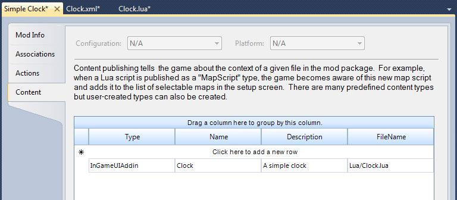

In the following screenshot we can see the clock we added (the red highlight is added just to make it easier to find in the screen shot, it was not added by the mod).

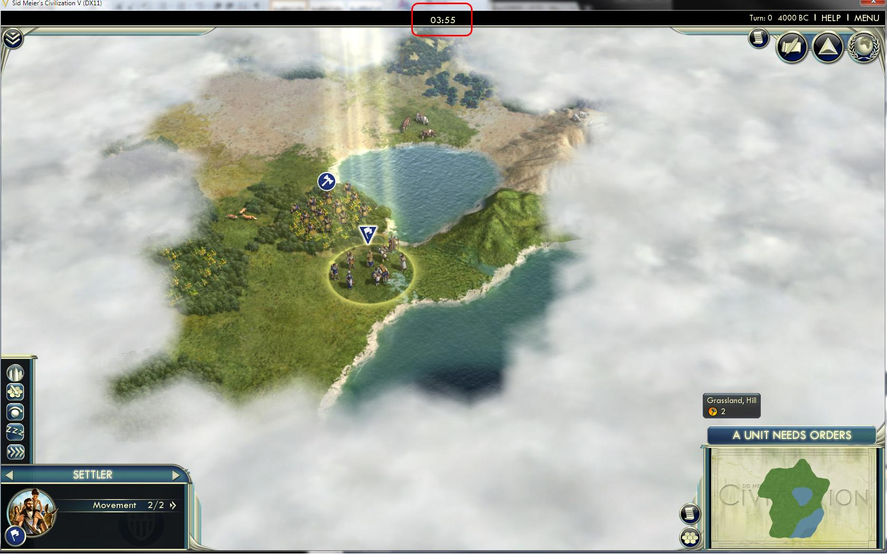

#### 如何用 Lua 添加一个新镜头

There is no way to know what mods you have loaded while playing. In this section we will add a new screen on the Additional Information menu that lists all the loaded Mods.

There are a few hurdles we have to work through before we add a new screen to the game. We worked through an example of using InGameUIAddin in the prior section. InGameUIAddin allows us to add new user interface aspects to the game, but doesn't allow us to modify existing UI components. To modify existing components we need to replace the those files. The problem with replacing Lua files is that this causes us to conflict with other mods that replace those same files.

For this mod to work we need to replace the following files:

- **DiploCorner.lua** - This lua file controls the UI control on the upper right corner of the screen. We will modify this file to add our new menu option.

- **DiploCorner.xml** - This XML file controls the XML aspects of the UI diplomacy corner control.
- **InGame.xml** - This is the main place where Lua files are registered.
- **NotificationLogPopup.lua** - This controls the Notification popup menu, we are going to piggy back on this event to add out new one.

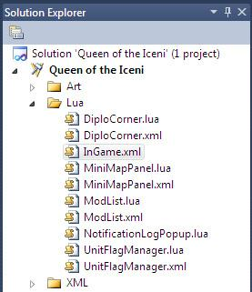

And we will add two new files to control the new screen:

- **ModList.lua** - The Lua file for the new screen.

- **ModList.xml** - The XML file that controls the definitions for the new Mod List screen.

1. Our first step is to create the files in the Lua directory of our mod as in the above screenshot. For DiploCorner.lua, DiploCorner.xml, InGame.xml and NotificationLogPopup.lua copy the actual files from the "`<Civ5 install directory>\Assets\UI\`" directory into our mod copies.

The first change is a minor change to InGame.xml to load our new Lua file definition:

```xml
<LuaContext FileName="Assets/UI/InGame/Popups/SetCityName" ID="SetCityName" Hidden="True" />
<LuaContext FileName="Assets/UI/InGame/Popups/ProductionPopup" ID="ProductionPopup" Hidden="True" />
<!-- Added by Kael 09/17/2010 -->
<LuaContext FileName="Lua/ModList" ID="ModList" Hidden="True" />
<!-- End Add -->
<LuaContext FileName="Assets/UI/InGame/TopPanel" ID="TopPanel" />
```

All the above does is load our new ModList.lua file when the mod loads. More about the ModList.lua file later.

2. Next lets adjust the DiploCorner.lua and DiploCorner.xml to add the new menu option. The following is the addition in the DiploCoerner.lua file:

```lua
local g_MultiPullInfo = {};
g_MultiPullInfo[0] = { text="TXT_KEY_ADVISOR_SCREEN_TECH_TREE_DISPLAY", call=function() Events.SerialEventGameMessagePopup( { Type = ButtonPopupTypes.BUTTONPOPUP_TECH_TREE } ); end };
g_MultiPullInfo[1] = { text="TXT_KEY_DIPLOMACY_OVERVIEW", call=function() Events.SerialEventGameMessagePopup( { Type = ButtonPopupTypes.BUTTONPOPUP_DIPLOMATIC_OVERVIEW } ); end };
g_MultiPullInfo[2] = { text="TXT_KEY_MILITARY_OVERVIEW", call=function() Events.SerialEventGameMessagePopup( { Type = ButtonPopupTypes.BUTTONPOPUP_MILITARY_OVERVIEW } ); end };
g_MultiPullInfo[3] = { text="TXT_KEY_ECONOMIC_OVERVIEW", call=function() Events.SerialEventGameMessagePopup( { Type = ButtonPopupTypes.BUTTONPOPUP_ECONOMIC_OVERVIEW } ); end };
g_MultiPullInfo[4] = { text="TXT_KEY_VP_TT", call=function() Events.SerialEventGameMessagePopup( { Type = ButtonPopupTypes.BUTTONPOPUP_VICTORY_INFO} ); end };
g_MultiPullInfo[5] = { text="TXT_KEY_DEMOGRAPHICS", call=function() Events.SerialEventGameMessagePopup( { Type = ButtonPopupTypes.BUTTONPOPUP_DEMOGRAPHICS} ); end };
g_MultiPullInfo[6] = { text="TXT_KEY_POP_NOTIFICATION_LOG", call=function() Events.SerialEventGameMessagePopup( { Type = ButtonPopupTypes.BUTTONPOPUP_NOTIFICATION_LOG, Data1 = Game.GetActivePlayer() } ); end };

-- Added by Kael 09/17/2010
g_MultiPullInfo[7] = { text="TXT_KEY_MOD_LIST", call=function() Events.SerialEventGameMessagePopup( { Type = ButtonPopupTypes.BUTTONPOPUP_NOTIFICATION_LOG, Data1 = 999 } ); end };
-- End Add
```

The above adds another option to the multipull menu. If that option is selected it passes the BUTTONPOPUP_NOTIFICATION_LOG and 999 in the Data1 field. Later we will cover how to capture that event and trigger the popup menu on it.

!()[civ5_imgs/page65.jpg]

The above works fine for adding a new menu option to the Additional Options menu. But we will want to adjust the size of the dropdown dialog to make room for the new menu option. XML controls the size and format of the UI, so we need to change the DiploCorner.xml to adjust the size.

```xml
<!-- ==========================================================================================================-->
<!-- Notification Log DropDownButtons -->
<!-- ==========================================================================================================-->
<PullDown ConsumeMouse="1" Offset="-6,0" Anchor="R,T" Size="45,45" AutoSizePopUp="0" SpaceForScroll="0" ScrollThreshold="900" ID="MultiPull" >
    <ButtonData>
        <Button Anchor="R,T" Size="45.45" Texture="assets\UI\Art\Notification\NotificationNotes.dds" ToolTip="TXT_KEY_DIPLO_ADDITIONAL" >
            <ShowOnMouseOver>
                <Image Anchor="R,T" Offset="0,0" Size="45.45" Texture="assets\UI\Art\Notification\NotificationNotes.dds" />
                <AlphaAnim Anchor="R,T" Offset="0,0" Size="45.45" TextureOffset="0.0" Texture="assets\UI\Art\Notification\NotificationNotesHL.dds" Pause="0" Cycle="Bounce" Speed="2" AlphaStart="0.95" AlphaEnd="0.55"/>
            </ShowOnMouseOver>
        </Button>
    </ButtonData>
    <GridData Anchor="L,T" Offset="-24.-41" AnchorSide="O,I" Style="Grid9DetailTwo140" Padding="0,0" >

<!-- Modified by Kael 09/17/2010
        <Box Color="Black.0" Size="200.260" /> -->
        <Box Color="Black.0" Size="200.280" />
<!-- End Modify -->
```

The above increases the size of the dropdown box from 260 to 280.

3. We piggybacked on the BUTTONPOPUP_NOTIFICATION_LOG function with our change to DiploCorner.lua. So whenever we select our new menu option it triggers as if the BUTTONPOPUP_NOTIFICATION_LOG popup had been called. If we had SDK access we would create a new BUTTONPOPUP definition for our Mod List. But without it we will have to get creative. So we call BUTTONPOPUP_NOTIFICATION_LOG and pass a value of 999 with it (normally the player number is passed, which would never be near that range).

Since we are piggybacking on the BUTTONPOPUP_NOTIFICATION_LOG function we need to block the normal BUTTONPOPUP_NOTIFICATION_LOG dialog from triggering. Which is why we added NotificationLogPopup.lua to our project.

Remember that Lua functions cannot directly call Lua functions in other files. Instead Lua registers functions with a central event service, and monitors that event service to see when it needs to act. In this case this is the normal OnPopup function from NotificationLogPopup.lua:

```lua
function OnPopup( popupInfo )
    if( popupInfo.Type ~= ButtonPopupTypes.BUTTONPOPUP_NOTIFICATION_LOG ) then
        return;
    end

    CivIconHookup( Game.GetActivePlayer(), 64, Controls.CivIcon, Controls.CivIconBG, Controls.CivIconShadow, false, true );
    m_PopupInfo = popupInfo;
    g_NotificationInstanceManager:ResetInstances();
    local player = Players[Game.GetActivePlayer()];
    local numNotifications = player:GetNumNotifications();
    for i = 0, numNotifications - 1
    do
        local str = player:GetNotificationStr((numNotifications - 1) - i);
        local index = player:GetNotificationIndex((numNotifications - 1) - i);
        local turn = player:GetNotificationTurn((numNotifications - 1) - i);
        local dismissed = player:GetNotificationDismissed((numNotifications - 1) - i);
        AddNotificationButton(index, str, turn, dismissed);
    end
    Controls.NotificationButtonStack:CalculateSize();
    Controls.NotificationButtonStack:ReprocessAnchoring();
    Controls.NotificationScrollPanel:CalculateInternalSize();
    if( m_PopupInfo.Data1 == 1 ) then
        if( ContextPtr:IsHidden() == false ) then
            OnClose();
        else
            UIManager:QueuePopup( ContextPtr, PopupPriority.eUtmost );
        end
    else
        UIManager:QueuePopup( ContextPtr, PopupPriority.NotificationLog );
    end
end
Events.SerialEventGameMessagePopup.Add( OnPopup );
```

In the above the OnPopup function is defined and it is registered to the SerialEventGameMessagePopup event (in blue). The first check of the onPopup function is to verify if this event going through SerialEventGameMessagePopup applies to it or not. So it checks to see it the popupInfo.Type is anything other than BUTTONPOPUP_NOTIFICATION_LOG (in red). If it is anything other than that, it returns and ends the function.

But we will be triggering BUTTONGPOPUP_NOTIFICATION_LOG for another function, and we won't want this popup to trigger when we do it. So the following change is required to NotificationLogPopup.lua:

```lua
function OnPopup( popupInfo )
    if( popupInfo.Type ~= ButtonPopupTypes.BUTTONPOPUP_NOTIFICATION_LOG ) then
        return;
    end

    -- Added by Kael 09/17/2010
    if( popupInfo.Data1 == 999 ) then
        return;
    end
    -- End Add

    CivIconHookup( Game.GetActivePlayer(), 64, Controls.CivIcon, Controls.CivIconBG, Controls.CivIconShadow, false, true );
    m_PopupInfo = popupInfo;
    g_NotificationInstanceManager:ResetInstances();
    local player = Players[Game.GetActivePlayer()];
    local numNotifications = player:GetNumNotifications();
    for i = 0, numNotifications - 1
    do
        local str = player:GetNotificationStr((numNotifications - 1) - i);
        local index = player:GetNotificationIndex((numNotifications - 1) - i);
        local turn = player:GetNotificationTurn((numNotifications - 1) - i);
        local dismissed = player:GetNotificationDismissed((numNotifications - 1) - i);
        AddNotificationButton(index, str, turn, dismissed);
    end
    Controls.NotificationButtonStack:CalculateSize();
    Controls.NotificationButtonStack:ReprocessAnchoring();
    Controls.NotificationScrollPanel:CalculateInternalSize();
    if( m_PopupInfo.Data1 == 1 ) then
        if( ContextPtr:IsHidden() == false ) then
            OnClose();
        else
            UIManager:QueuePopup( ContextPtr, PopupPriority.eUtmost );
        end
    else
        UIManager:QueuePopup( ContextPtr, PopupPriority.NotificationLog );
    end
end
Events.SerialEventGameMessagePopup.Add( OnPopup );
```

In the above we added an additional check. Just like the check that exits the function if the type isn't BUTTONPOPUP_NOTIFICATION_LOG, this check exits the function if the Data1 property is 999. This was we can share the BUTTONPOPUP_NOTIFICATION_LOG function without bumping into each other.

4. Finally we get to creating the code for our new screen. First we need the XML definition for the screen. The following was the definition I used for ModList.xml:

```xml
<Context Font="TwCenMT14" FontStyle="Base" Color="Beige" Color1="Black" >
    <Instance Offset="0,0" Name="NotificationButton" Size="890,60" >
        <Button Size="890,60" Offset="0,0" StateOffsetIncrement="0" ID="Button">
            <Button Anchor="L,C" Offset="0,0" Size="64.64" Texture="assets\UI\Art\WorldView\ActionItemsButton.dds" Hidden="1" ID="GenericButton" />
            <Label Anchor="R,B" Offset="5,8" Font="TwCenMT24" ColorSet="Beige_Black_Alpha" FontStyle="Shadow" String="Turn" ID="NotificationTurnText" />
            <Stack ID="TextStack" Anchor="L,T" Padding="10">
                <Label Anchor="L,T" Offset="16,5" LeadingOffset="-8" WrapWidth="780" Font="TwCenMT18" ColorSet="Beige_Black_Alpha" FontStyle="Shadow" ID="NotificationText" String="Text" />
                <Image Anchor="C,B" Offset="0,0" TextureOffset="0.0" Texture="bar900x2.dds" Size="900.1" />
            </Stack>
            <ShowOnMouseOver>
                <AlphaAnim ID="TextAnim" Anchor="C,C" Offset="10,0" Size="890,64" Pause="0" Cycle="Bounce" Speed="1" AlphaStart="2" AlphaEnd="1">
                    <Grid ID="TextHL" Size="890,64" Offset="0,0" Padding="0,0" Style="Grid9FrameTurnsHL" />
                </AlphaAnim>
            </ShowOnMouseOver>
        </Button>
    </Instance>
    <Box Style="BGBlock_ClearTopBar" />

    <Instance Name="ListingButtonInstance">
        <Button Anchor="L,T" Size="896,32" Offset="0,0" Color="Black.0" StateOffsetIncrement="0,0" ID="Button">
            <ShowOnMouseOver>
                <AlphaAnim Anchor="L,T" Size="896,72" Pause="0" Cycle="Bounce" Speed="1" AlphaStart="1.5" AlphaEnd="1" ID="SelectHighlight">
                    <Grid Size="896,36" Offset="0,0" Padding="0,0" Style="Grid9FrameTurnsHL" />
                </AlphaAnim>
            </ShowOnMouseOver>
            <Stack StackGrowth="Right" Offset="0,0" Padding="0">
                <Box Anchor="L,T" Offset="8,8" Size="175,24" Color="Black.0">
                    <Label Anchor="L,T" Offset="10,0" Font="TwCenMT18" ColorSet="Beige_Black_Alpha" FontStyle="Shadow" String="MOD TITLE" ID="Title" />
                </Box>
            </Stack>
            <Image Anchor="L,B" Offset="0,0" TextureOffset="0.0" Texture="bar900x2.dds" Size="900.1" />
        </Button>
    </Instance>

    <Grid Size="960,658" Anchor="C,C" Offset="0,36" Padding="0,0" Style="Grid9DetailFive140" ConsumeMouse="0">
        <Image Anchor="L,T" Offset="17,90" Texture="HorizontalTrim.dds" Size="926.2" />
        <ScrollPanel Anchor="L,T" ID="ListingScrollPanel" Vertical="1" Size="912,440" Offset="13,94" AutoScrollBar="1">
        <ScrollBar Anchor="R,T" AnchorSide="O,I" Offset="0,18" Length="404" Style="VertSlider"/>
            <UpButton Anchor="R,T" AnchorSide="O,I" Offset="0,0" Style="ScrollBarUp"/>
            <DownButton Anchor="R,B" AnchorSide="O,I" Offset="0,0" Style="ScrollBarDown"/>
            <Stack ID="ListingStack" StackGrowth="B" Offset="4,0" Padding="0" />
        </ScrollPanel>
        <Label String="TXT_KEY_POP_MOD_LIST" ID="Notifications Label" Anchor="C,T" Offset="0,19" Font="TwCenMT20" Color0="30.50.80.255" Color1="133.184.186.255" Color2="133.184.186.255" FontStyle="SoftShadow" />
        <Box Anchor="C,B" AnchorSide="I.I" Offset="0,54" Size="910,56" Color="255,255,255,0" >
            <GridButton Anchor="L,B" Style="SmallButton" Size="150,32" Offset="14,0" StateOffsetIncrement="0,0" ID="CloseButton" >
                <Label Anchor="C,C" Offset="0,0" String="TXT_KEY_CLOSE" Font="TwCenMT18" ColorSet="Beige_Black_Alpha" FontStyle="Shadow" />
            </GridButton>
        </Box>
        <Image Anchor="C,B" Offset="0,110" Texture="HorizontalTrim.dds" Size="926.5" />
    </Grid>
</Context>
```

The above can be intimidating to look at creating out of thin air. I'm sure there are guys that can create the above from scratch, but I'm not one of them. Instead I take the XML definition from a screen that is similar to the one I want to create, and I cut, adjust and add to that one until it looks like I want it. I use the Notification screen as the base for this and then copied XML from the ModBrowser (the place you select mods from the main menu) to get the pieces I needed. Since all of Civ5's UI is in Lua it's all available to borrow from in making our own screens.

The above defines the screen, but it doesn't have any logic. That's where we need Lua. The ModList.lua file contains the following:

```lua
include( "InstanceManager" );
g_InstanceManager = InstanceManager:new( "ListingButtonInstance", "Button", Controls.ListingStack );

function OnPopup( popupInfo )
    -- red area
    if( popupInfo.Type ~= ButtonPopupTypes.BUTTONPOPUP_NOTIFICATION_LOG ) then
        return;
    end
    if( popupInfo.Data1 ~= 999 ) then
        return;
    end
    -- end of red area

    local unsortedInstalledMods = Modding.GetInstalledMods();
    g_InstanceManager:ResetInstances();
    for k, v in pairs(unsortedInstalledMods) do
        local modinfo = v;
        if(modinfo == nil) then
            break;
        end
        if(modinfo.Enabled) then
            local listing = g_InstanceManager:GetInstance();
            local str = modinfo.Name;
            if(modinfo.Version ~= "") then
                local version = string.format("version %s (%s)", modinfo.Version or "", modinfo.Stability or "");
                str = string.format("%s - %s", str, version)
            end
            listing.Title:SetText(str);
        end
    end

    UIManager:QueuePopup( ContextPtr, PopupPriority.NotificationLog );
end
-- blue area
Events.SerialEventGameMessagePopup.Add( OnPopup );
-- end of blue

function OnClose ()
    UIManager:DequeuePopup( ContextPtr );
end
Controls.CloseButton:RegisterCallback( Mouse.eLClick, OnClose );
```

Notice that the above is very similar to the Notification log code we modified. It registers to the SerialEventGameMessagePopup (in blue) just like the Notification log popup did. But in this case we only allow the OnPopup function to process if the type is BUTTONPOPUP_NOTIFICATION_LOG and Data1 is 999 (in red).

The code is fairly simply. I looked through the ModBroser Lua files to find the calls and functions I would need (that's how I found out about the Modding.GetInstalledMods() function and the .Name and .Enabled attributes for the returns). In essence the OnPopup function adds new lines to the screen display for every installed mod that is enabled for this particular game. It displays the mods name, the version and stability (Experimental, Alpha, Beta, Final) for each of these mods.

The only additional function is the code to Control the close button. A very simple example of adding a new screen to the game.

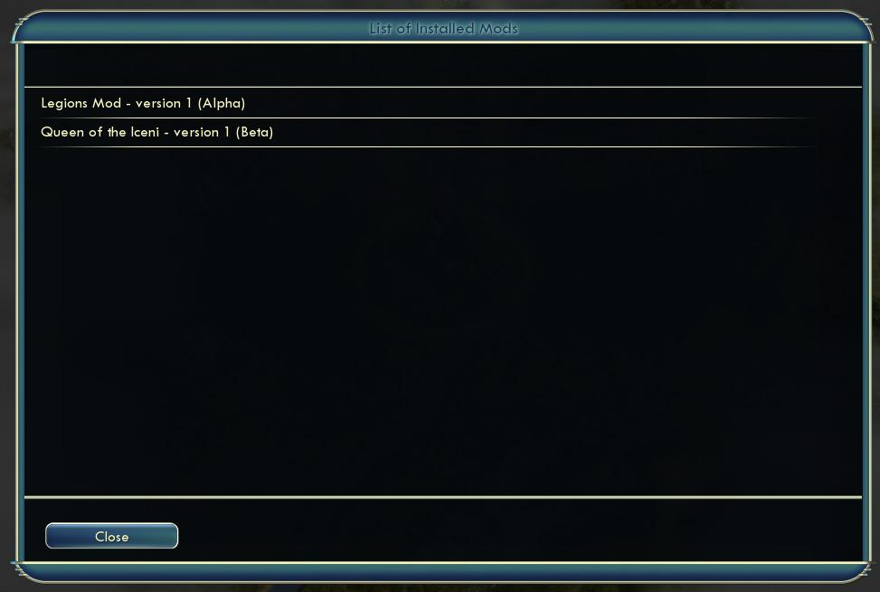


### WorldBuilder

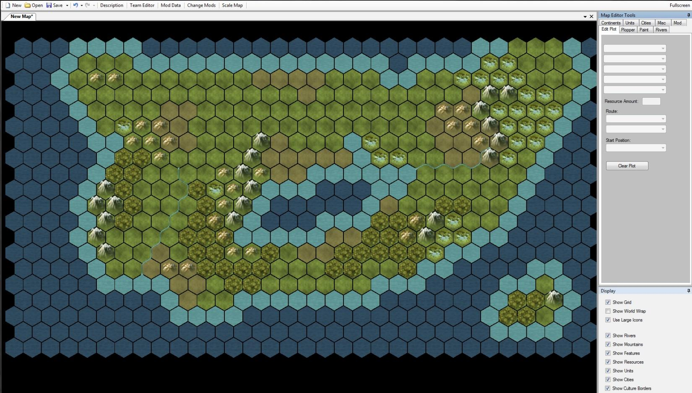

Worldbuilder is a map editor and scenario creator for Civilization V. With it maps can be created quickly, and complex scenarios with starting teams can be developed. This section will go through the options in Worldbuilder so that modders can quickly start creating their scenarios.

Across the top of the file bar there is a description option that allows you to enter your map name and a brief description for the players.

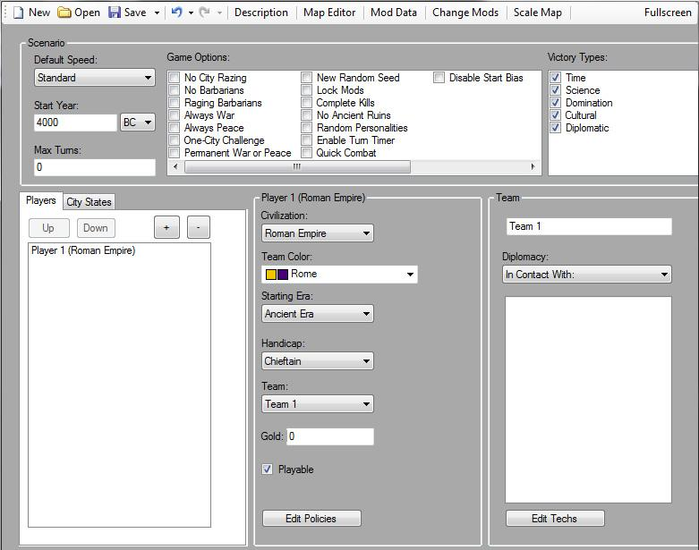

Next is the Team editor. It allows the scenario creator to assign the available civilizations for this scenario as well as their starting techs, policies, diplomacy, gold, etc. Before cities or non-barbarian units can be placed on the map those teams need to be assigned in team editor.

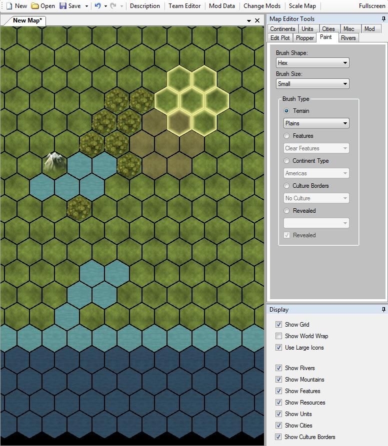

The map editor in WorldBuilder is fairly straight forward. The Map Editor Tools box contains all the tools needed to create an interesting map on the following tabs.

- **Edit Plot** - This allows the selected plot to have any terrain, feature, resource and improvement set. This is also where you can set the plot as the start position for any configured players.
- **Plopper** - This tab allows features, resources, improvements, natural wonders and roads to be quickly painted on plots.
- **Paint** - This tab allows differing brush sizes to be used to lay down terrain, features, continent definitions, cultural borders and revealed terrain.
- **Rivers** - If you are familiar with process of laying rivers with the Civ4 WorldBuilder (I'm fairly sure it involved sacrificing a goat) then it is vastly improved in Civ5. All the hex intersections that can support rivers can be clicked to enable or disable a river passing through that intersection.
- **Continents** - This is where areas can be distinguished as continents (Americas, Asia, Africa and Europe).
- **Units** - Only barbarian units can be placed unless there are players set in the team editor. If there are players set then this tab allows all units to be set on the map, and the state (health, fortified, embarked) of that unit.
- **Cities** - Players have to be set on the team editor before this can be used. If that is done cities can be placed on the map, and the population and the buildings in that city can be set.
- **Misc** - The Misc tab allows the world wrap and randomize resources options to be set.

Once your map is complete, select Save from the file menu to save it. It can always be reloaded to make further changes. WorldBuilder maps are saved in the "`..\<My Games>\Sid Meier's Civilization V\Maps\`" directory.

#### 保存文明 5 的地图

If you like the map you are playing on, or believe it may make a good base for your scenario you can save it directly from the game.

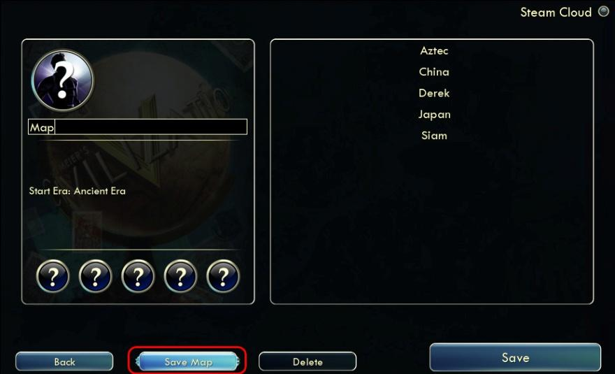

To do so go to the save game menu and there is a button for "Save Map".

That will open the Save Map window where a name can be entered. Click save to save the map. The map will be saved in the "`..\<My Games>\Sid Meier's Civilization V\Maps\`" directory (the same directory that WorldBuilder saves its files in).

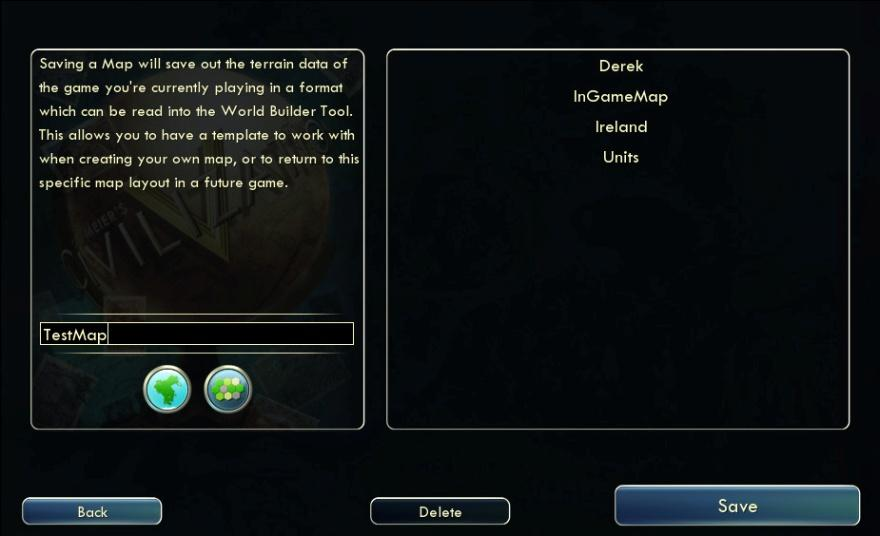

#### 向模组中添加地图

Copy the map file into your mod in ModBuddy to add it to your mod. The name and location of the map doesn't matter. I recommend creating a "Map" directory off the root of your project to place map's in, but it isn't required.

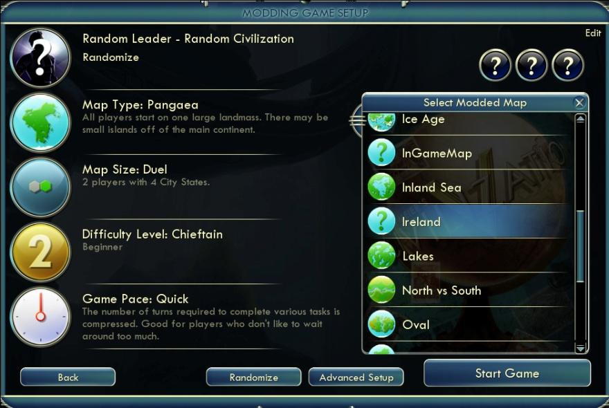

With the mod loaded your map can be selected from the setup menu. It appears with the normal game maps. In this screenshot Ireland is a map provided by the mod.

If you created custom players in the team editor then you will have a "Load Scenario" option on the setup screen. If this is unchecked your map will be loaded without any custom players, units, cities, etc. Just the map will be used. If "Load Scenario" is selected then the only civilizations/leaders from the map can be loaded.

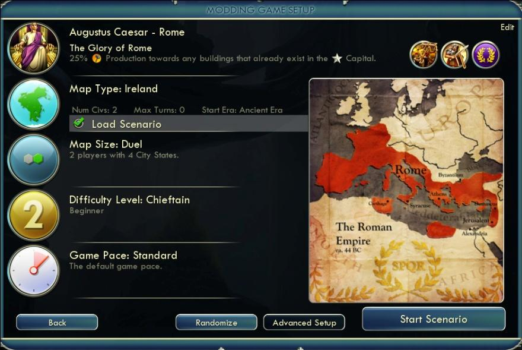

### 发布模组

Before you can test your mod you need ModBuddy to "Build" it for you. Building is the process of taking everything you have included with your mod and putting it in a format the game can recognize. You will need to Build your mod each time you want all your latest changes to take effect. You should build frequently and test each change as you add it (rather than changing a lot of files at once then having the hard task of figuring out which change is keeping the game from loading).

Once you are ready to share your mod with others you can publish it in two different ways.

The first way is that the files can be distributed outside of the game. The Mod Browser is a great resource, but it isn't required to share mods. Your mod will be in your "`..\< My Games>\Sid Meier's Civilization V\MODS`" directory. You can zip that mod directory and share it with others (who will have to extract it to their "`..\< My Games>\Sid Meier's Civilization V\MODS`" directory).

The second way is through ModBuddy with the "Online Services" option under the Tools menu. This uploads your mod to the mod database so that others will see it in the mod browser.

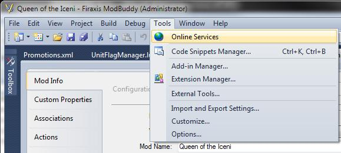

To upload your mod go through the following steps after selecting Online Services:

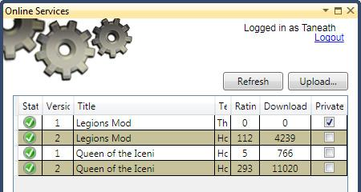

1. Login to Gamespy (if required).

2. Select Upload from the Online Services screen. Notice that this screen will also show you the status of mods you have already uploaded, including prior versions.

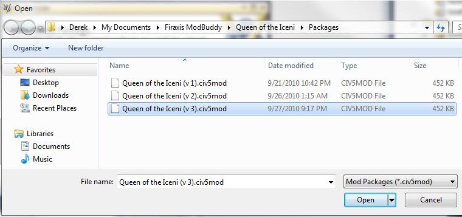

3. Click the ... button on the Select Mod Package screen to browse for the mod to upload.

4. Select the mod package. It defaults to `../My Documents/Firaxis ModBuddy/<ModName>/Packages` directory. If you have multiple versions of the mod they will all appear here. Select the version you want to upload (typically the most recent version).

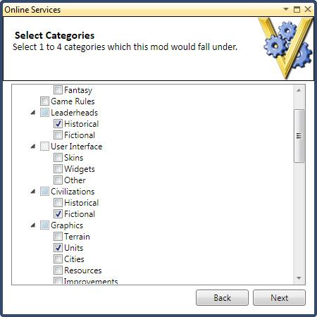

5. Wait while the Mod uploads.

6. Select the Mod categories that apply to your mod.

That's it, your mod should be uploaded and available for players to download.

To update a mod change the version number on your mod's property screen then reupload using the above process.

#### 兼容性

There are three levels of exclusivity for Civilization V mods.

- **Nonexclusive** - Any mod can be enabled with your mod (default).
- **Partially Exclusive** - Any mod that is referenced by your mod or references your mod can be enabled.
- **Totally Exclusive** - Only mods which are referenced by your mod can be enabled.

Most mod's will be non-exclusive. Meaning that they will work with all other nonexclusive mods (and partially or totally exclusive mods that select them). If you are making a mod that adds a new civilization, new units then you will probably want to make it a nonexclusive mod.

Partially Exclusive is the appropriate setting for total conversion mods. If you make a civil war mod you probably don't want the player to run it with a Spain Civ, or with a mod that adds Firaxis as a new world wonder. If your mod deletes any base assets in the game (removes a resource, tech, etc) you will probably want it to be Partially Exclusive, since those assets may be used by other mods. If you or other mod authors set their mod to be able to run together with yours then they will be able to be run together.

Totally Exclusive is the ultimate in mod control. Your mod can't be used in combination with any other mods unless you specifically allow that mod. The only difference between this and being partially exclusive is that it keeps other mod authors from being able to allow their mods to be able to work with yours. This setting should be very rare, only for mod authors who have had problems with other mod authors marking their mods compatible and causing compatibility issues.

### 排除故障

If you are a dumb guy like me, you spend 10% of your time creating, and 90% of the time trying to figure out why it doesn't work. Of all the files Firaxis provides to help us mod, I spend the most time looking at the debug logs.

The debug logs are located in the "..\My Games\Sid Meier's Civilization 5\Logs\" directory. There are numerous files here, I find it helpful to sort the files by date to see which file has been updated the most recently. I won't go through all the files here, only the two I refer to most commonly.

#### Database.log

This file contains all the exceptions when the database loads. This typically means XML reference issues. If a Civilization refers to a leader that doesn't exist anymore, or a unit refers to a resource that has been removed then the Database.log is a great place to find it.

This is a great place to find mistypes. If you have spelled LEADER_ELIZABETH incorrectly and your game is crashing on load this log file will give you a clue as to what went wrong. Here are some sample errors from Database.log:

```
[207898.601] Invalid Reference on Civilizations.Civilopedia - "TXT_KEY_CIV_RUSSIA_PEDIA" does not exist in Language_en_US
[207898.616] Invalid Reference on Feature_YieldChanges.FeatureType - "FEATURE_RIVER" does not exist in Features
```

#### Lua.log

Much as the Database.log helps you isolate XMl problems Lua.log helps you isolate Lua errors. Notice that in most cases (as in the example below) the Lua.log file gives you the file generating the error and the line number. Very handy when trying to figure out why your mod isn't working.

```
[202778.570] Syntax Error: [string "Lua/ModList.lua"]:165: 'end' expected (to close 'function' at line 14) near '`<eof>`'
[202778.570] Runtime Error: Error loading Lua/ModList.lua.
```
