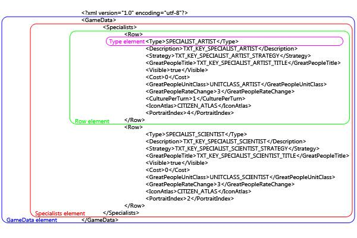
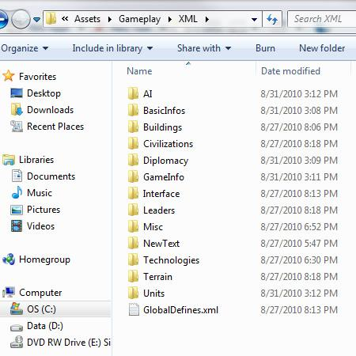
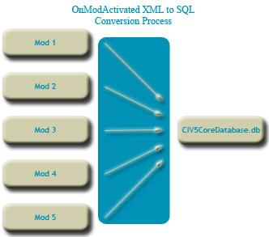
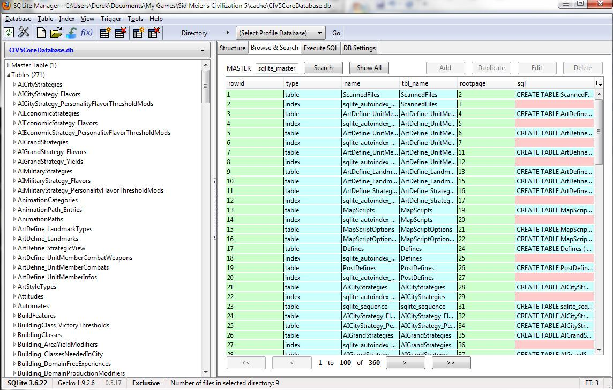

文明 5 MOD 制作教程 - 第一部分
=========

## 核心概念

### 什么是 MOD 开发？

通过修改硬件或软件来做些有别于设计者所设想的事情，是 MOD 开发的一种更为贴切<!-- slang -->说法。 Firaxis 公司开发的文明 5 （包括早先的版本）早已考虑到 mod 开发。一个 mod 可以很简单，修改<!-- tweaking -->某些单位和建筑的花费，修改 AI 让它变得不一样或者是向游戏中添加一个新文明。要么是个很复杂、完全不同的 mod，用文明引擎创造一个新的游戏。

这篇文档是用来帮助 mod 开发者的，通过探讨可行性、了解技术问题、让开发者尽快实现他们的想法以及发布自己的 mod，从而帮助他们更好开发文明 5 的 mod 。尽管这篇文章涉及广泛的 mod 概念，但它无法包含的文明 5 所能做的每一件事。特别地，源代码模型以及第三方的艺术改动不包含在该教程内。

### 文明 5 有哪些改动？

很多游戏都可以添加 mod，文明 4 在设计的时候就基于模组特性制订了一套新的标准。游戏数据库（XML）文件可以用文本编辑器进行修改，脚本语言（python）包含在内让玩家可以构建自己的事件和函数，并且核心 DLL 文件的源代码可以用 c++ 编译器进行修改。文明 4 不仅仅是款游戏，更是开发 mod 的基础。

这款引擎开源而且强大，这里列出了几点限制。

1. 对于用户来说，发现、下载和安装 mod 很难。

2. 没有必要的开发者的整合工作，mod 是没法同时运行的。

3. 尽管 python 很强大，它还是会严重影响游戏的性能。

文明 5 改进了 文明 4 提供的模组特性，解决了上述三个问题。文明 5 提供一个游戏内的 mod 菜单（Mod 浏览器），允许用户发现、下载和安装他们想要尝试的 mod。现在制作一个 mod ，让玩家可以与其它 mod 一起运行，非常简单，这允许玩家选择他们想要在游戏中运行的 mod。并且用 Lua 替换了 python，Lua 能够与 C++ 核心更好的整合，并且对性能的影响更小。

### 模块设计

文明 4 mod 开发者可以通过自由更换文件达到修改的目的。如果新的 Civ4Civilizations.xml 文件被添加到 mod 里面，那么就不会应用基础的 Civ4Civilizaiotns.xml 文件。文明 5 不会发生这种情况。不是替换文件，所有的 mod 自动继承基础对象，并且开发者必须删掉那些对象如果他们不再被这个 mod 所使用（这个教程待会儿会讲到这些内容）。制作 Civil War 版本的 mod 时，开发者可以创建一个联盟和城邦文明，但还是需要删除基本文明的相关内容，这样就无法使用基本文明的相关内容了（否则在 Civil War 版本的 mod 里就会看到像法国和俄罗斯这样的文明了）。

这样做的好处在于它让 mod 模块化了。游戏认为所有的资源都能被使用，除非一个特殊的 mod 告诉它不要使用所有资源。这样某个 mod 可能添加加拿大文明，另一个 mod 可能移除德国文明并用新文明替换，而另一个 mod 可能添加亚特兰提斯文明。不需要经过开发者的特殊整合，这些 mod 就能够同时运作。mod 足够多的话，每个玩家喜爱的 mod 组合可以大不相同。

### XML

XML is a format for qualifying data. It isn't a programming language, it's a language for storing information. In Civilizaiotn V XML is used to store the attributes of the different game assets. The cost of a unit, the name of a leader, the starting units for a civilization are all defined in XML.

The advantage of XML is that it is modifiable with a text editor and users don't have to learn a programming language to use it. Consider the following XML definition of a settler:

```
<Row>
    <Class>UNITCLASS_SETTLER</Class>
    <Type>UNIT_SETTLER</Type>
    <Moves>2</Moves>
    <Capture>UNITCLASS_WORKER</Capture>
    <HurryCostModifier>33</HurryCostModifier>
    <Domain>DOMAIN_LAND</Domain>
    <DefaultUnitAI>UNITAI_SETTLE</DefaultUnitAI>
    <Description>TXT_KEY_UNIT_SETTLER</Description>
    <Civilopedia>TXT_KEY_CIV5_ANTIQUITY_SETTLER_TEXT</Civilopedia>
    <Strategy>TXT_KEY_UNIT_SETTLER_STRATEGY</Strategy>
    <Help>TXT_KEY_UNIT_HELP_SETTLER</Help>
    <Requirements>TXT_KEY_NO_ACTION_SETTLER_SIZE_LIMIT_HARDCODED</Requirements>
    <Food>true</Food>
    <Found>true</Found>
    <CombatLimit>0</CombatLimit>
    <UnitArtInfo>ART_DEF_UNIT__SETTLER</UnitArtInfo>
    <UnitArtInfoCulturalVariation>true</UnitArtInfoCulturalVariation>
    <PortraitIndex>0</PortraitIndex>
    <IconAtlas>UNIT_ATLAS_1</IconAtlas>
</Row>
```

In this definition the attributes of a Settler are defined. These are divided in elements where each element has a start-tag (in `< >` such as `<Moves>`) and an end-tag (in `</ >` such as `</Moves>`). The data is between the start-tag and the end-tag is the data (the 2 that represents that the Settler has a 2 movement). Changing the movement of a settler to 3 tiles per turn is as easy as changing that 2 to a 3.

Note that `<Row>` and `</Row>` are also tags. So the entire settler definition is one element with child elements inside of it.

Don't be confused if all of the elements don't make sense yet. If it is your first time looking at XML you will probably be surprised at how much of it you can guess at. Firaxis has done an excellent job of making Tags easily readable. `<Domain>DOMAIN_LAND</DOMAIN>` means that the settler is a land unit. `<Capture>UNITCLASS_WORKER</Capture>` means that when a settler is captured it turns into a worker, etc.

Elements can contain other elements. In the above example the Row element (that has the start tag of `<Row>` and the end tag of `</Row>`) contains all the elements for a Settler. Here is a more complex example:



In the above the GameData element is the entirety of the blue region. The Specialists element is the entirety of the red region. Note that there are two Row elements within the Specialists element for two different specialists, much as the Row element contains many different elements for the attributes of those specialists. The first Row element is the green region and it is the full definition for the Artist specialist, and the purple region is a single attribute of the Artist specialist.

#### Schema

Schema is the definition for XML elements. In Civ terms this means that Schema determines if the `<Moves>` tag holds a text string, a boolean or an integer (Moves is an integer). It also defines the default settings for an attribute, unlike in Civ4 where modders had to define every attribute, in Civ5 default values are defined in schema so that if they aren't set the default value is used.

You may have noticed that there are a lot of unit attributes that weren't on the setter definition in the proceeding section. For example it doesn't say if the settler is allowed to pillage or not. There is a attribute called Pillage that is defined in schema as follows:

```
<Column name="Pillage" type="boolean" default="false"/>
```

This schema definition shows that the Pillage element is a boolean. It can be either `<Pillage>true</Pillage>` or `<Pillage>false</Pillage>`, but nothing else. We also notice that the default value for Pillage is false. So we don't need to add it to a units definition if it is false, since that's the default. Which is why a settler doesn't need to have it set.

If you want to know what attributes are available for an object you should look at the schema definition for that object type. Sometimes we find attributes that aren't being used, things that can be used in Mods even if they aren't used in the base game. Consider the following from CIV5HurryInfos.xml:

```
<GameData>
    <!-- Table definition -->
    <Table name="HurryInfos">
        <Column name="ID" type="integer" primarykey="true" autoincrement="true"/>
        <Column name="Type" type="text" notnull="true" unique="true"/>
        <Column name="Description" type="text"/>
        <Column name="PolicyPrereq" type="text" reference="Policies(Type)"/>
        <Column name="GoldPerProduction" type="integer" default="0"/>
        <Column name="ProductionPerPopulation" type="integer" default="0"/>
        <Column name="GoldPerBeaker" type="integer" default="0"/>
        <Column name="GoldPerCulture" type="integer" default="0"/>
    </Table>
    <!-- Table data -->
    <HurryInfos>
        <Row>
            <ID>0</ID>
            <Type>HURRY_POPULATION</Type>
            <Description>TXT_KEY_HURRY_POPULATION</Description>
            <PolicyPrereq>NULL</PolicyPrereq>
            <ProductionPerPopulation>60</ProductionPerPopulation>
        </Row>
        <Row>
            <Type>HURRY_GOLD</Type>
            <Description>TXT_KEY_HURRY_GOLD</Description>
            <PolicyPrereq>NULL</PolicyPrereq>
            <GoldPerProduction>6</GoldPerProduction>
        </Row>
    </HurryInfos>
</GameData>
```

In the above we have the schema definition between `<Table name="HurryInfos">` and `</Table>` (highlighted in red). There are eight attributes defined in schema, ID, Type, Description, PolicyPrereq, GoldPerProduction, ProductionPerPopulation, GoldPerBeaker and GoldPerCulture.

The actual assets are defined as Rows between `<HurryInfos>` and `</HurryInfos>` (highlighted in blue). There are two, HURRY_POPULATION (sacrificing population to rush production) and HURRY_GOLD (paying gold to hurry production). But the attributes for PolicyPrereq, GoldPerBeaker and GoldPerCulture are never used. These are attributes modders can use in their mods even though they aren't used in the base game.

Also notice that in the above example, schema is defined at the beginning of the file with the asset type it controls. This is different than how it was handled in Civ4, where schema was a separate file.

#### Understanding References

In Civilization nearly every asset relates to every other. The unit definition may reference technology's required to build that unit, a civilization definition may reference units that are unique to that civilization, a leader definition may reference a trait. This makes deleting an object more complex since all references to that object need to be deleted as well.

For example, if we want to make a mod that removes the Oil resource from the game. We can't simply delete the Oil resource from the CIV5Resources.xml file. If we did that we would get an error when the game loaded when the improvements loaded (because they refer to Oil as a resource that makes certain improvements valid), when the units loaded (because some units refer to Oil as a requirement to being built) and when the traits loaded (because a trait boosts Oil production).

The same is true for adding new objects to the game. If you add a new civilization and you refer to a leader that you haven't added yet, or a unique unit that you haven't added then you will get an error loading your mod.

If you want to add one piece at a time and make sure it works you may want to use already existing references until you make the ones specific to new object you are adding. If you are adding a new civilization you may want to use LEADER_WASHINGTON as the leader and UNIT_AMERICAN_B17 as the unique unit so you can load and test your civilization before going back and adding a new leader and unique unit.

#### XML File Structure

The XML file structure is contained in `<install directory>\assets\Gameplay\XML\` directory. Unlike Civilization IV, this exact file structure isn't critical since we aren't replacing files. But it is important to know where the files exist so modders can look up the current definitions. In general schema is defined at the beginning if the file for that type of asset, so it's also a good place to look for available attributes.



**GlobalDefines.xml** - Contains the default definitions for a wide range of game settings such as the starting year, initial city population and max buildings per city (defaults to unlimited). Hundreds of game rules changes can be made simply by modifying the values in this file.

**AI** - This directory contains a wide range of AI configuration files. Things that were only possible by modding the source code in Civilization IV can be easily changed in XML. There are files for city strategies, economic strategies, grand strategies (what sort of victory the AI will pursue), military strategies, tactical moves, diplomacy and general AI defines (for things like how quickly the AI expands, how much it values gold, etc).

**BasicInfos** - This directory covers the definition of all the more mundane game assets. Unit Combat types are defined here, Invisibility types, domains, etc. In general these are simple declarations (just naming a type without any attributes) and they aren't commonly changed by modders. But if you set an invisibility type (for example) on a unit the game needs to have a place where that invisibility type is defined, which it is here.

**Buildings** - Much as you would expect the building definitions are held here. There are two files, one for the Building Classes and another for the actual Buildings.

Building Classes are base definitions for buildings, for example a Barracks. But there can be multiple Buildings for a single Building Class. So the Barracks Building Class has two Buildings referenced to it, the Barracks and the Krepost. Allowing multiple buildings to be referenced to one Building Class is the games way to replace buildings for a civilization. So one civilization builds a Krepost instead of a Barracks as a unique building. But since both Barracks and Krepost are associated with the Barracks Building Class the game can simply refer to it as a Building Class Barracks and know that it will get whatever form of the barracks is available for that player.

As an example all civilizations start with a free BUILDINGCLASS_PALACE. If you created a new civilization and gave it a unique palace your new building wouldn't be a BUILDING_PALACE, but would be associated with BUILDINGCLASS_PALACE so that when the free palace was given out your new civilization would get its custom palace instead of the standard one.

**Civilizations** - Civilizations, Minor Civilizations, Regions and Traits are defined here. Civilizations will probably be one of the first things people want to mod and add to and this document will cover a specific example of that later on.

**Diplomacy**- This is where all the text strings for things like the first greeting, declaration of war, refusal of deals, etc are all linked.

**GameInfo** - This is where Firaxis stuck everything that doesn't fit anywhere else. The following files and assets are defined here:

- **CIV5ArtStyleTypes.xml** - The list of the available ArtStyles for cities. This is reference for the civilization definitions. There is very little to add here since it is just a tag for the name.

- **CIV5Climates.xml** - These are the definitions for the various climate types (arid, cold, temperate, tropical, etc) with variables use by the random map generator to create the world. Though this won't be as flexible as creating a unique mapscript, this is an easy way to allow players to select maps with more or less jungle, forests, mountains, deserts, etc.

- **CIV5CultureLevels.xml** - This file is obsolete and unused in Civilization V.

- **CIV5Cursors.xml** - This is a link to the cursor animations that are used by the game. Creating a new cursor set is as easy as adding new .ani files and updating this file with the new link.

- **CIV5EmphasizeInfos.xml** - This file is obsolete and unused in Civilization V.

- **CIV5Eras.xml** - In general these are the settings for late game starts (determining how many units you start with, starting gold, if goodie huts should be spawned, etc). But it does contain some attributes for games that reach these eras such as a modifier to improvement build times, free population in new cities and the definition for the city art (so your cities look differently in different eras). The EventChancePerTurn and SoundtrackSpace attributes in this file are obsolete.

- **CIV5Flavors.xml** - This is a list of tags used in other files for flavor types.

- **CIV5ForceControlInfos.xml** - This file is obsolete and unused in Civ5.

- **CIV5GameOptions.xml** - These are the tags for the Game Options (quick combat, raging barbarians, etc).

- **CIV5GameSpeeds.xml** - This is where the game speeds are defined. They include modifications to the build speed, population growth and improvement growth.

- **CIV5GoodyHuts.xml** - Contains all the possible goody hut results. The actual chance that each result is returned is based on the difficulty level which is configured in CIV5HandicapInfos.xml.

- **CIV5HandicapInfos.xml** - This is where the difficulty levels are set. It's a great place to see what changes at the different difficulty levels. In this file we can see that "EarliestBarbarianReleaseTurn" at settler difficulty is 10000. Most modders won't change the difficulty adjustments, but some modders increase the AI's advantage to balance for new mechanics that favor human players. Others may decrease the AI's advantage if they improve the AI enough that it doesn't need the boost.

- **CIV5HurryInfos.xml** - This is where production rush methods are defined. If you want to modify the amount production given for population sacrifice or the amount of gold per production to gold rush, this is the file to do it in.

- **CIV5IconFontMapping.xml** - This is the file where the icon assets (such as ICON_BULLET) is mapped to a picture in the icon atlas.

- **CIV5IconTextureAtlases.xml** - This is where icon atlas's (such as TECH_ATLAS_1) are mapped to specific files (such as TechnologyAtlas.dds). It is useful to see what dds files are mapped to if modders want to change the icons, or if a modder wants to add a new icon atlas.

- **CIV5MultiplayerOptions.xml** - This is where the multiplayer game options are defined. There are no attributes on these options other than their default state, and text strings. All of the real definition is handled in the source code. Because of that adding a new Multiplayer Option to this file will cause a new option to appear in the selection lists, but it won't do anything.

- **CIV5PlayerOptions.xml**- This is where all the non-multiplayer game options are defined. Just like the multiplayer game options there aren't any meaningful attributes here. The real effect of having these options enabled or disabled happens in the source code.

- **CIV5Policies.xml** - This is where all the policies are defined. Policies are all linked to a policy branch here. All aspects of a policy are defined here, though you may have to look through the several tables in this file to get all the information.

- **CIV5PolicyBranchTypes.xml** - This is where the policy branches are applied. The only real configuration stored on them is if one branch blocks another. Outside of that, they are available for modders to add or remove policy branches that policies set in CIV5Policies.xml can be configured to use.

- **CIV5Processes.xml** - The build wealth and build research options can be modified in this file if a modder wants to change the ratios.

- **CIV5Projects.xml** - Projects are defined here. Notice that there is a table defined in schema that isn't being used, Project_ResourceQuantityRequirements, which may allow modders to create some interesting projects.

- **CIV5SeaLevels.xml** - This file determines the increased probability of ocean tiles based on the players choice of sea levels.

- **CIV5SmallAwards.xml** - This file is unused in Civ5. It appears to be capable of displaying notifications when thresholds around victory points, number of cities and population are reached.

- **CIV5Specialists.xml** - This is where the specialists are defined. You can use this file to modify the amount of yields produced by various specialists, add or remove specialists from the game, or change the amount they contribute to various great people.

- **CIV5Trades.xml** - This file controls the AI weight valuations for trades (what the AI values research, culture and gold at).

- **CIV5TurnTimers.xml** - These define the turn timers when auto-end turns are set in the multi-player game options.

- **CIV5Victories.xml** - This is where the victory conditions are defined. In general the victory conditions in Civ5 don't expose much to modding. The domination victory, for example, just has the Conquest element set to true(<Conquest>true</Conquest>). What the Conquest element does is set in the source code, not exposed to XML. But looking closely at schema for this file shows that there is a table defined in schema that isn't being used, VictoryPointAwards. Firaxis has a victory point system integrated and unused in Civ5. A modder can add new Victories that don't have WinsGame set to true and then assign points to them in the VictoryPointsAwards table.

- **CIV5Votes.xml** - This file is obsolete and unused in Civ5.

- **CIV5VoteSources.xml** - This file is obsolete and unused in Civ5.

- **CIV5Worlds.xml** - This is where the world sizes are defined. The grid width and height (how tall and wide the map is) are configured here as are the default players and some tunables. Adding a new map size to this file doesn't work well because most of the map scripts refer to the map sizes by name to set variables. If the new map size isn't one of the names the script accounts for then it won't work correctly.

**Interface** - The definitions for interface modes, colors and player colors are here. Player colors become important if you want to look and see what player color to assign to a new civ you create. A player color is the primary color, the secondary color and the text color for players using that player color. Player color red, for example, has a primary color of red, a secondary color of white and a text color of red. In the colors file is where the colors are defined (as in exactly what "COLOR_RED" is). Civ5 uses this to assign more than just traditional colors, but has color defines for things like COLOR_TECH_TEXT.

**Leaders** - This folder is setup differently than the others. Rather than having a common file with all the schema and assets Firaxis has the schema in one file and each leader in their own file. This doesn't affect modability, but it does make it easier to look at all the values specific to a leader, and a bit more difficult to compare values between leaders.

**Misc** - This is where notifications and routes (roads and railroads) are defined. Modders may be interested in changing the yields or movement rate modifier from roads or railroads.

**NewText** - This is where all the text values used in the game are assigned to actual strings. Where TXT_KEY_CIV_ARABIA_DESC is set to decode to "Arabian Empire" for English players. There is a separate directory for German (de_DE), English (EN_US), Spanish (es_ES), French (fr_FR), Italian (it_IT) and Japanese (JA_JP). English modders who want to find out what a specific text value decodes to will want to look in the files in the /XML/NewText/EN_US/ directory.

**Technologies** - This is where the technologies are defined. Technologies have GridX and GridY elements. These determine where the tech is displayed on the tech tree. When adding a technology you may need to update the GridX and GridY attributes of other technologies to make room for it in the tech tree.

**Terrain** - This is where features (including unique features), improvements, resources, terrains and yields are defined.

**Units** - Units and anything related to units are defined here, including promotions, builds, missions, formations, etc.


### SQL 

XML is just an intermediate domain specific language that is translated into SQL and then executed on the database. Typically, after you've run the game once and the XML files have not changed, you will simply load from the .db files directly. This improves performance. Firaxis kept the XML format for familiarity, it isn't directly used by the game.



Effectively the XML files are translated into SQL queries and run against the database. Direct SQL files can also be run. SQL files have their pros and cons. The downside to SQL is that the modder must be familiar with the language whereas the upside is that they can write very complex transforms that cannot be expressed in XML.

#### Viewing the database

The easiest way to view the game database is to install Firefox with the SQLite Manager addon [https://addons.mozilla.org/en-US/firefox/addon/5817/](https://addons.mozilla.org/en-US/firefox/addon/5817/).

Once it is installed, you can open SQLite Manager by opening Firefox and going to Tools->SQLite Manager. At the top menu in the application, go to Database->Connect Database. Navigate to <My Documents>/My Games/Sid Meier's Civilization V/cache/. Now, making sure that the file type drop down is set to "All Files", select CIV5CoreDatabase.db. Select OK and you can now view the database contents.



The files in the cache folder are subject to getting deleted and replaced while the game is running so if you wish to make data changes, do so in the XML and not directly in this file.

#### SQL Examples

The following examples can be applied by including an sql file with your mod. It is often a faster way to modify a lot of settings rather than manually changing each one.

-- Make all buildings and units except the Settler and Scout unbuildable
```
UPDATE Buildings SET 'PrereqTech' = 'TECH_FUTURE_TECH' WHERE Type <> 'BUILDING_PALACE';
UPDATE Units SET 'PrereqTech' = 'TECH_FUTURE_TECH' WHERE Class <> 'UNITCLASS_SETTLER' and Class <> 'UNITCLASS_SCOUT';
```

-- Another way to block the creation of certain unit's
```
UPDATE UnitClasses SET MaxPlayerInstances = 0 WHERE Type IN ("UNITCLASS_SETTLER","UNITCLASS_ARTIST","UNITCLASS_SCIENTIST","UNITCLASS_MERCHANT","UNITCLASS_ENGINEER");
```

-- Display All Civilizations
```
for civ in DB.Query("select * from Civilizations") do
    print(civ.Type);
end
```

-- Display All Units that cost more than 200
```
for unit in DB.Query("select * from Units where cost > 200") do
    print(unit.Type);
end
```

-- Display the RGB Values of the PrimaryColor for All Player Colors
```
for color in DB.Query("select Colors.Red, Colors.Green, Colors.Blue from PlayerColors inner join Colors on PlayerColors.PrimaryColor = Color.Type") do
    print(string.Format("R: %f, G: %f, B: %f", color.Red, Color.Green, Color.Blue);
end
```

-- Display all American leaders
```
local myCiv = "CIVLIZATION_AMERICA";
for leader in DB.Query("select * from Leaders inner join Civilization_Leaders on Leaders.Type = Civilization_Leaders.LeaderheadType where Civilization_Leaders.CivilizationType = ?", myCiv) do
    print(leader.Type);
end
```

### Lua

#### The Relationship between XML and LUA

UI's in Civ5 are an XML/Lua pair. The XML specifies the controls and hierarchy while the Lua specify the logic. XML builds the UI, it determines what buttons appear where, what the tables look like, etc, while Lua is the programming language that controls what happens when you press a button, or how the table is populated.

#### References

There are a lot of good Lua programming guides. Many of which can be picked up at your local bookstore or ordered from Amazon. A good online reference is the following:
Lua 5.1 Reference Manual by Roberto Ierusalimschy, Luiz Henrique de Figueiredo, Waldemar Celes: [http://www.lua.org/manual/5.1/manual.html](http://www.lua.org/manual/5.1/manual.html)

#### Scripting Events

Lua scripts cannot directly call functions in other Lua scripts. Instead there is a LuaEvents interface that allows Lua Scripts to add functions that become globally available.

If you need a function to be callable by another Lua script you will need to create a LuaEvents function to do it such as:

```
LuaEvents.ToggleHideUnitIcon.Add(
function()
    if (bHideUnitIcon) then
        bHideUnitIcon = false;
    else
        bHideUnitIcon = true;
    end
end);
```

The above function has been registered with the LuaEvents engine and can be called by any Lua script by:

```
LuaEvents.ToggleHideUnitIcon();
```

Which would run the ToggleHideUnitIcon in the first script and change the bHideUnitIcon value for that script.
