## 制作模组

### ModBuddy

ModBuddy is the primary modding tool Firaxis provides to make modding easier than it has been in prior versions. ModBuddy is a full featured XML and Lua editor with plugins built to handle building Civ5 mod project, publish mods and templates to make modding easier.

#### 制作模组

Follow these steps to get started on your own mod. (Screen shots may differ slightly from the release version since I'm using beta versions of all the tools to create this document).

1. Load ModBuddy (the Sid Meier's Civilization V SDK).

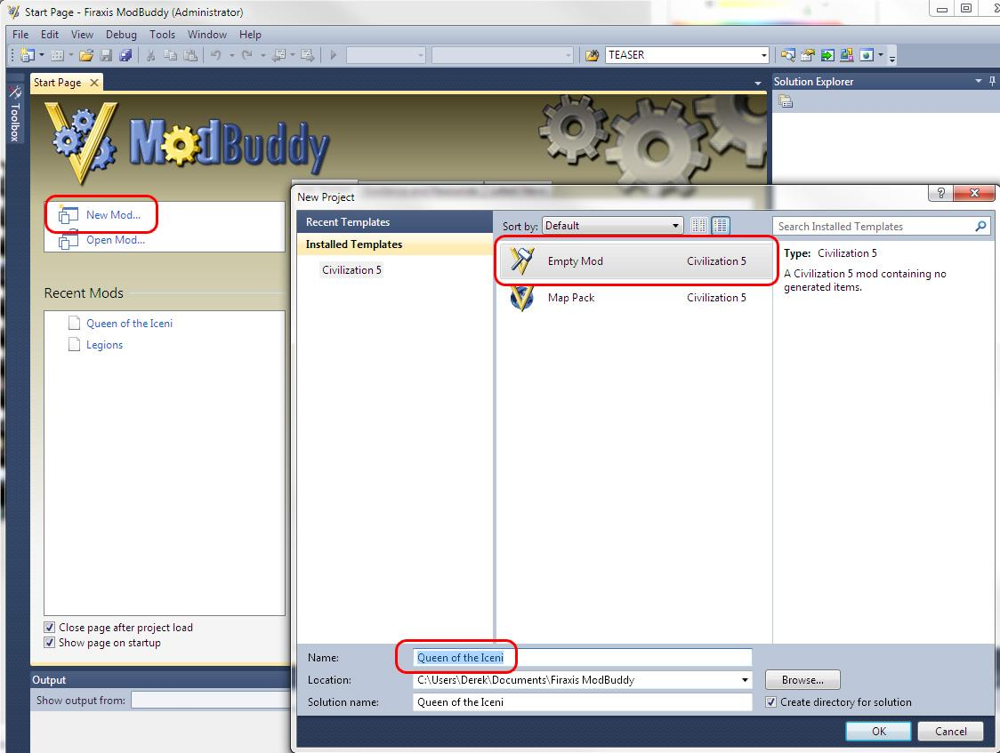

2. From the Main menu of ModBuddy select "New Mod"

3. Select "Empty Mod", give our Mod a name and click "OK".

4. On the general information screen enter the mod's title, author and description. Note that the Mod's title and description have to be at least 8 characters long. In this example I've selected "Legends of Civilization" and the title, put my name in as the author and put in a brief description.

Once that is done select "Next".

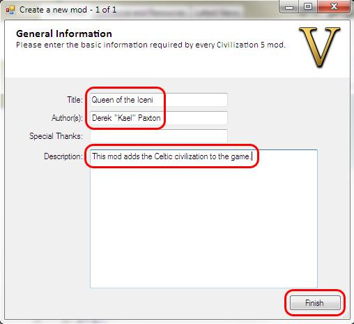

That is all you need to create a new mod. The mod doesn't do anything yet, we will get to that later sections.

#### 组织项目

There is no required directory structure for your mod project in ModBuddy. Modders can places the files where it is convenient for them and their project. Many people may start by creating files at the root of the project but as the project grows having all the files in one location can be frustrating and waste the modders time.

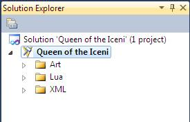

Renaming, moving and deleting files, if you want to reorganize them later, is fairly easy to do (files aren't typically referenced by their path).

I would recommend creating three folders off of your project, Art, Lua and XML. These serve as a good base for separating the different types of files we will be working with. Within the Art, Lua and XML folders I tend to follow the same directory structure that Firaxis used with Civilization V because, it's as good as any other, and it helps me remember where things are if things are setup consistently. For example, beneath the XML directory I created a Civilizations directory to place the new civilization XML files.

There isn't any reason to create directories if there aren't any files within them. So if your mod doesn't have any art files don't bother creating an Art directory. If your mod doesn't have any XML Leaders files then don't bother creating an XML/Leaders directory.

Note: This is one way to organize your project. It is equally valid to organize your project by your assets instead of asset types. You could, for example, have a directory for each Civilization you are adding to the game. That directory would contain all the civilization XML, leader XML, unique unit XML, art, audio and Lua files required for that civilization.

#### 模组属性

Right click on Mod icon in the Solution Explorer and select properties to view the mod properties. This is where the mod instructions are setup, and modders should become familiar with the options here (especially the Actions tab) to configure and enable the features their mod needs.

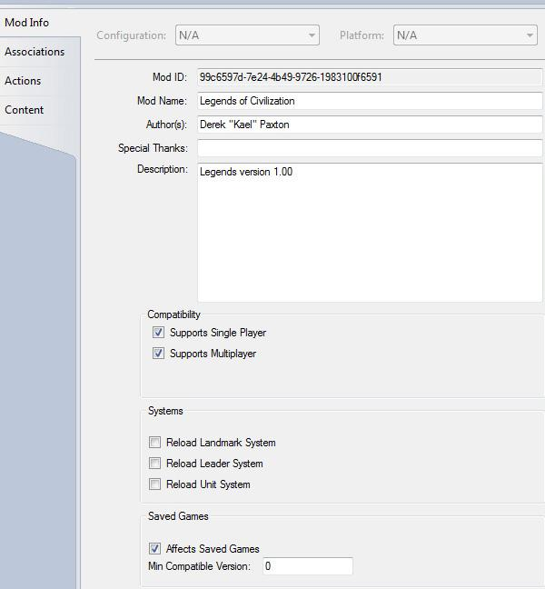

**Mod Info** - This contains all the setup information you entered when creating your mod. It can be updated if you add new members to your team, you want to modify the description, or add thanks to more people. This is what people see when they browse for mods.

**Compatibility** - By default mods are listed as being compatible with Single Player and Multiplayer. Unchecking these boxes removes that compatibility. Checking or unchecking this box doesn't change the mod at all (unchecking Supports Multiplayer doesn't change a mod to make it work in multiplayer) it only controls the options available with that mod for those users.

**Systems** - The art system is loaded before mods are. So if your mod changes landmarks, leaders or units then these options need to be selected to allow the game to reload those graphics. As an example a later mod in this document will change the scale of unit models. That change won't take effect if we don't have "Reload Unit System" checked.

**Saved Games** - If the mod effects save games then this option has to be selected. It is selected by default. Unchecking this option means that saves created when this mod is running can be loaded by the base game without the mod in place. This is possible only for UI and balance mods that don't add or remove assets to the game. If you add anything, such as a new civilization, then your mod will affect save games (since the base game doesn't have your civilization and will crash trying to reference it). As with compatibility checking or unchecking this box doesn't change your mod, it doesn't make your save games any more or less compatible with the base game.

**Associations** - This is where associations are made to other mods. there are three types:
- Dependencies - Mods that are required before you mod can load.
- References - Optional mods that can be loaded to work with your mod (important if you are using a partially exclusive or totally exclusive mod).
- Blocks - Mods listed here cannot be loaded with your mod.

**Actions** - Actions are required to tell the game which files need to be run when your mod loads. By default, having files included with your mod won't change anything unless there is an action here to update the database with your file. Remember that XML isn't directly used by the game engine, the game engine uses the database, so our mod has to update the database with our XML files.

The most common "Set" you will need is "OnModActivated" (meaning to happen when the mod loads) and the most common type is "UpdateDatabase" (to apply the specified xml file). An example of a mod with applied xml files is in the following screenshot:

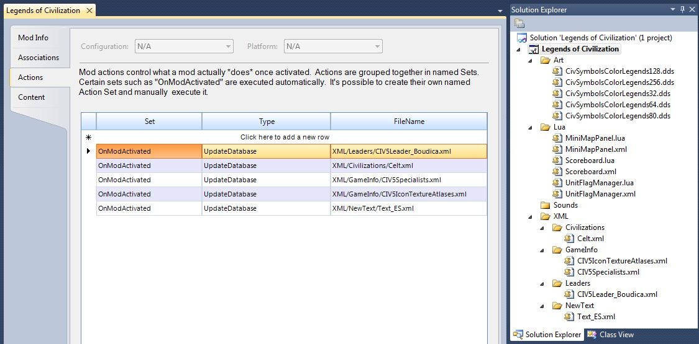

**Content** - The content screen specifies special file types within the mod much as the Actions screen is used for database updates. The following content types are available:
- CityViewUIAddin- Adds the UI to the City View root
- Custom- A custom UI which is added as an entry to the "Custom Game" menu.
- DiplomacyUIAddin- Adds the UI to the Leaderhead root (base diplomacy screen).
- InGameUIAddin- Adds to the UI of the main game interface.
- Map- A world builder map (this doesn't have to be defined for this map to be usable, only for it to be published and for any UI's to know about it).
- MapScript- A Lua map script (this doesn't have to be defined for this map to be usable, only for it to be published and for any UI's to know about it).

#### 创建对象

Creating new assets with ModBuddy is very simple. This document will go through some detailed "how to" procedures later. But the overall process is that an xml file is created in ModBuddy. Within that XML file there must be a GameData element. Within that GameData element (meaning between the start tag of `<GameData>` and end tag of `</GameData>`) there must be an element that sets the asset type. Within the Element that sets the assets type there must be a Row element, and within the Row element is where all the object specific attributes exist as elements.

The following is a sample of adding a new goody hut entry. The line numbers are simply for reference, they wouldn't exist in the real XML.

```xml
1. <GameData>
2.      <GoodyHuts>
3.          <Row>
4.              <Type>GOODY_SKELETON</Type>
                <Description>TXT_KEY_GOODY_SKELETON</Description>
                <Sound>AS2D_GOODY_WARRIOR</Sound>
                <UnitClass>UNITCLASS_SKELETON</UnitClass>
5.          </Row>
6.      </GoodyHuts>
7. </GameData>
```

1. The first line is the start of the GameData element. This is what tells the game that we are going to be passing in some new XML.

2. Next we have an opening depending on the type of asset we are creating. If we are creating a civilization, then it is `<Civilizations>`, it we are creating a leader then it `<Leaders>`, it's a unit it is `<Units>`. the easiest way to see what the opening tag should be is to look at the definition of an existing version of that asset type. In this example I'm using the definition for a goody hut. The file name in ModBuddy isn't important, the directory in ModBuddy isn't important. This entry is how the game knows what sort of asset we are creating.

3. `<Row>` is the XML tag that tells the system that we are going to start an entry for the type defined in the prior line.

4. This is the beginning of the object specific attributes. The exact attributes vary depending on the object type. Check out similar assets for examples, and the schema at the beginning of the XML files to see what's available.

5. Every element we start with XML must be closed. We have to tell the system that we are done with the Row element. To close the `<Row>` element we add a `</Row>` tag.

6. Just as we needed to close the Row element we also need to close the `<GoodyHuts>` element. In this case with a `</GoodHuts>` tag.

7. Finally we close the `<GameData>` element with `</GameData>`.

The above example show an assets that only has one table. But most of the assets in Civilization V have multiple tables. Consider the following for the engineer specialist:

```xml
<GameData>
    <Specialists>
        <Row>
            <Type>SPECIALIST_ENGINEER</Type>
            <Description>TXT_KEY_SPECIALIST_ENGINEER</Description>
            <Strategy>TXT_KEY_SPECIALIST_ENGINEER_STRATEGY</Strategy>
            <GreatPeopleTitle>TXT_KEY_SPECIALIST_ENGINEER_TITLE</GreatPeopleTitle>
            <Visible>true</Visible>
            <Cost>0</Cost>
            <GreatPeopleUnitClass>UNITCLASS_ENGINEER</GreatPeopleUnitClass>
            <GreatPeopleRateChange>3</GreatPeopleRateChange>
            <IconAtlas>CITIZEN_ATLAS</IconAtlas>
            <PortraitIndex>1</PortraitIndex>
        </Row>
    </Specialists>
    <SpecialistYields>
        <Row>
            <SpecialistType>SPECIALIST_ENGINEER</SpecialistType>
            <YieldType>YIELD_PRODUCTION</YieldType>
            <Yield>1</Yield>
        </Row>
    </SpecialistYields>
</GameData>
```

Here we have two tables, Specialists and SpecialistYields. Although slightly more complex for formatting (and different than how this was handled in Civilization IV) these tables are defined within the schema the top of the file. The only real disadvantage to this method is sometimes it's difficult to see all the attributes that pertain to a specific asset. The resources file, for example, has 7 tables, making it a bit of a pain to find all the attributes that are set for a specific attribute. So make sure when you copy the information for an asset, you get all the information in the file for it. Even if it is in more than one table.

#### 更新对象

Sometimes you don't want to add a new asset, you just want to change an asset in the base game. This is as simple as adding an <Update> element between the asset tags (where the <Row> element typically goes).

An Update element has two child elements, a <Set> element and a <Where> element.

**Set** - This element uses an XML attribute to determine what change is going to take place. Such as `<Set Combat="20"/>`.

**Where** - This element determines our matching condition. Where we want the change to take place. Such as <Where Type="UNIT_JAPANESE_SAMURAI"/>.

Note that there is no difference (from an XML perspective) between `<Set Combat="20"></Set>` and `<Set Combat="20"/>`. Including the / as the last character in the tag is another way to mark that element closed. We don't commonly do it because we need to include data between the start and end tag. but in cases like these where there is no data between the tags it's slightly more clean to end the element in the start tag.

Let's put it together for a change. In Civ5 Engineer specialists and Citizens both increase production by 1. But in our mod we want Engineers to boost production by 2. This is the SpecialistYields table in Civ5 (the part that sets the Engineer's yield is highlighted in blue):

```xml
<GameData>
    <SpecialistYields>
        <Row>
            <SpecialistType>SPECIALIST_CITIZEN</SpecialistType>
            <YieldType>YIELD_PRODUCTION</YieldType>
            <Yield>1</Yield>
        </Row>
        <Row>
            <SpecialistType>SPECIALIST_MERCHANT</SpecialistType>
            <YieldType>YIELD_GOLD</YieldType>
            <Yield>2</Yield>
        </Row>
        <Row>
            <SpecialistType>SPECIALIST_SCIENTIST</SpecialistType>
            <YieldType>YIELD_SCIENCE</YieldType>
            <Yield>3</Yield>
        </Row>
        <Row>
            <SpecialistType>SPECIALIST_ENGINEER</SpecialistType>
            <YieldType>YIELD_PRODUCTION</YieldType>
            <Yield>1</Yield>
        </Row>
    </SpecialistYields>
</GameData>
```

In order to change the Yield to 2 we need the following update (the line numbers are just for reference, they should not exist in real code):

```xml
1. <GameData>
2.     <SpecialistYields>
3.         <Update>
4.             <Set Yield="2"/>
5.             <Where SpecialistType="SPECIALIST_ENGINEER"/>
6.         </Update>
7.     </SpecialistYields>
8. </GameData>
```

1. This is the start of the GameData element. This is what tells the game that we are going to be passing in some new XML.

2. Next we have the name of the table. The table we are updating is SpecialistYields, so the opening element is `<SpecilaistYields>`.

3. On an add operation we had <Row> at this level to show we were going to start a new entry. But, to update an asset we use the `<Update>` tag here.

4. As discussed above there are two elements inside the <Update> tag. The first is Set. In this example we are setting the Yield to 2 with `<Set Yield="2"/>`.

5. This is the condition part of the update expression. The update already knows to set Yield to 2, but this is where we tell it which Yield to set to 2. In this case `<Where SpecialistType="SPECIALIST_ENGINEER"/>` tells it to set Yields to 2 if the SpecialistType element equals SPECiALIST_ENGINEER.

6. This is the end of the `<Update>` element.

7. This is the end of the `<SpecialistYields>` element.

8. This is the end of the `<GameData>` element.

##### Multiple Condition Updates

Sometimes we will want our update to check on more than one element before applying the update. Assume that we want to change the Food yield from Whales from 1 to 2. Consider the following sample from the Resource_YieldChanges table:

```xml
<Resource_YieldChanges>
    <Row>
        <ResourceType>RESOURCE_BANANA</ResourceType>
        <YieldType>YIELD_FOOD</YieldType>
        <Yield>1</Yield>
    </Row>
    <Row>
        <ResourceType>RESOURCE_WHALE</ResourceType>
        <YieldType>YIELD_FOOD</YieldType>
        <Yield>1</Yield>
    </Row>
    <Row>
        <ResourceType>RESOURCE_WHALE</ResourceType>
        <YieldType>YIELD_GOLD</YieldType>
        <Yield>1</Yield>
    </Row>
</Resource_YieldChanges>
```

We may try the following to accomplish this:

```xml
<GameData>
    <Resource_YieldChanges>
        <Update>
            <Set Yield="2"/>
            <Where ResourceType="RESOURCE_WHALE"/>
        </Update>
    </Resource_YieldChanges>
<GameData>
```

But since the above matches both on the Food and the Gold Rows (the green and the blue in the sample), both of those yields would be increased to 2.

```xml
<GameData>
    <Resource_YieldChanges>
        <Update>
            <Set Yield="2"/>
            <Where YieldType="YIELD_FOOD"/>
        </Update>
    </Resource_YieldChanges>
<GameData>
```

But in this case we would set the Food yields to 2 for all resources, including Bananas (in red) and Whales (in green) in our sample.

We need the ability to set a multi-conditional argument which we can do by adding multiple attributes to the Where element as in the following:

```xml
<GameData>
    <Resource_YieldChanges>
        <Update>
            <Set Yield="2"/>
            <Where ResourceType="RESOURCE_WHALE" YieldType="YIELD_FOOD"/>
        </Update>
    </Resource_YieldChanges>
<GameData>
```

Notice that in the above there is no logical qualifier between the two attributes. Attributes are "Anded" together, elements must match all of them before the Set is applied. If you want to use "Or" logic (the Set is applied if either condition is valid) then you should create separate update element that checks for each criteria.

#### 删除对象

Deleting an asset requires us to use the Delete element with an attribute to match on instead of the Row element.

For example the following code would remove the America civilization from the game:

```xml
<GameData>
    <Civilizations>
        <Delete type="CIVILIZATION_AMERICA"/>
    </Civilizations>
</GameData>
```

After being introduced to add and updates this syntax should be familiar. It doesn't matter what element the Delete matches on (in the example I use type), but be careful that if you are using a non-unique element. If you are deleting all the civilizations with the ARTSTYLE_EUROPEAN Art Style Type (`<Delete ArtStyleType="ARTSTYLE_EUROPEAN"/>`) then they will all be deleted. If another mod the player has loaded modifies an ArtStyleType to ARTSTYLE_EUROPEAN, then that civilization will be deleted by your mod. If another mod adds a civilization that is set to ARTSTYLE_EUROPEAN then your mod will delete it.

The most important thing to remember when deleting assets is that all references to that asset also need to be cleaned up or your mod will have errors loading. References in Civ5 are unidirectional, one asset refers to another, the assets don't refer to each other. Sometimes which asset refers to which isn't obvious. For example the civilization file refers to the unique unit (CIVILIZATION_AMERICA refers to UNIT_AMERICAN_B17) but the unique unit doesn't refer to the civilization it belong to. So you could delete CIVILIZATION_AMERICA without any errors. But if you deleted UNIT_AMERICAN_B17 by itself you would get an error when CIVILIZATION_AMERICA tried to reference it.

These references are the most difficult part of deleting assets since it's often difficult to tell what assets refer to the asset we are deleting. Especially if other mods refer to the assets we are deleting, for example if another mod adds a unit that require the Steam Power technology, but you have deleted that technology. Because of this if we delete base assets it's probably best if your mod is an exclusive mod. You can't assume compatibility if you are removing base assets from the game.

Another option is to disable assets without deleting them. The ability to do this varies depending in the Asset type. If you were removing a civilization it may be best just to make it non-playable:

```xml
<GameData>
    <Civilizations>
        <Update>
            <Set Playable="0" />
            <Where Type="CIVILIZATION_AMERICA" />
        </Update>
    </Civilizations>
</GameData>
```

A delete with no conditions matches on everything, so it deleted on everything. The following removes all civilizations from the game.

```xml
<GameData>
    <Civilizations>
        <Delete />
    </Civilizations>
</GameData>
```

Deleting all the assets is also a big step. Remember that order in the file matters. So if you were to add a civilization after deleting all of them with the above code, then you would want the add to happen after the total delete. If you add your civilization before the delete then your new civ will be deleted too. This will also delete any assets from mods loaded before your mod that added civilizations.

#### 如何添加文本

Text is an asset type similar to civilizations, leaders and units. The asset type for English is `<Language_en_US>`, just as the asset type for civilizations is `<Civilizations>`. The `<Row>` element is used to add new text, but with text we have to include an attribute with the `<Row>` element to assign the Tag.

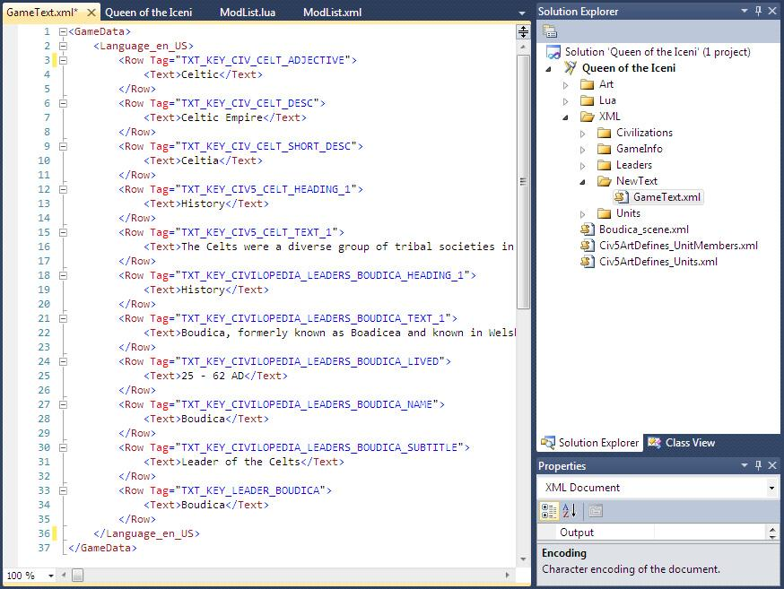

In the screenshot we have added new text tags in ModBuddy. The Tag is how the game refers to the text string, the entry in `<Text></Text>` is what the game will display for this language when that text string is referenced. For example, with the above when TXT_KEY_CIV_CELT_DESC is referenced (as we will see in the How to: Add a Civilization section of this document) the game will display "Celtic Empire" when English is the active language.

To add the above follow these steps:

1. Create an XML folder off of the root of your project if you don't already have one. This isn't required but helps us organize our project.

2. Create a New Text folder under the XML folder. Again, this isn't required but helps us organize our project. I choose "New Text" as the folder name because that's what Firaxis called their text folder. Through this would still work regardless of the folder name.

3. Add an XML file under the New Text folder and rename it GameText.xml. As with the above this name isn't required, but it helps us to know that this is the XML file where we will store our text definitions. It would work as well if we called it Legends_text.xml, Celt_Civ_text.xml, Cabbage.xml or any file name.

4. Fill the file with the text definitions as in the screenshot above. Let's take a look at one of the values:

```xml
<GameData>
    <Language_en_US>
        <Row Tag="TXT_KEY_CIV_CELT_DESC">
            <Text>Celtic Empire</Text>
        </Row>
    </Language_en_US>
</GameData>
```

In the above section there is a new Language_en_US (English text) asset being added. The text decode will be used whenever TXT_KEY_CIV_CELT_DESC is used in the XML it will be displayed (to players with the English language selected) as "Celtic Empire".

#### 修改文本

We may also want to change existing text strings in the base game. You overwrite the existing definition the same as changing any attribute. To begin you may want to look at the former text string definition. You can find base game text strings somewhere beneath "<install directory>\assets\Gameplay\XML\NewText\".

Looking through those files we can find the following text string definitions in CIV5ModdingText.xml:

```xml
<Row Tag="TXT_KEY_MODDING_LIKE_IT">
    <Text>Like it</Text>
</Row>
<Row Tag="TXT_KEY_MODDING_FLAG_MODERATION">
    <Text>Report</Text>
</Row>
```

If you want to have some fun (or suspect your mod is so offensive that you will get more report clicks than Likes) you can reverse these text strings by including the following in your mod:

```xml
<GameData>
    <Language_en_US>
        <Update>
            <Where Tag=" TXT_KEY_MODDING_LIKE_IT "/>
            <Set Text="Report"/>
        </Update>
        <Update>
            <Where Tag=" TXT_KEY_MODDING_FLAG_MODERATION"/>
            <Set Text="Like It"/>
        </Update>
    </Language_en_US>
</GameData>
```

Just like when changing other attributes we can use Update to change text definitions. The attribute we need to match on to do this is "Tag".

#### 如何添加文明

In this section we will go through the entire process of adding a new civilization to the game. First let's look at the schema definition for a civilization from the Civ5Civilizations.xml file:

```xml
<Table name="Civilizations">
    <Column name="ID" type="integer" primarykey="true" autoincrement="true"/>
    <Column name="Type" type="text" notnull="true" unique="true"/>
    <Column name="Description" type="text"/>
    <Column name="Civilopedia" type="text"/>
    <Column name="CivilopediaTag" type="text"/>
    <Column name="Strategy" type="text" default="Ask Paul"/>
    <Column name="Playable" type="boolean" default="true"/>
    <Column name="AIPlayable" type="boolean" default="true"/>
    <Column name="ShortDescription" type="text" default="NULL"/>
    <Column name="Adjective" type="text" default="NULL"/>
    <Column name="DefaultPlayerColor" type="text" default="NULL"/>
    <Column name="ArtDefineTag" type="text" default="NULL"/>
    <Column name="ArtStyleType" type="text" default="NULL"/>
    <Column name="ArtStyleSuffix" type="text" default="NULL"/>
    <Column name="ArtStylePrefix" type="text" default="NULL"/>
    <Column name="DerivativeCiv" type="text" default="NULL"/>
    <Column name="PortraitIndex" type="integer" default="-1"/>
    <Column name="IconAtlas" type="text" default="NULL" reference="IconTextureAtlases(Atlas)"/>
    <Column name="AlphaIconAtlas" type="text" default="NULL" reference="IconTextureAtlases(Atlas)"/>
    <Column name="MapImage" type="text" default="NULL"/>
    <Column name="DawnOfManQuote" type="text" default="NULL"/>
    <Column name="DawnOfManImage" type="text" default="NULL"/>
    <Column name="DawnOfManAudio" type="text" default="NULL"/>
</Table>
<Table name="Civilization_BuildingClassOverrides">
    <Column name="CivilizationType" type="text" reference="Civilizations(Type)"/>
    <Column name="BuildingClassType" type="text" notnull="true" reference="BuildingClasses(Type)"/>
    <Column name="BuildingType" type="text" reference="Buildings(Type)"/>
</Table>
<Table name="Civilization_CityNames">
    <Column name="CivilizationType" type="text" reference="Civilizations(Type)"/>
    <Column name="CityName" type="text" notnull="true"/>
</Table>
<Table name="Civilization_DisableTechs">
    <Column name="CivilizationType" type="text" reference="Civilizations(Type)"/>
    <Column name="TechType" type="text" reference="Technologies(Type)"/>
</Table>
<Table name="Civilization_FreeBuildingClasses">
    <Column name="CivilizationType" type="text" reference="Civilizations(Type)"/>
    <Column name="BuildingClassType" type="text" reference="BuildingClasses(Type)"/>
</Table>
<Table name="Civilization_FreeTechs">
    <Column name="CivilizationType" type="text" reference="Civilizations(Type)"/>
    <Column name="TechType" type="text" reference="Technologies(Type)"/>
</Table>
<Table name="Civilization_FreeUnits">
    <Column name="CivilizationType" type="text" reference="Civilizations(Type)"/>
    <Column name="UnitClassType" type="text" reference="UnitClasses(Type)"/>
    <Column name="UnitAIType" type="text" reference="UnitAIInfos(Type)"/>
    <Column name="Count" type="integer"/>
</Table>
<Table name="Civilization_Leaders">
    <Column name="CivilizationType" type="text" reference="Civilizations(Type)"/>
    <Column name="LeaderheadType" type="text" reference="Leaders(Type)"/>
</Table>
<Table name="Civilization_UnitClassOverrides">
    <Column name="CivilizationType" type="text" reference="Civilizations(Type)"/>
    <Column name="UnitClassType" type="text" notnull="true" reference="UnitClasses(Type)"/>
    <Column name="UnitType" type="text" reference="Units(Type)"/>
</Table>
<Table name="Civilization_Start_Along_Ocean">
    <Column name="CivilizationType" type="text" reference="Civilizations(Type)"/>
    <Column name="StartAlongOcean" type="boolean" default="false"/>
</Table>
<Table name="Civilization_Start_Along_River">
    <Column name="CivilizationType" type="text" reference="Civilizations(Type)"/>
    <Column name="StartAlongRiver" type="boolean" default="false"/>
</Table>
<Table name="Civilization_Start_Region_Priority">
    <Column name="CivilizationType" type="text" reference="Civilizations(Type)"/>
    <Column name="RegionType" type="text" reference="Regions(Type)"/>
</Table>
<Table name="Civilization_Start_Region_Avoid">
    <Column name="CivilizationType" type="text" reference="Civilizations(Type)"/>
    <Column name="RegionType" type="text" reference="Regions(Type)"/>
</Table>
```

Let's look at each of these values in detail:

- **ID** - This is the database starter row. It is set as 0 on the first entry but shouldn't be modified.

- **Type** - This is the key we will use to reference this civilization. We typically use CIVILIZATION_<name> (so CIVILIZATION_CANADA for Canada). We keep the object type as the first part of the name so that it doesn't get confused with another object type with the same name, and is easy to read and identify. Types have to be unique (you can't have two CIVILIZATION_CANADA's). If two objects with the same Type are loaded the one that is loaded second will replace the first one.

- **Description** - This is the text string description of the civ, for America it is "American Empire".

- **Civilopedia** - This isn't used in Civ5.

- **CivilopediaTag** - The starting text string for the pedia entry.

- **Strategy** - This isn't used in Civ5 (though Firaxis was having some fun with their default setting).

- **Playable** - If true then humans can select this as an available civilization. If false then it won't be available. Note that the default is true, so civilizations will be playable unless the modmaker specifically disables them.

- **AIPlayable** - If this is true then the AI can pick this civilization when randomly picking a civ when the game begins. If it is set to false then the AI will never pick this civilization. As with Playable this default to true unless the modder changes it. Setting both the Playable and AIPlayable attribute to false for a civilization is a good way to remove a civilization from the game without actually deleting the assets (so you won't break other mods that refer to it).

- **ShortDescription** - The short text string for this civilization. For America it is "America".

- **Adjective**- The text string for the qualifier to things that belong to this civilization. For Ameican it is "American", as in an American Spearman.

- **DefaultPlayerColor** - The default color of this civilizations borders, etc. This entry has to be specified in the CIV5PlayerColors.xml file. It is only the default because if the same civilization is in a game twice a random color will be assigned to the second instance (so players can tell them apart).

- **ArtDefineTag** - This isn't used in Civ5.

- **ArtStyleType** - Defines the art style for the buildings that are used in this Civilization's cities.

- **ArtStyleSuffix** - Used to pick different flavors of improvements and wonder art.

- **ArtStylePrefix** - Used to pick different flavors of improvements and wonder art.

- **DervativeCiv** - This isn't used in Civ5.

- **PortraitIndex** - The number of the icon in the icon atlas that is used for this Civilization.

- **IconAtlas** - The icon atlas that holds the icon for this civilization.

- **AlphaIconAtlas** - The icon atlas that has the alpha layer for this icon.

- **MapImage** - The picture (as a dds file) that is displayed when this civ is selected from the civilization selection menu. Typically this is a map of the Civilization.

- **DawnOfManQuote**- The text that is displayed on the Dawn of Man (ie: loading) screen.

- **DawnOfManImage** - The picture (as a dds file) that is show on the dawn on man screen.

- **DawnOfManAudio** - The audio file that is played on the Dawn of Man screen, typically this is a reading of the Dawn of Man quote.

- **Civilization_BuildingClassOverrides** - This is how unique buildings are implemented for a civilization. This can be used to block a civilization from being able to build a building such as this change which keeps minor civilizations from being able to build the Sydney Opera House:

```xml
<Row>
    <CivilizationType>CIVILIZATION_MINOR</CivilizationType>
    <BuildingClassType>BUILDINGCLASS_SYDNEY_OPERA_HOUSE</BuildingClassType>
    <BuildingType/>
</Row>
```

Or this change which switched the Castle to the Mughal fort for India:

```xml
<Row>
    <CivilizationType>CIVILIZATION_INDIA</CivilizationType>
    <BuildingClassType>BUILDINGCLASS_CASTLE</BuildingClassType>
    <BuildingType>BUILDING_MUGHAL_FORT</BuildingType>
</Row>
```

- **Civilization_CityNames**- This is a list of the available city names for a civilization.
- **Civilization_DisableTechs**- Any techs set here for a specific civilization won't be available for that civilization to research.
- **Civilization_FreeBuildingClasses**- This is the free buildings available to a civilization when they found their first city. By default all civilizations get a free palace.
- **Civilization_FreeTechs**- These are the free techs a civilization starts with.
- **Civilization_FreeUnits**- These are the units the civilization starts with. By default all civilizations are set to start with a free settler.
- **Civilization_Leaders**-This is where leaders are associated to their civilizations. In Civ5 each civilization can only have 1 leader.
- **Civilization_UnitClassOverrides**- Much like the building class overrides this is where unique units are set with the unit they replace for this civilization.
- **Civilization_Start_Along_Ocean**- If a civilization has this set the game will attempt to start them along a coastal tile. This defaults to false in schema, so it doesn't need to be set unless the modder is setting it to true.
- **Civilization_Start_Along_River**- If a civilization has this set the game will attempt to start them along a coastal tile. This defaults to false in schema, so it doesn't need to be set unless the modder is setting it to true.
- **Civilization_Start_Region_Priority**- If a civilization has this set the game will attempt to start them in the specified region. For example Arabia has Desert set for this.
- **Civilization_Start_Region_Avoid**- If a civilization has this set the game will attempt to avoid these regions when deciding the civilizations starting location. For example Egypt is set to avoid starts in Jungles.

Unfortunately there is no complete reference for what all the attributes for all the objects types in civilization. But as you can see from the above schema most are fairly easy to figure out. You can also look for examples in the XML definitions to give hints. If you were, for example. wondering what Civilization_FreeUnits is it's helpful to see that every civilization has one for the settler.

Now that we understand the attributes that are required for a civilization we are ready to add a new civilization to the game.

1. Create the file structure. The filename and file structure doesn't matter. But I prefer to mirror Firaxis's XML folders for consistency. Create an XML folder from the root of the project, and a Civilizations folder beneath it. Within the Civilizations folder create a new file called Civ_Celt.xml.<br /><br />
I prefer to have each civilization have their own file to make it easier for me to find data and make changes. But it's just as viable to create a single Civilizations file as Firaxis did, or to put all your xml objects in a single file.

2. Fill in the Civ_Celt.xml file with the following information:

```xml
<GameData>
    <Civilizations>
        <Row>
            <Type>CIVILIZATION_CELT</Type>
            <Description>TXT_KEY_CIV_CELT_DESC</Description>
            <ShortDescription>TXT_KEY_CIV_CELT_SHORT_DESC</ShortDescription>
            <Adjective>TXT_KEY_CIV_CELT_ADJECTIVE</Adjective>
            <Civilopedia>TXT_KEY_CIV_CELT_PEDIA</Civilopedia>
            <CivilopediaTag>TXT_KEY_CIV5_CELT</CivilopediaTag>
            <DefaultPlayerColor>PLAYERCOLOR_DARK_GREEN</DefaultPlayerColor>
            <ArtDefineTag>ART_DEF_CIVILIZATION_ENGLAND</ArtDefineTag>
            <ArtStyleType>ARTSTYLE_EUROPEAN</ArtStyleType>
            <ArtStyleSuffix>_EURO</ArtStyleSuffix>
            <ArtStylePrefix>EUROPEAN </ArtStylePrefix>
            <PortraitIndex>6</PortraitIndex>
            <IconAtlas>CIV_COLOR_ATLAS</IconAtlas>
            <AlphaIconAtlas>CIV_ALPHA_ATLAS</AlphaIconAtlas>
            <MapImage>MapEngland512.dds</MapImage>
            <DawnOfManQuote>TXT_KEY_CIV5_CELT_TEXT_1</DawnOfManQuote>
            <DawnOfManImage>DOM_Elizabeth.dds</DawnOfManImage>
        </Row>
    </Civilizations>
    <Civilization_CityNames>
        <Row>
            <CivilizationType>CIVILIZATION_CELT</CivilizationType>
            <CityName>TXT_KEY_CITY_NAME_BIBRACTE</CityName>
        </Row>
        <Row>
            <CivilizationType>CIVILIZATION_CELT</CivilizationType>
            <CityName>TXT_KEY_CITY_NAME_VIENNE</CityName>
        </Row>
        <Row>
            <CivilizationType>CIVILIZATION_CELT</CivilizationType>
            <CityName>TXT_KEY_CITY_NAME_TOLOSA</CityName>
        </Row>
    </Civilization_CityNames>
    <Civilization_FreeBuildingClasses>
        <Row>
            <CivilizationType>CIVILIZATION_CELT</CivilizationType>
            <BuildingClassType>BUILDINGCLASS_PALACE</BuildingClassType>
        </Row>
    </Civilization_FreeBuildingClasses>
    <Civilization_FreeTechs>
        <Row>
            <CivilizationType>CIVILIZATION_CELT</CivilizationType>
            <TechType>TECH_AGRICULTURE</TechType>
        </Row>
    </Civilization_FreeTechs>
    <Civilization_FreeUnits>
        <Row>
            <CivilizationType>CIVILIZATION_CELT</CivilizationType>
            <UnitClassType>UNITCLASS_SETTLER</UnitClassType>
            <Count>1</Count>
            <UnitAIType>UNITAI_SETTLE</UnitAIType>
        </Row>
    </Civilization_FreeUnits>
    <Civilization_Leaders>
        <Row>
            <CivilizationType>CIVILIZATION_CELT</CivilizationType>
            <LeaderheadType>LEADER_ELIZABETH</LeaderheadType>
        </Row>
    </Civilization_Leaders>
    <Civilization_Start_Region_Priority>
        <Row>
            <CivilizationType>CIVILIZATION_CELT</CivilizationType>
            <RegionType>REGION_FOREST</RegionType>
        </Row>
    </Civilization_Start_Region_Priority>
</GameData>
```

The above is the definition for our new Celtic civilization. Because we haven't created a new leader yet I'm using Elizabeth as a leader. We haven't created a unique buildings (Civilization_BuildingClassOverrides) or unique units (Civilization_UnitClassOverrides) so they aren't set. I did set the Celt's to prefer start positions in forested regions. I selected PLAYERCOLOR_DARK_GREEN as the default player color for the civilization, you can find the full list of available player colors in CIV5PlayerColors.xml (which is also where you would add new ones).

I only used 3 city names in the above example just to simplify this document. For a real civilization we would want more than three city names.

3. Define the text strings. We used a lot of text strings in the civ definition. We will have to define those in XML as well. Create a New Text directory under XML and add a new file under it. I have called mine GameText.xml.

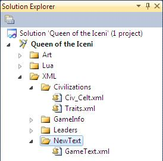

The pedia entries use a special format. The prefix for the pedia entries is whatever we put in the CivilopediaTag attribute (TXT_KEY_CIV5_CELT). But the pedia is built form matching pairs of _HEADING_# and _TEXT_# entries. If we add a text entry for TXT_KEY_CIV5_CELT_HEADING_1, then that will be the heading for the for section of the pedia, TXT_KEY_CIV5_CELT_TEXT_1 will be the pedia entry under that heading. This way modders can add as many pedia entries as they want for a civilization (the same system is used for leaders).

Being lazy, I also used TXT_KEY_CIV5_CELT_TEXT_1 as the Dawn of Man quote.

4. Add the following to the text file:

```xml
<GameData>
    <Language_en_US>
        <Row Tag="TXT_KEY_CITY_NAME_BIBRACTE">
            <Text>Bibracte</Text>
        </Row>
        <Row Tag="TXT_KEY_CITY_NAME_VIENNE">
            <Text>Vienne</Text>
        </Row>
        <Row Tag="TXT_KEY_CITY_NAME_TOLOSA">
            <Text>Tolosa</Text>
        </Row>
        <Row Tag="TXT_KEY_CIV_CELT_ADJECTIVE">
            <Text>Celtic</Text>
        </Row>
        <Row Tag="TXT_KEY_CIV_CELT_DESC">
            <Text>Celtic Empire</Text>
        </Row>
        <Row Tag="TXT_KEY_CIV_CELT_SHORT_DESC">
            <Text>Celtia</Text>
        </Row>
        <Row Tag="TXT_KEY_CIV5_CELT_HEADING_1">
            <Text>History</Text>
        </Row>
        <Row Tag="TXT_KEY_CIV5_CELT_TEXT_1">
            <Text>The Celts were a diverse group of tribal societies in Iron Age and Roman-era Europe who spoke Celtic languages.[NEWLINE][NEWLINE]The earliest archaeological culture commonly accepted as Celtic, or rather Proto-Celtic, was the central European Hallstatt culture (ca. 800-450 BC), named for the rich grave finds in Hallstatt, Austria. By the later La Tène period (ca. 450 BC up to the Roman conquest), this Celtic culture had expanded over a wide range of regions, whether by diffusion or migration: to the British Isles (Insular Celts), the Iberian Peninsula (Celtiberians, Celtici ), much of Central Europe, (Gauls) and following the Gallic invasion of the Balkans in 279 BC as far east as central Anatolia (Galatians).[NEWLINE][NEWLINE]The earliest directly attested examples of a Celtic language are the Lepontic inscriptions, beginning from the 6th century BC. Continental Celtic languages are attested only in inscriptions and place-names. Insular Celtic is attested from about the 4th century AD in ogham inscriptions, although it is clearly much earlier. Literary tradition begins with Old Irish from about the 8th century. Coherent texts of Early Irish literature, such as the Táin Bó Cúailnge (The Cattle Raid of Cooley), survive in 12th-century recensions. According to the theory of John T. Koch and others, the Tartessian language may have been the earliest directly attested Celtic language with the Tartessian written script used in the inscriptions based on a version of a Phoenician script in use around 825 BC.[NEWLINE][NEWLINE]By the early 1st millennium AD, following the expansion of the Roman Empire and the Great Migrations (Migration Period) of Germanic peoples, Celtic culture had become restricted to the British Isles (Insular Celtic), and the Continental Celtic languages ceased to be widely used by the 6th century.</Text>
        </Row>
    </Language_en_US>
</GameData>           
```

5. Lastly we have to make sure our modified files update the database. On the Actions tab on the mod properties we have to add the following entries to get the game to convert our xml files to sql and write them to the game database when the mod is loaded. This is one of the few places where the file path is important, if we change our directory or file names we will have to update the entry here on the Actions tab.

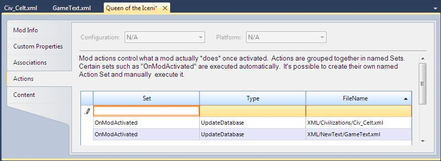

After that we have a new civilization in the game. We could use some art assets to make it look better, a new leader to go with it, and a unique unit and building. All of those will be covered in later sections.

#### 如何添加图标

Now we need an icon for our civilization.

Firaxis has helped us out by providing icon templates in the <SDK install directory>\Art\ directory as .psd files. There are seven templates files, one for 32x32 icons, one for 45x45, 64x64, 80x80, 128x128, 214x214 and 256x256.

Firaxis also provided a readme for icon sizes that are required for all the asset types.

|  |  |
| :--------------- |  :-------------------  |
|  Promotions       |  256,64, 45, 32           | 
|  Buildings        |  256,128, 64, 45          | 
|  Citizens         |  256,128, 64, 45, 32      | 
|  Civilizations    |  256,128, 80, 64, 45, 32  |
|  Difficulties     |  128,64, 32               |
|  GameSpeeds       |  128,64, 32               | 
|  Leaders          |  256,128, 64              |   
|  Natural Wonders  |  256,128, 80, 64, 45      |     
|  Policies         |  256,64                   |
|  Resources        |  256,80, 64, 45           |    
|  Technologies     |  256,214, 128, 80, 64, 45 |    
|  Terrain          |  256,64                   |
|  Unit Actions     |  64, 45                   |
|  Units            |  256,128, 80, 64, 45      |    
|  Unit Flags       |  32                       |
|  World Sizes      |  128,64, 32               |
|  World Types      |  128,64, 32               | 
| | |

The above means that civilizations, for example, need a 256x256, 128x128, 80x80, 64x64, 45x45 and 32x32 icon. So we need to create six icons for different sizes for our civilization. Loading the IconAtlas256.psd I can use Photoshop to create an icon in the first slot.


I prefer Photoshop, but many modders like to use Gimp, which has the considerable advantage of being free. The art tool doesn't matter, as long as it can read the .psd template and save the file as a .dds file.

I prefer to create the largest icon size first, since we will shrink this file to save the smaller versions. It's also important that our icon be clear and distinctive, not only at the 256x256 size, but at the 32x32 size. So avoid designs that are to complex (the celtic knot design I used is probably too complex to look that good at 32x32, but it will do).

There is also an alpha layer in the psd file that defaults to the same round circles you see in the rest of the icon spaces above. The alpha layer controls what is displayed, what is white in the alpha layer is shown as part of the icon, what is black isn't. It is how the game knows what the edges of the icon are.

All the base game civilization icons are simple circles, but I got a little fancy with mine and had it extend outside of the circle, so I had to adjust the alpha layer to match.

Once you have the icon created in the template, save it as a dds file. You may need to download special plugins for your art tool of choice to be able to save dds files. I selected to call my file CivSymbolsColorLegends256.dds.

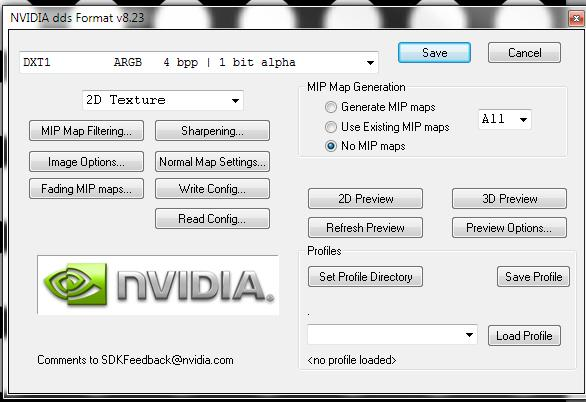

The 256x256 template is 2048x2048 pixels (eight 256 width icons across, eight 256 height icons from top to bottom). If we resize our image from 2048x2048 to 1024x1024 this will reduce our icons to 128x128, then we can save CivSymbolsColorLegends128.dds, resize to 640x640 (80 x 8) and save CivSymbolsColorLegends80.dds. And on to create a 64x64, 45x45 and 32x32 icon size dds file.

Once that is done we can add the files to our mod by creating an Art folder (though this isn't nessesary, I create it to help organize the project) and dragging and dropping our files into it.

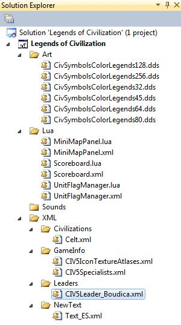

Once all of our art files our added to the project we need to be able to reference them. to do that add a new asset type we need to add, IconTextureAtlases. Add the GameInfo folder underneath the XML folder and add an XML file called CIV5IconTextureAtlases.xml that contains the following:

```xml
<GameData>
    <IconTextureAtlases>
        <Row>
            <Atlas>CIV_COLOR_ATLAS_LEGENDS</Atlas>
            <IconSize>256</IconSize>
            <Filename>CivSymbolsColorLegends256.dds</Filename>
            <IconsPerRow>8</IconsPerRow>
            <IconsPerColumn>8</IconsPerColumn>
        </Row>
        <Row>
            <Atlas>CIV_COLOR_ATLAS_LEGENDS</Atlas>
            <IconSize>128</IconSize>
            <Filename>CivSymbolsColorLegends128.dds</Filename>
            <IconsPerRow>8</IconsPerRow>
            <IconsPerColumn>8</IconsPerColumn>
        </Row>
        <Row>
            <Atlas>CIV_COLOR_ATLAS_LEGENDS</Atlas>
            <IconSize>80</IconSize>
            <Filename>CivSymbolsColorLegends80.dds</Filename>
            <IconsPerRow>8</IconsPerRow>
            <IconsPerColumn>8</IconsPerColumn>
        </Row>
        <Row>
            <Atlas>CIV_COLOR_ATLAS_LEGENDS</Atlas>
            <IconSize>64</IconSize>
            <Filename>CivSymbolsColorLegends64.dds</Filename>
            <IconsPerRow>8</IconsPerRow>
            <IconsPerColumn>8</IconsPerColumn>
        </Row>
        <Row>
            <Atlas>CIV_COLOR_ATLAS_LEGENDS</Atlas>
            <IconSize>45</IconSize>
            <Filename>CivSymbolsColorLegends45.dds</Filename>
            <IconsPerRow>8</IconsPerRow>
            <IconsPerColumn>8</IconsPerColumn>
        </Row>
        <Row>
            <Atlas>CIV_COLOR_ATLAS_LEGENDS</Atlas>
            <IconSize>32</IconSize>
            <Filename>CivSymbolsColorLegends32.dds</Filename>
            <IconsPerRow>8</IconsPerRow>
            <IconsPerColumn>8</IconsPerColumn>
        </Row>
    </IconTextureAtlases>
</GameData>
```

The above defines the dds files we added. The important part for each is that the Icon size specifies what size icons it holds, and the IconsPerRow and IconsPerColumm tells it how the icons are laid out. Also note that all the Atlases have the same name, what distinguishes them is what size icon the game needs. So that if we tell the game to get the 12th icon in the CIV_COLOR_ATLAS_LEGENDS it will already know that it needs it for a 128x128 size display, so it will look in CivSymbolsColorLegends128.dds and since it knows that the icons are in a 8x8 grid it knows the 12th icon is 3rd icon in the 2nd row (counting starts at 0).

Lastly we need to modify our civilization definition to use our new icon. back in our Celt.xml file we need to make the changes marked in blue:

```xml
<GameData>
    <Civilizations>
        <Row>
            <Type>CIVILIZATION_CELT</Type>
            <Description>TXT_KEY_CIV_CELT_DESC</Description>
            <ShortDescription>TXT_KEY_CIV_CELT_SHORT_DESC</ShortDescription>
            <Adjective>TXT_KEY_CIV_CELT_ADJECTIVE</Adjective>
            <Civilopedia>TXT_KEY_CIV_CELT_PEDIA</Civilopedia>
            <CivilopediaTag>TXT_KEY_CIV5_CELT</CivilopediaTag>
            <DefaultPlayerColor>PLAYERCOLOR_DARK_GREEN</DefaultPlayerColor>
            <ArtDefineTag>ART_DEF_CIVILIZATION_ENGLAND</ArtDefineTag>
            <ArtStyleType>ARTSTYLE_EUROPEAN</ArtStyleType>
            <ArtStyleSuffix>_EURO</ArtStyleSuffix>
            <ArtStylePrefix>EUROPEAN </ArtStylePrefix>
            <blue><PortraitIndex>0</PortraitIndex></blue>
            <blue><IconAtlas>CIV_COLOR_ATLAS_LEGENDS</IconAtlas></blue>
            <AlphaIconAtlas>CIV_ALPHA_ATLAS</AlphaIconAtlas>
            <MapImage>MapEngland512.dds</MapImage>
            <DawnOfManQuote>TXT_KEY_CIV5_DAWN_CELT_TEXT</DawnOfManQuote>
            <DawnOfManImage>DOM_Elizabeth.dds</DawnOfManImage>
            <DawnOfManAudio/>
        </Row>
...etc
```

The above tells the civilization to use the new atlas we defined and use Icon 0 (the first icon in that atlas) the civ icon. Loading up the mod we can take a look at our new icon.

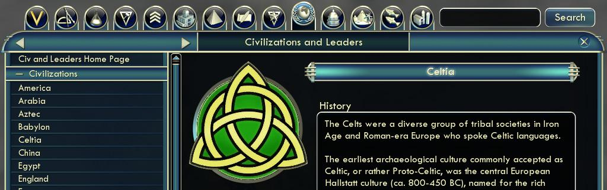

#### 如何添加首领

Adding a leader is similar to adding a civilization. To create Boudica I copied all the attributes from Alexander, who I want her to act similar to. Then I switched to Elizabeth's art definitions for ArtDefineTag (the leader screen art) and PortraitIndex (the icon she uses). Last I switched her to the Hiawatha's trait of Ignore Terrain in Forest. In later sections we look at how to create new art and trait for Boudica.

This is Boudica's leader definition. I created a new file called XML/Leaders/CIV5Leader_Bouidica.xml and set this file to update the database on the actions tab of the mod properties.

```xml
<GameData>
    <Leaders>
        <Row>
            <Type>LEADER_BOUDICA</Type>
            <Description>TXT_KEY_LEADER_BOUDICA</Description>
            <Civilopedia>TXT_KEY_LEADER_BOUDICA_PEDIA</Civilopedia>
            <CivilopediaTag>TXT_KEY_CIVILOPEDIA_LEADERS_BOUDICA</CivilopediaTag>
            <ArtDefineTag>Elizabeth_Scene.xml</ArtDefineTag>
            <VictoryCompetitiveness>8</VictoryCompetitiveness>
            <WonderCompetitiveness>7</WonderCompetitiveness>
            <MinorCivCompetitiveness>3</MinorCivCompetitiveness>
            <Boldness>8</Boldness>
            <DiploBalance>3</DiploBalance>
            <WarmongerHate>2</WarmongerHate>
            <WorkAgainstWillingness>7</WorkAgainstWillingness>
            <WorkWithWillingness>4</WorkWithWillingness>
            <PortraitIndex>6</PortraitIndex>
            <IconAtlas>LEADER_ATLAS</IconAtlas>
        </Row>
            </Leaders>
            <Leader_MajorCivApproachBiases>
            <Row>
            <LeaderType>LEADER_BOUDICA</LeaderType>
            <MajorCivApproachType>MAJOR_CIV_APPROACH_WAR</MajorCivApproachType>
            <Bias>7</Bias>
        </Row>
        <Row>
            <LeaderType>LEADER_BOUDICA</LeaderType>
            <MajorCivApproachType>MAJOR_CIV_APPROACH_HOSTILE</MajorCivApproachType>
            <Bias>7</Bias>
        </Row>
        <Row>
            <LeaderType>LEADER_BOUDICA</LeaderType>
            <MajorCivApproachType>MAJOR_CIV_APPROACH_DECEPTIVE</MajorCivApproachType>
            <Bias>4</Bias>
        </Row>
        <Row>
            <LeaderType>LEADER_BOUDICA</LeaderType>
            <MajorCivApproachType>MAJOR_CIV_APPROACH_GUARDED</MajorCivApproachType>
            <Bias>5</Bias>
        </Row>
        <Row>
            <LeaderType>LEADER_BOUDICA</LeaderType>
            <MajorCivApproachType>MAJOR_CIV_APPROACH_AFRAID</MajorCivApproachType>
            <Bias>3</Bias>
        </Row>
        <Row>
            <LeaderType>LEADER_BOUDICA</LeaderType>
            <MajorCivApproachType>MAJOR_CIV_APPROACH_FRIENDLY</MajorCivApproachType>
            <Bias>5</Bias>
        </Row>
        <Row>
            <LeaderType>LEADER_BOUDICA</LeaderType>
            <MajorCivApproachType>MAJOR_CIV_APPROACH_NEUTRAL</MajorCivApproachType>
            <Bias>4</Bias>
        </Row>
    </Leader_MajorCivApproachBiases>
    <Leader_MinorCivApproachBiases>
        <Row>
            <LeaderType>LEADER_BOUDICA</LeaderType>
            <MinorCivApproachType>MINOR_CIV_APPROACH_IGNORE</MinorCivApproachType>
            <Bias>4</Bias>
        </Row>
        <Row>
            <LeaderType>LEADER_BOUDICA</LeaderType>
            <MinorCivApproachType>MINOR_CIV_APPROACH_FRIENDLY</MinorCivApproachType>
            <Bias>5</Bias>
        </Row>
        <Row>
            <LeaderType>LEADER_BOUDICA</LeaderType>
            <MinorCivApproachType>MINOR_CIV_APPROACH_PROTECTIVE</MinorCivApproachType>
            <Bias>3</Bias>
        </Row>
        <Row>
            <LeaderType>LEADER_BOUDICA</LeaderType>
            <MinorCivApproachType>MINOR_CIV_APPROACH_CONQUEST</MinorCivApproachType>
            <Bias>8</Bias>
        </Row>
    </Leader_MinorCivApproachBiases>
    <Leader_Flavors>
        <Row>
            <LeaderType>LEADER_BOUDICA</LeaderType>
            <FlavorType>FLAVOR_OFFENSE</FlavorType>
            <Flavor>8</Flavor>
        </Row>
        <Row>
            <LeaderType>LEADER_BOUDICA</LeaderType>
            <FlavorType>FLAVOR_DEFENSE</FlavorType>
            <Flavor>5</Flavor>
        </Row>
        <Row>
            <LeaderType>LEADER_BOUDICA</LeaderType>
            <FlavorType>FLAVOR_CITY_DEFENSE</FlavorType>
            <Flavor>5</Flavor>
        </Row>
        <Row>
            <LeaderType>LEADER_BOUDICA</LeaderType>
            <FlavorType>FLAVOR_MILITARY_TRAINING</FlavorType>
            <Flavor>5</Flavor>
        </Row>
        <Row>
            <LeaderType>LEADER_BOUDICA</LeaderType>
            <FlavorType>FLAVOR_RECON</FlavorType>
            <Flavor>5</Flavor>
        </Row>
        <Row>
            <LeaderType>LEADER_BOUDICA</LeaderType>
            <FlavorType>FLAVOR_RANGED</FlavorType>
            <Flavor>3</Flavor>
        </Row>
        <Row>
            <LeaderType>LEADER_BOUDICA</LeaderType>
            <FlavorType>FLAVOR_MOBILE</FlavorType>
            <Flavor>8</Flavor>
        </Row>
        <Row>
            <LeaderType>LEADER_BOUDICA</LeaderType>
            <FlavorType>FLAVOR_NAVAL</FlavorType>
            <Flavor>5</Flavor>
        </Row>
        <Row>
            <LeaderType>LEADER_BOUDICA</LeaderType>
            <FlavorType>FLAVOR_NAVAL_RECON</FlavorType>
            <Flavor>5</Flavor>
        </Row>
        <Row>
            <LeaderType>LEADER_BOUDICA</LeaderType>
            <FlavorType>FLAVOR_NAVAL_GROWTH</FlavorType>
            <Flavor>6</Flavor>
        </Row>
        <Row>
            <LeaderType>LEADER_BOUDICA</LeaderType>
            <FlavorType>FLAVOR_NAVAL_TILE_IMPROVEMENT</FlavorType>
            <Flavor>6</Flavor>
        </Row>
        <Row>
            <LeaderType>LEADER_BOUDICA</LeaderType>
            <FlavorType>FLAVOR_AIR</FlavorType>
            <Flavor>3</Flavor>
        </Row>
        <Row>
            <LeaderType>LEADER_BOUDICA</LeaderType>
            <FlavorType>FLAVOR_EXPANSION</FlavorType>
            <Flavor>8</Flavor>
        </Row>
        <Row>
            <LeaderType>LEADER_BOUDICA</LeaderType>
            <FlavorType>FLAVOR_GROWTH</FlavorType>
            <Flavor>4</Flavor>
        </Row>
        <Row>
            <LeaderType>LEADER_BOUDICA</LeaderType>
            <FlavorType>FLAVOR_TILE_IMPROVEMENT</FlavorType>
            <Flavor>4</Flavor>
        </Row>
        <Row>
            <LeaderType>LEADER_BOUDICA</LeaderType>
            <FlavorType>FLAVOR_INFRASTRUCTURE</FlavorType>
            <Flavor>4</Flavor>
        </Row>
        <Row>
            <LeaderType>LEADER_BOUDICA</LeaderType>
            <FlavorType>FLAVOR_PRODUCTION</FlavorType>
            <Flavor>5</Flavor>
        </Row>
        <Row>
            <LeaderType>LEADER_BOUDICA</LeaderType>
            <FlavorType>FLAVOR_GOLD</FlavorType>
            <Flavor>3</Flavor>
        </Row>
        <Row>
            <LeaderType>LEADER_BOUDICA</LeaderType>
            <FlavorType>FLAVOR_SCIENCE</FlavorType>
            <Flavor>6</Flavor>
        </Row>
        <Row>
            <LeaderType>LEADER_BOUDICA</LeaderType>
            <FlavorType>FLAVOR_CULTURE</FlavorType>
            <Flavor>7</Flavor>
        </Row>
        <Row>
            <LeaderType>LEADER_BOUDICA</LeaderType>
            <FlavorType>FLAVOR_HAPPINESS</FlavorType>
            <Flavor>5</Flavor>
        </Row>
        <Row>
            <LeaderType>LEADER_BOUDICA</LeaderType>
            <FlavorType>FLAVOR_GREAT_PEOPLE</FlavorType>
            <Flavor>6</Flavor>
        </Row>
        <Row>
            <LeaderType>LEADER_BOUDICA</LeaderType>
            <FlavorType>FLAVOR_WONDER</FlavorType>
            <Flavor>7</Flavor>
        </Row>
        <Row>
            <LeaderType>LEADER_BOUDICA</LeaderType>
            <FlavorType>FLAVOR_RELIGION</FlavorType>
            <Flavor>5</Flavor>
        </Row>
        <Row>
            <LeaderType>LEADER_BOUDICA</LeaderType>
            <FlavorType>FLAVOR_DIPLOMACY</FlavorType>
            <Flavor>7</Flavor>
        </Row>
        <Row>
            <LeaderType>LEADER_BOUDICA</LeaderType>
            <FlavorType>FLAVOR_SPACESHIP</FlavorType>
            <Flavor>8</Flavor>
        </Row>
        <Row>
            <LeaderType>LEADER_BOUDICA</LeaderType>
            <FlavorType>FLAVOR_WATER_CONNECTION</FlavorType>
            <Flavor>6</Flavor>
        </Row>
    </Leader_Flavors>
    <Leader_Traits>
        <Row>
            <LeaderType>LEADER_BOUDICA</LeaderType>
            <TraitType>TRAIT_IGNORE_TERRAIN_IN_FOREST</TraitType>
        </Row>
    </Leader_Traits>
</GameData>
```

We need two more things before Boudica becomes a complete leader. First we need to modify our Celt civilization entry to make Boudica the leader. To do that we need to modify the Celt.xml entry we added from the LEADER_ELIZABETH leader to LEADER_BOUDICA.

```xml
<Civilization_Leaders>
    <Row>
        <CivilizationType>CIVILIZATION_CELT</CivilizationType>
        <LeaderheadType>LEADER_BOUDICA</LeaderheadType>
    </Row>
</Civilization_Leaders>
```

Secondly we need to add the text strings to our already existing GameText.xml that is used by our new leader:

```xml
    <Row Tag="TXT_KEY_CIVILOPEDIA_LEADERS_BOUDICA_HEADING_1">
        <Text>History</Text>
    </Row>
    <Row Tag="TXT_KEY_CIVILOPEDIA_LEADERS_BOUDICA_TEXT_1">
        <Text>Boudica, formerly known as Boadicea and known in Welsh as "Buddug" was queen of a Celtic tribe who led an uprising against the occupying forces of the Roman Empire.[NEWLINE][NEWLINE]Boudica's husband Prasutagus, ruler of the Iceni tribe who had ruled as a nominally independent ally of Rome, left his kingdom jointly to his daughters and the Roman Emperor in his will. However, when he died his will was ignored. The kingdom was annexed as if conquered, Boudica was flogged and her daughters raped, and Roman financiers called in their loans.[NEWLINE][NEWLINE]In AD 60 or 61, while the Roman governor, Gaius Suetonius Paulinus, was leading a campaign on the island of Anglesey in north Wales, Boudica led the Iceni people, along with the Trinovantes and others, in revolt. They destroyed Camulodunum (modern Colchester), formerly the capital of the Trinovantes, but now a colonia (a settlement for discharged Roman soldiers) and the site of a temple to the former emperor Claudius, which was built and maintained at local expense. They also routed a Roman legion, the IX Hispana, sent to relieve the settlement.[NEWLINE][NEWLINE]On hearing the news of the revolt, Suetonius hurried to Londinium (London), the twenty-year-old commercial settlement that was the rebels' next target. Concluding he did not have the numbers to defend it, Suetonius evacuated and abandoned it. It was burnt to the ground, as was Verulamium (St Albans). An estimated 70,000–80,000 people were killed in the three cities. Suetonius, meanwhile, regrouped his forces in the West Midlands, and despite being heavily outnumbered, defeated the Britons in the Battle of Watling Street. The crisis caused the emperor Nero to consider withdrawing all Roman forces from the island, but Suetonius' eventual victory over Boudica secured Roman control of the province. Boudica then killed herself so she would not be captured, or fell ill and died; Tacitus and Dio differ.[NEWLINE][NEWLINE]The history of these events, as recorded by Tacitus and Cassius Dio, was rediscovered during the Renaissance and led to a resurgence of Boudica's legendary fame during the Victorian era, when Queen Victoria was portrayed as her 'namesake'. Boudica has since remained an important cultural symbol in the United Kingdom. The absence of native British literature during the early part of the first millennium means that Britain owes its knowledge of Boudica's rebellion to the writings of the Romans.</Text>
    </Row>
    <Row Tag="TXT_KEY_CIVILOPEDIA_LEADERS_BOUDICA_LIVED">
        <Text>25 - 62 AD</Text>
    </Row>
    <Row Tag="TXT_KEY_CIVILOPEDIA_LEADERS_BOUDICA_NAME">
        <Text>Boudica</Text>
    </Row>
    <Row Tag="TXT_KEY_CIVILOPEDIA_LEADERS_BOUDICA_SUBTITLE">
        <Text>Leader of the Celts</Text>
    </Row>
    <Row Tag="TXT_KEY_LEADER_BOUDICA">
        <Text>Boudica</Text>
    </Row>
```

Notice that, just as with the civilizations, the CivilopediaTag attribute is a prefix for several text strings. The _NAME and _SUBTITLE are special to leaders and are displayed at the top of the pedia page. Exactly as with civilizations the _HEADING_1 and _TEXT_1 are used to create body sections in the pedia page. And there is a special tag for _LIVED which contains the years the years the leader was alive.

Finally, I would like to update the Dawn of Man (loading screen image) image for the Celt civ so that it loads with a picture of Boudica instead of the current picture of Elizabeth. As I was stretching the limits of my artistic ability to create that Celtic civilization icon, I'm going to have to find another source for a Boudica picture. Fortunately Boudica had great art in the Civilization IV: Warlords expansion, and I don't think Firaxis would mind if I borrowed it for a Civilization V mod.

A Dawn of Man picture is 1024x768 and has to be a DDS file. Outside of that any picture will do. I used photoshop to save a picture of Boudica in that size and format as BoudicaDOM.dds, included that picture with my mod and made the following change to the Celt's civilization definition (change in blue):

```xml
<Civilizations>
    <Row>
        <Type>CIVILIZATION_CELT</Type>
        <Description>TXT_KEY_CIV_CELT_DESC</Description>
        <ShortDescription>TXT_KEY_CIV_CELT_SHORT_DESC</ShortDescription>
        <Adjective>TXT_KEY_CIV_CELT_ADJECTIVE</Adjective>
        <Civilopedia>TXT_KEY_CIV_CELT_PEDIA</Civilopedia>
        <CivilopediaTag>TXT_KEY_CIV5_CELT</CivilopediaTag>
        <DefaultPlayerColor>PLAYERCOLOR_DARK_GREEN</DefaultPlayerColor>
        <ArtDefineTag>ART_DEF_CIVILIZATION_ENGLAND</ArtDefineTag>
        <ArtStyleType>ARTSTYLE_EUROPEAN</ArtStyleType>
        <ArtStyleSuffix>_EURO</ArtStyleSuffix>
        <ArtStylePrefix>EUROPEAN </ArtStylePrefix>
        <PortraitIndex>0</PortraitIndex>
        <IconAtlas>CIV_COLOR_ATLAS_LEGENDS</IconAtlas>
        <AlphaIconAtlas>CIV_ALPHA_ATLAS</AlphaIconAtlas>
        <MapImage>MapEngland512.dds</MapImage>
        <DawnOfManQuote>TXT_KEY_CIV5_CELT_TEXT_1</DawnOfManQuote>
        <DawnOfManImage>BoudicaDOM.dds</DawnOfManImage>
        <DawnOfManAudio/>
    </Row>
</Civilizations>
```
And that's all we need to have a new, working leader. In the next section we will cover how to add a new trait to Boudica and there will be a screenshot of the Dawn of Man screen where we can see the new screen.

#### 如何添加特性

So far we have been borrowing Hiawatha's trait for our Boudica. It works fairly well, but our civilization would be more interesting if it had a unique trait. This section will go through the simple steps to add a trait to the game.

First we need to add a new file to our mod, CIV5Traits.xml in the /XML/Civilizations directory. We will be adding a trait called Battle Fury that will give all Melee, Mounted and Gun units 2 attacks per round instead of the normal 1. This is the definition we will need to do that:

```xml
<GameData>
    <Traits>
        <Row>
            <Type>TRAIT_BATTLE_FURY</Type>
            <Description>TXT_KEY_TRAIT_BATTLE_FURY</Description>
            <ShortDescription>TXT_KEY_TRAIT_BATTLE_FURY_SHORT</ShortDescription>
        </Row>
    </Traits>
    <Trait_FreePromotionUnitCombats>
        <Row>
            <TraitType>TRAIT_BATTLE_FURY</TraitType>
            <UnitCombatType>UNITCOMBAT_MELEE</UnitCombatType>
            <PromotionType>PROMOTION_SECOND_ATTACK</PromotionType>
        </Row>
        <Row>
            <TraitType>TRAIT_BATTLE_FURY</TraitType>
            <UnitCombatType>UNITCOMBAT_MOUNTED</UnitCombatType>
            <PromotionType>PROMOTION_SECOND_ATTACK</PromotionType>
        </Row>
        <Row>
            <TraitType>TRAIT_BATTLE_FURY</TraitType>
            <UnitCombatType>UNITCOMBAT_GUN</UnitCombatType>
            <PromotionType>PROMOTION_SECOND_ATTACK</PromotionType>
        </Row>
    </Trait_FreePromotionUnitCombats>
</GameData>
```

The above adds the new trait to the game. It's a fairly simple definition, it gives the Second Attack promotion to all this civilizations Melee, Mounted and Gun units (Second Attack is an already existing promotion that gives units an additional attack each turn).

But we need to modify our mod properties to add this to the list of files that will update the database when the mod is loaded, we need text string decodes for the text strings we use here and we need to assign this trait to Boudica.

You should be familiar with adding text strings by this point. Add the following to the GameText.xml file:

```xml
<Row Tag="TXT_KEY_TRAIT_BATTLE_FURY">
    <Text>Melee, Mounted and Gun units can make 2 attacks per round.</Text>
</Row>
<Row Tag="TXT_KEY_TRAIT_BATTLE_FURY_SHORT">
    <Text>Battle Fury</Text>
</Row>
```

To assign this to Boudica make the following change to our Boudica leader definition:

```xml
<Leader_Traits>
    <Row>
        <LeaderType>LEADER_BOUDICA</LeaderType>
        <TraitType>TRAIT_BATTLE_FURY</TraitType>
    </Row>
</Leader_Traits>
```

Creating a new trait is as easy as that. Be sure to look through the schema definition for Traits and the XML definitions for all the existing traits to get ideas for new traits for your leaders.

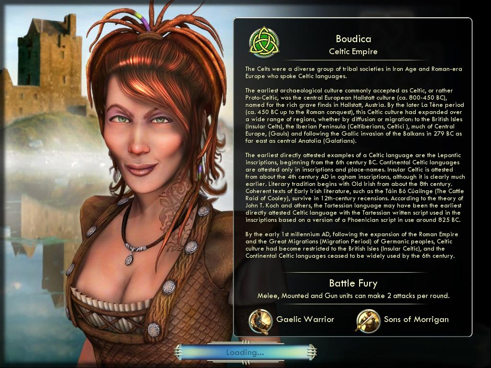

#### 如何添加单位

Units are fun, and adding them is easy. As you may have noticed in the above screenshot there are two Unique Units assigned to the Celt's in this section we will cover how to add one of them.

This document covers the technical aspects of modding, but it's worth briefly mentioning some design considerations when adding new unique units to the game. When you consider a unique unit think about when that makes the civilization powerful (unique units are typically better than the unit they replace). Consider how that matches with their trait and how that compares to other unique units. For the Celts I've added a unique unit that replaces the warrior and one that replaces the swordsman. Both are early units and both combine nicely with the Boudica's trait. That makes the Celt's very strong militarily in the early game. They don't have buildings that help with their infrastructure and none of their abilities are very helpful defensively. But they are great early game raiders.

The Gaelic Warrior is the same cost and strength of a normal warrior but he ignores terrain costs. Moving through forests, hills, jungles or across rivers happens exactly like open plains. This makes the Gaelic Warrior very quick raiders, especially with their trait ability of being able to attack twice a turn. This also helps with their forested starts.

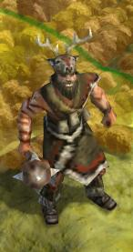

We need to make four changes to add a new unique unit to the game. First we need to add a new file CIV5Units.xml to our mod. I added it in the XML/Units/ folder. That file needs to contain the following unit definition.

```xml
<GameData>
    <Units>
        <Row>
            <Class>UNITCLASS_WARRIOR</Class>
            <Type>UNIT_GAELIC_WARRIOR</Type>
            <Combat>6</Combat>
            <Cost>40</Cost>
            <Moves>2</Moves>
            <CombatClass>UNITCOMBAT_MELEE</CombatClass>
            <Domain>DOMAIN_LAND</Domain>
            <DefaultUnitAI>UNITAI_ATTACK</DefaultUnitAI>
            <Description>TXT_KEY_UNIT_GAELIC_WARRIOR</Description>
            <Civilopedia>TXT_KEY_CIV5_ANTIQUITY_WARRIOR_TEXT</Civilopedia>
            <Strategy>TXT_KEY_UNIT_WARRIOR_STRATEGY</Strategy>
            <Help>TXT_KEY_UNIT_HELP_GAELIC_WARRIOR</Help>
            <MilitarySupport>true</MilitarySupport>
            <MilitaryProduction>true</MilitaryProduction>
            <Pillage>true</Pillage>
            <ObsoleteTech>TECH_METAL_CASTING</ObsoleteTech>
            <GoodyHutUpgradeUnitClass>UNITCLASS_SPEARMAN</GoodyHutUpgradeUnitClass>
            <AdvancedStartCost>10</AdvancedStartCost>
            <XPValueAttack>3</XPValueAttack>
            <XPValueDefense>3</XPValueDefense>
            <Conscription>1</Conscription>
            <UnitArtInfo>ART_DEF_UNIT_GAELIC_WARRIOR</UnitArtInfo>
            <UnitFlagIconOffset>3</UnitFlagIconOffset>
            <IconAtlas>UNIT_ATLAS_1</IconAtlas>
            <PortraitIndex>3</PortraitIndex>
        </Row>
    </Units>
    <Unit_FreePromotions>
        <Row>
            <UnitType>UNIT_GAELIC_WARRIOR</UnitType>
            <PromotionType>PROMOTION_IGNORE_TERRAIN_COST</PromotionType>
        </Row>
    </Unit_FreePromotions>
    <Unit_AITypes>
        <Row>
            <UnitType>UNIT_GAELIC_WARRIOR</UnitType>
            <UnitAIType>UNITAI_ATTACK</UnitAIType>
        </Row>
        <Row>
            <UnitType>UNIT_GAELIC_WARRIOR</UnitType>
            <UnitAIType>UNITAI_DEFENSE</UnitAIType>
        </Row>
        <Row>
            <UnitType>UNIT_GAELIC_WARRIOR</UnitType>
            <UnitAIType>UNITAI_EXPLORE</UnitAIType>
        </Row>
    </Unit_AITypes>
    <Unit_ClassUpgrades>
        <Row>
            <UnitType>UNIT_GAELIC_WARRIOR</UnitType>
            <UnitClassType>UNITCLASS_SWORDSMAN</UnitClassType>
        </Row>
    </Unit_ClassUpgrades>
    <Unit_Flavors>
        <Row>
            <UnitType>UNIT_GAELIC_WARRIOR</UnitType>
            <FlavorType>FLAVOR_RECON</FlavorType>
            <Flavor>1</Flavor>
        </Row>
        <Row>
            <UnitType>UNIT_GAELIC_WARRIOR</UnitType>
            <FlavorType>FLAVOR_OFFENSE</FlavorType>
            <Flavor>2</Flavor>
        </Row>
        <Row>
            <UnitType>UNIT_GAELIC_WARRIOR</UnitType>
            <FlavorType>FLAVOR_DEFENSE</FlavorType>
            <Flavor>2</Flavor>
        </Row>
    </Unit_Flavors>
</GameData>
```

Notice that in the above there are a few tables that need to be updated when adding unit. The primary one is the Units table, But we also updated the Unit_FreePromotions table (to grant the promotion that allows the unit to ignore terrain costs), Unit_AITypes table (interestingly the game searches for an available UNITAI_DEFENSE unit to start the player with, since I didn't originally have this defined the Celts weren't starting with a free warrior until I fixed it), Unit_ClassUpgrades table (so that our new unit can be upgraded to a Swordsman) and the Unit_Flavors table (so different AI leaders can prefer different strategies).

The above unit uses the UNITCLASS_WARRIOR unitclass, so we don't need to define a new unitclass for it. Since it doesn't have its own unitclass, we know that this is a unique unit (that it replaces the warrior unit for a civilization).

All of the Unit attributes should be fairly easy to understand. I included a custom art definition with the Gaelic Warrior, we will go over that in the next section.

The second step to adding the unit is that we have to modify the mod properties and include the new file as one that updates the database when the mod is activated.

The third step is to add the text entries the unit requires. I didn't get fancy and add a custom pedia entry. Just the text string and a help string so the player knows what the unit does, so we only have two entries that need to be added to the text file.

```xml
<Row Tag="TXT_KEY_UNIT_GAELIC_WARRIOR">
    <Text>Gaelic Warrior</Text>
</Row>
<Row Tag="TXT_KEY_UNIT_HELP_GAELIC_WARRIOR">
    <Text>This unit's ability to ignore terrain allows it to quickly rush into enemy lands.</Text>
</Row>
```

The final step is we need to assign this unit as unique unit for the Celt civilization.

```xml
<Civilization_UnitClassOverrides>
    <Row>
        <CivilizationType>CIVILIZATION_CELT</CivilizationType>
        <UnitClassType>UNITCLASS_WARRIOR</UnitClassType>
        <UnitType>UNIT_GAELIC_WARRIOR</UnitType>
    </Row>
</Civilization_UnitClassOverrides>
```

That is all it takes to add a new unit to the game. In the next section we will look at how we assign new art to a unit.

#### 如何改变艺术家的定义

This document won't cover creating art assets for Civ5. Firaxis has an SDK tool called Nexus for that, but I am the wrong guy to cover it.

But we will go through the art definitions. There are two parts. The first, UnitArtInfo, is for the formation as a whole. The unit definition points to this layer, it specifies how many units (and what sort of units) make up the formation. The entire file is too long to include here, but this is one sample from it.

```xml
<UnitArtInfos>
    <UnitArtInfo>
        <Type>ART_DEF_UNIT_BARBARIAN_EURO</Type>
        <Formation>Barbarian</Formation>
        <DamageStates>1</DamageStates>
        <UnitMemberArt>
            <MemberType>ART_DEF_UNIT_MEMBER_BARBARIAN_EURO_ALPHA</MemberType>
            <MemberCount>2</MemberCount>
        </UnitMemberArt>
        <UnitMemberArt>
            <MemberType>ART_DEF_UNIT_MEMBER_BARBARIAN_EURO_BRAVO</MemberType>
            <MemberCount>4</MemberCount>
        </UnitMemberArt>
        <UnitMemberArt>
            <MemberType>ART_DEF_UNIT_MEMBER_BARBARIAN_EURO_CHARLIE</MemberType>
            <MemberCount>4</MemberCount>
        </UnitMemberArt>
    </UnitArtInfo>
</UnitArtInfos>
```

Notice that this is the first XML definition we have covered that doesn't start with the <GameData> field. Unit art info isn't fully integrated into the database, so dealing with it is a bit different than the other XML assets.

The above definition for ART_DEF_UNIT_BARBARIAN_EURO contains ten units in its formation. Two EURO_ALPHA unit models, four EURO_BRAVO models and four EURO_CHARLIE models. Firaxis has different models makeup the formations so it doesn't look like a clone army. To see more about those models we need to check out the UnitMemberArtInfo definitions:

```xml
<UnitMemberArtInfos>
    <UnitMemberArtInfo>
        <Type>ART_DEF_UNIT_MEMBER_BARBARIAN_EURO_ALPHA</Type>
        <fScale>0.14</fScale>
        <Granny>Assets/Units/Barbarian/Barbarian_EURO/Barbarian_EURO_Alpha.fxsxml</Granny>
        <Combat>
            <Defaults>ART_DEF_TEMPLATE_SOLDIER</Defaults>
            <Weapon>
                <WeaponTypeTag>BLUNT</WeaponTypeTag>
                <WeaponTypeSoundOverrideTag>BLUNT</WeaponTypeSoundOverrideTag>
            </Weapon>
            <Weapon>
                <Usage>Vs_City ShortRange</Usage>
                <fVisKillStrengthMin>10.0</fVisKillStrengthMin>
                <fVisKillStrengthMax>20.0</fVisKillStrengthMax>
                <WeaponTypeTag>FLAMING_ARROW</WeaponTypeTag>
            </Weapon>
        </Combat>
        <MaterialTypeTag>CLOTH</MaterialTypeTag>
        <MaterialTypeSoundOverrideTag>FLESH</MaterialTypeSoundOverrideTag>
    </UnitMemberArtInfo>
    <UnitMemberArtInfo>
        <Type>ART_DEF_UNIT_MEMBER_BARBARIAN_EURO_BRAVO</Type>
        <fScale>0.14</fScale>
        <Granny>Assets/Units/Barbarian/Barbarian_EURO/Barbarian_EURO_Bravo.fxsxml</Granny>
        <Combat>
            <Defaults>ART_DEF_TEMPLATE_SOLDIER</Defaults>
            <Weapon>
                <WeaponTypeTag>BLUNT</WeaponTypeTag>
                <WeaponTypeSoundOverrideTag>BLUNT</WeaponTypeSoundOverrideTag>
            </Weapon>
            <Weapon>
                <Usage>Vs_City ShortRange</Usage>
                <fVisKillStrengthMin>10.0</fVisKillStrengthMin>
                <fVisKillStrengthMax>20.0</fVisKillStrengthMax>
                <WeaponTypeTag>FLAMING_ARROW</WeaponTypeTag>
            </Weapon>
        </Combat>
        <MaterialTypeTag>CLOTH</MaterialTypeTag>
        <MaterialTypeSoundOverrideTag>FLESH</MaterialTypeSoundOverrideTag>
    </UnitMemberArtInfo>
    <UnitMemberArtInfo>
        <Type>ART_DEF_UNIT_MEMBER_BARBARIAN_EURO_CHARLIE</Type>
        <fScale>0.14</fScale>
        <Granny>Assets/Units/Barbarian/Barbarian_EURO/Barbarian_EURO_Charlie.fxsxml</Granny>
        <Combat>
            <Defaults>ART_DEF_TEMPLATE_SOLDIER</Defaults>
            <Weapon>
                <WeaponTypeTag>BLUNT</WeaponTypeTag>
                <WeaponTypeSoundOverrideTag>BLUNT</WeaponTypeSoundOverrideTag>
            </Weapon>
            <Weapon>
                <Usage>Vs_City ShortRange</Usage>
                <fVisKillStrengthMin>10.0</fVisKillStrengthMin>
                <fVisKillStrengthMax>20.0</fVisKillStrengthMax>
                <WeaponTypeTag>FLAMING_ARROW</WeaponTypeTag>
            </Weapon>
        </Combat>
        <MaterialTypeTag>CLOTH</MaterialTypeTag>
        <MaterialTypeSoundOverrideTag>FLESH</MaterialTypeSoundOverrideTag>
    </UnitMemberArtInfo>
</UnitMemberArtInfos>
```

There are three UnitMemberArtInfo definitions in the above. Each sets the fScale (how large the unit model is) links to the actual art file (in the Granny attribute) and contains the tags used for the sound and animation effects.

Personally I'm not a huge fan of the large ten unit formations. The battles do look cool, but it's hard to distinguish all the small units on the map. So with this mod we are going to change from formations of ten units to a single large unit model.

One of the differences with the UnitArtInfo and UnitMemberArtInfo, since they aren't in the database, is that we can't use the <Update> function one them. We have to provide a complete copy of the modified file. Also because the unit system is loaded before the mod is we need to set "Reload Unit System" in our mod properties to have our changed unit model definitions take effect.

To do that we first have to change the UnitArtInfo for each unit to switch them to one member. Again I won't include the entire file here, but just our barbarian warrior example.

```xml
<UnitArtInfos>
    <UnitArtInfo>
        <Type>ART_DEF_UNIT_BARBARIAN_EURO</Type>
        <Formation>Barbarian</Formation>
        <DamageStates>1</DamageStates>
        <blue><UnitMemberArt>
            <MemberType>ART_DEF_UNIT_MEMBER_BARBARIAN_EURO_BRAVO</MemberType>
            <MemberCount>1</MemberCount>
        </UnitMemberArt></blue>
    </UnitArtInfo>
</UnitArtInfos>
```

And secondly we need to change the definition for our ART_DEF_UNIT_MEMBER_BARBARIAN_EURO_BRAVO to increase its size.

```xml
<UnitMemberArtInfos>
    <UnitMemberArtInfo>
        <Type>ART_DEF_UNIT_MEMBER_BARBARIAN_EURO_BRAVO</Type>
        <fScale>0.32</fScale>
        <Granny>Assets/Units/Barbarian/Barbarian_EURO/Barbarian_EURO_Bravo.fxsxml</Granny>
        <Combat>
            <Defaults>ART_DEF_TEMPLATE_SOLDIER</Defaults>
            <Weapon>
                <WeaponTypeTag>BLUNT</WeaponTypeTag>
                <WeaponTypeSoundOverrideTag>BLUNT</WeaponTypeSoundOverrideTag>
            </Weapon>
            <Weapon>
                <Usage>Vs_City ShortRange</Usage>
                <fVisKillStrengthMin>10.0</fVisKillStrengthMin>
                <fVisKillStrengthMax>20.0</fVisKillStrengthMax>
                <WeaponTypeTag>FLAMING_ARROW</WeaponTypeTag>
            </Weapon>
        </Combat>
        <MaterialTypeTag>CLOTH</MaterialTypeTag>
        <MaterialTypeSoundOverrideTag>FLESH</MaterialTypeSoundOverrideTag>
    </UnitMemberArtInfo>
</UnitMemberArtInfos>
```

The only change to the above is highlighted in blue. The fScale of the unit was changed from 0.12 to 0.32, so it's almost three times the size of normal.

One of the big advantages of switching from the larger formations to a single larger units is it leaves us with some unused unit art models. Before the barbarian unit formation was made up of three different unit models, Alpha, Bravo and Charlie. In our new barbarian formation we are using the Bravo model. So we have the Alpha model (which sports a cool deerskin antler headdress which is perfect for our Gaelic Warrior unit) available for use.

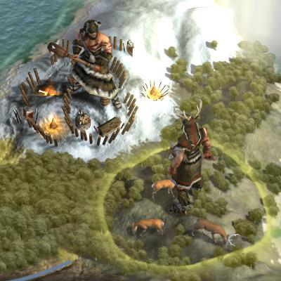

In the prior section, when we created our Gaelic Warrior we used the art definition of ART_DEF_UNIT_GAELIC_WARRIOR, now we need to add that definition to the UnitArtInfo.

```xml
<UnitArtInfos>
    <UnitArtInfo>
        <Type>ART_DEF_UNIT_GAELIC_WARRIOR</Type>
        <Formation>LooseCivilian</Formation>
        <DamageStates>1</DamageStates>
        <UnitMemberArt>
            <MemberType>ART_DEF_UNIT_MEMBER_BARBARIAN_EURO_ALPHA</MemberType>
            <MemberCount>1</MemberCount>
        </UnitMemberArt>
    </UnitArtInfo>
</UnitArtInfos>
```

We don't need to change the UnitMemberArtInfo since that definition hasn't changed. Instead this tells the game to use the ART_DEF_UNIT_MEMBER_BARBARIAN_EURO_ALPHA model as a single unit formation when the ART_DEF_UNIT_GAELIC_WARRIOR definition is set.

#### 如何添加建筑

Buildings are easy to add to the game. In this example we will add a palisade as an early defensive building. The palisade won't require any techs, so it's available from the first turn, and can't be built in any era except the Ancient Era (during later eras player should be using walls, castles and other powerful defensive buildings).

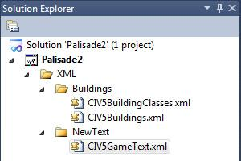

To do this we only need to update three tables. The first is Buildings table from CIV5Buildings.xml. The following adds the Palisade building to the game:

```xml
<GameData>
    <Buildings>
        <Row>
            <Type>BUILDING_PALISADE</Type>
            <BuildingClass>BUILDINGCLASS_PALISADE</BuildingClass>
            <Cost>60</Cost>
            <GoldMaintenance>1</GoldMaintenance>
            <Help>TXT_KEY_BUILDING_PALISADE_STRATEGY</Help>
            <Description>TXT_KEY_BUILDING_PALISADE</Description>
            <Civilopedia>TXT_KEY_CIV5_BUILDINGS_PALISADE_TEXT</Civilopedia>
            <Strategy>TXT_KEY_BUILDING_PALISADE_STRATEGY</Strategy>
            <ArtDefineTag>ART_DEF_BUILDING_WALLS</ArtDefineTag>
            <MaxStartEra>ERA_ANCIENT</MaxStartEra>
            <MinAreaSize>-1</MinAreaSize>
            <AllowsRangeStrike>true</AllowsRangeStrike>
            <Defense>250</Defense>
            <CityWall>true</CityWall>
            <HurryCostModifier>25</HurryCostModifier>
            <IconAtlas>BW_ATLAS_1</IconAtlas>
            <NeverCapture>true</NeverCapture>
            <PortraitIndex>32</PortraitIndex>
        </Row>
    </Buildings>
</GameData>
```

Civ5 uses Buildingclasses for the replacement buildings used as unique buildings, for example the Market and Bazaar are both BUILDINGCLASS_MARKET. That way all the AI and logic can be programmed using BUILDINGCLASS_MARKET and the game can translate that to mean a Market for most civilizations and a Bazaar for Arabian players.

The next entry is the BuildingClasses table in the CIV5BuildingClasses.xml file:

```xml
<GameData>
    <BuildingClasses>
        <Row>
            <Type>BUILDINGCLASS_PALISADE</Type>
            <DefaultBuilding>BUILDING_PALISADE</DefaultBuilding>
            <Description>TXT_KEY_BUILDING_PALISADE</Description>
        </Row>
    </BuildingClasses>
</GameData>
```

And finally we need the text strings to support the building we added. There are three new tags we referenced in the above building definition.

```xml
<GameData>
    <Language_en_US>
        <Row Tag="TXT_KEY_BUILDING_PALISADE">
            <Text>Palisade</Text>
        </Row>
        <Row Tag="TXT_KEY_BUILDING_PALISADE_STRATEGY">
            <Text>Palisade's provide an early defense against attackers. Though they are less expensive than walls, they provide only half the defense.</Text>
        </Row>
        <Row Tag="TXT_KEY_CIV5_BUILDINGS_PALISADE_TEXT">
            <Text>Built of little more than mud and raw lumber palisades were as vulnerable to the weather as they were to enemy attack. Yet they remained popular in border cities if only because they made the people behind them feel more secure.</Text>
        </Row>
    </Language_en_US>
</GameData>
```

That's it, a complete mod that adds a new building to the game, that is modular (can be used with other mods without compatibility issues) and can be created an published within 5-10 minutes.

#### 如何修改建筑

Let's assume we want to change the way that some buildings work in the game. Currently a Granary adds food to the city it is in and Hospital's allow a city to carry over 50% of its food after a population increase.

The following is the base definition for a Granary:

```xml
<Buildings>
    <Row>
        <Type>BUILDING_GRANARY</Type>
        <BuildingClass>BUILDINGCLASS_GRANARY</BuildingClass>
        <FreeStartEra>ERA_RENAISSANCE</FreeStartEra>
        <Cost>100</Cost>
        <GoldMaintenance>1</GoldMaintenance>
        <PrereqTech>TECH_POTTERY</PrereqTech>
        <Help>TXT_KEY_BUILDING_GRANARY_STRATEGY</Help>
        <Description>TXT_KEY_BUILDING_GRANARY</Description>
        <Civilopedia>TXT_KEY_CIV5_BUILDINGS_GRANARY_TEXT</Civilopedia>
        <Strategy>TXT_KEY_BUILDING_GRANARY_STRATEGY</Strategy>
        <ArtDefineTag>ART_DEF_BUILDING_GRANARY</ArtDefineTag>
        <MinAreaSize>-1</MinAreaSize>
        <ConquestProb>66</ConquestProb>
        <HurryCostModifier>25</HurryCostModifier>
        <IconAtlas>BW_ATLAS_1</IconAtlas>
        <PortraitIndex>0</PortraitIndex>
    </Row>
</Buildings>
<Building_YieldChanges>
    <Row>
        <BuildingType>BUILDING_GRANARY</BuildingType>
        <YieldType>YIELD_FOOD</YieldType>
        <Yield>2</Yield>
    </Row>
</Building_YieldChanges>
```

And the following is the base definition for a Hospital:

```xml
<Buildings>
    <Row>
        <Type>BUILDING_HOSPITAL</Type>
        <BuildingClass>BUILDINGCLASS_HOSPITAL</BuildingClass>
        <Cost>400</Cost>
        <GoldMaintenance>2</GoldMaintenance>
        <PrereqTech>TECH_BIOLOGY</PrereqTech>
        <Help>TXT_KEY_BUILDING_HOSPITAL_HELP</Help>
        <Description>TXT_KEY_BUILDING_HOSPITAL</Description>
        <Civilopedia>TXT_KEY_BUILDING_HOSPITAL_PEDIA</Civilopedia>
        <Strategy>TXT_KEY_BUILDING_HOSPITAL_STRATEGY</Strategy>
        <ArtDefineTag>ART_DEF_BUILDING_HOSPITAL</ArtDefineTag>
        <FoodKept>50</FoodKept>
        <MinAreaSize>-1</MinAreaSize>
        <ConquestProb>66</ConquestProb>
        <HurryCostModifier>0</HurryCostModifier>
        <IconAtlas>BW_ATLAS_1</IconAtlas>
        <PortraitIndex>45</PortraitIndex>
    </Row>
</Buildings>
```

The nice thing about the <update> tag is that you only have to specify exactly what you want to change. To change the definitions for these create a new files in the mod called /XML/Buildings/CIV5Buildings.xml and add that file to update the database in the Mod's properties as we have done with all of our other changes. As with the others the filename and directory path doesn't matter except to help us organize our mod.

If we want the Granary to keep 30% of the food after a population growth, and we want to remove that ability from the Hospital and replace it with the ability to grant the Medic promotion to any units trained there we need to add the following XML to our new CIV5Buildings.xml file:

```xml
<GameData>
    <Buildings>
        <Update>
            <Set FoodKept="30"/>
            <Where Type="BUILDING_GRANARY"/>
        </Update>
        <Update>
            <Set Help="TXT_KEY_BUILDING_GRANARY_HELP"/>
            <Where Type="BUILDING_GRANARY"/>
        </Update>
        <Update>
            <Set FoodKept="0"/>
            <Where Type="BUILDING_HOSPITAL"/>
        </Update>
        <Update>
            <Set TrainedFreePromotion="PROMOTION_MEDIC"/>
            <Where Type="BUILDING_HOSPITAL"/>
        </Update>
    </Buildings>
</GameData>
```

The above XML makes four changes. The first is to set the FoodKept attribute of Granaries to 30 (so 30% of the food is kept after population growth). The second sets the Help attribute of Granaries to TXT_KEY_BUILDING_GRANARY_HELP. Granaries don't normally have a Help string, but we will need one so players know about the functionality we are adding. The third removes the FoodKept ability from Hospitals by setting it to 0. And the fourth is to set the TrainedFreePromotion attribute of Hospitals to PROMOTION_MEDIC, so new units trained in a city with a Hospital start with the Medic promotion.

Not only is this very simple to read, and see exactly what you have changed (in prior versions all of the xml would need to be replaced so you would need to use a compare utility to see what was changed) it also makes the changes very modular. One mod can allow Granaries to store food after growth, another could modify the Granary's cost and a third could change the Granary to a different tech.

We also need a few text strings to support this. We will need to add the new TXT_KEY_BUILDING_GRANARY_HELP text string, and we need to update the already existing TXT_KEY_BUILDING_HOSPITAL_HELP text string.

```xml
<GameData>
    <Language_en_US>
        <Row Tag="TXT_KEY_BUILDING_GRANARY_HELP">
           <Text>30% of [ICON_FOOD] Food is carried over after a new [ICON_CITIZEN] Citizen is born.</Text>
        </Row>
        <Update>
            <Where Tag="TXT_KEY_BUILDING_HOSPITAL_HELP"/>
            <Set Text="All newly-trained Units in this City receive the [COLOR_POSITIVE_TEXT]Medic[ENDCOLOR] Promotion, increasing the heal rate of this unit and all adjacent units by 1 per turn."/>
        </Update>
    <Language_en_US>
<GameData>
```

Notice that the Granary string is a new string, as we added for other assets. But the Hospital string is an update operation, which we need to change the base text string to the new one.

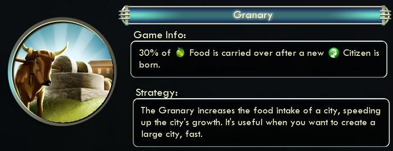

The process covered in this section is as valid for leaders, units and other assets as it is for buildings. The `<Update>` element is an easy way for modders to change existing base game assets in a modular way.

#### 如何移除资源

Removing a resource is a good example of removing any referenced asset from Civ5. Resources are referenced by units, buildings, improvements, and other sources. So simply deleting the asset will cause errors or the game to crash.

If we want to remove horses from the game (and it wasn't for these references) the following mod would work:

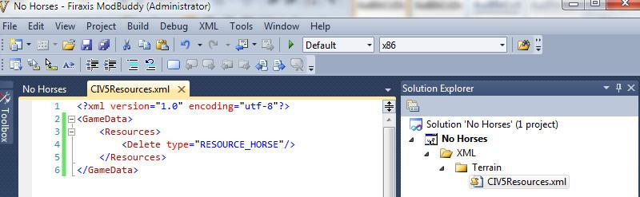

But when this mod is loaded the game crashes and we get the following errors in the Database.log file:

```
[66897.643] Validating Foreign Key Constraints...
[66897.659] Invalid Reference on Building_LocalResourceAnds.ResourceType - "RESOURCE_HORSE" does not exist in Resources
[66897.659] Invalid Reference on Building_LocalResourceOrs.ResourceType - "RESOURCE_HORSE" does not exist in Resources
[66897.659] Invalid Reference on Trait_ResourceQuantityModifiers.ResourceType - "RESOURCE_HORSE" does not exist in Resources
[66897.674] Invalid Reference on Improvement_ResourceTypes.ResourceType - "RESOURCE_HORSE" does not exist in Resources
[66897.674] Invalid Reference on Improvement_ResourceType_Yields.ResourceType - "RESOURCE_HORSE" does not exist in Resources
[66897.674] Invalid Reference on Resource_YieldChanges.ResourceType - "RESOURCE_HORSE" does not exist in Resources
[66897.674] Invalid Reference on Resource_Flavors.ResourceType - "RESOURCE_HORSE" does not exist in Resources
[66897.674] Invalid Reference on Resource_TerrainBooleans.ResourceType - "RESOURCE_HORSE" does not exist in Resources
[66897.674] Invalid Reference on Resource_TerrainBooleans.ResourceType - "RESOURCE_HORSE" does not exist in Resources
[66897.674] Invalid Reference on Resource_TerrainBooleans.ResourceType - "RESOURCE_HORSE" does not exist in Resources
[66897.674] Invalid Reference on Resource_QuantityTypes.ResourceType - "RESOURCE_HORSE" does not exist in Resources
[66897.674] Invalid Reference on Resource_QuantityTypes.ResourceType - "RESOURCE_HORSE" does not exist in Resources
[66897.674] Invalid Reference on Unit_ResourceQuantityRequirements.ResourceType - "RESOURCE_HORSE" does not exist in Resources
[66897.674] Invalid Reference on Unit_ResourceQuantityRequirements.ResourceType - "RESOURCE_HORSE" does not exist in Resources
[66897.674] Invalid Reference on Unit_ResourceQuantityRequirements.ResourceType - "RESOURCE_HORSE" does not exist in Resources
[66897.674] Invalid Reference on Unit_ResourceQuantityRequirements.ResourceType - "RESOURCE_HORSE" does not exist in Resources
[66897.674] Invalid Reference on Unit_ResourceQuantityRequirements.ResourceType - "RESOURCE_HORSE" does not exist in Resources
[66897.674] Invalid Reference on Unit_ResourceQuantityRequirements.ResourceType - "RESOURCE_HORSE" does not exist in Resources
[66897.674] Invalid Reference on Unit_ResourceQuantityRequirements.ResourceType - "RESOURCE_HORSE" does not exist in Resources
[66897.674] Invalid Reference on Unit_ResourceQuantityRequirements.ResourceType - "RESOURCE_HORSE" does not exist in Resources
[66897.674] Invalid Reference on Unit_ResourceQuantityRequirements.ResourceType - "RESOURCE_HORSE" does not exist in Resources
[66897.674] Invalid Reference on Unit_ResourceQuantityRequirements.ResourceType - "RESOURCE_HORSE" does not exist in Resources
[66897.674] Failed Validation.
```

The problem is the existing references to non-existing Horses. Although the Database.log file gives us some indication of where the errors are coming from, the easiest way to find out what files contain a reference to RESOURSE_HORSE is a file search.

To do that I start in the "<Civ5 install dir>\Assets\Gameplay\XML" directory and do a search for RESOURCE_HORSE and select to have my search include file contents. Doing so gives me the following:

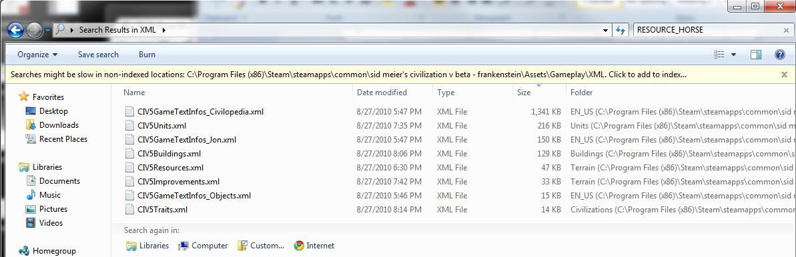

We don't need to worry about the text files. The text files are only string decodes, they don't reference anything. The fact that RESOURCE_HORSE exists in them is only part of a longer text string. That leaves us with: CIV5Units.xml, CIV5Buildings.xml, CIV5Resources.xml, CIV5Improvements.xml and Civ5Traits.xml.

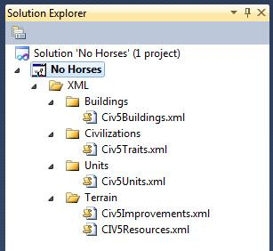

My next step is to create xml files for each of the files I have to supply updates for. As stated in earlier sections, we could have all these changes in a single file and the folder and file names don't matter. I prefer to maintain Civ5's structure and filenames because it is easier for me to remember, but a single XML file called RemoveHorses.xml is just as valid.

Once we have the blank files we have to look through the original version to see what reference we need to remove. We will start with Civ5Buildings.xml.

A search of Civ5Buildings.xml shows two references to RESOURCE_HORSE. It is in the Building_LocalResourceAnds table for Stables, and in the Building_LocalResourceOrs table for the Circus. Both of these references will need to be removed by our mod before it will be able to load.

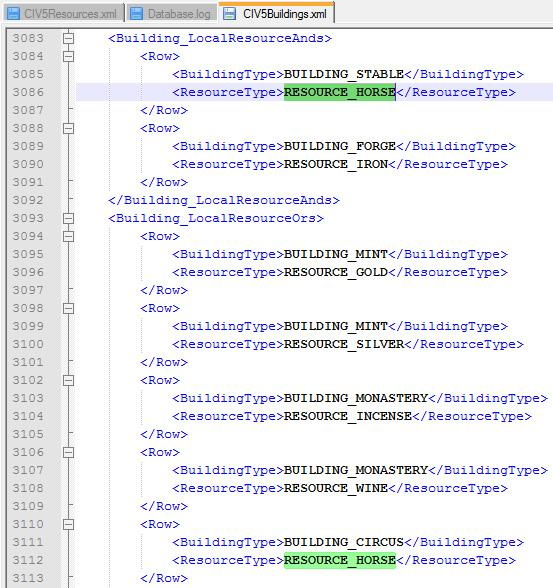

The following xml for our Mod's Civ5Buildings.xml will remove both of the references.

```xml
<GameData>
    <Building_LocalResourceAnds>
        <Delete ResourceType="RESOURCE_HORSE"/>
    </Building_LocalResourceAnds>
    <Building_LocalResourceOrs>
        <Delete ResourceType="RESOURCE_HORSE"/>
    </Building_LocalResourceOrs>
</GameData>
```

And we need to do the same thing for the Traits, Units, Improvements and Resources files, which leaves us with the following.

Civ5Traits.xml:

```xml
<GameData>
    <Trait_ResourceQuantityModifiers>
        <Delete ResourceType="RESOURCE_HORSE"/>
    </Trait_ResourceQuantityModifiers>
</GameData>
```

Civ5Units.xml:

```xml
<GameData>
    <Unit_ResourceQuantityRequirements>
        <Delete ResourceType="RESOURCE_HORSE"/>
    </Unit_ResourceQuantityRequirements>
</GameData>
```

Civ5Improvements.xml:

```xml
<GameData>
    <Improvement_ResourceTypes>
        <Delete ResourceType="RESOURCE_HORSE"/>
    </Improvement_ResourceTypes>
    <Improvement_ResourceType_Yields>
        <Delete ResourceType="RESOURCE_HORSE"/>
    </Improvement_ResourceType_Yields>
</GameData>
```

Civ5Resources.xml:

```xml
<GameData>
    <Resources>
        <Delete type="RESOURCE_HORSE"/>
    </Resources>
    <Resource_YieldChanges>
        <Delete ResourceType="RESOURCE_HORSE"/>
    </Resource_YieldChanges>
    <Resource_Flavors>
        <Delete ResourceType="RESOURCE_HORSE"/>
    </Resource_Flavors>
    <Resource_TerrainBooleans>
        <Delete ResourceType="RESOURCE_HORSE"/>
    </Resource_TerrainBooleans>
    <Resource_QuantityTypes>
        <Delete ResourceType="RESOURCE_HORSE"/>
    </Resource_QuantityTypes>
</GameData>
```

Once the above changes are made we will have a mod that removes horses, and all the references to horses from the game. Keep in mind that this mod will not be compatible with other mods that reference horses. If for example a mod adds a new mounted unit that has a resource require of horses. Which is why mods that delete base assets should be marked exclusive.

#### 如何用 Lua 禁用单位图标

In Civilization V Units have a Unit Icon floating above them. We are going to add the ability to disable that unit icon.

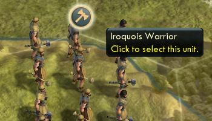

First we have to find what Lua file controls the unit icon. There is no easy reference for this, it takes a bit of searching. Fortunately Firaxis has used fairly explanatory names, the unit icon is controlled by the UnitFlagManager.lua and UnitFlagManager.xml files. These are both in the `<Civilization V>\assets\UI\InGame` directory.

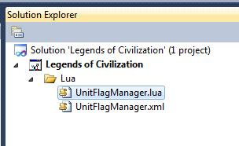

First we need to add two new files to our project. Unlike XML files it is important that we maintain the same names for Lua files so rename the new files to UnitFlagManager.lua and UnitFlagManager.xml and delete the contents of both. It doesn't matter what folder these files are placed in, but to keep things well organized I created a Lua folder and added both files beneath it.

Now copy the contents of the normal UnitFlagManager.lua and UnitFlagManager.xml into our empty project copies. Lua is not as modular as XML (InGameUIAddin allows some modular Lua changes but it is limited) so the entire file needs to be copied for changes to happen.

There is more than one way to disable the Unit Icon, and different programmers will prefer different methods. But here is one way we can disable it. The UpdateVisibility() function in UnitFlagManager.lua is:

```lua
UpdateVisibility = function( self )
    if InStrategicView() then
        local bVisible = self.m_IsCurrentlyVisible and self.m_IsGarrisoned and g_GarrisonedUnitFlagsInStrategicView and not self.m_IsInvisible;
        self.m_Instance.Anchor:SetHide(not bVisible);
        else
        self.m_Instance.Anchor:SetHide(not (self.m_IsCurrentlyVisible and not self.m_IsInvisible));
    end
end,
```

Looking at this code we can see that if the game is in the Strategic view then the Unit Icon is displayed if the unit is visible, garrisoned and the unit isn't invisible. If we aren't in the strategic view then the unit icon is shown if the unit is visible and not invisible.

The easiest way to disable the Unit Icon is with the following change:

```lua
UpdateVisibility = function( self )
    if InStrategicView() then
        local bVisible = self.m_IsCurrentlyVisible and self.m_IsGarrisoned and g_GarrisonedUnitFlagsInStrategicView and not self.m_IsInvisible;
        self.m_Instance.Anchor:SetHide(not bVisible);
    else
        -- Modified by Kael 07/17/2010 to disable the Unit Icon
        -- self.m_Instance.Anchor:SetHide(not (self.m_IsCurrentlyVisible and not self.m_IsInvisible));
        self.m_Instance.Anchor:SetHide(true);
        -- End Modify
    end
end,
```

In the above code we have simply set the Unit Icon to always be hidden when the game isn't in the strategic view. In strategic view the same rules are used for displaying the Unit Icon. Also note that I have commented the change to include who made the change, when I changed it, and why I changed it. I also kept an original copy of the line in case I want to back my change out later or see what it was set to (without having to go to the original file).

I could publish my mod now and it would be a mod with disabled Unit Icons. But it isn't a very elegant solution. It would be better if the player had the ability to enable and disable the Unit Icon according to his preference. To do that let's add a new menu option to the MiniMap Options panel so that players can choose if they want to display the Unit Icon.

First we will need to extend our code change so that we use a variable instead of simply setting the Anchor Hide to true.

```lua
UpdateVisibility = function( self )
    if InStrategicView() then
        local bVisible = self.m_IsCurrentlyVisible and self.m_IsGarrisoned and g_GarrisonedUnitFlagsInStrategicView and not self.m_IsInvisible;
        self.m_Instance.Anchor:SetHide(not bVisible);
    else
        -- Modified by Kael 07/17/2010 to disable the Unit Icon
        -- self.m_Instance.Anchor:SetHide(not (self.m_IsCurrentlyVisible and not self.m_IsInvisible));
        self.m_Instance.Anchor:SetHide(not (self.m_IsCurrentlyVisible and not self.m_IsInvisible) or bHideUnitIcon);
        -- End Modify
    end
end,
```

In this version rather than simply setting the Unit Icon to always be hidden when the player isn't in the Strategic View, we are using a variable to control it. If bHideUnitIcon is true it will act exactly like our previous code, hiding the Unit Icon. If bHideUnitIcon is false it will act exactly like the games default code.

We will need to set bHideUnitIcon's default value by adding the following at the top of UnitFlagManager.lua:

```lua
-- Added by Kael 07/17/2010 to disable the Unit Icon
local bHideUnitIcon = true;
-- End Add
```


Note that I selected true as the default value for bHideUnitIcon so that Unit Icon's will start hidden. This is a good time to load our mod and make sure that the Unit Icon is hidden.
5. We will need a text string for our menu option. Create a new XML folder. Beneath it create a NewText folder. And in that folder create a new file called GameText.xml. The file structure is just for our organization, it mirrors the file structure of CIV5's xml files. The file name doesn't matter either (the GameData tag in the file is what matters). This would work if it was called stuff.xml at the root of the project.
6. Replace any default text in the projects GameText.xml with the following:

```xml
<?xml version="1.0" encoding="utf-8"?>
<GameData>
    <Language_en_US>
        <Row Tag="TXT_KEY_MAP_OPTIONS_HIDE_UNIT_ICON">
            <Text>Hide Unit Icons</Text>
        </Row>
    </Language_en_US>
</GameData>
```

The above is a simple text string replacement. Whenever the game is set to English and encounters TXT_KEY_MAP_OPTIONS_HIDE_UNIT_ICON it will replace it with "Hide Unit Icons".

7. To add the option to enable/disable Unit Icon we will need to add two more file to our project, MiniMapPanel.lua and MiniMapPanel.xml. Just as with the UnitFlagManager files we will want to create two new empty files, rename them MiniMapPanel.lua and MiniMapPanel.xml and copy the contents of the original files into our project copies.

8. Modify the projects MiniMapPanel.xml to add the new checkbox.

```xml
<Grid ID="OptionsPanel" Anchor="R,B" Size="300,300" Color="White.256" Style="Grid9DetailSix140" Padding="30,46" Hidden="true" ConsumeMouse="1" >
    <Stack Anchor="C,C" Padding="0" Offset="0,5" StackGrowth="Bottom" ID="MainStack" >
        <Stack Anchor="C,T" Offset="0,0" Padding="0" StackGrowth="Bottom" ID="StrategicStack" >
            <Label Anchor="L,T" ColorSet="Beige_Black" Font="TwCenMT18" Offset="0,5" FontStyle="Shadow" ID="OverlayName" String="TXT_KEY_STRAT_OVERLAY"/>
            <PullDown Style="GenericPullDown" ScrollThreshold="256" Offset="0,5" Size="210,27" SpaceForScroll="0" ID="OverlayDropDown"/>
            <Label Anchor="L,T" ColorSet="Beige_Black" Font="TwCenMT18" Offset="0,5" FontStyle="Shadow" ID="IconName" String="TXT_KEY_STRAT_ICON_MODE"/>
            <PullDown Style="GenericPullDown" ScrollThreshold="256" Offset="0,5" Size="210,27" SpaceForScroll="0" ID="IconDropDown"/>
            <CheckBox Anchor="L,T" TextAnchorSide="Right" Offset="0,0" TextOffset="40,0" IsChecked="1" ID="ShowFeatures" String="TXT_KEY_STRAT_FEATURES" />
            <CheckBox Anchor="L,T" TextAnchorSide="Right" Offset="0,0" TextOffset="40,0" IsChecked="1" ID="ShowFogOfWar" String="TXT_KEY_STRAT_FOW" />
            <Box Anchor="C,T" Offset="0,5" Size="175,1" Color="Beige,120" />
        </Stack>
        <CheckBox Anchor="L,T" TextAnchorSide="Right" Offset="0,0" TextOffset="40,0" IsChecked="0" ID="ShowRecommendation" String="TXT_KEY_MAP_OPTIONS_RECOMMENDATIONS" />
        <CheckBox Anchor="L,T" TextAnchorSide="Right" Offset="0,0" TextOffset="40,0" IsChecked="0" ID="ShowResources" String="TXT_KEY_MAP_OPTIONS_RESOURCE_ICONS" />
        <CheckBox Anchor="L,T" TextAnchorSide="Right" Offset="0,0" TextOffset="40,0" IsChecked="0" ID="ShowYield" String="TXT_KEY_MAP_OPTIONS_YIELD_ICONS" />
        <CheckBox Anchor="L,T" TextAnchorSide="Right" Offset="0,0" TextOffset="40,0" IsChecked="0" ID="ShowGrid" String="TXT_KEY_MAP_OPTIONS_HEX_GRID" />
        <!-- Modified by Kael 07/15/2010-->
        <CheckBox Anchor="L,T" TextAnchorSide="Right" Offset="0,0" TextOffset="40,0" IsChecked="1" ID="HideUnitIcon" String="TXT_KEY_MAP_OPTIONS_HIDE_UNIT_ICON" />
        <!-- End Modify-->
        <Box Anchor="C,T" Size="210,1" Color="0,0,0,0" />
    </Stack>
</Grid>
```

Note in the above that the change is still commented, but that commenting syntax is different in XML. A comment starts with "`<!--`" and ends with a "`-->`". The important setting in the added line are IsChecked="1", which means that the checkbox defaults to being checked. The ID of the checkbox is "HideUnitIcon" and the string that is displayed with it is "TXT_KEY_MAP_OPTIONS_HIDE_UNIT_ICON".

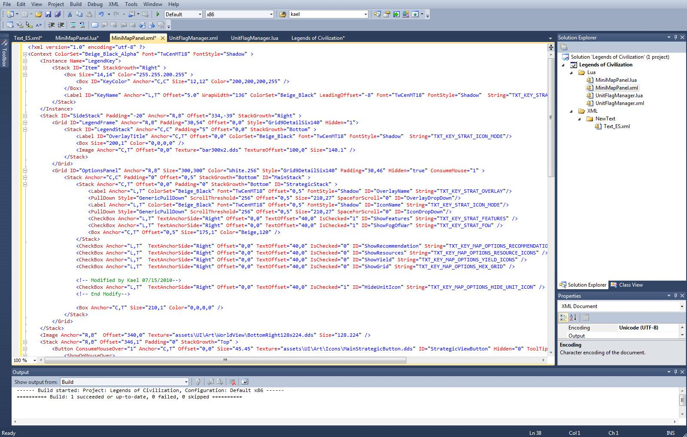

9. We have disabled unit icons by default and added a menu option to allow players to enable/disable unit icons. But the menu option doesn't do anything yet. When a player clicks the Hide Unit Icons checkbox it should toggle the bHideUnitIcon variable we created in the UntiFlagManager.lua file.

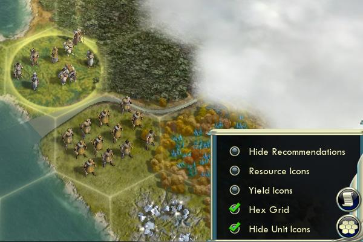

Lua scripts can't directly call functions in other scripts. If we want one Lua script to call a function in another we have to use LuaEvents. At the start of UnitFlagManager.lua we need to create a new LuaEvent as follows:

```lua
-- Added by Kael 07/16/2010
local bHideUnitIcon = true;

LuaEvents.ToggleHideUnitIcon.Add(
function()
    if (bHideUnitIcon) then
    bHideUnitIcon = false;
    else
    bHideUnitIcon = true;
    end
end);
-- End Add
```

The LuaEvents.ToggleHideUnitIcon() function can now be called by external Lua scripts and change the value in this Lua script.

10. We need the menu option we created to call LuaEvents.ToggleHideUnitIcon(). To do that we add the following to our projects MiniMapPanel.lua file:

```lua
-- Added by Kael 07/16/2010
function OnHideUnitIconChecked( bIsChecked )
    LuaEvents.ToggleHideUnitIcon();
    Events.StrategicViewStateChanged();
end
Controls.HideUnitIcon:RegisterCheckHandler( OnHideUnitIconChecked );
-- End Add
```

The above code registers a trigger with the HideUnitIcon (that is the ID of the checkbox we added in MiniMapPanel.xml file) checkbox. If it is checked it calls the local OnHideUnitIconChecked function. The OnHideUnitIcon checked function calls the ToggleHideIcon() LuaEvent and the Events.StrategicViewStateChanged() function. StrategicViewStateChanged() forces the flag to be redrawn, this way the game won't wait for the next time that unit is updated to add or remove the flag, it will happen as soon as the player clicks the checkbox.

That is it, a complete mod that adds the ability for players to enable and disable the unit icons through a menu option on the minimap panel. In it we covered how to add text strings, how to modify Lua scripts in our project, how to tie Lua functions to xml objects and how to call functions in one Lua script from other through LuaEvents. Once these basics are understood the hardest part becomes figuring out which script and function controls the processes we want to change (how did we know that UnitIcons were controlled by UnitFlagManager.lua) and what functions to call to do what we need (how did we know that StrategicViewStateChanged() would update the unit flags). For me that meant experimenting and reading through lots of files.

In the beginning it may take a few hours to do something like the above (it took me quite a few). But hopefully this document reduces that time considerably. And now that I understand what I had to do here my next change will be much faster.

#### 如何用 InGameUIAddin 制作模块化的 UI 变化

There is a way to create modular Lua changes through InGameUIAddin. As of this writing this functionality is limited, it can add new UI components, but it can't remove or modify existing UI components. To remove or modify existing UI components you will need to replace the Lua and XML files as we did in the "How to: Disable Unit Icons with Lua" section.

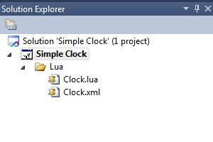

In this example we will add a clock to the interface. We start by adding a Clock.lua and Clock.xml file to the project. These are not replacement files, so the names don't matter. As with all Lua UI changes we need a paired XML and Lua file. The XML file provides the structure and settings, the Lua file provides the code.

First we will fill in the Clock.xml file:

```xml
<Context ColorSet="Beige_Black" Font="TwCenMT20" FontStyle="Shadow" >
    <Label Anchor="C,T" Offset="0,10" Font="TwCenMT20" ColorSet="Beige_Black_Alpha" FontStyle="Shadow" ID="ClockLabel"/>
</Context>
```

The above defines a new label with the ID of "ClockLabel". We can see the font (TwCenMT20), color (Beige_Black_Alpha) and location (centered at the top of the screen, with an offset 0 to the left and 10 down) for the label.

But at this point this is an empty label. We need Clock.lua to populate it with the time. For Clock.lua we can use the following:

```lua
ContextPtr:SetUpdate(function()
    local t = os.date("%I:%M");
    Controls.ClockLabel:SetString(t);
end);
```

ContextPtr:SetUpdate runs on each screen update. The above function adds this function to that process. It assigns the hour and minute to the "t" string, then sets the ClockLabel in the XML definition to that string.

Our next step is that we need to have our UI changed loaded when the mod loads, similar to how XML needs an OnModActivated and UpdateDatabase function on the actions tab for the Mod properties. For InGameUIAddin changes we have to go to Content tab of Mod Properties and specify that this is an InGameUIAddin change, and the Lua file we want activated (the matching XML file doesn't need to be specified).

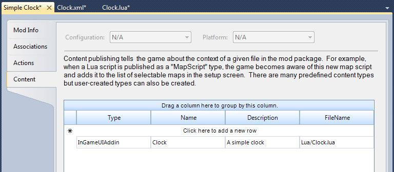

In the following screenshot we can see the clock we added (the red highlight is added just to make it easier to find in the screen shot, it was not added by the mod).

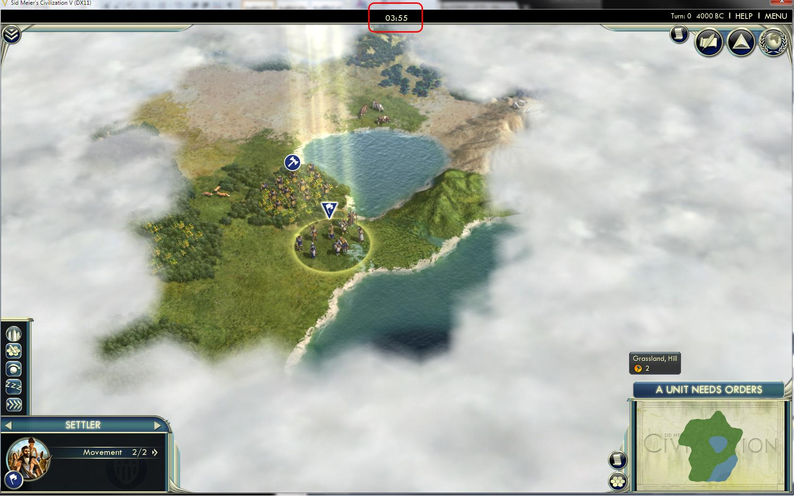

#### 如何用 Lua 添加一个新镜头

There is no way to know what mods you have loaded while playing. In this section we will add a new screen on the Additional Information menu that lists all the loaded Mods.

There are a few hurdles we have to work through before we add a new screen to the game. We worked through an example of using InGameUIAddin in the prior section. InGameUIAddin allows us to add new user interface aspects to the game, but doesn't allow us to modify existing UI components. To modify existing components we need to replace the those files. The problem with replacing Lua files is that this causes us to conflict with other mods that replace those same files.

For this mod to work we need to replace the following files:

- **DiploCorner.lua** - This lua file controls the UI control on the upper right corner of the screen. We will modify this file to add our new menu option.

- **DiploCorner.xml** - This XML file controls the XML aspects of the UI diplomacy corner control.
- **InGame.xml** - This is the main place where Lua files are registered.
- **NotificationLogPopup.lua** - This controls the Notification popup menu, we are going to piggy back on this event to add out new one.

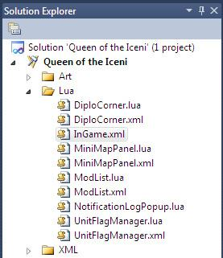

And we will add two new files to control the new screen:

- **ModList.lua** - The Lua file for the new screen.

- **ModList.xml** - The XML file that controls the definitions for the new Mod List screen.

1. Our first step is to create the files in the Lua directory of our mod as in the above screenshot. For DiploCorner.lua, DiploCorner.xml, InGame.xml and NotificationLogPopup.lua copy the actual files from the "`<Civ5 install directory>\Assets\UI\`" directory into our mod copies.

The first change is a minor change to InGame.xml to load our new Lua file definition:

```xml
<LuaContext FileName="Assets/UI/InGame/Popups/SetCityName" ID="SetCityName" Hidden="True" />
<LuaContext FileName="Assets/UI/InGame/Popups/ProductionPopup" ID="ProductionPopup" Hidden="True" />
<!-- Added by Kael 09/17/2010 -->
<LuaContext FileName="Lua/ModList" ID="ModList" Hidden="True" />
<!-- End Add -->
<LuaContext FileName="Assets/UI/InGame/TopPanel" ID="TopPanel" />
```

All the above does is load our new ModList.lua file when the mod loads. More about the ModList.lua file later.

2. Next lets adjust the DiploCorner.lua and DiploCorner.xml to add the new menu option. The following is the addition in the DiploCoerner.lua file:

```lua
local g_MultiPullInfo = {};
g_MultiPullInfo[0] = { text="TXT_KEY_ADVISOR_SCREEN_TECH_TREE_DISPLAY", call=function() Events.SerialEventGameMessagePopup( { Type = ButtonPopupTypes.BUTTONPOPUP_TECH_TREE } ); end };
g_MultiPullInfo[1] = { text="TXT_KEY_DIPLOMACY_OVERVIEW", call=function() Events.SerialEventGameMessagePopup( { Type = ButtonPopupTypes.BUTTONPOPUP_DIPLOMATIC_OVERVIEW } ); end };
g_MultiPullInfo[2] = { text="TXT_KEY_MILITARY_OVERVIEW", call=function() Events.SerialEventGameMessagePopup( { Type = ButtonPopupTypes.BUTTONPOPUP_MILITARY_OVERVIEW } ); end };
g_MultiPullInfo[3] = { text="TXT_KEY_ECONOMIC_OVERVIEW", call=function() Events.SerialEventGameMessagePopup( { Type = ButtonPopupTypes.BUTTONPOPUP_ECONOMIC_OVERVIEW } ); end };
g_MultiPullInfo[4] = { text="TXT_KEY_VP_TT", call=function() Events.SerialEventGameMessagePopup( { Type = ButtonPopupTypes.BUTTONPOPUP_VICTORY_INFO} ); end };
g_MultiPullInfo[5] = { text="TXT_KEY_DEMOGRAPHICS", call=function() Events.SerialEventGameMessagePopup( { Type = ButtonPopupTypes.BUTTONPOPUP_DEMOGRAPHICS} ); end };
g_MultiPullInfo[6] = { text="TXT_KEY_POP_NOTIFICATION_LOG", call=function() Events.SerialEventGameMessagePopup( { Type = ButtonPopupTypes.BUTTONPOPUP_NOTIFICATION_LOG, Data1 = Game.GetActivePlayer() } ); end };

-- Added by Kael 09/17/2010
g_MultiPullInfo[7] = { text="TXT_KEY_MOD_LIST", call=function() Events.SerialEventGameMessagePopup( { Type = ButtonPopupTypes.BUTTONPOPUP_NOTIFICATION_LOG, Data1 = 999 } ); end };
-- End Add
```

The above adds another option to the multipull menu. If that option is selected it passes the BUTTONPOPUP_NOTIFICATION_LOG and 999 in the Data1 field. Later we will cover how to capture that event and trigger the popup menu on it.

!()[civ5_imgs/page65.jpg]

The above works fine for adding a new menu option to the Additional Options menu. But we will want to adjust the size of the dropdown dialog to make room for the new menu option. XML controls the size and format of the UI, so we need to change the DiploCorner.xml to adjust the size.

```xml
<!-- ==========================================================================================================-->
<!-- Notification Log DropDownButtons -->
<!-- ==========================================================================================================-->
<PullDown ConsumeMouse="1" Offset="-6,0" Anchor="R,T" Size="45,45" AutoSizePopUp="0" SpaceForScroll="0" ScrollThreshold="900" ID="MultiPull" >
    <ButtonData>
        <Button Anchor="R,T" Size="45.45" Texture="assets\UI\Art\Notification\NotificationNotes.dds" ToolTip="TXT_KEY_DIPLO_ADDITIONAL" >
            <ShowOnMouseOver>
                <Image Anchor="R,T" Offset="0,0" Size="45.45" Texture="assets\UI\Art\Notification\NotificationNotes.dds" />
                <AlphaAnim Anchor="R,T" Offset="0,0" Size="45.45" TextureOffset="0.0" Texture="assets\UI\Art\Notification\NotificationNotesHL.dds" Pause="0" Cycle="Bounce" Speed="2" AlphaStart="0.95" AlphaEnd="0.55"/>
            </ShowOnMouseOver>
        </Button>
    </ButtonData>
    <GridData Anchor="L,T" Offset="-24.-41" AnchorSide="O,I" Style="Grid9DetailTwo140" Padding="0,0" >

<!-- Modified by Kael 09/17/2010
        <Box Color="Black.0" Size="200.260" /> -->
        <Box Color="Black.0" Size="200.280" />
<!-- End Modify -->
```

The above increases the size of the dropdown box from 260 to 280.

3. We piggybacked on the BUTTONPOPUP_NOTIFICATION_LOG function with our change to DiploCorner.lua. So whenever we select our new menu option it triggers as if the BUTTONPOPUP_NOTIFICATION_LOG popup had been called. If we had SDK access we would create a new BUTTONPOPUP definition for our Mod List. But without it we will have to get creative. So we call BUTTONPOPUP_NOTIFICATION_LOG and pass a value of 999 with it (normally the player number is passed, which would never be near that range).

Since we are piggybacking on the BUTTONPOPUP_NOTIFICATION_LOG function we need to block the normal BUTTONPOPUP_NOTIFICATION_LOG dialog from triggering. Which is why we added NotificationLogPopup.lua to our project.

Remember that Lua functions cannot directly call Lua functions in other files. Instead Lua registers functions with a central event service, and monitors that event service to see when it needs to act. In this case this is the normal OnPopup function from NotificationLogPopup.lua:

```lua
function OnPopup( popupInfo )
    if( popupInfo.Type ~= ButtonPopupTypes.BUTTONPOPUP_NOTIFICATION_LOG ) then
        return;
    end

    CivIconHookup( Game.GetActivePlayer(), 64, Controls.CivIcon, Controls.CivIconBG, Controls.CivIconShadow, false, true );
    m_PopupInfo = popupInfo;
    g_NotificationInstanceManager:ResetInstances();
    local player = Players[Game.GetActivePlayer()];
    local numNotifications = player:GetNumNotifications();
    for i = 0, numNotifications - 1
    do
        local str = player:GetNotificationStr((numNotifications - 1) - i);
        local index = player:GetNotificationIndex((numNotifications - 1) - i);
        local turn = player:GetNotificationTurn((numNotifications - 1) - i);
        local dismissed = player:GetNotificationDismissed((numNotifications - 1) - i);
        AddNotificationButton(index, str, turn, dismissed);
    end
    Controls.NotificationButtonStack:CalculateSize();
    Controls.NotificationButtonStack:ReprocessAnchoring();
    Controls.NotificationScrollPanel:CalculateInternalSize();
    if( m_PopupInfo.Data1 == 1 ) then
        if( ContextPtr:IsHidden() == false ) then
            OnClose();
        else
            UIManager:QueuePopup( ContextPtr, PopupPriority.eUtmost );
        end
    else
        UIManager:QueuePopup( ContextPtr, PopupPriority.NotificationLog );
    end
end
Events.SerialEventGameMessagePopup.Add( OnPopup );
```

In the above the OnPopup function is defined and it is registered to the SerialEventGameMessagePopup event (in blue). The first check of the onPopup function is to verify if this event going through SerialEventGameMessagePopup applies to it or not. So it checks to see it the popupInfo.Type is anything other than BUTTONPOPUP_NOTIFICATION_LOG (in red). If it is anything other than that, it returns and ends the function.

But we will be triggering BUTTONGPOPUP_NOTIFICATION_LOG for another function, and we won't want this popup to trigger when we do it. So the following change is required to NotificationLogPopup.lua:

```lua
function OnPopup( popupInfo )
    if( popupInfo.Type ~= ButtonPopupTypes.BUTTONPOPUP_NOTIFICATION_LOG ) then
        return;
    end

    -- Added by Kael 09/17/2010
    if( popupInfo.Data1 == 999 ) then
        return;
    end
    -- End Add

    CivIconHookup( Game.GetActivePlayer(), 64, Controls.CivIcon, Controls.CivIconBG, Controls.CivIconShadow, false, true );
    m_PopupInfo = popupInfo;
    g_NotificationInstanceManager:ResetInstances();
    local player = Players[Game.GetActivePlayer()];
    local numNotifications = player:GetNumNotifications();
    for i = 0, numNotifications - 1
    do
        local str = player:GetNotificationStr((numNotifications - 1) - i);
        local index = player:GetNotificationIndex((numNotifications - 1) - i);
        local turn = player:GetNotificationTurn((numNotifications - 1) - i);
        local dismissed = player:GetNotificationDismissed((numNotifications - 1) - i);
        AddNotificationButton(index, str, turn, dismissed);
    end
    Controls.NotificationButtonStack:CalculateSize();
    Controls.NotificationButtonStack:ReprocessAnchoring();
    Controls.NotificationScrollPanel:CalculateInternalSize();
    if( m_PopupInfo.Data1 == 1 ) then
        if( ContextPtr:IsHidden() == false ) then
            OnClose();
        else
            UIManager:QueuePopup( ContextPtr, PopupPriority.eUtmost );
        end
    else
        UIManager:QueuePopup( ContextPtr, PopupPriority.NotificationLog );
    end
end
Events.SerialEventGameMessagePopup.Add( OnPopup );
```

In the above we added an additional check. Just like the check that exits the function if the type isn't BUTTONPOPUP_NOTIFICATION_LOG, this check exits the function if the Data1 property is 999. This was we can share the BUTTONPOPUP_NOTIFICATION_LOG function without bumping into each other.

4. Finally we get to creating the code for our new screen. First we need the XML definition for the screen. The following was the definition I used for ModList.xml:

```xml
<Context Font="TwCenMT14" FontStyle="Base" Color="Beige" Color1="Black" >
    <Instance Offset="0,0" Name="NotificationButton" Size="890,60" >
        <Button Size="890,60" Offset="0,0" StateOffsetIncrement="0" ID="Button">
            <Button Anchor="L,C" Offset="0,0" Size="64.64" Texture="assets\UI\Art\WorldView\ActionItemsButton.dds" Hidden="1" ID="GenericButton" />
            <Label Anchor="R,B" Offset="5,8" Font="TwCenMT24" ColorSet="Beige_Black_Alpha" FontStyle="Shadow" String="Turn" ID="NotificationTurnText" />
            <Stack ID="TextStack" Anchor="L,T" Padding="10">
                <Label Anchor="L,T" Offset="16,5" LeadingOffset="-8" WrapWidth="780" Font="TwCenMT18" ColorSet="Beige_Black_Alpha" FontStyle="Shadow" ID="NotificationText" String="Text" />
                <Image Anchor="C,B" Offset="0,0" TextureOffset="0.0" Texture="bar900x2.dds" Size="900.1" />
            </Stack>
            <ShowOnMouseOver>
                <AlphaAnim ID="TextAnim" Anchor="C,C" Offset="10,0" Size="890,64" Pause="0" Cycle="Bounce" Speed="1" AlphaStart="2" AlphaEnd="1">
                    <Grid ID="TextHL" Size="890,64" Offset="0,0" Padding="0,0" Style="Grid9FrameTurnsHL" />
                </AlphaAnim>
            </ShowOnMouseOver>
        </Button>
    </Instance>
    <Box Style="BGBlock_ClearTopBar" />

    <Instance Name="ListingButtonInstance">
        <Button Anchor="L,T" Size="896,32" Offset="0,0" Color="Black.0" StateOffsetIncrement="0,0" ID="Button">
            <ShowOnMouseOver>
                <AlphaAnim Anchor="L,T" Size="896,72" Pause="0" Cycle="Bounce" Speed="1" AlphaStart="1.5" AlphaEnd="1" ID="SelectHighlight">
                    <Grid Size="896,36" Offset="0,0" Padding="0,0" Style="Grid9FrameTurnsHL" />
                </AlphaAnim>
            </ShowOnMouseOver>
            <Stack StackGrowth="Right" Offset="0,0" Padding="0">
                <Box Anchor="L,T" Offset="8,8" Size="175,24" Color="Black.0">
                    <Label Anchor="L,T" Offset="10,0" Font="TwCenMT18" ColorSet="Beige_Black_Alpha" FontStyle="Shadow" String="MOD TITLE" ID="Title" />
                </Box>
            </Stack>
            <Image Anchor="L,B" Offset="0,0" TextureOffset="0.0" Texture="bar900x2.dds" Size="900.1" />
        </Button>
    </Instance>

    <Grid Size="960,658" Anchor="C,C" Offset="0,36" Padding="0,0" Style="Grid9DetailFive140" ConsumeMouse="0">
        <Image Anchor="L,T" Offset="17,90" Texture="HorizontalTrim.dds" Size="926.2" />
        <ScrollPanel Anchor="L,T" ID="ListingScrollPanel" Vertical="1" Size="912,440" Offset="13,94" AutoScrollBar="1">
        <ScrollBar Anchor="R,T" AnchorSide="O,I" Offset="0,18" Length="404" Style="VertSlider"/>
            <UpButton Anchor="R,T" AnchorSide="O,I" Offset="0,0" Style="ScrollBarUp"/>
            <DownButton Anchor="R,B" AnchorSide="O,I" Offset="0,0" Style="ScrollBarDown"/>
            <Stack ID="ListingStack" StackGrowth="B" Offset="4,0" Padding="0" />
        </ScrollPanel>
        <Label String="TXT_KEY_POP_MOD_LIST" ID="Notifications Label" Anchor="C,T" Offset="0,19" Font="TwCenMT20" Color0="30.50.80.255" Color1="133.184.186.255" Color2="133.184.186.255" FontStyle="SoftShadow" />
        <Box Anchor="C,B" AnchorSide="I.I" Offset="0,54" Size="910,56" Color="255,255,255,0" >
            <GridButton Anchor="L,B" Style="SmallButton" Size="150,32" Offset="14,0" StateOffsetIncrement="0,0" ID="CloseButton" >
                <Label Anchor="C,C" Offset="0,0" String="TXT_KEY_CLOSE" Font="TwCenMT18" ColorSet="Beige_Black_Alpha" FontStyle="Shadow" />
            </GridButton>
        </Box>
        <Image Anchor="C,B" Offset="0,110" Texture="HorizontalTrim.dds" Size="926.5" />
    </Grid>
</Context>
```

The above can be intimidating to look at creating out of thin air. I'm sure there are guys that can create the above from scratch, but I'm not one of them. Instead I take the XML definition from a screen that is similar to the one I want to create, and I cut, adjust and add to that one until it looks like I want it. I use the Notification screen as the base for this and then copied XML from the ModBrowser (the place you select mods from the main menu) to get the pieces I needed. Since all of Civ5's UI is in Lua it's all available to borrow from in making our own screens.

The above defines the screen, but it doesn't have any logic. That's where we need Lua. The ModList.lua file contains the following:

```lua
include( "InstanceManager" );
g_InstanceManager = InstanceManager:new( "ListingButtonInstance", "Button", Controls.ListingStack );

function OnPopup( popupInfo )
    <red>
    if( popupInfo.Type ~= ButtonPopupTypes.BUTTONPOPUP_NOTIFICATION_LOG ) then
        return;
    end
    if( popupInfo.Data1 ~= 999 ) then
        return;
    end
    </red>

    local unsortedInstalledMods = Modding.GetInstalledMods();
    g_InstanceManager:ResetInstances();
    for k, v in pairs(unsortedInstalledMods) do
        local modinfo = v;
        if(modinfo == nil) then
            break;
        end
        if(modinfo.Enabled) then
            local listing = g_InstanceManager:GetInstance();
            local str = modinfo.Name;
            if(modinfo.Version ~= "") then
                local version = string.format("version %s (%s)", modinfo.Version or "", modinfo.Stability or "");
                str = string.format("%s - %s", str, version)
            end
            listing.Title:SetText(str);
        end
    end

    UIManager:QueuePopup( ContextPtr, PopupPriority.NotificationLog );
end
<blue>Events.SerialEventGameMessagePopup.Add( OnPopup );</blue>

function OnClose ()
    UIManager:DequeuePopup( ContextPtr );
end
Controls.CloseButton:RegisterCallback( Mouse.eLClick, OnClose );
```

Notice that the above is very similar to the Notification log code we modified. It registers to the SerialEventGameMessagePopup (in blue) just like the Notification log popup did. But in this case we only allow the OnPopup function to process if the type is BUTTONPOPUP_NOTIFICATION_LOG and Data1 is 999 (in red).

The code is fairly simply. I looked through the ModBroser Lua files to find the calls and functions I would need (that's how I found out about the Modding.GetInstalledMods() function and the .Name and .Enabled attributes for the returns). In essence the OnPopup function adds new lines to the screen display for every installed mod that is enabled for this particular game. It displays the mods name, the version and stability (Experimental, Alpha, Beta, Final) for each of these mods.

The only additional function is the code to Control the close button. A very simple example of adding a new screen to the game.

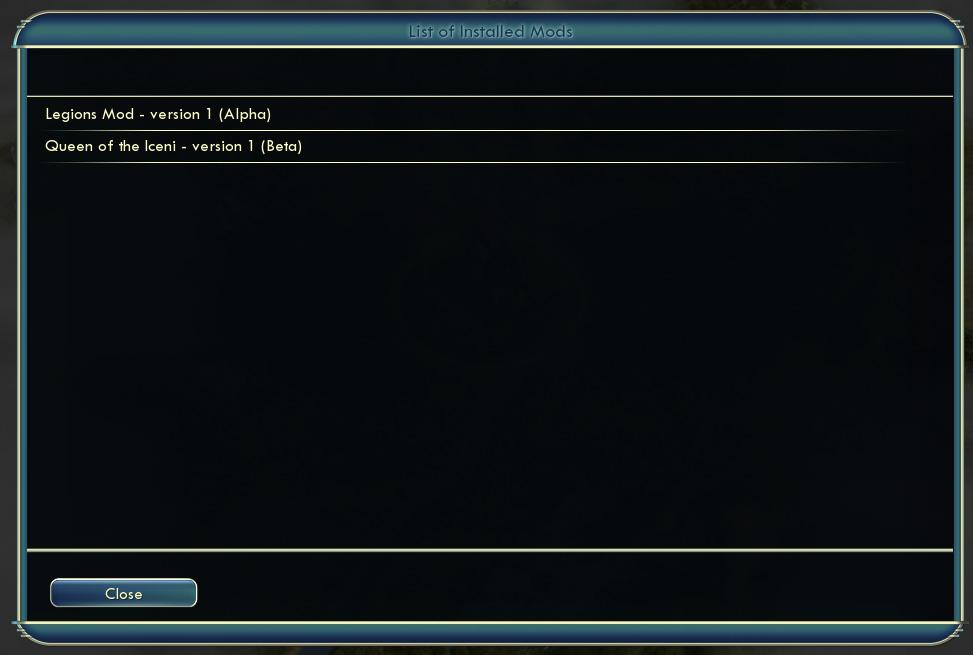


### WorldBuilder

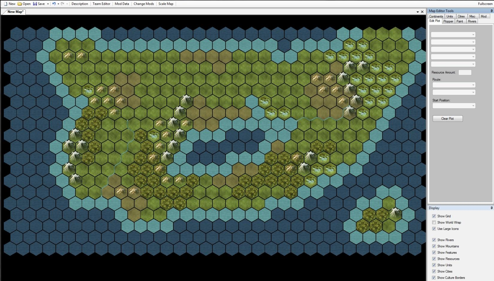

Worldbuilder is a map editor and scenario creator for Civilization V. With it maps can be created quickly, and complex scenarios with starting teams can be developed. This section will go through the options in Worldbuilder so that modders can quickly start creating their scenarios.

Across the top of the file bar there is a description option that allows you to enter your map name and a brief description for the players.

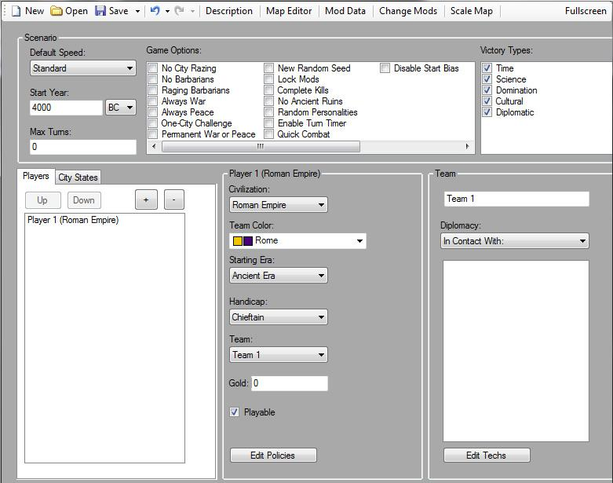

Next is the Team editor. It allows the scenario creator to assign the available civilizations for this scenario as well as their starting techs, policies, diplomacy, gold, etc. Before cities or non-barbarian units can be placed on the map those teams need to be assigned in team editor.

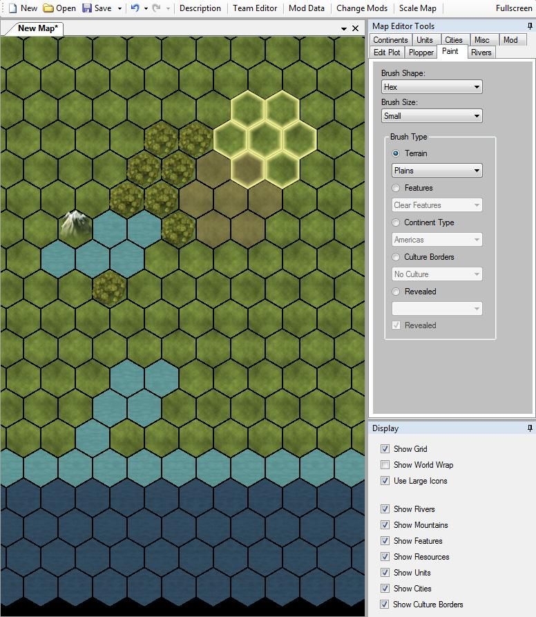

The map editor in WorldBuilder is fairly straight forward. The Map Editor Tools box contains all the tools needed to create an interesting map on the following tabs.

- **Edit Plot** - This allows the selected plot to have any terrain, feature, resource and improvement set. This is also where you can set the plot as the start position for any configured players.
- **Plopper** - This tab allows features, resources, improvements, natural wonders and roads to be quickly painted on plots.
- **Paint** - This tab allows differing brush sizes to be used to lay down terrain, features, continent definitions, cultural borders and revealed terrain.
- **Rivers** - If you are familiar with process of laying rivers with the Civ4 WorldBuilder (I'm fairly sure it involved sacrificing a goat) then it is vastly improved in Civ5. All the hex intersections that can support rivers can be clicked to enable or disable a river passing through that intersection.
- **Continents** - This is where areas can be distinguished as continents (Americas, Asia, Africa and Europe).
- **Units** - Only barbarian units can be placed unless there are players set in the team editor. If there are players set then this tab allows all units to be set on the map, and the state (health, fortified, embarked) of that unit.
- **Cities** - Players have to be set on the team editor before this can be used. If that is done cities can be placed on the map, and the population and the buildings in that city can be set.
- **Misc** - The Misc tab allows the world wrap and randomize resources options to be set.

Once your map is complete, select Save from the file menu to save it. It can always be reloaded to make further changes. WorldBuilder maps are saved in the "`..\<My Games>\Sid Meier's Civilization V\Maps\`" directory.

#### 保存文明 5 的地图

If you like the map you are playing on, or believe it may make a good base for your scenario you can save it directly from the game.

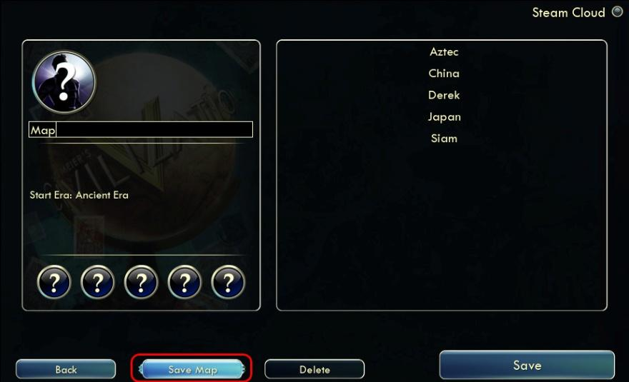

To do so go to the save game menu and there is a button for "Save Map".

That will open the Save Map window where a name can be entered. Click save to save the map. The map will be saved in the "`..\<My Games>\Sid Meier's Civilization V\Maps\`" directory (the same directory that WorldBuilder saves its files in).

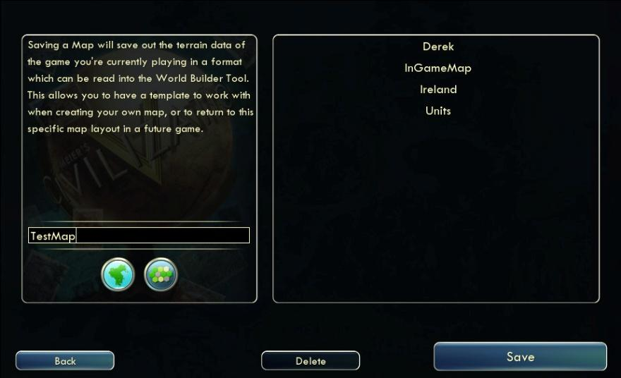

#### 向模组中添加地图

Copy the map file into your mod in ModBuddy to add it to your mod. The name and location of the map doesn't matter. I recommend creating a "Map" directory off the root of your project to place map's in, but it isn't required.

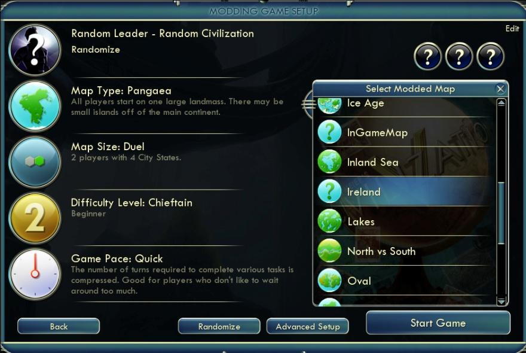

With the mod loaded your map can be selected from the setup menu. It appears with the normal game maps. In this screenshot Ireland is a map provided by the mod.

If you created custom players in the team editor then you will have a "Load Scenario" option on the setup screen. If this is unchecked your map will be loaded without any custom players, units, cities, etc. Just the map will be used. If "Load Scenario" is selected then the only civilizations/leaders from the map can be loaded.

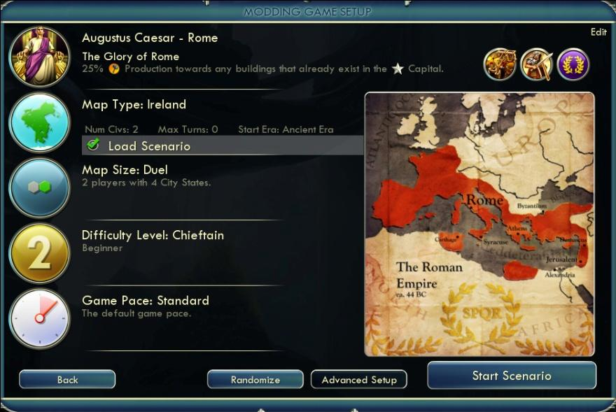

### 发布模组

Before you can test your mod you need ModBuddy to "Build" it for you. Building is the process of taking everything you have included with your mod and putting it in a format the game can recognize. You will need to Build your mod each time you want all your latest changes to take effect. You should build frequently and test each change as you add it (rather than changing a lot of files at once then having the hard task of figuring out which change is keeping the game from loading).

Once you are ready to share your mod with others you can publish it in two different ways.

The first way is that the files can be distributed outside of the game. The Mod Browser is a great resource, but it isn't required to share mods. Your mod will be in your "`..\< My Games>\Sid Meier's Civilization V\MODS`" directory. You can zip that mod directory and share it with others (who will have to extract it to their "`..\< My Games>\Sid Meier's Civilization V\MODS`" directory).

The second way is through ModBuddy with the "Online Services" option under the Tools menu. This uploads your mod to the mod database so that others will see it in the mod browser.

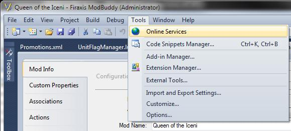

To upload your mod go through the following steps after selecting Online Services:

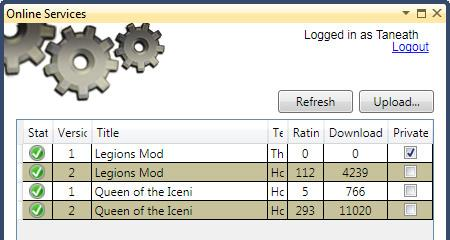

1. Login to Gamespy (if required).

2. Select Upload from the Online Services screen. Notice that this screen will also show you the status of mods you have already uploaded, including prior versions.

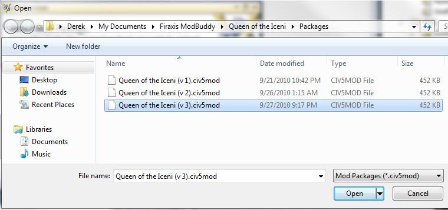

3. Click the ... button on the Select Mod Package screen to browse for the mod to upload.

4. Select the mod package. It defaults to ../My Documents/Firaxis ModBuddy/<ModName>/Packages directory. If you have multiple versions of the mod they will all appear here. Select the version you want to upload (typically the most recent version).

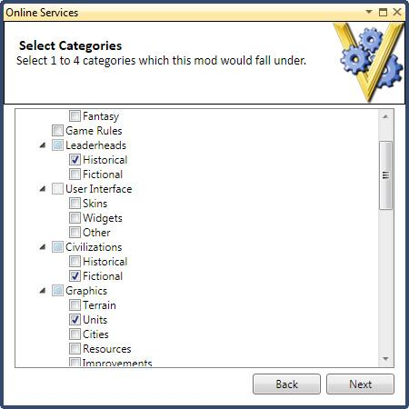

5. Wait while the Mod uploads.

6. Select the Mod categories that apply to your mod.

That's it, your mod should be uploaded and available for players to download.

To update a mod change the version number on your mod's property screen then reupload using the above process.

#### 兼容性

There are three levels of exclusivity for Civilization V mods.

- **Nonexclusive** - Any mod can be enabled with your mod (default).
- **Partially Exclusive** - Any mod that is referenced by your mod or references your mod can be enabled.
- **Totally Exclusive** - Only mods which are referenced by your mod can be enabled.

Most mod's will be non-exclusive. Meaning that they will work with all other nonexclusive mods (and partially or totally exclusive mods that select them). If you are making a mod that adds a new civilization, new units then you will probably want to make it a nonexclusive mod.

Partially Exclusive is the appropriate setting for total conversion mods. If you make a civil war mod you probably don't want the player to run it with a Spain Civ, or with a mod that adds Firaxis as a new world wonder. If your mod deletes any base assets in the game (removes a resource, tech, etc) you will probably want it to be Partially Exclusive, since those assets may be used by other mods. If you or other mod authors set their mod to be able to run together with yours then they will be able to be run together.

Totally Exclusive is the ultimate in mod control. Your mod can't be used in combination with any other mods unless you specifically allow that mod. The only difference between this and being partially exclusive is that it keeps other mod authors from being able to allow their mods to be able to work with yours. This setting should be very rare, only for mod authors who have had problems with other mod authors marking their mods compatible and causing compatibility issues.

### 排除故障

If you are a dumb guy like me, you spend 10% of your time creating, and 90% of the time trying to figure out why it doesn't work. Of all the files Firaxis provides to help us mod, I spend the most time looking at the debug logs.

The debug logs are located in the "..\My Games\Sid Meier's Civilization 5\Logs\" directory. There are numerous files here, I find it helpful to sort the files by date to see which file has been updated the most recently. I won't go through all the files here, only the two I refer to most commonly.

#### Database.log

This file contains all the exceptions when the database loads. This typically means XML reference issues. If a Civilization refers to a leader that doesn't exist anymore, or a unit refers to a resource that has been removed then the Database.log is a great place to find it.

This is a great place to find mistypes. If you have spelled LEADER_ELIZABETH incorrectly and your game is crashing on load this log file will give you a clue as to what went wrong. Here are some sample errors from Database.log:

```
[207898.601] Invalid Reference on Civilizations.Civilopedia - "TXT_KEY_CIV_RUSSIA_PEDIA" does not exist in Language_en_US
[207898.616] Invalid Reference on Feature_YieldChanges.FeatureType - "FEATURE_RIVER" does not exist in Features
```

#### Lua.log

Much as the Database.log helps you isolate XMl problems Lua.log helps you isolate Lua errors. Notice that in most cases (as in the example below) the Lua.log file gives you the file generating the error and the line number. Very handy when trying to figure out why your mod isn't working.

```
[202778.570] Syntax Error: [string "Lua/ModList.lua"]:165: 'end' expected (to close 'function' at line 14) near '<eof>'
[202778.570] Runtime Error: Error loading Lua/ModList.lua.
```