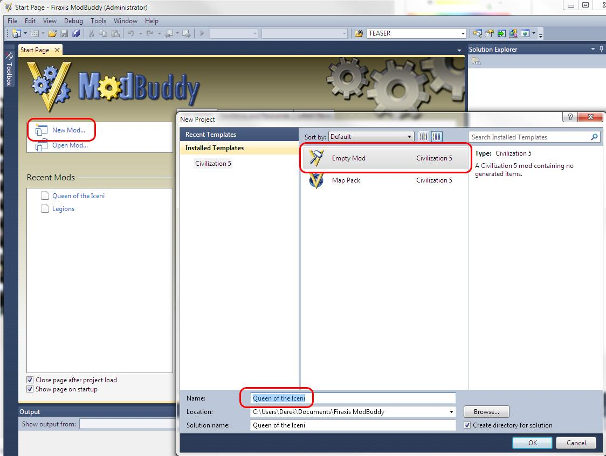
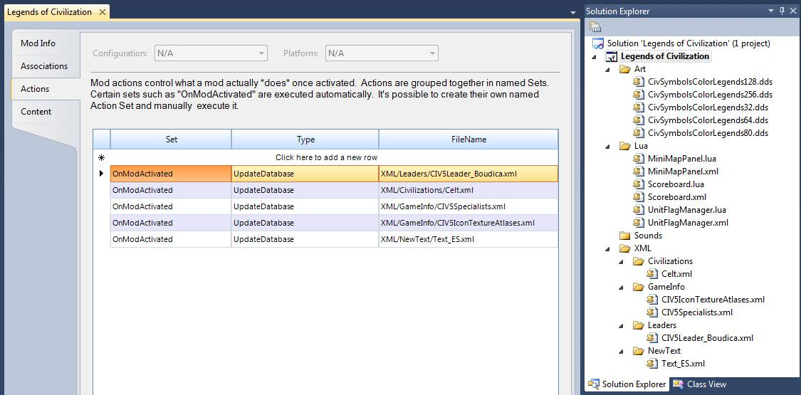
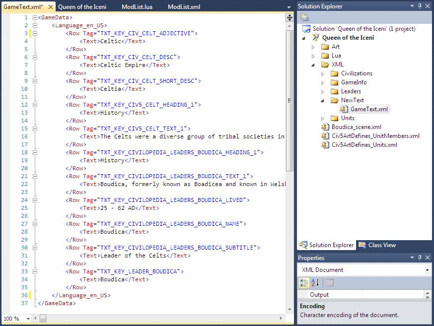

## 制作模组

### ModBuddy

ModBuddy 是 Firaxis 提供的制作模组的主要工具，与前一个版本相比，ModBuddy 使制作模组更加简单。ModBuddy 是一个十分有特色的 XML 和 Lua 编辑器，有内建的插件用来处理构建 Civ5 模组项目，也有已发布的模组和模版，让制作模组更简单。

#### 制作模组

按照下面的步骤，开始制作你自己的模组。（截图可能因软件版本而有少许出入，我写这个文档时用的工具都是测试版本）

1. 打开 ModBuddy （the Sid Meier's Civilization V SDK）.



2. 在 ModBuddy 的主菜单里选择 “New Mod”

3. 选择 “Empty Mod”，给模组取个名字，点击 “OK”

4. 然后在生成信息窗口里面输入模组的标题，作者和描述。注意模组的标题和描述至少要 8 个字符。这个例子里，我输入 “Legends of Civilization” 作为标题，作者一栏填的是我的名字，然后写了一段简短的描述。

都做好了就点 “Next”。


这就是创作新模组所需要做的事情。这个模组还不能做什么事，我们在之后的部分会谈到这些。

#### 组织项目

ModBuddy 不限定你项目的目录结构。开发者可以按照自己的习惯和项目的要求放置文件。很多人或许会直接在项目的根目录下开始创建文件，但是随着项目规模的增大，一个目录下的所有文件将会变得繁杂，浪费开发者的时间。


如果你想重新组织文件，重命名，移动和删除他们非常简单（并不是通过路径简单的引用文件）。

我建议在你的项目中创建 Art，Lua，XML 这三个文件夹。他们可以作为区分将要使用的不同类型的文件的良好结构。在 Art，Lua 和 XML 文件夹中我会按照 Firaxis 在《文明 5》中所用的目录结构，因为它足够好，并且能让我记住文件所在的位置。比如，在 XML 目录下我创建了 Civilization 目录来存放新文明的 XML 文件。

如果一个目录下面没有文件，那么创建这个目录就没有意义。所以要是你的模组里面没有任何图片资源，就不用考虑创建 Art 目录了。要是你的模组不包含任何单独描述首领的 XML 类型文件，就不用考虑创建 XML 或者 Leaders 目录。

注意：还有种组织项目的方式。通过资源而不是资源类型来组织项目同样有用。你可以为你要添加进游戏的每一个文明创建一个单独的目录。这个目录包含该文明所需的所有图片，音频， Lua 文件以及关于文明、首领、特色单位的 XML 文件。

#### 模组属性

在解决方案浏览器中右击模组图标，选择项目属性可以查看模组的属性。这是放置模组说明的地方，模组开发者需要熟悉这里的选项（尤其是 Actions 标签），以便配置使用模组需要的特性。


**Mod Info** - 这里包含你创建模组时输入的所有设置。当你的队伍中来了新成员，或是你想要修改描述信息，或者想要向更多人致谢时，就可以更改这里的信息。人们浏览模组时会看到的这些信息。

**Compatibility** - 模组默认按照单人游戏和多人游戏的兼容性排列。取消复选框会移除相应的兼容性。复选框选中与否其实根本不改变模组（取消支持多人游戏会让模组不能在多人游戏中使用），它仅仅为玩家提供该模组的可用模式。

**Systems** - 视图系统的加载早于模组。所以如果模组要修改地标，首领或者单位，这些选项需要被选中，以允许游戏重载这些图片。本文稍后会有一个模组例子，它将修改单位模型。如果没有选中 “Reload Unit Systems” 这些修改就不会生效。

**Saved Games** - 如果模组影响存档，这个选项需要选中。它默认是选中的。取消这一选项意味着当该模组运行时创建的存档能够被不含该模组的基础游戏加载。这仅可能发生在 UI 和平衡性模组中，它们不向游戏添加或删除资源。如果你添加了什么东西，比如一个新文明，那么你的模组将会影响存档（因为基础游戏不含有你的文明，并且在尝试引用它的时候崩溃）。就像兼容性一样，该复选框选中与否不会修改你的模组，它不会让你的存档更兼容或更不兼容基础游戏。

**Associations** - 这是保存与其它模组关联模式的地方。有三种类型：
- 依赖性 - 加载你的模组前需要的模组。
- 引用 - 可选的模组，能够与你的模组同时加载运行。（当用一个部分或者完全排他的模组时很重要）
- 屏蔽 - 这里列出的模组与你的模组不能同时加载。

**Actions** - Actions 需要告诉游戏，当你的模组加载时运行哪些文件。默认的，把文件包含在你的模组里不会有任何作用，除非这里有个动作，用你的文件更新数据库。记住游戏引擎不会直接使用 XML 文件，游戏引擎用的是数据库，所以模组要用 XML 文件更新数据库。

你所需要的、最常见的 “Set” 大概是 “OnModActivated” （意味着在模组加载的时候），还有最常见的类型将是 “UpdateDatabase” （用来运用指定的 XML 文件）。以下图片是带有已应用的 XML 文件的一个模组例子：



**Content** - content 页面指定模组里的文件类型，也就是 Actions 页面里用来更新数据库的那些类型：
- CityViewUIAddin - 向城市外观树添加 UI。
- Custom - 自定义 UI ，添加为 “Custom Game” 菜单的入口。
- DiplomacyUIAddin - 向国家首领页面的树添加 UI（基本外交页面）。
- InGameUIAddin - 把 UI 添加到主要游戏界面。
- Map - 构建世界的地图（仅当它要发布并且要让其它 UI 知道它，才需要定义它）。
- MapScript - Lua 地图脚本（仅当它要发布并且要让其它 UI 知道它，才需要定义它）。

#### 创建对象

用 ModBuddy 创建资源很简单。本文稍后会完成一些详细的“如何做”的过程。大致过程是在 ModBuddy 里创建一个 XML 文件。XML 文件里必须要有一个 GameData 元素。而 GameData 元素中（也就是位于起始标签 `<GameData>` 和结束标签 `</GameData>` 之间）必须有元素设置资源类型。这个元素中又要有 Row 元素，而在 Row 元素中就是对象的指定属性作为元素存在的地方。

下面这个例子是添加新的 goody hut 的入口。行号仅供参考，实际上 XML 中没有这些东西。

```xml
1. <GameData>
2.      <GoodyHuts>
3.          <Row>
4.              <Type>GOODY_SKELETON</Type>
                <Description>TXT_KEY_GOODY_SKELETON</Description>
                <Sound>AS2D_GOODY_WARRIOR</Sound>
                <UnitClass>UNITCLASS_SKELETON</UnitClass>
5.          </Row>
6.      </GoodyHuts>
7. </GameData>
```

1. 这是 GameData 元素的开始标签。这告诉游戏，我们将在新 XML 内容中传递哪些东西。

2. 接下来的开始标签取决于我们要创建的资源类型。如果我们要创建一个文明，那么它就应该是 `<Civilizations>`，如果是创建领袖，那它就该是 `<Leaders>`，创建单位就是 `<Units>`。要查看这个开始标签到底是什么意思，最简单的方式就是查看现有版本的资源类型。比如我用的是 goody hut 的定义。这个文件的文件名在 ModBuddy 里并不重要，所在的目录也不重要。这就是个入口，让游戏知道我们创建的资源类别。

3. `<Row>` 是 XML 标签，告诉系统我们要开始为前一行定义的类型进行描述。

4. 这是对象具体属性的开始部分。确切的属性依照对象类型有所区别。查看一下相似资源的例子，以及 XML 文件初始部分的模式可以知道哪些是有用的。

5. XML 的每一个元素都必须关闭。我们得告诉系统我们写完了 Row 元素。添加 `</Row>` 标签来关闭 `<Row>` 元素。

6. 像关闭 Row 元素一样，我们也要关闭 `<GoodyHuts>` 元素。这里是用个 `</GoodyHuts>` 标签。

7. 最后，我们用 `</GameData>` 标签关闭 `<GameData>`。

上述例子展示了仅用一个表的资源。但是《文明 5》中大多数资源都有很多表。看看下面关于（城市）工程师专业人员的例子：

```xml
<GameData>
    <Specialists>
        <Row>
            <Type>SPECIALIST_ENGINEER</Type>
            <Description>TXT_KEY_SPECIALIST_ENGINEER</Description>
            <Strategy>TXT_KEY_SPECIALIST_ENGINEER_STRATEGY</Strategy>
            <GreatPeopleTitle>TXT_KEY_SPECIALIST_ENGINEER_TITLE</GreatPeopleTitle>
            <Visible>true</Visible>
            <Cost>0</Cost>
            <GreatPeopleUnitClass>UNITCLASS_ENGINEER</GreatPeopleUnitClass>
            <GreatPeopleRateChange>3</GreatPeopleRateChange>
            <IconAtlas>CITIZEN_ATLAS</IconAtlas>
            <PortraitIndex>1</PortraitIndex>
        </Row>
    </Specialists>
    <SpecialistYields>
        <Row>
            <SpecialistType>SPECIALIST_ENGINEER</SpecialistType>
            <YieldType>YIELD_PRODUCTION</YieldType>
            <Yield>1</Yield>
        </Row>
    </SpecialistYields>
</GameData>
```

这里有两个表，Specialists 和 SpecialistYields。尽管格式化有些复杂（并且与《文明 4》中的处理方式不同），这些表按照模式定义在文件首部。这个方法真正的缺陷是有时候它很难看到属于一个指定资源的所有属性。比如一个有 7 个表的资源文件，要找到为具体属性设置的所有资源是相当难受的。所以当你复制一个资源的信息时，确保你拿到了这个文件里的所有有关信息，尤其是当它存在于多个表中的时候。

#### 更新对象

有时你并不想添加一个新的资源，只是想改变基础游戏中的一个资源。很简单，在资源标签之间添加一个 `<Update>` 元素（也就是 `<Row>` 元素通常所在的位置）。

Update 元素有两个子元素，一个是 `<Set>` 元素，一个是 `<Where>` 元素。

**Set** - 该元素使用 XML 标签属性来设置发生改变的地方。比如 `<Set Combat="20"/>`。

**Where** - 该元素决定匹配条件，也就是我们想要改动的地方。比如 `<Where Type="UNIT_JAPANESE_SAMURAI"/>`。

注意 `<Set Combat="20">` 和 `<Set Combat="20/>` 之间是没有差别的（从 XML 的角度看）。标签中最后一个字符是 / 是另一种结束标签的方式。通常不这么做，因为要在起始标签和结束标签之间包含数据。但是标签之间没有数据的时候，开始标签的末尾用 / 结束标签会显得简洁一些。

放在一起，看看区别。《文明 5》中工程师专业人员和普通市民都是增加 1 点产能。但是我们的模组想要工程师专业人员能增加 2 点产能。这是《文明 5》中的 SpecialistYields 表（设置工程师专业人员的部分高亮成蓝色，也就是最后一个 Row 元素）

```xml
<GameData>
    <SpecialistYields>
        <Row>
            <SpecialistType>SPECIALIST_CITIZEN</SpecialistType>
            <YieldType>YIELD_PRODUCTION</YieldType>
            <Yield>1</Yield>
        </Row>
        <Row>
            <SpecialistType>SPECIALIST_MERCHANT</SpecialistType>
            <YieldType>YIELD_GOLD</YieldType>
            <Yield>2</Yield>
        </Row>
        <Row>
            <SpecialistType>SPECIALIST_SCIENTIST</SpecialistType>
            <YieldType>YIELD_SCIENCE</YieldType>
            <Yield>3</Yield>
        </Row>
        <Row>
            <SpecialistType>SPECIALIST_ENGINEER</SpecialistType>
            <YieldType>YIELD_PRODUCTION</YieldType>
            <Yield>1</Yield>
        </Row>
    </SpecialistYields>
</GameData>
```

为了把 Yield 的值改成 2 ，需要以下修改（行号仅供参考，实际不存在）：

```xml
1. <GameData>
2.     <SpecialistYields>
3.         <Update>
4.             <Set Yield="2"/>
5.             <Where SpecialistType="SPECIALIST_ENGINEER"/>
6.         </Update>
7.     </SpecialistYields>
8. </GameData>
```

1. 这是 GameData 元素的开始标签。这告诉游戏，我们将在新 XML 内容中传递哪些东西。

2. 然后是表名。要更新的表是 SpecialistYields，所以开放标签就是 `<SpecialistYields>`。

3. 添加操作时这一层是 `<Row>` 标签，表明要增加内容。但这里要更新资源，用 `<Update>` 标签。

4. 像上面所说的，`<Update>` 标签里有两个元素。第一个是 Set 元素。这里我们用 `<Set Yield="2"/>` 设置 Yield 的值为 2。

5. 这是更新表达式中的条件部分。update 语句已经知道要把 Yield 的值设成 2，这一行是告诉它要把哪个 Yield 的值设成 2。这时 `<Where SpecialistType="SPECIALIST_ENGINEER"/>` 告诉它如果 SpecialistType 元素是 SPECIALIST_ENGINEER，就把相应的 Yield 值改为 2.

6. `<Update>` 元素的结束标签。

7. `<SpecialistYields>` 元素的结束标签。

8. `<GameData>` 元素的结束标签。

##### 复合条件更新

有时我们想在应用更新前让 update 检查多个元素。设想我们想把鲸鱼地块的食物产出从 1 变到 2。思考下面这个 Resource_YieldChanges 表的例子：

```xml
<Resource_YieldChanges>
    <Row>
        <ResourceType>RESOURCE_BANANA</ResourceType>
        <YieldType>YIELD_FOOD</YieldType>
        <Yield>1</Yield>
    </Row>
    <Row>
        <ResourceType>RESOURCE_WHALE</ResourceType>
        <YieldType>YIELD_FOOD</YieldType>
        <Yield>1</Yield>
    </Row>
    <Row>
        <ResourceType>RESOURCE_WHALE</ResourceType>
        <YieldType>YIELD_GOLD</YieldType>
        <Yield>1</Yield>
    </Row>
</Resource_YieldChanges>
```

我们可能会尝试这样的内容：

```xml
<GameData>
    <Resource_YieldChanges>
        <Update>
            <Set Yield="2"/>
            <Where ResourceType="RESOURCE_WHALE"/>
        </Update>
    </Resource_YieldChanges>
<GameData>
```

但是由于这能匹配到 Food 和 Gold 两行，这两个地方的地块产出都会变成 2。

```xml
<GameData>
    <Resource_YieldChanges>
        <Update>
            <Set Yield="2"/>
            <Where YieldType="YIELD_FOOD"/>
        </Update>
    </Resource_YieldChanges>
<GameData>
```

而在这种情况上，我们会把所有资源的食物产出设为 2，包含例中的香蕉和鲸鱼。

需要能够设置复合条件的参数，我们可以向 Where 元素中添加多个属性设置复合条件，像下面这样：

```xml
<GameData>
    <Resource_YieldChanges>
        <Update>
            <Set Yield="2"/>
            <Where ResourceType="RESOURCE_WHALE" YieldType="YIELD_FOOD"/>
        </Update>
    </Resource_YieldChanges>
<GameData>
```

注意上述例子的两个属性之间没有逻辑连接符。属性是被“与”在一起的，在应用 Set 语句前，元素必须匹配所有条件。要是想用“或”逻辑（如果其中任一条件满足的话就应用 Set 语句）那你要为每个条件单独写一个 update 元素。

#### 删除对象

删除一个资源需要使用带有匹配对象的属性的 Delete 元素，而不是 Row 元素。

比如下面的代码就会移除美国文明：

```xml
<GameData>
    <Civilizations>
        <Delete type="CIVILIZATION_AMERICA"/>
    </Civilizations>
</GameData>
```

介绍过添加和更新后，这种语法应该不陌生。Delete 元素匹配的是什么没关系（例中我用的是 type），但是如果你匹配的是元素不唯一时就要小心了。如果你要删除所有带有 ARTSTYLE_EUROPEAN 艺术类型的文明（`<Delete ArtStyleType="ARTSTYLE_EUROPEAN"/>`），那么他们将会被全部删除。如果玩家加载的其它模组将 ArtStyleType 改成 ARTSTYLE_EUROPEAN，那么这个文明也会被你的模组所删除。如果其它模组添加了一个文明，而且设置的艺术类型是 ARTSTYLE_EUROPEAN 的话，那么你的模组也会删除它。

删除资源时，要记住的最重要的事情是所有引用该资源的东西都要被清除，否则你的模组加载时就会报错。《文明 5》中的引用是单向的，一个资源引用了另一个，那么后一个资源就不能引用前一个资源了。有时资源引用别的资源不明显。比如描述文明的文件引用了特色单位（CIVILIZATION_AMERICA 引用了 UNIT_AMERICAN_B17）但是特色单位不引用它所属的文明。所以你删除 CIVILIZATION_AMERICA 不会任务报错。但是如果你删除了 UNIT_AMERICAN_B17 ，在 CIVILIZATION_AMERICA 尝试引用它的时候会发生错误。

这些引用是删除资源最难的一部分，因为很难辨别哪些资源引用了我们要删除的资源。尤其是其它模组引用了我们删除的资源，比如如果另一个模组添加了一个单位，这个单位需要蒸汽动力的特技（才能制造），但你要删除这个科技。因此如果我们删除了基础资源，那最好是你的模组是排他的。如果你要删除基础资源，那你就没法考虑兼容性。

另一个选项是禁用资源而不是删除他们。这取决于资源的类型。如果你要移除一个文明，最好就是把它设成不可使用的：

```xml
<GameData>
    <Civilizations>
        <Update>
            <Set Playable="0" />
            <Where Type="CIVILIZATION_AMERICA" />
        </Update>
    </Civilizations>
</GameData>
```

无条件的删除会匹配所有东西，所以它删除了所有东西。以下移除了所有文明：

```xml
<GameData>
    <Civilizations>
        <Delete />
    </Civilizations>
</GameData>
```

删除所有的资源是一个耗时的步骤。记住文件里的顺序。如果你要用上述代码删除所有文明后添加新文明，那么你肯定想要完成整个删除操作后再进行添加操作。如果你在删除前添加了文明，那么新文明也会被删除掉。这也会在你添加文明的模组里删除所有的资源。

#### 如何添加文本

文本是一种类似文明、首领和单位的资源类型。就像文明的资源类型是 `<Civilization>` 一样，对于英文的资源类型是 `<Language_en_US>`。`<Row>` 元素用来添加新文本，但是我们要向 `<Row>` 元素的标签属性里添加有关 text 的内容。



这个截图里我们用 ModBuddy 添加了一段新文本。Tag 属性是游戏取得文本字符串的方式，`<Text></Text>` 之间的内容是当文本被引用的时候，游戏会用这门语言进行显示。比如，当 TXT_KEY_CIV_CELT_DESC 被引用并且游戏语言是英语的时候，游戏会显示 “Celtic Empire”（我们将会在本文的“如何添加文明”这一节中看到）。

要添加以上内容，需要按照这些步骤：

1. 如果你的项目根目录下还没有一个叫做 “XML” 文件夹，就创建一个。这不必要但对组织项目有帮助。

2. 在 “XML” 文件夹下面创建一个 “New Text” 文件夹。再次声明，这不必要但对组织项目有帮助。尽管无论什么名字都行，但因为 Firaxis 是这样命名的，我也用 “New Text” 作为文件夹名。

3. 在 “New Text” 文件夹下面添加一个 XML 文件，重命名为 “GameText.xml”。如前所述，名字不重要，但能让我们知道这个文件是存放文本定义的地方。即使命名成 “Legends_text.xml”、“Celt_Civ_text.xml”、“Cabbage.xml” 或是其它任何名字都可以正常运行。

4. 就像前面的截图一样，将文本定义写在这个文件里。看看其中的一部分：

```xml
<GameData>
    <Language_en_US>
        <Row Tag="TXT_KEY_CIV_CELT_DESC">
            <Text>Celtic Empire</Text>
        </Row>
    </Language_en_US>
</GameData>
```

上面的部分添加的是 Language_en_US （英文文本）资源。当 TXT_KEY_CIV_CELT_DESC 在 XML 文件中使用时，就会使用这段文本。这会显示为 “Celtic Empire” （对于选择英语语言的玩家来说）。

#### 修改文本

我们或许想要改变基础游戏里已有的文本。你可以像改变其它属性一样重写现有的定义。你需要看一看之前关于文本的定义。可以在 “`<install directory>\assets\Gameplay\XML\NewText\`” 目录下面找到基础游戏的相关文本。

浏览这些文件，可以在 “CIV5ModdingText.xml” 文件中找到这些文本：

```xml
<Row Tag="TXT_KEY_MODDING_LIKE_IT">
    <Text>Like it</Text>
</Row>
<Row Tag="TXT_KEY_MODDING_FLAG_MODERATION">
    <Text>Report</Text>
</Row>
```

如果想找点乐趣（或者认为你的模组令人讨厌以致举报的点击数会多于赞的）你可以在模组里用这些代码交换这些文本：

```xml
<GameData>
    <Language_en_US>
        <Update>
            <Where Tag=" TXT_KEY_MODDING_LIKE_IT "/>
            <Set Text="Report"/>
        </Update>
        <Update>
            <Where Tag=" TXT_KEY_MODDING_FLAG_MODERATION"/>
            <Set Text="Like It"/>
        </Update>
    </Language_en_US>
</GameData>
```

就像改变其它属性时所做的，我们用 Update 来更改文本定义。我们这里需要匹配的是 “Tag”。