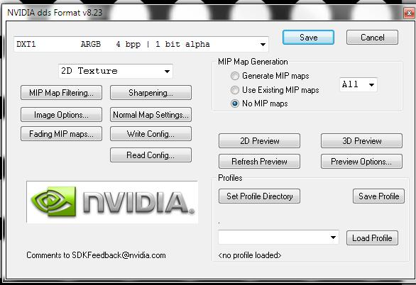

#### 如何添加文明

这一节将包含添加新文明的整个过程。首先看一看 “Civ5Civilizations.xml” 文件中定义文明的模式：

```xml
<Table name="Civilizations">
    <Column name="ID" type="integer" primarykey="true" autoincrement="true"/>
    <Column name="Type" type="text" notnull="true" unique="true"/>
    <Column name="Description" type="text"/>
    <Column name="Civilopedia" type="text"/>
    <Column name="CivilopediaTag" type="text"/>
    <Column name="Strategy" type="text" default="Ask Paul"/>
    <Column name="Playable" type="boolean" default="true"/>
    <Column name="AIPlayable" type="boolean" default="true"/>
    <Column name="ShortDescription" type="text" default="NULL"/>
    <Column name="Adjective" type="text" default="NULL"/>
    <Column name="DefaultPlayerColor" type="text" default="NULL"/>
    <Column name="ArtDefineTag" type="text" default="NULL"/>
    <Column name="ArtStyleType" type="text" default="NULL"/>
    <Column name="ArtStyleSuffix" type="text" default="NULL"/>
    <Column name="ArtStylePrefix" type="text" default="NULL"/>
    <Column name="DerivativeCiv" type="text" default="NULL"/>
    <Column name="PortraitIndex" type="integer" default="-1"/>
    <Column name="IconAtlas" type="text" default="NULL" reference="IconTextureAtlases(Atlas)"/>
    <Column name="AlphaIconAtlas" type="text" default="NULL" reference="IconTextureAtlases(Atlas)"/>
    <Column name="MapImage" type="text" default="NULL"/>
    <Column name="DawnOfManQuote" type="text" default="NULL"/>
    <Column name="DawnOfManImage" type="text" default="NULL"/>
    <Column name="DawnOfManAudio" type="text" default="NULL"/>
</Table>
<Table name="Civilization_BuildingClassOverrides">
    <Column name="CivilizationType" type="text" reference="Civilizations(Type)"/>
    <Column name="BuildingClassType" type="text" notnull="true" reference="BuildingClasses(Type)"/>
    <Column name="BuildingType" type="text" reference="Buildings(Type)"/>
</Table>
<Table name="Civilization_CityNames">
    <Column name="CivilizationType" type="text" reference="Civilizations(Type)"/>
    <Column name="CityName" type="text" notnull="true"/>
</Table>
<Table name="Civilization_DisableTechs">
    <Column name="CivilizationType" type="text" reference="Civilizations(Type)"/>
    <Column name="TechType" type="text" reference="Technologies(Type)"/>
</Table>
<Table name="Civilization_FreeBuildingClasses">
    <Column name="CivilizationType" type="text" reference="Civilizations(Type)"/>
    <Column name="BuildingClassType" type="text" reference="BuildingClasses(Type)"/>
</Table>
<Table name="Civilization_FreeTechs">
    <Column name="CivilizationType" type="text" reference="Civilizations(Type)"/>
    <Column name="TechType" type="text" reference="Technologies(Type)"/>
</Table>
<Table name="Civilization_FreeUnits">
    <Column name="CivilizationType" type="text" reference="Civilizations(Type)"/>
    <Column name="UnitClassType" type="text" reference="UnitClasses(Type)"/>
    <Column name="UnitAIType" type="text" reference="UnitAIInfos(Type)"/>
    <Column name="Count" type="integer"/>
</Table>
<Table name="Civilization_Leaders">
    <Column name="CivilizationType" type="text" reference="Civilizations(Type)"/>
    <Column name="LeaderheadType" type="text" reference="Leaders(Type)"/>
</Table>
<Table name="Civilization_UnitClassOverrides">
    <Column name="CivilizationType" type="text" reference="Civilizations(Type)"/>
    <Column name="UnitClassType" type="text" notnull="true" reference="UnitClasses(Type)"/>
    <Column name="UnitType" type="text" reference="Units(Type)"/>
</Table>
<Table name="Civilization_Start_Along_Ocean">
    <Column name="CivilizationType" type="text" reference="Civilizations(Type)"/>
    <Column name="StartAlongOcean" type="boolean" default="false"/>
</Table>
<Table name="Civilization_Start_Along_River">
    <Column name="CivilizationType" type="text" reference="Civilizations(Type)"/>
    <Column name="StartAlongRiver" type="boolean" default="false"/>
</Table>
<Table name="Civilization_Start_Region_Priority">
    <Column name="CivilizationType" type="text" reference="Civilizations(Type)"/>
    <Column name="RegionType" type="text" reference="Regions(Type)"/>
</Table>
<Table name="Civilization_Start_Region_Avoid">
    <Column name="CivilizationType" type="text" reference="Civilizations(Type)"/>
    <Column name="RegionType" type="text" reference="Regions(Type)"/>
</Table>
```

先仔细看看这些值：

- **ID** - 这是数据库的起始行。第一条记录是 0，不能被修改。

- **Type** - 这是用来引用文明的关键。通常用 `CIVILIZATION_<name>`（因此 CIVILIZATION_CANADA 就是加拿大）。我们将名字的前一部分作为对象类型，那么它就不会和拥有相同名字的其它对象类型混淆，而且易于阅读和辨别。类型是唯一的（不能有两个 CIVILIZATION_CANADA）。如果加载 Type 相同的两个对象，后一个加载的会替换掉前一个。

- **Description** - 这是文明的文本描述，对于美国则是 “American Empire”。

- **Civilopedia** - 《文明 5》中不再使用。

- **CivilopediaTag** - 百科条目的初始文本。

- **Strategy** - 《文明 5》中不再使用（尽管 Firaxis 仍认为他们的默认设置很有意思）。

- **Playable** - 如果设为真，那么人类玩家可以选择这个文明进行游戏。如果设为假，那么这个文明就不可用。注意默认为真，因此文明将是可用的，除非模组开发者指定禁用。

- **AIPlayable** - 如果设为真，那么游戏开始时 AI 随机挑选文明时可以选择这个文明。如果它被设为假，那么 AI 就不能选择这个文明。就像 “Playable” 一样，默认设为真，除非模组开发者修改它。将某个文明的 “Playable” 和 “AIPlayable” 属性都设为假，这是移除文明的好方法，但实际并没有删除资源（因此你不会影响其它引用这个文明的模组）。

- **ShortDescription** - 文明的简称。对于美国来说是 “America”。

- **Adjective**- 描述属于该文明的东西的文本。对于美国而言是 “American”，比如美国矛兵。

- **DefaultPlayerColor** - 文明边界的默认颜色。这个条目必须是 “CIV5PlayerColors.xml” 文件中的。它仅仅是默认的，因为加入一个游戏里有两个相同的文明，那么一个随机的颜色会被分配给第二个文明实例（这样就能被玩家区分开）。

- **ArtDefineTag** - 《文明 5》中不再使用。

- **ArtStyleType** - 定义该文明的城市中的建筑的艺术类型。

- **ArtStyleSuffix** - 用来分辨不同的著作和奇观艺术。

- **ArtStylePrefix** - 用来分辨不同的著作和奇观艺术。

- **DervativeCiv** - 《文明 5》中不再使用。

- **PortraitIndex** - 该文明所用的图集中的图标数量。

- **IconAtlas** - 保存该文明的图标的图集。

- **AlphaIconAtlas** - 图标中包含透明度层的图集。

- **MapImage** - 从文明选择菜单中进行选择时，显示的图片（就是 dds 文件）。通常是文明的映射。

- **DawnOfManQuote**- 显示在 Dawn of Man （比如加载）页面的文本。

- **DawnOfManImage** - 显示在 Dawn of Man 页面的图片。

- **DawnOfManAudio** - Dawn of Man 页面播放的音频文件, 通常这是 Dawn of Man 页面中进行的朗读。

- **Civilization_BuildingClassOverrides** - 这是用来实现一个文明的特色建筑的。它可以用来阻止文明建造建筑，比如这个改动可以避免城邦建造悉尼歌剧院：

```xml
<Row>
    <CivilizationType>CIVILIZATION_MINOR</CivilizationType>
    <BuildingClassType>BUILDINGCLASS_SYDNEY_OPERA_HOUSE</BuildingClassType>
    <BuildingType/>
</Row>
```

或者这个改动，将印度的城堡换成莫卧儿王朝堡：

```xml
<Row>
    <CivilizationType>CIVILIZATION_INDIA</CivilizationType>
    <BuildingClassType>BUILDINGCLASS_CASTLE</BuildingClassType>
    <BuildingType>BUILDING_MUGHAL_FORT</BuildingType>
</Row>
```

- **Civilization_CityNames**- 这是一个文明中可用的城市名称列表。
- **Civilization_DisableTechs**- 这里针对某个文明设置的所有科技都不能被该文明研究。
- **Civilization_FreeBuildingClasses**- 这里是一个文明建造他们的第一个城市时可获得的免费建筑。默认的所有文明会获得一个免费的宫殿。
- **Civilization_FreeTechs**- 这里是开局时文明的免费科技。
- **Civilization_FreeUnits**- 这是文明开局的单位。默认所有文明都有一个免费的移民。
- **Civilization_Leaders**- 这是首领关联他们文明的地方。《文明 5》中一个文明仅能有一个首领。
- **Civilization_UnitClassOverrides**- 就像建筑类别的覆盖一样。这是把一个文明的普通单位换成特色单位的地方。
- **Civilization_Start_Along_Ocean**- 如果一个文明有该设置，游戏就尝试将初始移民放在沿海地带上。默认是假，所以不用设置它，除非开发者把它设为真。
- **Civilization_Start_Along_River**- 如果一个文明有该设置，游戏就尝试将初始移民放在沿河地带上。默认是假，所以不用设置它，除非开发者把它设为真。
- **Civilization_Start_Region_Priority**- 如果一个文明有该设置，游戏会尝试将初始移民放在特殊区域。比如 Arabia 的该设置为荒漠。
- **Civilization_Start_Region_Avoid**- 如果一个文明有该设置，游戏在决定文明开局位置的时候会尝试避开这些区域。比如 Egypt 就有此设置，避免在丛林开局。

不幸的是在《文明 5》中没有对于所有对象的所有属性的完整引用。但是正如你从上面所看到的，大多数模式很容易看出。也能参考 XML 定义的例子来得到提示。举个例子，知道每个城邦都有一个免费的移民对于你想要弄清楚 Civilization_FreeUnits 是什么，是很有帮助的。

既然我们了解了一个文明所需的属性，我们就可以开始向游戏添加一个新文明了。

1. 创建文件树。文件名和文件结构没有什么关系。但我更喜欢与 Firaxis 的 XML 文件结构保持一致。在项目的根目录下创建一个 XML 文件夹，然后在这个文件夹里面创建包含文明的 “Civilizations” 文件夹。在 “Civilizations” 文件夹中创建一个叫做 “Civ_Celt.xml” 的文件。<br/><br/>
我更喜欢每个文明有其独立的文件，这对我来说，查找数据和进行修改都很简单。像 Firaxis 一样，为文明单独创建文件是可行的，或者将 xml 的内容都放到一个文件里。

2. 将以下内容填入 “Civ_Celt.xml” 文件中：

```xml
<GameData>
    <Civilizations>
        <Row>
            <Type>CIVILIZATION_CELT</Type>
            <Description>TXT_KEY_CIV_CELT_DESC</Description>
            <ShortDescription>TXT_KEY_CIV_CELT_SHORT_DESC</ShortDescription>
            <Adjective>TXT_KEY_CIV_CELT_ADJECTIVE</Adjective>
            <Civilopedia>TXT_KEY_CIV_CELT_PEDIA</Civilopedia>
            <CivilopediaTag>TXT_KEY_CIV5_CELT</CivilopediaTag>
            <DefaultPlayerColor>PLAYERCOLOR_DARK_GREEN</DefaultPlayerColor>
            <ArtDefineTag>ART_DEF_CIVILIZATION_ENGLAND</ArtDefineTag>
            <ArtStyleType>ARTSTYLE_EUROPEAN</ArtStyleType>
            <ArtStyleSuffix>_EURO</ArtStyleSuffix>
            <ArtStylePrefix>EUROPEAN </ArtStylePrefix>
            <PortraitIndex>6</PortraitIndex>
            <IconAtlas>CIV_COLOR_ATLAS</IconAtlas>
            <AlphaIconAtlas>CIV_ALPHA_ATLAS</AlphaIconAtlas>
            <MapImage>MapEngland512.dds</MapImage>
            <DawnOfManQuote>TXT_KEY_CIV5_CELT_TEXT_1</DawnOfManQuote>
            <DawnOfManImage>DOM_Elizabeth.dds</DawnOfManImage>
        </Row>
    </Civilizations>
    <Civilization_CityNames>
        <Row>
            <CivilizationType>CIVILIZATION_CELT</CivilizationType>
            <CityName>TXT_KEY_CITY_NAME_BIBRACTE</CityName>
        </Row>
        <Row>
            <CivilizationType>CIVILIZATION_CELT</CivilizationType>
            <CityName>TXT_KEY_CITY_NAME_VIENNE</CityName>
        </Row>
        <Row>
            <CivilizationType>CIVILIZATION_CELT</CivilizationType>
            <CityName>TXT_KEY_CITY_NAME_TOLOSA</CityName>
        </Row>
    </Civilization_CityNames>
    <Civilization_FreeBuildingClasses>
        <Row>
            <CivilizationType>CIVILIZATION_CELT</CivilizationType>
            <BuildingClassType>BUILDINGCLASS_PALACE</BuildingClassType>
        </Row>
    </Civilization_FreeBuildingClasses>
    <Civilization_FreeTechs>
        <Row>
            <CivilizationType>CIVILIZATION_CELT</CivilizationType>
            <TechType>TECH_AGRICULTURE</TechType>
        </Row>
    </Civilization_FreeTechs>
    <Civilization_FreeUnits>
        <Row>
            <CivilizationType>CIVILIZATION_CELT</CivilizationType>
            <UnitClassType>UNITCLASS_SETTLER</UnitClassType>
            <Count>1</Count>
            <UnitAIType>UNITAI_SETTLE</UnitAIType>
        </Row>
    </Civilization_FreeUnits>
    <Civilization_Leaders>
        <Row>
            <CivilizationType>CIVILIZATION_CELT</CivilizationType>
            <LeaderheadType>LEADER_ELIZABETH</LeaderheadType>
        </Row>
    </Civilization_Leaders>
    <Civilization_Start_Region_Priority>
        <Row>
            <CivilizationType>CIVILIZATION_CELT</CivilizationType>
            <RegionType>REGION_FOREST</RegionType>
        </Row>
    </Civilization_Start_Region_Priority>
</GameData>
```

以上是我们定义的新 “Celtic” 文明。因为我们还没有创建新首领，因此这里我用 Elizabeth 作为首领。我们还没有创建特色建筑（Civilization_BuildingClassOverrides）和特色单位（Civilization_UnitClassOverrides），因此还没有设置他们。我设置 Celt 文明偏好出生地点为雨林地带。我选择 PLAYERCOLOR_DARK_GREEN 作为默认的玩家颜色，你能在 “CIV5PlayerColors.xml” 文件中可以找到可用的玩家颜色的整个列表（这就是你添加新颜色的地方）。

上例中我只填写了 3 个城市名，是为了简化这个文档。要是真创造一个文明时，我们不会只设置三个城市名。

3. 定义文本。定义文明的时候会用到很多文本。我们也要在 XML 中定义这些文本。在 XML 文件夹下创建一个 “New Text” 目录，在这个目录下添加一个新文件。我把这个文件叫做 “GameText.xml”。


百科条目用的是特殊的格式。维基条目的前缀是我们放在 CivilopediaTag 标签中的属性（TXT_KEY_CIV5_CELT）。但是百科是匹配 _HEADING_# 和 _TEXT_# 条目的成型格式。如果添加一个叫做 TXT_KEY_CIV5_CELT_HEADING_1 的文本条目，那这就是百科部分的标题，TXT_KEY_CIV5_CELT_TEXT_1 将是标题下面的一个条目。这样开发者就能想添加多少百科条目就能添加多少条目（对于首领来说也是一样的）。

偷个懒，我把 TXT_KEY_CIV5_CELT_TEXT_1 当作 Dawn of Man 的引述。

4. 把下面内容添加到文件中：

```xml
<GameData>
    <Language_en_US>
        <Row Tag="TXT_KEY_CITY_NAME_BIBRACTE">
            <Text>Bibracte</Text>
        </Row>
        <Row Tag="TXT_KEY_CITY_NAME_VIENNE">
            <Text>Vienne</Text>
        </Row>
        <Row Tag="TXT_KEY_CITY_NAME_TOLOSA">
            <Text>Tolosa</Text>
        </Row>
        <Row Tag="TXT_KEY_CIV_CELT_ADJECTIVE">
            <Text>Celtic</Text>
        </Row>
        <Row Tag="TXT_KEY_CIV_CELT_DESC">
            <Text>Celtic Empire</Text>
        </Row>
        <Row Tag="TXT_KEY_CIV_CELT_SHORT_DESC">
            <Text>Celtia</Text>
        </Row>
        <Row Tag="TXT_KEY_CIV5_CELT_HEADING_1">
            <Text>History</Text>
        </Row>
        <Row Tag="TXT_KEY_CIV5_CELT_TEXT_1">
            <Text>The Celts were a diverse group of tribal societies in Iron Age and Roman-era Europe who spoke Celtic languages.[NEWLINE][NEWLINE]The earliest archaeological culture commonly accepted as Celtic, or rather Proto-Celtic, was the central European Hallstatt culture (ca. 800-450 BC), named for the rich grave finds in Hallstatt, Austria. By the later La Tène period (ca. 450 BC up to the Roman conquest), this Celtic culture had expanded over a wide range of regions, whether by diffusion or migration: to the British Isles (Insular Celts), the Iberian Peninsula (Celtiberians, Celtici ), much of Central Europe, (Gauls) and following the Gallic invasion of the Balkans in 279 BC as far east as central Anatolia (Galatians).[NEWLINE][NEWLINE]The earliest directly attested examples of a Celtic language are the Lepontic inscriptions, beginning from the 6th century BC. Continental Celtic languages are attested only in inscriptions and place-names. Insular Celtic is attested from about the 4th century AD in ogham inscriptions, although it is clearly much earlier. Literary tradition begins with Old Irish from about the 8th century. Coherent texts of Early Irish literature, such as the Táin Bó Cúailnge (The Cattle Raid of Cooley), survive in 12th-century recensions. According to the theory of John T. Koch and others, the Tartessian language may have been the earliest directly attested Celtic language with the Tartessian written script used in the inscriptions based on a version of a Phoenician script in use around 825 BC.[NEWLINE][NEWLINE]By the early 1st millennium AD, following the expansion of the Roman Empire and the Great Migrations (Migration Period) of Germanic peoples, Celtic culture had become restricted to the British Isles (Insular Celtic), and the Continental Celtic languages ceased to be widely used by the 6th century.</Text>
        </Row>
    </Language_en_US>
</GameData>           
```

5. 最后要确保修改的文件更新了数据库。在 Actions 标签页的模组属性中，我们要添加以下内容来让游戏将 XML 文件转化为 sql 语句并且在模组加载时写入到游戏数据库中。这是几个重要的文件路径之一，如果修改目录或者文件名，我们得更新 Actions 标签页面的相关条目。


在添加新文明后，我们可以用一些艺术资源让它看起来很完善，还要有一个新首领，一个特色单位和特色建筑。所有这些都会在后几个章节中涉及到。

#### 如何添加图标

现在我们需要文明的图标。

Firaxis 已经帮我们提供了 .psd 格式的图标模版，在 `<SDK install directory>\Art\` 目录下面存放着。有七个模版文件，分别含有 32x32，45x45，64x64，80x80，128x128，214x214 和 256x256 等像素的图标。

Firaxis 也提供了一个 readme 文件，包含所有资源类型所需的图标尺寸。

|  |  |
| :--------------- |  :-------------------  |
|  Promotions       |  256,64, 45, 32           | 
|  Buildings        |  256,128, 64, 45          | 
|  Citizens         |  256,128, 64, 45, 32      | 
|  Civilizations    |  256,128, 80, 64, 45, 32  |
|  Difficulties     |  128,64, 32               |
|  GameSpeeds       |  128,64, 32               | 
|  Leaders          |  256,128, 64              |   
|  Natural Wonders  |  256,128, 80, 64, 45      |     
|  Policies         |  256,64                   |
|  Resources        |  256,80, 64, 45           |    
|  Technologies     |  256,214, 128, 80, 64, 45 |    
|  Terrain          |  256,64                   |
|  Unit Actions     |  64, 45                   |
|  Units            |  256,128, 80, 64, 45      |    
|  Unit Flags       |  32                       |
|  World Sizes      |  128,64, 32               |
|  World Types      |  128,64, 32               | 
| | |

上面这些内容意味着文明需要 256x256，128x128，80x80，64x64，45x45 和 32x32 的图标。所以我们要为新文明创造 6 个不同尺寸的图标。加载 “IconAtlas256.psd” 文件，我可以用 Photoshop 在第一个区域来创造一个图标。


我喜欢 Photoshop，但很多开发者喜欢用 Gimp，它最明显的好处就是免费。工具无关紧要，只要能够读出 .psd 模版的内容，并且能够保存成 .dds 文件就行。

我喜欢先制作最大尺寸的图标，因为我们会压缩文件得到小的版本。图标清晰也很重要，不仅仅是 256x256 尺寸清楚，32x32 尺寸也要清楚。所以要避免过于复杂的设计（我使用的 celtic 节点的设计可能过于复杂，在 32x32 尺寸下看起来并不好，但也能用）。

在 psd 文件里还有个透明度层，就是你在图片区域的空余位置看到的圆圈上面。透明度层控制了显示区域，透明度层中白色的部分就会显示这部分的图片，而黑色的部分就不显示。这让游戏知道图片的边界在哪。

基本游戏文明的图片就是一个个普通的圆，但我把自己的图片弄出了圆外，因此我得调整透明度层来达到要求。

当你完成了模版里的图标，将它保存成 dds 文件。你可能需要给你使用的工具下载特殊插件，使之能够保存 dds 文件。我把我的文件命名为 “CivSymbolsColorLegends256.dds”。



这个 256x256 的模版有 2048x2048 个像素（横向有 8 个 256 像素的图标，纵向有 8 个高为 256 像素的图标）。要是把图片从 2048x2048 缩放到 1024x1024，就会将图标尺寸缩小到 128x128，这样就能保存成 “CivSymbolsColorLegends128.dds” 文件，缩小到 640x640 （80 x 8）保存成 “CivSymbolsColorLegends80.dds” 文件。然后依次保存 64x64，45x45 和 32x32 尺寸的 dds 文件。

这个工作完成后就能向在模组中创建的 Art 文件夹里添加文件了（尽管文件夹不是必须的，但我创建它来帮助管理项目），将文件拖到文件夹中即可。


当所有艺术文件被添加到项目中后，就需要能够引用它们。要引用它们，需要添加一种新的资源类型，IconTextureAtlases。向 XML 文件夹下的 GameInfo 文件夹添加一个叫做 “CIV5IconTextureAtlases.xml” 的文件，它要包含这些内容：

```xml
<GameData>
    <IconTextureAtlases>
        <Row>
            <Atlas>CIV_COLOR_ATLAS_LEGENDS</Atlas>
            <IconSize>256</IconSize>
            <Filename>CivSymbolsColorLegends256.dds</Filename>
            <IconsPerRow>8</IconsPerRow>
            <IconsPerColumn>8</IconsPerColumn>
        </Row>
        <Row>
            <Atlas>CIV_COLOR_ATLAS_LEGENDS</Atlas>
            <IconSize>128</IconSize>
            <Filename>CivSymbolsColorLegends128.dds</Filename>
            <IconsPerRow>8</IconsPerRow>
            <IconsPerColumn>8</IconsPerColumn>
        </Row>
        <Row>
            <Atlas>CIV_COLOR_ATLAS_LEGENDS</Atlas>
            <IconSize>80</IconSize>
            <Filename>CivSymbolsColorLegends80.dds</Filename>
            <IconsPerRow>8</IconsPerRow>
            <IconsPerColumn>8</IconsPerColumn>
        </Row>
        <Row>
            <Atlas>CIV_COLOR_ATLAS_LEGENDS</Atlas>
            <IconSize>64</IconSize>
            <Filename>CivSymbolsColorLegends64.dds</Filename>
            <IconsPerRow>8</IconsPerRow>
            <IconsPerColumn>8</IconsPerColumn>
        </Row>
        <Row>
            <Atlas>CIV_COLOR_ATLAS_LEGENDS</Atlas>
            <IconSize>45</IconSize>
            <Filename>CivSymbolsColorLegends45.dds</Filename>
            <IconsPerRow>8</IconsPerRow>
            <IconsPerColumn>8</IconsPerColumn>
        </Row>
        <Row>
            <Atlas>CIV_COLOR_ATLAS_LEGENDS</Atlas>
            <IconSize>32</IconSize>
            <Filename>CivSymbolsColorLegends32.dds</Filename>
            <IconsPerRow>8</IconsPerRow>
            <IconsPerColumn>8</IconsPerColumn>
        </Row>
    </IconTextureAtlases>
</GameData>
```

上面的内容定义了我们添加的 dds 文件。重要的部分是图标尺寸指定了它所能使用多大的图标，IconsPerRow 和 IconsPerColumn 表明有多少个图标。请注意所有图集都有一样的名字，区分他们的是游戏需要多大的图标。因此如果我们告诉游戏，需要 CIV_COLOR_ATLAS_LEGENDS 中的第 12 个图标，它就知道需要用 128x128 尺寸的图标进行显示。因此他就会去 “CivSymbolsColorLegends128.dds” 文件中查找，并且由于它知道图标是在一个 8x8 的格子中，它就知道第 12 个图标是第 2 行的第三个图片（行列都从 0 开始计数）。

最后需要修改文明的定义来使用新图标。回到 “Celt.xml” 文件中，我们需要做这样的改动（蓝色标记的部分）：

```xml
<GameData>
    <Civilizations>
        <Row>
            <Type>CIVILIZATION_CELT</Type>
            <Description>TXT_KEY_CIV_CELT_DESC</Description>
            <ShortDescription>TXT_KEY_CIV_CELT_SHORT_DESC</ShortDescription>
            <Adjective>TXT_KEY_CIV_CELT_ADJECTIVE</Adjective>
            <Civilopedia>TXT_KEY_CIV_CELT_PEDIA</Civilopedia>
            <CivilopediaTag>TXT_KEY_CIV5_CELT</CivilopediaTag>
            <DefaultPlayerColor>PLAYERCOLOR_DARK_GREEN</DefaultPlayerColor>
            <ArtDefineTag>ART_DEF_CIVILIZATION_ENGLAND</ArtDefineTag>
            <ArtStyleType>ARTSTYLE_EUROPEAN</ArtStyleType>
            <ArtStyleSuffix>_EURO</ArtStyleSuffix>
            <ArtStylePrefix>EUROPEAN </ArtStylePrefix>
            <!-- blue area -->
            <PortraitIndex>0</PortraitIndex>
            <IconAtlas>CIV_COLOR_ATLAS_LEGENDS</IconAtlas>
            <!-- blue area -->
            <AlphaIconAtlas>CIV_ALPHA_ATLAS</AlphaIconAtlas>
            <MapImage>MapEngland512.dds</MapImage>
            <DawnOfManQuote>TXT_KEY_CIV5_DAWN_CELT_TEXT</DawnOfManQuote>
            <DawnOfManImage>DOM_Elizabeth.dds</DawnOfManImage>
            <DawnOfManAudio/>
        </Row>
...etc
```

上面的代码告诉文明使用我们做的新图集，并且将 Icon 0 作为文明的图标（图集中的第一个图标）。加载这个模组我们就能看到新图标了。


