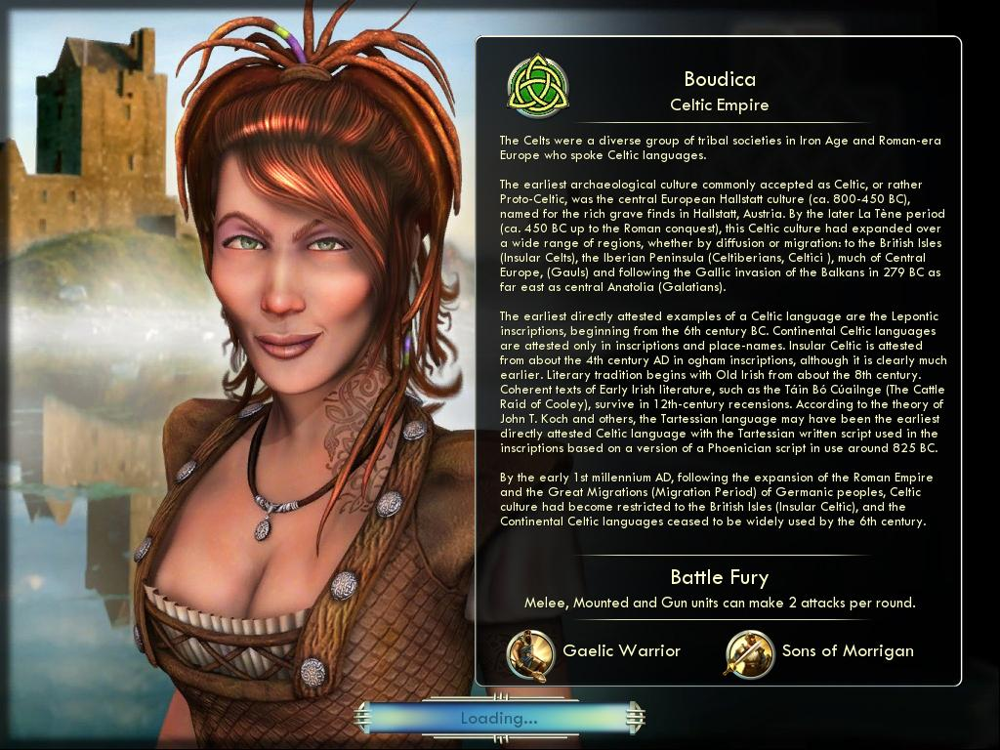

#### 如何添加首领

Adding a leader is similar to adding a civilization. To create Boudica I copied all the attributes from Alexander, who I want her to act similar to. Then I switched to Elizabeth's art definitions for ArtDefineTag (the leader screen art) and PortraitIndex (the icon she uses). Last I switched her to the Hiawatha's trait of Ignore Terrain in Forest. In later sections we look at how to create new art and trait for Boudica.

This is Boudica's leader definition. I created a new file called XML/Leaders/CIV5Leader_Bouidica.xml and set this file to update the database on the actions tab of the mod properties.

```xml
<GameData>
    <Leaders>
        <Row>
            <Type>LEADER_BOUDICA</Type>
            <Description>TXT_KEY_LEADER_BOUDICA</Description>
            <Civilopedia>TXT_KEY_LEADER_BOUDICA_PEDIA</Civilopedia>
            <CivilopediaTag>TXT_KEY_CIVILOPEDIA_LEADERS_BOUDICA</CivilopediaTag>
            <ArtDefineTag>Elizabeth_Scene.xml</ArtDefineTag>
            <VictoryCompetitiveness>8</VictoryCompetitiveness>
            <WonderCompetitiveness>7</WonderCompetitiveness>
            <MinorCivCompetitiveness>3</MinorCivCompetitiveness>
            <Boldness>8</Boldness>
            <DiploBalance>3</DiploBalance>
            <WarmongerHate>2</WarmongerHate>
            <WorkAgainstWillingness>7</WorkAgainstWillingness>
            <WorkWithWillingness>4</WorkWithWillingness>
            <PortraitIndex>6</PortraitIndex>
            <IconAtlas>LEADER_ATLAS</IconAtlas>
        </Row>
            </Leaders>
            <Leader_MajorCivApproachBiases>
            <Row>
            <LeaderType>LEADER_BOUDICA</LeaderType>
            <MajorCivApproachType>MAJOR_CIV_APPROACH_WAR</MajorCivApproachType>
            <Bias>7</Bias>
        </Row>
        <Row>
            <LeaderType>LEADER_BOUDICA</LeaderType>
            <MajorCivApproachType>MAJOR_CIV_APPROACH_HOSTILE</MajorCivApproachType>
            <Bias>7</Bias>
        </Row>
        <Row>
            <LeaderType>LEADER_BOUDICA</LeaderType>
            <MajorCivApproachType>MAJOR_CIV_APPROACH_DECEPTIVE</MajorCivApproachType>
            <Bias>4</Bias>
        </Row>
        <Row>
            <LeaderType>LEADER_BOUDICA</LeaderType>
            <MajorCivApproachType>MAJOR_CIV_APPROACH_GUARDED</MajorCivApproachType>
            <Bias>5</Bias>
        </Row>
        <Row>
            <LeaderType>LEADER_BOUDICA</LeaderType>
            <MajorCivApproachType>MAJOR_CIV_APPROACH_AFRAID</MajorCivApproachType>
            <Bias>3</Bias>
        </Row>
        <Row>
            <LeaderType>LEADER_BOUDICA</LeaderType>
            <MajorCivApproachType>MAJOR_CIV_APPROACH_FRIENDLY</MajorCivApproachType>
            <Bias>5</Bias>
        </Row>
        <Row>
            <LeaderType>LEADER_BOUDICA</LeaderType>
            <MajorCivApproachType>MAJOR_CIV_APPROACH_NEUTRAL</MajorCivApproachType>
            <Bias>4</Bias>
        </Row>
    </Leader_MajorCivApproachBiases>
    <Leader_MinorCivApproachBiases>
        <Row>
            <LeaderType>LEADER_BOUDICA</LeaderType>
            <MinorCivApproachType>MINOR_CIV_APPROACH_IGNORE</MinorCivApproachType>
            <Bias>4</Bias>
        </Row>
        <Row>
            <LeaderType>LEADER_BOUDICA</LeaderType>
            <MinorCivApproachType>MINOR_CIV_APPROACH_FRIENDLY</MinorCivApproachType>
            <Bias>5</Bias>
        </Row>
        <Row>
            <LeaderType>LEADER_BOUDICA</LeaderType>
            <MinorCivApproachType>MINOR_CIV_APPROACH_PROTECTIVE</MinorCivApproachType>
            <Bias>3</Bias>
        </Row>
        <Row>
            <LeaderType>LEADER_BOUDICA</LeaderType>
            <MinorCivApproachType>MINOR_CIV_APPROACH_CONQUEST</MinorCivApproachType>
            <Bias>8</Bias>
        </Row>
    </Leader_MinorCivApproachBiases>
    <Leader_Flavors>
        <Row>
            <LeaderType>LEADER_BOUDICA</LeaderType>
            <FlavorType>FLAVOR_OFFENSE</FlavorType>
            <Flavor>8</Flavor>
        </Row>
        <Row>
            <LeaderType>LEADER_BOUDICA</LeaderType>
            <FlavorType>FLAVOR_DEFENSE</FlavorType>
            <Flavor>5</Flavor>
        </Row>
        <Row>
            <LeaderType>LEADER_BOUDICA</LeaderType>
            <FlavorType>FLAVOR_CITY_DEFENSE</FlavorType>
            <Flavor>5</Flavor>
        </Row>
        <Row>
            <LeaderType>LEADER_BOUDICA</LeaderType>
            <FlavorType>FLAVOR_MILITARY_TRAINING</FlavorType>
            <Flavor>5</Flavor>
        </Row>
        <Row>
            <LeaderType>LEADER_BOUDICA</LeaderType>
            <FlavorType>FLAVOR_RECON</FlavorType>
            <Flavor>5</Flavor>
        </Row>
        <Row>
            <LeaderType>LEADER_BOUDICA</LeaderType>
            <FlavorType>FLAVOR_RANGED</FlavorType>
            <Flavor>3</Flavor>
        </Row>
        <Row>
            <LeaderType>LEADER_BOUDICA</LeaderType>
            <FlavorType>FLAVOR_MOBILE</FlavorType>
            <Flavor>8</Flavor>
        </Row>
        <Row>
            <LeaderType>LEADER_BOUDICA</LeaderType>
            <FlavorType>FLAVOR_NAVAL</FlavorType>
            <Flavor>5</Flavor>
        </Row>
        <Row>
            <LeaderType>LEADER_BOUDICA</LeaderType>
            <FlavorType>FLAVOR_NAVAL_RECON</FlavorType>
            <Flavor>5</Flavor>
        </Row>
        <Row>
            <LeaderType>LEADER_BOUDICA</LeaderType>
            <FlavorType>FLAVOR_NAVAL_GROWTH</FlavorType>
            <Flavor>6</Flavor>
        </Row>
        <Row>
            <LeaderType>LEADER_BOUDICA</LeaderType>
            <FlavorType>FLAVOR_NAVAL_TILE_IMPROVEMENT</FlavorType>
            <Flavor>6</Flavor>
        </Row>
        <Row>
            <LeaderType>LEADER_BOUDICA</LeaderType>
            <FlavorType>FLAVOR_AIR</FlavorType>
            <Flavor>3</Flavor>
        </Row>
        <Row>
            <LeaderType>LEADER_BOUDICA</LeaderType>
            <FlavorType>FLAVOR_EXPANSION</FlavorType>
            <Flavor>8</Flavor>
        </Row>
        <Row>
            <LeaderType>LEADER_BOUDICA</LeaderType>
            <FlavorType>FLAVOR_GROWTH</FlavorType>
            <Flavor>4</Flavor>
        </Row>
        <Row>
            <LeaderType>LEADER_BOUDICA</LeaderType>
            <FlavorType>FLAVOR_TILE_IMPROVEMENT</FlavorType>
            <Flavor>4</Flavor>
        </Row>
        <Row>
            <LeaderType>LEADER_BOUDICA</LeaderType>
            <FlavorType>FLAVOR_INFRASTRUCTURE</FlavorType>
            <Flavor>4</Flavor>
        </Row>
        <Row>
            <LeaderType>LEADER_BOUDICA</LeaderType>
            <FlavorType>FLAVOR_PRODUCTION</FlavorType>
            <Flavor>5</Flavor>
        </Row>
        <Row>
            <LeaderType>LEADER_BOUDICA</LeaderType>
            <FlavorType>FLAVOR_GOLD</FlavorType>
            <Flavor>3</Flavor>
        </Row>
        <Row>
            <LeaderType>LEADER_BOUDICA</LeaderType>
            <FlavorType>FLAVOR_SCIENCE</FlavorType>
            <Flavor>6</Flavor>
        </Row>
        <Row>
            <LeaderType>LEADER_BOUDICA</LeaderType>
            <FlavorType>FLAVOR_CULTURE</FlavorType>
            <Flavor>7</Flavor>
        </Row>
        <Row>
            <LeaderType>LEADER_BOUDICA</LeaderType>
            <FlavorType>FLAVOR_HAPPINESS</FlavorType>
            <Flavor>5</Flavor>
        </Row>
        <Row>
            <LeaderType>LEADER_BOUDICA</LeaderType>
            <FlavorType>FLAVOR_GREAT_PEOPLE</FlavorType>
            <Flavor>6</Flavor>
        </Row>
        <Row>
            <LeaderType>LEADER_BOUDICA</LeaderType>
            <FlavorType>FLAVOR_WONDER</FlavorType>
            <Flavor>7</Flavor>
        </Row>
        <Row>
            <LeaderType>LEADER_BOUDICA</LeaderType>
            <FlavorType>FLAVOR_RELIGION</FlavorType>
            <Flavor>5</Flavor>
        </Row>
        <Row>
            <LeaderType>LEADER_BOUDICA</LeaderType>
            <FlavorType>FLAVOR_DIPLOMACY</FlavorType>
            <Flavor>7</Flavor>
        </Row>
        <Row>
            <LeaderType>LEADER_BOUDICA</LeaderType>
            <FlavorType>FLAVOR_SPACESHIP</FlavorType>
            <Flavor>8</Flavor>
        </Row>
        <Row>
            <LeaderType>LEADER_BOUDICA</LeaderType>
            <FlavorType>FLAVOR_WATER_CONNECTION</FlavorType>
            <Flavor>6</Flavor>
        </Row>
    </Leader_Flavors>
    <Leader_Traits>
        <Row>
            <LeaderType>LEADER_BOUDICA</LeaderType>
            <TraitType>TRAIT_IGNORE_TERRAIN_IN_FOREST</TraitType>
        </Row>
    </Leader_Traits>
</GameData>
```

We need two more things before Boudica becomes a complete leader. First we need to modify our Celt civilization entry to make Boudica the leader. To do that we need to modify the Celt.xml entry we added from the LEADER_ELIZABETH leader to LEADER_BOUDICA.

```xml
<Civilization_Leaders>
    <Row>
        <CivilizationType>CIVILIZATION_CELT</CivilizationType>
        <LeaderheadType>LEADER_BOUDICA</LeaderheadType>
    </Row>
</Civilization_Leaders>
```

Secondly we need to add the text strings to our already existing GameText.xml that is used by our new leader:

```xml
    <Row Tag="TXT_KEY_CIVILOPEDIA_LEADERS_BOUDICA_HEADING_1">
        <Text>History</Text>
    </Row>
    <Row Tag="TXT_KEY_CIVILOPEDIA_LEADERS_BOUDICA_TEXT_1">
        <Text>Boudica, formerly known as Boadicea and known in Welsh as "Buddug" was queen of a Celtic tribe who led an uprising against the occupying forces of the Roman Empire.[NEWLINE][NEWLINE]Boudica's husband Prasutagus, ruler of the Iceni tribe who had ruled as a nominally independent ally of Rome, left his kingdom jointly to his daughters and the Roman Emperor in his will. However, when he died his will was ignored. The kingdom was annexed as if conquered, Boudica was flogged and her daughters raped, and Roman financiers called in their loans.[NEWLINE][NEWLINE]In AD 60 or 61, while the Roman governor, Gaius Suetonius Paulinus, was leading a campaign on the island of Anglesey in north Wales, Boudica led the Iceni people, along with the Trinovantes and others, in revolt. They destroyed Camulodunum (modern Colchester), formerly the capital of the Trinovantes, but now a colonia (a settlement for discharged Roman soldiers) and the site of a temple to the former emperor Claudius, which was built and maintained at local expense. They also routed a Roman legion, the IX Hispana, sent to relieve the settlement.[NEWLINE][NEWLINE]On hearing the news of the revolt, Suetonius hurried to Londinium (London), the twenty-year-old commercial settlement that was the rebels' next target. Concluding he did not have the numbers to defend it, Suetonius evacuated and abandoned it. It was burnt to the ground, as was Verulamium (St Albans). An estimated 70,000–80,000 people were killed in the three cities. Suetonius, meanwhile, regrouped his forces in the West Midlands, and despite being heavily outnumbered, defeated the Britons in the Battle of Watling Street. The crisis caused the emperor Nero to consider withdrawing all Roman forces from the island, but Suetonius' eventual victory over Boudica secured Roman control of the province. Boudica then killed herself so she would not be captured, or fell ill and died; Tacitus and Dio differ.[NEWLINE][NEWLINE]The history of these events, as recorded by Tacitus and Cassius Dio, was rediscovered during the Renaissance and led to a resurgence of Boudica's legendary fame during the Victorian era, when Queen Victoria was portrayed as her 'namesake'. Boudica has since remained an important cultural symbol in the United Kingdom. The absence of native British literature during the early part of the first millennium means that Britain owes its knowledge of Boudica's rebellion to the writings of the Romans.</Text>
    </Row>
    <Row Tag="TXT_KEY_CIVILOPEDIA_LEADERS_BOUDICA_LIVED">
        <Text>25 - 62 AD</Text>
    </Row>
    <Row Tag="TXT_KEY_CIVILOPEDIA_LEADERS_BOUDICA_NAME">
        <Text>Boudica</Text>
    </Row>
    <Row Tag="TXT_KEY_CIVILOPEDIA_LEADERS_BOUDICA_SUBTITLE">
        <Text>Leader of the Celts</Text>
    </Row>
    <Row Tag="TXT_KEY_LEADER_BOUDICA">
        <Text>Boudica</Text>
    </Row>
```

Notice that, just as with the civilizations, the CivilopediaTag attribute is a prefix for several text strings. The _NAME and _SUBTITLE are special to leaders and are displayed at the top of the pedia page. Exactly as with civilizations the _HEADING_1 and _TEXT_1 are used to create body sections in the pedia page. And there is a special tag for _LIVED which contains the years the years the leader was alive.

Finally, I would like to update the Dawn of Man (loading screen image) image for the Celt civ so that it loads with a picture of Boudica instead of the current picture of Elizabeth. As I was stretching the limits of my artistic ability to create that Celtic civilization icon, I'm going to have to find another source for a Boudica picture. Fortunately Boudica had great art in the Civilization IV: Warlords expansion, and I don't think Firaxis would mind if I borrowed it for a Civilization V mod.

A Dawn of Man picture is 1024x768 and has to be a DDS file. Outside of that any picture will do. I used photoshop to save a picture of Boudica in that size and format as BoudicaDOM.dds, included that picture with my mod and made the following change to the Celt's civilization definition (change in blue):

```xml
<Civilizations>
    <Row>
        <Type>CIVILIZATION_CELT</Type>
        <Description>TXT_KEY_CIV_CELT_DESC</Description>
        <ShortDescription>TXT_KEY_CIV_CELT_SHORT_DESC</ShortDescription>
        <Adjective>TXT_KEY_CIV_CELT_ADJECTIVE</Adjective>
        <Civilopedia>TXT_KEY_CIV_CELT_PEDIA</Civilopedia>
        <CivilopediaTag>TXT_KEY_CIV5_CELT</CivilopediaTag>
        <DefaultPlayerColor>PLAYERCOLOR_DARK_GREEN</DefaultPlayerColor>
        <ArtDefineTag>ART_DEF_CIVILIZATION_ENGLAND</ArtDefineTag>
        <ArtStyleType>ARTSTYLE_EUROPEAN</ArtStyleType>
        <ArtStyleSuffix>_EURO</ArtStyleSuffix>
        <ArtStylePrefix>EUROPEAN </ArtStylePrefix>
        <PortraitIndex>0</PortraitIndex>
        <IconAtlas>CIV_COLOR_ATLAS_LEGENDS</IconAtlas>
        <AlphaIconAtlas>CIV_ALPHA_ATLAS</AlphaIconAtlas>
        <MapImage>MapEngland512.dds</MapImage>
        <DawnOfManQuote>TXT_KEY_CIV5_CELT_TEXT_1</DawnOfManQuote>
        <DawnOfManImage>BoudicaDOM.dds</DawnOfManImage>
        <DawnOfManAudio/>
    </Row>
</Civilizations>
```
And that's all we need to have a new, working leader. In the next section we will cover how to add a new trait to Boudica and there will be a screenshot of the Dawn of Man screen where we can see the new screen.

#### 如何添加特性

So far we have been borrowing Hiawatha's trait for our Boudica. It works fairly well, but our civilization would be more interesting if it had a unique trait. This section will go through the simple steps to add a trait to the game.

First we need to add a new file to our mod, CIV5Traits.xml in the /XML/Civilizations directory. We will be adding a trait called Battle Fury that will give all Melee, Mounted and Gun units 2 attacks per round instead of the normal 1. This is the definition we will need to do that:

```xml
<GameData>
    <Traits>
        <Row>
            <Type>TRAIT_BATTLE_FURY</Type>
            <Description>TXT_KEY_TRAIT_BATTLE_FURY</Description>
            <ShortDescription>TXT_KEY_TRAIT_BATTLE_FURY_SHORT</ShortDescription>
        </Row>
    </Traits>
    <Trait_FreePromotionUnitCombats>
        <Row>
            <TraitType>TRAIT_BATTLE_FURY</TraitType>
            <UnitCombatType>UNITCOMBAT_MELEE</UnitCombatType>
            <PromotionType>PROMOTION_SECOND_ATTACK</PromotionType>
        </Row>
        <Row>
            <TraitType>TRAIT_BATTLE_FURY</TraitType>
            <UnitCombatType>UNITCOMBAT_MOUNTED</UnitCombatType>
            <PromotionType>PROMOTION_SECOND_ATTACK</PromotionType>
        </Row>
        <Row>
            <TraitType>TRAIT_BATTLE_FURY</TraitType>
            <UnitCombatType>UNITCOMBAT_GUN</UnitCombatType>
            <PromotionType>PROMOTION_SECOND_ATTACK</PromotionType>
        </Row>
    </Trait_FreePromotionUnitCombats>
</GameData>
```

The above adds the new trait to the game. It's a fairly simple definition, it gives the Second Attack promotion to all this civilizations Melee, Mounted and Gun units (Second Attack is an already existing promotion that gives units an additional attack each turn).

But we need to modify our mod properties to add this to the list of files that will update the database when the mod is loaded, we need text string decodes for the text strings we use here and we need to assign this trait to Boudica.

You should be familiar with adding text strings by this point. Add the following to the GameText.xml file:

```xml
<Row Tag="TXT_KEY_TRAIT_BATTLE_FURY">
    <Text>Melee, Mounted and Gun units can make 2 attacks per round.</Text>
</Row>
<Row Tag="TXT_KEY_TRAIT_BATTLE_FURY_SHORT">
    <Text>Battle Fury</Text>
</Row>
```

To assign this to Boudica make the following change to our Boudica leader definition:

```xml
<Leader_Traits>
    <Row>
        <LeaderType>LEADER_BOUDICA</LeaderType>
        <TraitType>TRAIT_BATTLE_FURY</TraitType>
    </Row>
</Leader_Traits>
```

Creating a new trait is as easy as that. Be sure to look through the schema definition for Traits and the XML definitions for all the existing traits to get ideas for new traits for your leaders.



#### 如何添加单位

Units are fun, and adding them is easy. As you may have noticed in the above screenshot there are two Unique Units assigned to the Celt's in this section we will cover how to add one of them.

This document covers the technical aspects of modding, but it's worth briefly mentioning some design considerations when adding new unique units to the game. When you consider a unique unit think about when that makes the civilization powerful (unique units are typically better than the unit they replace). Consider how that matches with their trait and how that compares to other unique units. For the Celts I've added a unique unit that replaces the warrior and one that replaces the swordsman. Both are early units and both combine nicely with the Boudica's trait. That makes the Celt's very strong militarily in the early game. They don't have buildings that help with their infrastructure and none of their abilities are very helpful defensively. But they are great early game raiders.

The Gaelic Warrior is the same cost and strength of a normal warrior but he ignores terrain costs. Moving through forests, hills, jungles or across rivers happens exactly like open plains. This makes the Gaelic Warrior very quick raiders, especially with their trait ability of being able to attack twice a turn. This also helps with their forested starts.


We need to make four changes to add a new unique unit to the game. First we need to add a new file CIV5Units.xml to our mod. I added it in the XML/Units/ folder. That file needs to contain the following unit definition.

```xml
<GameData>
    <Units>
        <Row>
            <Class>UNITCLASS_WARRIOR</Class>
            <Type>UNIT_GAELIC_WARRIOR</Type>
            <Combat>6</Combat>
            <Cost>40</Cost>
            <Moves>2</Moves>
            <CombatClass>UNITCOMBAT_MELEE</CombatClass>
            <Domain>DOMAIN_LAND</Domain>
            <DefaultUnitAI>UNITAI_ATTACK</DefaultUnitAI>
            <Description>TXT_KEY_UNIT_GAELIC_WARRIOR</Description>
            <Civilopedia>TXT_KEY_CIV5_ANTIQUITY_WARRIOR_TEXT</Civilopedia>
            <Strategy>TXT_KEY_UNIT_WARRIOR_STRATEGY</Strategy>
            <Help>TXT_KEY_UNIT_HELP_GAELIC_WARRIOR</Help>
            <MilitarySupport>true</MilitarySupport>
            <MilitaryProduction>true</MilitaryProduction>
            <Pillage>true</Pillage>
            <ObsoleteTech>TECH_METAL_CASTING</ObsoleteTech>
            <GoodyHutUpgradeUnitClass>UNITCLASS_SPEARMAN</GoodyHutUpgradeUnitClass>
            <AdvancedStartCost>10</AdvancedStartCost>
            <XPValueAttack>3</XPValueAttack>
            <XPValueDefense>3</XPValueDefense>
            <Conscription>1</Conscription>
            <UnitArtInfo>ART_DEF_UNIT_GAELIC_WARRIOR</UnitArtInfo>
            <UnitFlagIconOffset>3</UnitFlagIconOffset>
            <IconAtlas>UNIT_ATLAS_1</IconAtlas>
            <PortraitIndex>3</PortraitIndex>
        </Row>
    </Units>
    <Unit_FreePromotions>
        <Row>
            <UnitType>UNIT_GAELIC_WARRIOR</UnitType>
            <PromotionType>PROMOTION_IGNORE_TERRAIN_COST</PromotionType>
        </Row>
    </Unit_FreePromotions>
    <Unit_AITypes>
        <Row>
            <UnitType>UNIT_GAELIC_WARRIOR</UnitType>
            <UnitAIType>UNITAI_ATTACK</UnitAIType>
        </Row>
        <Row>
            <UnitType>UNIT_GAELIC_WARRIOR</UnitType>
            <UnitAIType>UNITAI_DEFENSE</UnitAIType>
        </Row>
        <Row>
            <UnitType>UNIT_GAELIC_WARRIOR</UnitType>
            <UnitAIType>UNITAI_EXPLORE</UnitAIType>
        </Row>
    </Unit_AITypes>
    <Unit_ClassUpgrades>
        <Row>
            <UnitType>UNIT_GAELIC_WARRIOR</UnitType>
            <UnitClassType>UNITCLASS_SWORDSMAN</UnitClassType>
        </Row>
    </Unit_ClassUpgrades>
    <Unit_Flavors>
        <Row>
            <UnitType>UNIT_GAELIC_WARRIOR</UnitType>
            <FlavorType>FLAVOR_RECON</FlavorType>
            <Flavor>1</Flavor>
        </Row>
        <Row>
            <UnitType>UNIT_GAELIC_WARRIOR</UnitType>
            <FlavorType>FLAVOR_OFFENSE</FlavorType>
            <Flavor>2</Flavor>
        </Row>
        <Row>
            <UnitType>UNIT_GAELIC_WARRIOR</UnitType>
            <FlavorType>FLAVOR_DEFENSE</FlavorType>
            <Flavor>2</Flavor>
        </Row>
    </Unit_Flavors>
</GameData>
```

Notice that in the above there are a few tables that need to be updated when adding unit. The primary one is the Units table, But we also updated the Unit_FreePromotions table (to grant the promotion that allows the unit to ignore terrain costs), Unit_AITypes table (interestingly the game searches for an available UNITAI_DEFENSE unit to start the player with, since I didn't originally have this defined the Celts weren't starting with a free warrior until I fixed it), Unit_ClassUpgrades table (so that our new unit can be upgraded to a Swordsman) and the Unit_Flavors table (so different AI leaders can prefer different strategies).

The above unit uses the UNITCLASS_WARRIOR unitclass, so we don't need to define a new unitclass for it. Since it doesn't have its own unitclass, we know that this is a unique unit (that it replaces the warrior unit for a civilization).

All of the Unit attributes should be fairly easy to understand. I included a custom art definition with the Gaelic Warrior, we will go over that in the next section.

The second step to adding the unit is that we have to modify the mod properties and include the new file as one that updates the database when the mod is activated.

The third step is to add the text entries the unit requires. I didn't get fancy and add a custom pedia entry. Just the text string and a help string so the player knows what the unit does, so we only have two entries that need to be added to the text file.

```xml
<Row Tag="TXT_KEY_UNIT_GAELIC_WARRIOR">
    <Text>Gaelic Warrior</Text>
</Row>
<Row Tag="TXT_KEY_UNIT_HELP_GAELIC_WARRIOR">
    <Text>This unit's ability to ignore terrain allows it to quickly rush into enemy lands.</Text>
</Row>
```

The final step is we need to assign this unit as unique unit for the Celt civilization.

```xml
<Civilization_UnitClassOverrides>
    <Row>
        <CivilizationType>CIVILIZATION_CELT</CivilizationType>
        <UnitClassType>UNITCLASS_WARRIOR</UnitClassType>
        <UnitType>UNIT_GAELIC_WARRIOR</UnitType>
    </Row>
</Civilization_UnitClassOverrides>
```

That is all it takes to add a new unit to the game. In the next section we will look at how we assign new art to a unit.