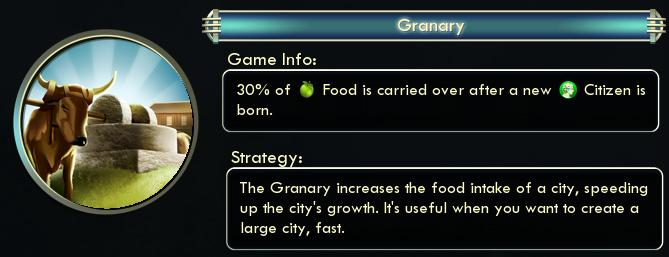
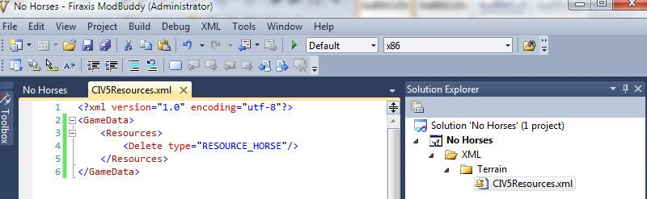
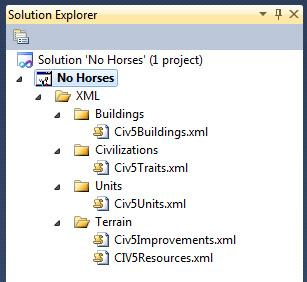

#### 如何改变艺术家的定义

本文不会讲怎么做《文明 5》用的图片资源。Firaxis 有一个叫做 Nexus 的软件就是做这个的，但我不是讲这个的最好人选。

但我们还是要理解图片定义。有两个部分，第一是 UnitArtInfo，这是整体信息。单位定义指向这一层，它指定了有多少个（及多少种）单位组成信息。整个文件太长了，无法包含到这里，这里是文件中的一个例子：

```xml
<UnitArtInfos>
    <UnitArtInfo>
        <Type>ART_DEF_UNIT_BARBARIAN_EURO</Type>
        <Formation>Barbarian</Formation>
        <DamageStates>1</DamageStates>
        <UnitMemberArt>
            <MemberType>ART_DEF_UNIT_MEMBER_BARBARIAN_EURO_ALPHA</MemberType>
            <MemberCount>2</MemberCount>
        </UnitMemberArt>
        <UnitMemberArt>
            <MemberType>ART_DEF_UNIT_MEMBER_BARBARIAN_EURO_BRAVO</MemberType>
            <MemberCount>4</MemberCount>
        </UnitMemberArt>
        <UnitMemberArt>
            <MemberType>ART_DEF_UNIT_MEMBER_BARBARIAN_EURO_CHARLIE</MemberType>
            <MemberCount>4</MemberCount>
        </UnitMemberArt>
    </UnitArtInfo>
</UnitArtInfos>
```

注意这是我们看过的第一个不是以 `<GameData>` 开头的 XML 定义。单位图片信息不完全整合到数据库中，因此处理它要比其它 XML 文件稍微困难些。

上面关于 ART_DEF_UNIT_BARBARIAN_EURO 的定义信息里包含了十个单位。两个 EURO_ALPHA 单位模型，四个 EURO_BRAVO 模型和四个 EURO_CHARLIE 模型。Firaxis 有不同的模型形态，因此它看上去不像是克隆的军队。要了解更多相关信息，我们得看一看 UnitMemberArtInfo 定义：

```xml
<UnitMemberArtInfos>
    <UnitMemberArtInfo>
        <Type>ART_DEF_UNIT_MEMBER_BARBARIAN_EURO_ALPHA</Type>
        <fScale>0.14</fScale>
        <Granny>Assets/Units/Barbarian/Barbarian_EURO/Barbarian_EURO_Alpha.fxsxml</Granny>
        <Combat>
            <Defaults>ART_DEF_TEMPLATE_SOLDIER</Defaults>
            <Weapon>
                <WeaponTypeTag>BLUNT</WeaponTypeTag>
                <WeaponTypeSoundOverrideTag>BLUNT</WeaponTypeSoundOverrideTag>
            </Weapon>
            <Weapon>
                <Usage>Vs_City ShortRange</Usage>
                <fVisKillStrengthMin>10.0</fVisKillStrengthMin>
                <fVisKillStrengthMax>20.0</fVisKillStrengthMax>
                <WeaponTypeTag>FLAMING_ARROW</WeaponTypeTag>
            </Weapon>
        </Combat>
        <MaterialTypeTag>CLOTH</MaterialTypeTag>
        <MaterialTypeSoundOverrideTag>FLESH</MaterialTypeSoundOverrideTag>
    </UnitMemberArtInfo>
    <UnitMemberArtInfo>
        <Type>ART_DEF_UNIT_MEMBER_BARBARIAN_EURO_BRAVO</Type>
        <fScale>0.14</fScale>
        <Granny>Assets/Units/Barbarian/Barbarian_EURO/Barbarian_EURO_Bravo.fxsxml</Granny>
        <Combat>
            <Defaults>ART_DEF_TEMPLATE_SOLDIER</Defaults>
            <Weapon>
                <WeaponTypeTag>BLUNT</WeaponTypeTag>
                <WeaponTypeSoundOverrideTag>BLUNT</WeaponTypeSoundOverrideTag>
            </Weapon>
            <Weapon>
                <Usage>Vs_City ShortRange</Usage>
                <fVisKillStrengthMin>10.0</fVisKillStrengthMin>
                <fVisKillStrengthMax>20.0</fVisKillStrengthMax>
                <WeaponTypeTag>FLAMING_ARROW</WeaponTypeTag>
            </Weapon>
        </Combat>
        <MaterialTypeTag>CLOTH</MaterialTypeTag>
        <MaterialTypeSoundOverrideTag>FLESH</MaterialTypeSoundOverrideTag>
    </UnitMemberArtInfo>
    <UnitMemberArtInfo>
        <Type>ART_DEF_UNIT_MEMBER_BARBARIAN_EURO_CHARLIE</Type>
        <fScale>0.14</fScale>
        <Granny>Assets/Units/Barbarian/Barbarian_EURO/Barbarian_EURO_Charlie.fxsxml</Granny>
        <Combat>
            <Defaults>ART_DEF_TEMPLATE_SOLDIER</Defaults>
            <Weapon>
                <WeaponTypeTag>BLUNT</WeaponTypeTag>
                <WeaponTypeSoundOverrideTag>BLUNT</WeaponTypeSoundOverrideTag>
            </Weapon>
            <Weapon>
                <Usage>Vs_City ShortRange</Usage>
                <fVisKillStrengthMin>10.0</fVisKillStrengthMin>
                <fVisKillStrengthMax>20.0</fVisKillStrengthMax>
                <WeaponTypeTag>FLAMING_ARROW</WeaponTypeTag>
            </Weapon>
        </Combat>
        <MaterialTypeTag>CLOTH</MaterialTypeTag>
        <MaterialTypeSoundOverrideTag>FLESH</MaterialTypeSoundOverrideTag>
    </UnitMemberArtInfo>
</UnitMemberArtInfos>
```

上面有三个 UnitMemberArtInfo 定义。每一个都设置了 fScale （单位模型的大小），关联到实际的图片文件（在 Granny 属性中），并且包含用于音效和动画效果的标签。

个人而言，我对巨大的单位形态不感兴趣。战斗看起来很酷，但很难分辨地图上的所有小单位。因此用这个模组我们会把十个单位的形态改成一个个巨大的单位模型。

由于 UnitArtInfo 和 UnitMemberArtInfo 不在数据库中，它们与之前的 XML 文件不同的是我们没法用 `<Update>` 更新数据。我们已经提供了修改过的文件的完整副本。而且由于单位系统是在模组之前加载的，我们需要勾上模组属性里的 “Reload Unit System”，让修改的单位模型生效。

首先要修改每个单位的 UnitArtInfo，将他们放到一个成员组中。再次强调我不会把整个文件放在这里，这里只有野蛮人勇士的例子。

```xml
<UnitArtInfos>
    <UnitArtInfo>
        <Type>ART_DEF_UNIT_BARBARIAN_EURO</Type>
        <Formation>Barbarian</Formation>
        <DamageStates>1</DamageStates>
        <blue><UnitMemberArt>
            <MemberType>ART_DEF_UNIT_MEMBER_BARBARIAN_EURO_BRAVO</MemberType>
            <MemberCount>1</MemberCount>
        </UnitMemberArt></blue>
    </UnitArtInfo>
</UnitArtInfos>
```

然后需要修改 ART_DEF_UNIT_MEMBER_BARBARIAN_EURO_BRAVO 定义，增大尺寸。

```xml
<UnitMemberArtInfos>
    <UnitMemberArtInfo>
        <Type>ART_DEF_UNIT_MEMBER_BARBARIAN_EURO_BRAVO</Type>
        <!-- blue area -->
        <fScale>0.32</fScale>
        <!-- end of blue area -->
        <Granny>Assets/Units/Barbarian/Barbarian_EURO/Barbarian_EURO_Bravo.fxsxml</Granny>
        <Combat>
            <Defaults>ART_DEF_TEMPLATE_SOLDIER</Defaults>
            <Weapon>
                <WeaponTypeTag>BLUNT</WeaponTypeTag>
                <WeaponTypeSoundOverrideTag>BLUNT</WeaponTypeSoundOverrideTag>
            </Weapon>
            <Weapon>
                <Usage>Vs_City ShortRange</Usage>
                <fVisKillStrengthMin>10.0</fVisKillStrengthMin>
                <fVisKillStrengthMax>20.0</fVisKillStrengthMax>
                <WeaponTypeTag>FLAMING_ARROW</WeaponTypeTag>
            </Weapon>
        </Combat>
        <MaterialTypeTag>CLOTH</MaterialTypeTag>
        <MaterialTypeSoundOverrideTag>FLESH</MaterialTypeSoundOverrideTag>
    </UnitMemberArtInfo>
</UnitMemberArtInfos>
```

唯一的改动是蓝色部分。把单位的 fScale 属性从 0.12 改到 0.32，所以它几乎是普通模型大小的三倍。

把一个巨大单位调成巨大形态的一个好处是它能给我们留下一些未使用的单位图片模型。之前形成野蛮人单位形态的是三个不同的单位模型， Alpha，Bravo 以及 Charlie。新的野蛮人形态中我们用的是 Bravo 模型。因此 Alpha 模型（身穿鹿皮，头戴鹿角，很适合 Gaelic 勇士单位）就能使用。


前一节中，创建 Gaelic 勇士时我们用的是 ART_DEF_UNIT_GAELIC_WARRIOR 的图片定义，现在我们要把这个定义添加到 UnitArtInfo。

```xml
<UnitArtInfos>
    <UnitArtInfo>
        <Type>ART_DEF_UNIT_GAELIC_WARRIOR</Type>
        <Formation>LooseCivilian</Formation>
        <DamageStates>1</DamageStates>
        <UnitMemberArt>
            <MemberType>ART_DEF_UNIT_MEMBER_BARBARIAN_EURO_ALPHA</MemberType>
            <MemberCount>1</MemberCount>
        </UnitMemberArt>
    </UnitArtInfo>
</UnitArtInfos>
```

不必修改 UnitMemberArtInfo，因为还没改变定义。但上面的代码告诉游戏，当 ART_DEF_UNIT_GAELIC_WARRIOR 设置时使用 ART_DEF_UNIT_MEMBER_BARBARIAN_EURO_ALPHA 模型作为一个单位形态。

#### 如何添加建筑

添加建筑很简单。我们将添加栅栏作为早期的防御建筑。栅栏不需要任何科技，因此第一个回合就能建造，并且只能在远古时代建造（在其它时代玩家就应该使用城墙，城堡以及其它坚固的防御建筑了）。


要做的是更新三个表。第一个是 “CIV5Buildings.xml” 文件中的 Buildings 表。下面的代码添加了栅栏建造：

```xml
<GameData>
    <Buildings>
        <Row>
            <Type>BUILDING_PALISADE</Type>
            <BuildingClass>BUILDINGCLASS_PALISADE</BuildingClass>
            <Cost>60</Cost>
            <GoldMaintenance>1</GoldMaintenance>
            <Help>TXT_KEY_BUILDING_PALISADE_STRATEGY</Help>
            <Description>TXT_KEY_BUILDING_PALISADE</Description>
            <Civilopedia>TXT_KEY_CIV5_BUILDINGS_PALISADE_TEXT</Civilopedia>
            <Strategy>TXT_KEY_BUILDING_PALISADE_STRATEGY</Strategy>
            <ArtDefineTag>ART_DEF_BUILDING_WALLS</ArtDefineTag>
            <MaxStartEra>ERA_ANCIENT</MaxStartEra>
            <MinAreaSize>-1</MinAreaSize>
            <AllowsRangeStrike>true</AllowsRangeStrike>
            <Defense>250</Defense>
            <CityWall>true</CityWall>
            <HurryCostModifier>25</HurryCostModifier>
            <IconAtlas>BW_ATLAS_1</IconAtlas>
            <NeverCapture>true</NeverCapture>
            <PortraitIndex>32</PortraitIndex>
        </Row>
    </Buildings>
</GameData>
```

《文明 5》使用 BuildingClasses 来为特色建筑替换普通建筑，比如 Market （市场）和 Bazaar （集市）都是 BUILDINGCLASS_MARKET 类别的。这样所有 AI 和逻辑能够使用 BUILDINGCLASS_MARKET 进行编程，游戏能知道这意味着大多数文明用的是 Market，而阿拉伯文明的玩家用的是 Bazaar。

下面的内容是“CIV5BuildingClasses.xml”文件中的 BuildingClasses 表：

```xml
<GameData>
    <BuildingClasses>
        <Row>
            <Type>BUILDINGCLASS_PALISADE</Type>
            <DefaultBuilding>BUILDING_PALISADE</DefaultBuilding>
            <Description>TXT_KEY_BUILDING_PALISADE</Description>
        </Row>
    </BuildingClasses>
</GameData>
```

最后需要为我们添加的建筑设置文本。这是我们在上述建筑定义中引用的三个新标签。

```xml
<GameData>
    <Language_en_US>
        <Row Tag="TXT_KEY_BUILDING_PALISADE">
            <Text>Palisade</Text>
        </Row>
        <Row Tag="TXT_KEY_BUILDING_PALISADE_STRATEGY">
            <Text>Palisade's provide an early defense against attackers. Though they are less expensive than walls, they provide only half the defense.</Text>
        </Row>
        <Row Tag="TXT_KEY_CIV5_BUILDINGS_PALISADE_TEXT">
            <Text>Built of little more than mud and raw lumber palisades were as vulnerable to the weather as they were to enemy attack. Yet they remained popular in border cities if only because they made the people behind them feel more secure.</Text>
        </Row>
    </Language_en_US>
</GameData>
```

一个添加了新建筑的完整模组就做好了，这是模块化的（可以被其它模组使用，并且不会用兼容性问题），并且能够在 5-10 分钟内构建、发布。

#### 如何修改建筑

假设我们要改变建筑的功能。粮仓给城市增加食物，医院允许城市能够保留 50% 食物以供人口增长。

下面是粮仓的基本定义：

```xml
<Buildings>
    <Row>
        <Type>BUILDING_GRANARY</Type>
        <BuildingClass>BUILDINGCLASS_GRANARY</BuildingClass>
        <FreeStartEra>ERA_RENAISSANCE</FreeStartEra>
        <Cost>100</Cost>
        <GoldMaintenance>1</GoldMaintenance>
        <PrereqTech>TECH_POTTERY</PrereqTech>
        <Help>TXT_KEY_BUILDING_GRANARY_STRATEGY</Help>
        <Description>TXT_KEY_BUILDING_GRANARY</Description>
        <Civilopedia>TXT_KEY_CIV5_BUILDINGS_GRANARY_TEXT</Civilopedia>
        <Strategy>TXT_KEY_BUILDING_GRANARY_STRATEGY</Strategy>
        <ArtDefineTag>ART_DEF_BUILDING_GRANARY</ArtDefineTag>
        <MinAreaSize>-1</MinAreaSize>
        <ConquestProb>66</ConquestProb>
        <HurryCostModifier>25</HurryCostModifier>
        <IconAtlas>BW_ATLAS_1</IconAtlas>
        <PortraitIndex>0</PortraitIndex>
    </Row>
</Buildings>
<Building_YieldChanges>
    <Row>
        <BuildingType>BUILDING_GRANARY</BuildingType>
        <YieldType>YIELD_FOOD</YieldType>
        <Yield>2</Yield>
    </Row>
</Building_YieldChanges>
```

这个是医院的基本定义：

```xml
<Buildings>
    <Row>
        <Type>BUILDING_HOSPITAL</Type>
        <BuildingClass>BUILDINGCLASS_HOSPITAL</BuildingClass>
        <Cost>400</Cost>
        <GoldMaintenance>2</GoldMaintenance>
        <PrereqTech>TECH_BIOLOGY</PrereqTech>
        <Help>TXT_KEY_BUILDING_HOSPITAL_HELP</Help>
        <Description>TXT_KEY_BUILDING_HOSPITAL</Description>
        <Civilopedia>TXT_KEY_BUILDING_HOSPITAL_PEDIA</Civilopedia>
        <Strategy>TXT_KEY_BUILDING_HOSPITAL_STRATEGY</Strategy>
        <ArtDefineTag>ART_DEF_BUILDING_HOSPITAL</ArtDefineTag>
        <FoodKept>50</FoodKept>
        <MinAreaSize>-1</MinAreaSize>
        <ConquestProb>66</ConquestProb>
        <HurryCostModifier>0</HurryCostModifier>
        <IconAtlas>BW_ATLAS_1</IconAtlas>
        <PortraitIndex>45</PortraitIndex>
    </Row>
</Buildings>
```

`<update>` 标签的优点在于你只需要指定你想要修改的东西。要做出修改，先创建一个文件 “/XML/Buildings/CIV5Buildings.xml”，做完所有改动后，在模组属性的更新数据库的设置中添加这个文件。和其它文件，文件名和路径无关紧要，但能帮助组织项目。

如果粮仓在人口增长后保持 30% 的食物，还要用新功能来取代医院之前的功能，让拥有医院的城市建造的所有单位获得医疗晋升，我们需要在 “CIV5Buildings.xml” 文件添加以下内容：

```xml
<GameData>
    <Buildings>
        <Update>
            <Set FoodKept="30"/>
            <Where Type="BUILDING_GRANARY"/>
        </Update>
        <Update>
            <Set Help="TXT_KEY_BUILDING_GRANARY_HELP"/>
            <Where Type="BUILDING_GRANARY"/>
        </Update>
        <Update>
            <Set FoodKept="0"/>
            <Where Type="BUILDING_HOSPITAL"/>
        </Update>
        <Update>
            <Set TrainedFreePromotion="PROMOTION_MEDIC"/>
            <Where Type="BUILDING_HOSPITAL"/>
        </Update>
    </Buildings>
</GameData>
```

上述的 XML 就改了四个地方。第一个是把粮仓的 FoodKept （保存食物）属性改成了 30 （因此 30% 的食物会被保存用于人口增长）。第二个设置了粮仓的 Help （提示）属性，改成了 TXT_KEY_BUILDING_GRANARY_HELP。粮仓一般没有提示文本，但我们需要这个来让玩家知道我们添加的功能。第三个移除了医院的 FoodKept 能力，将它改成 0。第四是把医院的 TrainedFreePromotion 属性设置成了 PROMOTION_MEDIC，这样拥有医院的城市建造的单位就有医疗晋升了。

这不仅仅易于阅读，而且可以清楚的看到你改了什么（在之前的版本里，所有的 xml 文件都要被替换掉，你就要用个比较工具查看改变了什么）。而且这让改动更容易模块话。一个模组能允许粮仓在人口增长后储藏食物，另一个可以修改粮仓的花费，而第三个模组能够修改建筑粮仓所需的科技。

还是要一些文本来描述这些东西。我们要添加 TXT_KEY_BUILDING_GRANARY_HELP 文本，还要更新现有的 TXT_KEY_BUIDING_HOSPITAL_HELP 文本。

```xml
<GameData>
    <Language_en_US>
        <Row Tag="TXT_KEY_BUILDING_GRANARY_HELP">
           <Text>30% of [ICON_FOOD] Food is carried over after a new [ICON_CITIZEN] Citizen is born.</Text>
        </Row>
        <Update>
            <Where Tag="TXT_KEY_BUILDING_HOSPITAL_HELP"/>
            <Set Text="All newly-trained Units in this City receive the [COLOR_POSITIVE_TEXT]Medic[ENDCOLOR] Promotion, increasing the heal rate of this unit and all adjacent units by 1 per turn."/>
        </Update>
    <Language_en_US>
<GameData>
```

注意粮仓是添加字符串，像我们添加其它资源一样。而医院文本要用到更新操作，这样才能改变文本。



这一节的步骤，修改建筑和修改首领，单位以及其它资源一样是有用的。`<Update>` 元素是模组开发者修改现有游戏数据的简单方式，也是可模块化的方式。

#### 如何移除资源

移除资源是移除《文明 5》中移除相关联资源的好例子。资源被单位、建筑、改进以及其它资源所引用。因此简单的删除资源会导致错误，甚至游戏崩溃。

要是想要移除游戏里的马（它没有被引用）那么下面的模组就能正常运行：



但是游戏加载该模组时，会崩溃，我们在 “Database.log” 文件里得到以下错误：

```
[66897.643] Validating Foreign Key Constraints...
[66897.659] Invalid Reference on Building_LocalResourceAnds.ResourceType - "RESOURCE_HORSE" does not exist in Resources
[66897.659] Invalid Reference on Building_LocalResourceOrs.ResourceType - "RESOURCE_HORSE" does not exist in Resources
[66897.659] Invalid Reference on Trait_ResourceQuantityModifiers.ResourceType - "RESOURCE_HORSE" does not exist in Resources
[66897.674] Invalid Reference on Improvement_ResourceTypes.ResourceType - "RESOURCE_HORSE" does not exist in Resources
[66897.674] Invalid Reference on Improvement_ResourceType_Yields.ResourceType - "RESOURCE_HORSE" does not exist in Resources
[66897.674] Invalid Reference on Resource_YieldChanges.ResourceType - "RESOURCE_HORSE" does not exist in Resources
[66897.674] Invalid Reference on Resource_Flavors.ResourceType - "RESOURCE_HORSE" does not exist in Resources
[66897.674] Invalid Reference on Resource_TerrainBooleans.ResourceType - "RESOURCE_HORSE" does not exist in Resources
[66897.674] Invalid Reference on Resource_TerrainBooleans.ResourceType - "RESOURCE_HORSE" does not exist in Resources
[66897.674] Invalid Reference on Resource_TerrainBooleans.ResourceType - "RESOURCE_HORSE" does not exist in Resources
[66897.674] Invalid Reference on Resource_QuantityTypes.ResourceType - "RESOURCE_HORSE" does not exist in Resources
[66897.674] Invalid Reference on Resource_QuantityTypes.ResourceType - "RESOURCE_HORSE" does not exist in Resources
[66897.674] Invalid Reference on Unit_ResourceQuantityRequirements.ResourceType - "RESOURCE_HORSE" does not exist in Resources
[66897.674] Invalid Reference on Unit_ResourceQuantityRequirements.ResourceType - "RESOURCE_HORSE" does not exist in Resources
[66897.674] Invalid Reference on Unit_ResourceQuantityRequirements.ResourceType - "RESOURCE_HORSE" does not exist in Resources
[66897.674] Invalid Reference on Unit_ResourceQuantityRequirements.ResourceType - "RESOURCE_HORSE" does not exist in Resources
[66897.674] Invalid Reference on Unit_ResourceQuantityRequirements.ResourceType - "RESOURCE_HORSE" does not exist in Resources
[66897.674] Invalid Reference on Unit_ResourceQuantityRequirements.ResourceType - "RESOURCE_HORSE" does not exist in Resources
[66897.674] Invalid Reference on Unit_ResourceQuantityRequirements.ResourceType - "RESOURCE_HORSE" does not exist in Resources
[66897.674] Invalid Reference on Unit_ResourceQuantityRequirements.ResourceType - "RESOURCE_HORSE" does not exist in Resources
[66897.674] Invalid Reference on Unit_ResourceQuantityRequirements.ResourceType - "RESOURCE_HORSE" does not exist in Resources
[66897.674] Invalid Reference on Unit_ResourceQuantityRequirements.ResourceType - "RESOURCE_HORSE" does not exist in Resources
[66897.674] Failed Validation.
```

问题在于，现有的引用指向不存在的 Horses（马）。尽管 “Database.log” 文件给了错误发生的提示，但找出哪些文件里包含对 RESOURSE_HORSE 引用的最简单的方法是文件搜索。

我先在 “`<Civ5 install dir>\Assets\Gameplay\XML`” 目录下面搜索 RESOURCE_HORSE ，选择文件包含我搜索的内容。给了我这些东西：


不用担心文本文件。文本文件只是解释字符串的，他们不引用任何东西。存在于文件中的 RESOURCE_HORSE 实际上只是长文本的一部分。搜索出了：“CIV5Units.xml”，“CIV5Buildings.xml”，“CIV5Resources.xml”，“CIV5Improvements.xml” 以及 “Civ5Traits.xml” 文件。



下一步要为每一个需要更新内容的文件创建各自相关的 XML 文件。如前几节所描述的，我们能够把所有改动都放在一个文件中，文件名无关紧要。我偏好于仿照 《文明 5》 的文件结构和文件名，因为这易于记忆，但是只用一个叫 “RemoveHorse.xml”的 XML 文件也可以。

当创建好了一个空文件后，就得浏览原始版本的几个文件，看看我们要移除哪些引用。从 “Civ5Buildings.xml” 开始吧。

在 “Civ5Buildings.xml” 展示了两个对 RESOURCE_HORSE 的引用。在 Building_LocalResourceAnds 表的 Stables 和 Building_LocalResourceOrs 表中的 Circus 都对 RESOURCE_HORSE 进行了引用。这两个引用都要删除，这样我们的模组才能加载。


以下的 “Civ5Buildings.xml” 文件将会删除上述两个引用。

```xml
<GameData>
    <Building_LocalResourceAnds>
        <Delete ResourceType="RESOURCE_HORSE"/>
    </Building_LocalResourceAnds>
    <Building_LocalResourceOrs>
        <Delete ResourceType="RESOURCE_HORSE"/>
    </Building_LocalResourceOrs>
</GameData>
```

还要对 Traits，Units，Improvements 以及 Resource 文件进行同样的处理，这就有了以下内容。

“Civ5Traits.xml” 文件:

```xml
<GameData>
    <Trait_ResourceQuantityModifiers>
        <Delete ResourceType="RESOURCE_HORSE"/>
    </Trait_ResourceQuantityModifiers>
</GameData>
```

“Civ5Units.xml” 文件:

```xml
<GameData>
    <Unit_ResourceQuantityRequirements>
        <Delete ResourceType="RESOURCE_HORSE"/>
    </Unit_ResourceQuantityRequirements>
</GameData>
```

“Civ5Improvements.xml” 文件:

```xml
<GameData>
    <Improvement_ResourceTypes>
        <Delete ResourceType="RESOURCE_HORSE"/>
    </Improvement_ResourceTypes>
    <Improvement_ResourceType_Yields>
        <Delete ResourceType="RESOURCE_HORSE"/>
    </Improvement_ResourceType_Yields>
</GameData>
```

“Civ5Resources.xml” 文件:

```xml
<GameData>
    <Resources>
        <Delete type="RESOURCE_HORSE"/>
    </Resources>
    <Resource_YieldChanges>
        <Delete ResourceType="RESOURCE_HORSE"/>
    </Resource_YieldChanges>
    <Resource_Flavors>
        <Delete ResourceType="RESOURCE_HORSE"/>
    </Resource_Flavors>
    <Resource_TerrainBooleans>
        <Delete ResourceType="RESOURCE_HORSE"/>
    </Resource_TerrainBooleans>
    <Resource_QuantityTypes>
        <Delete ResourceType="RESOURCE_HORSE"/>
    </Resource_QuantityTypes>
</GameData>
```

做完了这些就能移除马匹和所有引用马匹的资源了。要记住这个模组与其它引用了马匹的模组不兼容。比如说，有一个模组添加了一个新的骑乘单位，需要一单位的马匹资源。这就是模组删除基本资源时应该被标记为排他的原因。