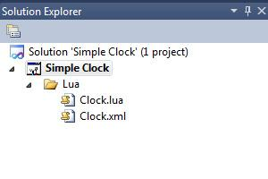
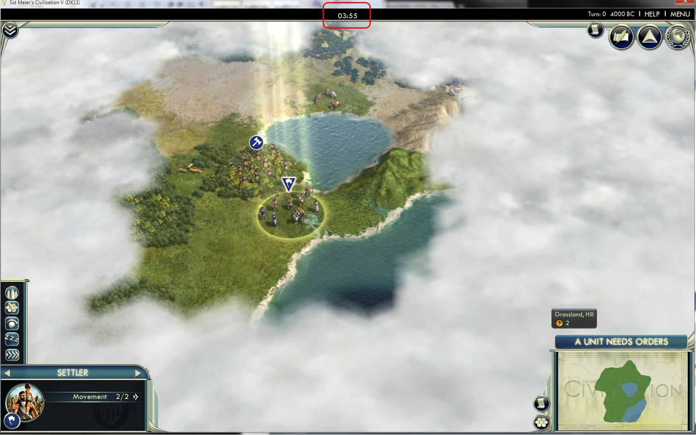
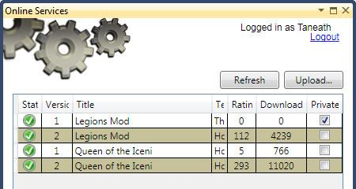
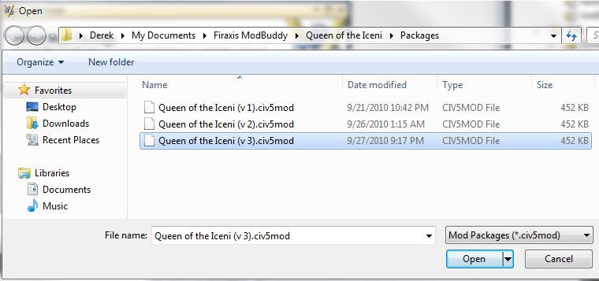

#### 如何用 Lua 禁用单位图标

《文明 5》的单位上方有一个浮动的图标。我们将添加禁用单位图标（Unit Icon）的能力。


先要找到控制单位图标的 Lua 文件。没有简单的引用关系，搜索要花一番功夫。好在 Firaxis 用的文件名相当有含义，单位图标由 “UnitFlagManager.lua” 和 “UnitFlagManager.xml” 文件控制。他们都在 `<Civilization V>\assets\UI\InGame` 目录下。


首先要在项目里添加两个新文件。与添加 XML 文件不同的是 Lua 文件要用 XML 一样的文件名，因此分别重命名新文件为 “UnitFlagManager.lua” 和 “UnitFlagManager.xml”，并且删除两个文件里的内容。它们放在哪个文件夹里不重要，但为让其有序，我创建了 Lua 文件夹，并把两个文件添加到里面。

然后是把原始的 “UnitFlagManager.lua” 和 “UnitFlagManager.xml” 文件的内容复制到空的新副本里。Lua 不像 XML 那样易于模块化（InGameUIAddin 允许某些模块化的 Lua 修改，但很有限）因此需要复制整个文件进行修改。

有很多禁用单位图标的方法，方法因人而异。这里有种禁用的方法。用 “UnitFlagManager.lua” 文件里的 UpdateVisibility() 函数：

```lua
UpdateVisibility = function( self )
    if InStrategicView() then
        local bVisible = self.m_IsCurrentlyVisible and self.m_IsGarrisoned and g_GarrisonedUnitFlagsInStrategicView and not self.m_IsInvisible;
        self.m_Instance.Anchor:SetHide(not bVisible);
    else
        self.m_Instance.Anchor:SetHide(not (self.m_IsCurrentlyVisible and not self.m_IsInvisible));
    end
end,
```

观察这段代码，能够发现如果游戏是处于战略视图状态下，那么当单位可见时，就会显示单位图标，单位不可见时单位图标就会隐藏。如果游戏不是战略视图状态，那么不论单位是否可见，都能显示单位图标。

禁用单位图标最简单的方法是做这样的修改：

```lua
UpdateVisibility = function( self )
    if InStrategicView() then
        local bVisible = self.m_IsCurrentlyVisible and self.m_IsGarrisoned and g_GarrisonedUnitFlagsInStrategicView and not self.m_IsInvisible;
        self.m_Instance.Anchor:SetHide(not bVisible);
    else
        -- Modified by Kael 07/17/2010 to disable the Unit Icon
        -- self.m_Instance.Anchor:SetHide(not (self.m_IsCurrentlyVisible and not self.m_IsInvisible));
        self.m_Instance.Anchor:SetHide(true);
        -- End Modify
    end
end,
```

上面的代码里我们只是简单的把单位图标设置成在游戏不是战略视图时永久隐藏。在战略视图里，同样的规则用于显示单位图标。要注意的是我对所作的修改进行了注释，包含谁做了修改，什么时候改的以及为什么修改它。同时用注释保留了原始文件中的一行代码，万一哪天我想撤回修改或者看看做了什么修改（就不用去找原来的文件了）。

我现在能够发布我制作的模组了，它能够禁用单位图标。但这还不是最好的解决方案。如果玩家能够根据自己的喜好设置是否启用单位图标的话就更好了。让我们在 MiniMap Options 面板里添加一个新的菜单选项，这样玩家就能选择是否显示单位图标了。

首先要加入一些代码，这样才能使用变量而不是简单的把 Anchor Hide 属性设置为 true。

```lua
UpdateVisibility = function( self )
    if InStrategicView() then
        local bVisible = self.m_IsCurrentlyVisible and self.m_IsGarrisoned and g_GarrisonedUnitFlagsInStrategicView and not self.m_IsInvisible;
        self.m_Instance.Anchor:SetHide(not bVisible);
    else
        -- Modified by Kael 07/17/2010 to disable the Unit Icon
        -- self.m_Instance.Anchor:SetHide(not (self.m_IsCurrentlyVisible and not self.m_IsInvisible));
        self.m_Instance.Anchor:SetHide(not (self.m_IsCurrentlyVisible and not self.m_IsInvisible) or bHideUnitIcon);
        -- End Modify
    end
end,
```

这个版本就不是简单的设置单位图标在玩家不是策略视图下永远隐藏了，我们用了一个变量来控制它。如果 bHideUnitIcon 是 true 的话，它就会像之前的代码一样，隐藏单位图标。但如果 bHideUnitIcon 是 false 的话，它就能像游戏的原始代码一样显示单位图标。

需要设置 bHideUnitIcon 的默认值，在 “UnitFlagManager.lua” 文件顶部添加下面的代码：

```lua
-- Added by Kael 07/17/2010 to disable the Unit Icon
local bHideUnitIcon = true;
-- End Add
```

注意 bHideUnitIcon 的默认值是 true，这样单位图标一开始就是隐藏的。现在可以加载我们的模组，确认单位图标是否被隐藏。

第五步，需要给菜单按钮添加文本。创建一个新的 XML 文件夹，然后在该文件夹下创建一个 NewText 文件夹，再在 NewText 文件夹下新建文件，就叫 “GameText.xml”。文件结构便于组织项目，它仿照的是《文明 5》的 xml 文件结构。文件名其实也不重要（文件里的 GameData 标签才重要）。即便把它放在项目根目录下，换个 “stuff.xml”的名字，也能正常运行。

第六，用下面的内容替换 “GameText.xml” 文件中的默认文本。

```xml
<?xml version="1.0" encoding="utf-8"?>
<GameData>
    <Language_en_US>
        <Row Tag="TXT_KEY_MAP_OPTIONS_HIDE_UNIT_ICON">
            <Text>Hide Unit Icons</Text>
        </Row>
    </Language_en_US>
</GameData>
```

上面是一个简单的文本替换。当游戏语音是英语，并且遇到 TXT_KEY_MAP_OPTIONS_HIDE_UNIT_ICON 时，它就会被替换成 “Hide Unit Icons”。

第七，添加可以启用或禁用单位图标的选项，需要再添加两个文件 “MiniMapPanel.lua” 和 “MiniMapPanel.xml”。和 UnitFlagManager 文件一样，我们要创造两个空文件，再分别重命名，并把原始文件的内容复制到项目的副本中。

第八，修改文件 “MiniMapPanel.xml”，添加一个新的复选框。

```xml
<Grid ID="OptionsPanel" Anchor="R,B" Size="300,300" Color="White.256" Style="Grid9DetailSix140" Padding="30,46" Hidden="true" ConsumeMouse="1" >
    <Stack Anchor="C,C" Padding="0" Offset="0,5" StackGrowth="Bottom" ID="MainStack" >
        <Stack Anchor="C,T" Offset="0,0" Padding="0" StackGrowth="Bottom" ID="StrategicStack" >
            <Label Anchor="L,T" ColorSet="Beige_Black" Font="TwCenMT18" Offset="0,5" FontStyle="Shadow" ID="OverlayName" String="TXT_KEY_STRAT_OVERLAY"/>
            <PullDown Style="GenericPullDown" ScrollThreshold="256" Offset="0,5" Size="210,27" SpaceForScroll="0" ID="OverlayDropDown"/>
            <Label Anchor="L,T" ColorSet="Beige_Black" Font="TwCenMT18" Offset="0,5" FontStyle="Shadow" ID="IconName" String="TXT_KEY_STRAT_ICON_MODE"/>
            <PullDown Style="GenericPullDown" ScrollThreshold="256" Offset="0,5" Size="210,27" SpaceForScroll="0" ID="IconDropDown"/>
            <CheckBox Anchor="L,T" TextAnchorSide="Right" Offset="0,0" TextOffset="40,0" IsChecked="1" ID="ShowFeatures" String="TXT_KEY_STRAT_FEATURES" />
            <CheckBox Anchor="L,T" TextAnchorSide="Right" Offset="0,0" TextOffset="40,0" IsChecked="1" ID="ShowFogOfWar" String="TXT_KEY_STRAT_FOW" />
            <Box Anchor="C,T" Offset="0,5" Size="175,1" Color="Beige,120" />
        </Stack>
        <CheckBox Anchor="L,T" TextAnchorSide="Right" Offset="0,0" TextOffset="40,0" IsChecked="0" ID="ShowRecommendation" String="TXT_KEY_MAP_OPTIONS_RECOMMENDATIONS" />
        <CheckBox Anchor="L,T" TextAnchorSide="Right" Offset="0,0" TextOffset="40,0" IsChecked="0" ID="ShowResources" String="TXT_KEY_MAP_OPTIONS_RESOURCE_ICONS" />
        <CheckBox Anchor="L,T" TextAnchorSide="Right" Offset="0,0" TextOffset="40,0" IsChecked="0" ID="ShowYield" String="TXT_KEY_MAP_OPTIONS_YIELD_ICONS" />
        <CheckBox Anchor="L,T" TextAnchorSide="Right" Offset="0,0" TextOffset="40,0" IsChecked="0" ID="ShowGrid" String="TXT_KEY_MAP_OPTIONS_HEX_GRID" />
        <!-- Modified by Kael 07/15/2010-->
        <CheckBox Anchor="L,T" TextAnchorSide="Right" Offset="0,0" TextOffset="40,0" IsChecked="1" ID="HideUnitIcon" String="TXT_KEY_MAP_OPTIONS_HIDE_UNIT_ICON" />
        <!-- End Modify-->
        <Box Anchor="C,T" Size="210,1" Color="0,0,0,0" />
    </Stack>
</Grid>
```

注意，上面依然注解了修改，但是 XML 的注释符与 Lua 不同。注释始于“`<!--`”，止于“`-->`”。添加的那行重要的设定是 IsChecked="1"，这意味着复选框默认是勾选的。复选框的 ID 叫 “HideUnitIcon”，显示的文本是 “TXT_KEY_MAP_OPTIONS_HIDE_UNIT_ICON”。


第九，默认是禁用单位图标，我们添加了菜单选项允许玩家启用或禁用单位图标。但是菜单选项还做不了什么事情。当玩家点击“隐藏单位图标”的复选框时，应该触发我们在 “UnitFlagManager.lua” 文件中的 bHideUnit 变量、


Lua 脚本不能直接调用其它脚本里的函数。如果要一个 Lua 脚本能调用另一个脚本里的函数，我们要用到 LuaEvenets。在 “UnitFlagManager.lua” 文件的开始，我们需要创建一个新的 LuaEvent，如下：

```lua
-- Added by Kael 07/16/2010
local bHideUnitIcon = true;

LuaEvents.ToggleHideUnitIcon.Add(
function()
    if (bHideUnitIcon) then
        bHideUnitIcon = false;
    else
        bHideUnitIcon = true;
    end
end);
-- End Add
```

现在 LuaEvents.ToggleHideUnitIcon() 函数能够被外部 Lua 脚本调用，并且修改脚本中的值了。

最后，我们需要菜单选项能够调用 LuaEvents.ToggleHideUnitIcon()。向 “MiniMapPanel.lua” 文件添加以下内容即可：

```lua
-- Added by Kael 07/16/2010
function OnHideUnitIconChecked( bIsChecked )
    LuaEvents.ToggleHideUnitIcon();
    Events.StrategicViewStateChanged();
end
Controls.HideUnitIcon:RegisterCheckHandler( OnHideUnitIconChecked );
-- End Add
```

上述代码给 HideUnitIcon 注册了一个触发器（也就是我们在 “MiniMapPanel.xml” 文件中添加的复选框的 ID）。如果被选中，它就调用本地的 OnHideUnitIconChecked 函数。OnHideUnitIconChecked 函数再调用 LuaEvent ToggleHideIcon() 以及 Events.StrategicViewStateChanged() 函数。StrategicViewStateChanged() 强制重画图标，这样游戏不会等到下一次更新单位时才添加或者移除图标，玩家一点击复选框就会更新单位。

这就是一个完整的模组，可以通过小地图面板上的菜单选项启用或禁用单位图标。这里我们讲了怎么添加文本，怎么修改 Lua 脚本，怎么绑定 Lua 函数到 XML 对象，以及如何通过 LuaEvents 从一个 Lua 脚本调用另一个脚本的函数。一旦理解了这些基础，就明白了最难的部分，也就是脚本和函数控制着我们想要改变的流程（我们是如何知道 UnitIcons 是 “UnitFlagManager.lua” 文件控制的）以及调用什么函数能够做到我们想要做的（如何知道 StrategicViewStateChanged() 函数会更新单位图标）。对我而言，这意味着查找搜索了很多文件。

一开始会花很久完成上述事情（它花了我很多时间）。但好在这篇文档明显地缩短了要用的时间。现在我知道我所作的下一个改变就会快得多。

#### 如何用 InGameUIAddin 制作模块化的 UI 变化

通过 InGameUIAddin 可以创造模块化的 UI 变化。尽管它功能有限，但它能添加新的 UI 控件，但不能移除或者修改现有的 UI 控件。要移除或者修改现有的 UI 控件，你得照着 “如何用 Lua 禁用单位图标” 替这一节的做法换 Lua 和 XML 文件



这个例子我们将在界面里添加一个时钟。从添加 “Clock.lua” 和 “Clock.xml” 文件开始。它们不是替换文件，因此文件名没关系。所有 Lua 的 UI 变化都要有配套的 XML 和 Lua 文件。XML文件提供结构和设置，Lua 文件提供代码。

首先在 “Clock.xml” 文件中填入以下内容：

```xml
<Context ColorSet="Beige_Black" Font="TwCenMT20" FontStyle="Shadow" >
    <Label Anchor="C,T" Offset="0,10" Font="TwCenMT20" ColorSet="Beige_Black_Alpha" FontStyle="Shadow" ID="ClockLabel"/>
</Context>
```

The above defines a new label with the ID of "ClockLabel". We can see the font (TwCenMT20), color (Beige_Black_Alpha) and location (centered at the top of the screen, with an offset 0 to the left and 10 down) for the label.
以上定义了一个叫做 “ClockLabel” 的新标签。可以看到标签的字体（font，TwCenMT20）,颜色（color，Beige_Black_Alpha）和位置（location，屏幕上方中央，距离左边为 0 ，距下边为 10）。（注： Label 中的 Anchor 指明位置，C 表示 Center、中央，T 表示 Top、顶部）

但这还只是个空标签，需要 “Clock.lua” 来同步时间。“Clock.lua” 的内容如下：

```lua
ContextPtr:SetUpdate(function()
    local t = os.date("%I:%M");
    Controls.ClockLabel:SetString(t);
end);
```

ContextPtr:SetUpdate 在屏幕画面更新时调用。上述代码添加了同步时间的函数。它将时和分赋给 “t” 字符串，然后设置成 XML 文件中定义的 ClockLabel 显示的文本。

下一步是当模组加载时，要加载 UI 的变化，与 XML 需要在模组属性的 actions 页设置 OnModActivated 和 UpdateDatabase 操作类似。对于 InGameUIAddin 变化，我们要转到模组属性的 Content 页，指定这是 InGameUIAddin 变化，以及我们想要激活的文件（相应的 XML 文件不需要指定）。


下面这幅截图中能够看到我们添加的时钟（红色框内的是添加的部分，让它在截图中更容易看到，红色框不是模组添加的）。



#### 如何用 Lua 添加一个新窗口

没有办法在进行游戏时知道你加载了什么模组（注：在 BNW 版本中已经可以查看了）。这一节将会在额外的信息菜单中添加一个新窗口，可以列出所有加载的模组。

在添加新窗口前，还有一些问题需要解决。在前一节里，我们用了 InGameUIAddin 的例子。InGameUIAddin 允许添加新的 UI。但不允许修改现有的 UI 控件。要修改现有的控件，需要替换那些原始的文件。替换 Lua 文件的问题是这可能会与其它替换同样文件的模组冲突。

要让模组工作，得替换以下文件：

- **DiploCorner.lua** -  该文件负责屏幕右上角的 UI 管理。我们将会修改这个文件，添加菜单按钮。
- **DiploCorner.xml** - 这个 XML 文件负责 XML 层面的外交界面管理。
- **InGame.xml** - 这是注册 Lua 文件的主要地方。
- **NotificationLogPopup.lua** - 它控制通知的弹出菜单，我们将会通过这个事件添加一个新的事件。


现在添加两个文件用来控制新窗口：

- **ModList.lua** - 控制窗口的 Lua 文件

- **ModList.xml** - 负责设定模组列表窗口的 XML 文件

1. 第一步是像上面的截图那样，在 Lua 目录下创建相应的文件。从 “`<Civ5 install directory>\Assets\UI\`” 目录下分别复制 “DiploCorner.lua”，“DiploCorner.xml”，“InGame.xml” 以及 “NotificationLogPopup.lua” 等文件的内容到我们新创建的文件里面。

第一个小改动是修改 “InGame.xml” 文件，使之能加载添加的 Lua 文件：

```xml
<LuaContext FileName="Assets/UI/InGame/Popups/SetCityName" ID="SetCityName" Hidden="True" />
<LuaContext FileName="Assets/UI/InGame/Popups/ProductionPopup" ID="ProductionPopup" Hidden="True" />
<!-- Added by Kael 09/17/2010 -->
<LuaContext FileName="Lua/ModList" ID="ModList" Hidden="True" />
<!-- End Add -->
<LuaContext FileName="Assets/UI/InGame/TopPanel" ID="TopPanel" />
```

上面所作的是在加载模组时，同时运行我们的 “ModList.lua” 文件。稍后会介绍更多关于 “ModList.lua” 的信息。

2. 下一步是修改 “DiploCorner.lua” 和 “DiploCorner.xml” 添加新的菜单选项。下面是在 “DiploCorner.lua” 文件里添加的内容：

```lua
local g_MultiPullInfo = {};
g_MultiPullInfo[0] = { text="TXT_KEY_ADVISOR_SCREEN_TECH_TREE_DISPLAY", call=function() Events.SerialEventGameMessagePopup( { Type = ButtonPopupTypes.BUTTONPOPUP_TECH_TREE } ); end };
g_MultiPullInfo[1] = { text="TXT_KEY_DIPLOMACY_OVERVIEW", call=function() Events.SerialEventGameMessagePopup( { Type = ButtonPopupTypes.BUTTONPOPUP_DIPLOMATIC_OVERVIEW } ); end };
g_MultiPullInfo[2] = { text="TXT_KEY_MILITARY_OVERVIEW", call=function() Events.SerialEventGameMessagePopup( { Type = ButtonPopupTypes.BUTTONPOPUP_MILITARY_OVERVIEW } ); end };
g_MultiPullInfo[3] = { text="TXT_KEY_ECONOMIC_OVERVIEW", call=function() Events.SerialEventGameMessagePopup( { Type = ButtonPopupTypes.BUTTONPOPUP_ECONOMIC_OVERVIEW } ); end };
g_MultiPullInfo[4] = { text="TXT_KEY_VP_TT", call=function() Events.SerialEventGameMessagePopup( { Type = ButtonPopupTypes.BUTTONPOPUP_VICTORY_INFO} ); end };
g_MultiPullInfo[5] = { text="TXT_KEY_DEMOGRAPHICS", call=function() Events.SerialEventGameMessagePopup( { Type = ButtonPopupTypes.BUTTONPOPUP_DEMOGRAPHICS} ); end };
g_MultiPullInfo[6] = { text="TXT_KEY_POP_NOTIFICATION_LOG", call=function() Events.SerialEventGameMessagePopup( { Type = ButtonPopupTypes.BUTTONPOPUP_NOTIFICATION_LOG, Data1 = Game.GetActivePlayer() } ); end };

-- Added by Kael 09/17/2010
g_MultiPullInfo[7] = { text="TXT_KEY_MOD_LIST", call=function() Events.SerialEventGameMessagePopup( { Type = ButtonPopupTypes.BUTTONPOPUP_NOTIFICATION_LOG, Data1 = 999 } ); end };
-- End Add
```

这里往 multipull 菜单里添加了新的选项。如果它被选中，它将会把 BUTTONPOPUP_NOTIFICATION_LOG 和 Data1 里的 999 传递出去。然后我们就要捕捉事件，触发弹出菜单。


以上完成了在选项菜单里添加新菜单项的工作。但我们想调整下拉框的大小，让新选项有足够的空间。XML 控制着 UI 的尺寸和形式，因此需要修改 “DiploCorner.xml” 调整大小。

```xml
<!-- ==========================================================================================================-->
<!-- Notification Log DropDownButtons -->
<!-- ==========================================================================================================-->
<PullDown ConsumeMouse="1" Offset="-6,0" Anchor="R,T" Size="45,45" AutoSizePopUp="0" SpaceForScroll="0" ScrollThreshold="900" ID="MultiPull" >
    <ButtonData>
        <Button Anchor="R,T" Size="45.45" Texture="assets\UI\Art\Notification\NotificationNotes.dds" ToolTip="TXT_KEY_DIPLO_ADDITIONAL" >
            <ShowOnMouseOver>
                <Image Anchor="R,T" Offset="0,0" Size="45.45" Texture="assets\UI\Art\Notification\NotificationNotes.dds" />
                <AlphaAnim Anchor="R,T" Offset="0,0" Size="45.45" TextureOffset="0.0" Texture="assets\UI\Art\Notification\NotificationNotesHL.dds" Pause="0" Cycle="Bounce" Speed="2" AlphaStart="0.95" AlphaEnd="0.55"/>
            </ShowOnMouseOver>
        </Button>
    </ButtonData>
    <GridData Anchor="L,T" Offset="-24.-41" AnchorSide="O,I" Style="Grid9DetailTwo140" Padding="0,0" >

<!-- Modified by Kael 09/17/2010
        <Box Color="Black.0" Size="200.260" /> -->
        <Box Color="Black.0" Size="200.280" />
<!-- End Modify -->
```

这把下拉框的大小从 260 调到了 280.

3. 这里用了在 “DiploConer.lua” 文件中添加的 BUTTONPOPUP_NOTIFICATION_LOG 函数。因此当我们选中添加的菜单选项时，它就触发了，就像是 BUTTONPOPUP_NOTIFICATION_LOG 函数被调用了一样。如果能够使用游戏开发包的话，还能给模组列表创建一个 BUTTONPOPUP 设定。没有这个定义就得想其它方法了。因此我们把 999 传给了调用的 BUTTONPOPUP_NOTIFICATION_LOG（通常是传递玩家号码，但也不会接近 999）。

由于利用了 BUTTONPOPUP_NOTIFICATION_LOG 函数，需要屏蔽掉普通的 BUTTONPOPUP_NOTIFICATION_LOG 对话框。这就是在项目中添加 “NotificationLogPopup.lua” 的原因。

记住 Lua 函数不能直接调用其它文件的 Lua 函数。除了带有统一事件处理的 Lua 注册函数以及监控何时响应事件的监控器。这是 “NotificationLogPopup.lua” 文件中普通的 OnPopup 函数：

```lua
function OnPopup( popupInfo )
    -- red area
    if( popupInfo.Type ~= ButtonPopupTypes.BUTTONPOPUP_NOTIFICATION_LOG ) then
        return;
    end
    -- end of red area

    CivIconHookup( Game.GetActivePlayer(), 64, Controls.CivIcon, Controls.CivIconBG, Controls.CivIconShadow, false, true );
    m_PopupInfo = popupInfo;
    g_NotificationInstanceManager:ResetInstances();
    local player = Players[Game.GetActivePlayer()];
    local numNotifications = player:GetNumNotifications();
    for i = 0, numNotifications - 1
    do
        local str = player:GetNotificationStr((numNotifications - 1) - i);
        local index = player:GetNotificationIndex((numNotifications - 1) - i);
        local turn = player:GetNotificationTurn((numNotifications - 1) - i);
        local dismissed = player:GetNotificationDismissed((numNotifications - 1) - i);
        AddNotificationButton(index, str, turn, dismissed);
    end
    Controls.NotificationButtonStack:CalculateSize();
    Controls.NotificationButtonStack:ReprocessAnchoring();
    Controls.NotificationScrollPanel:CalculateInternalSize();
    if( m_PopupInfo.Data1 == 1 ) then
        if( ContextPtr:IsHidden() == false ) then
            OnClose();
        else
            UIManager:QueuePopup( ContextPtr, PopupPriority.eUtmost );
        end
    else
        UIManager:QueuePopup( ContextPtr, PopupPriority.NotificationLog );
    end
end
-- blue area
Events.SerialEventGameMessagePopup.Add( OnPopup );
-- end of blue area
```

上面的代码定义了 OnPopup 函数，它被注册到 SerialEventGameMessagePopup 事件中（蓝色区域）。onPopup 函数里的第一个判断是验证传到 SerialEventGameMessagePopup 中的这个事件是否要被处理。因此检查 popupInfo.Type 是不是 BUTTONPOPUP_NOTIFICATION_LOG （红色区域）。如果不是的话，就会返回并且结束函数。

但我们要让 BUTTONPOPUP_NOTIFICATION_LOG 触发别的函数，不希望触发弹出窗口。因此要在 “NotificationLogPopup.lua” 文件里做些修改：

```lua
function OnPopup( popupInfo )
    if( popupInfo.Type ~= ButtonPopupTypes.BUTTONPOPUP_NOTIFICATION_LOG ) then
        return;
    end

    -- Added by Kael 09/17/2010
    if( popupInfo.Data1 == 999 ) then
        return;
    end
    -- End Add

    CivIconHookup( Game.GetActivePlayer(), 64, Controls.CivIcon, Controls.CivIconBG, Controls.CivIconShadow, false, true );
    m_PopupInfo = popupInfo;
    g_NotificationInstanceManager:ResetInstances();
    local player = Players[Game.GetActivePlayer()];
    local numNotifications = player:GetNumNotifications();
    for i = 0, numNotifications - 1
    do
        local str = player:GetNotificationStr((numNotifications - 1) - i);
        local index = player:GetNotificationIndex((numNotifications - 1) - i);
        local turn = player:GetNotificationTurn((numNotifications - 1) - i);
        local dismissed = player:GetNotificationDismissed((numNotifications - 1) - i);
        AddNotificationButton(index, str, turn, dismissed);
    end
    Controls.NotificationButtonStack:CalculateSize();
    Controls.NotificationButtonStack:ReprocessAnchoring();
    Controls.NotificationScrollPanel:CalculateInternalSize();
    if( m_PopupInfo.Data1 == 1 ) then
        if( ContextPtr:IsHidden() == false ) then
            OnClose();
        else
            UIManager:QueuePopup( ContextPtr, PopupPriority.eUtmost );
        end
    else
        UIManager:QueuePopup( ContextPtr, PopupPriority.NotificationLog );
    end
end
Events.SerialEventGameMessagePopup.Add( OnPopup );
```

以上代码添加了另一个判断。就像如果 type 不是 BUTTONPOPUP_NOTIFICATION_LOG 的判断一样，如果 Data1 的值不是 999，这个判断也会退出函数，这样我们就能使用 BUTTONPOPUP_NOTIFICATION_LOG 函数，不用担心和其它的冲突了。

4. 最后需要为新窗口写代码。首先需要用 XML 定义窗口。这是我在 “ModList.xml” 文件中的设定：

```xml
<Context Font="TwCenMT14" FontStyle="Base" Color="Beige" Color1="Black" >
    <Instance Offset="0,0" Name="NotificationButton" Size="890,60" >
        <Button Size="890,60" Offset="0,0" StateOffsetIncrement="0" ID="Button">
            <Button Anchor="L,C" Offset="0,0" Size="64.64" Texture="assets\UI\Art\WorldView\ActionItemsButton.dds" Hidden="1" ID="GenericButton" />
            <Label Anchor="R,B" Offset="5,8" Font="TwCenMT24" ColorSet="Beige_Black_Alpha" FontStyle="Shadow" String="Turn" ID="NotificationTurnText" />
            <Stack ID="TextStack" Anchor="L,T" Padding="10">
                <Label Anchor="L,T" Offset="16,5" LeadingOffset="-8" WrapWidth="780" Font="TwCenMT18" ColorSet="Beige_Black_Alpha" FontStyle="Shadow" ID="NotificationText" String="Text" />
                <Image Anchor="C,B" Offset="0,0" TextureOffset="0.0" Texture="bar900x2.dds" Size="900.1" />
            </Stack>
            <ShowOnMouseOver>
                <AlphaAnim ID="TextAnim" Anchor="C,C" Offset="10,0" Size="890,64" Pause="0" Cycle="Bounce" Speed="1" AlphaStart="2" AlphaEnd="1">
                    <Grid ID="TextHL" Size="890,64" Offset="0,0" Padding="0,0" Style="Grid9FrameTurnsHL" />
                </AlphaAnim>
            </ShowOnMouseOver>
        </Button>
    </Instance>
    <Box Style="BGBlock_ClearTopBar" />

    <Instance Name="ListingButtonInstance">
        <Button Anchor="L,T" Size="896,32" Offset="0,0" Color="Black.0" StateOffsetIncrement="0,0" ID="Button">
            <ShowOnMouseOver>
                <AlphaAnim Anchor="L,T" Size="896,72" Pause="0" Cycle="Bounce" Speed="1" AlphaStart="1.5" AlphaEnd="1" ID="SelectHighlight">
                    <Grid Size="896,36" Offset="0,0" Padding="0,0" Style="Grid9FrameTurnsHL" />
                </AlphaAnim>
            </ShowOnMouseOver>
            <Stack StackGrowth="Right" Offset="0,0" Padding="0">
                <Box Anchor="L,T" Offset="8,8" Size="175,24" Color="Black.0">
                    <Label Anchor="L,T" Offset="10,0" Font="TwCenMT18" ColorSet="Beige_Black_Alpha" FontStyle="Shadow" String="MOD TITLE" ID="Title" />
                </Box>
            </Stack>
            <Image Anchor="L,B" Offset="0,0" TextureOffset="0.0" Texture="bar900x2.dds" Size="900.1" />
        </Button>
    </Instance>

    <Grid Size="960,658" Anchor="C,C" Offset="0,36" Padding="0,0" Style="Grid9DetailFive140" ConsumeMouse="0">
        <Image Anchor="L,T" Offset="17,90" Texture="HorizontalTrim.dds" Size="926.2" />
        <ScrollPanel Anchor="L,T" ID="ListingScrollPanel" Vertical="1" Size="912,440" Offset="13,94" AutoScrollBar="1">
        <ScrollBar Anchor="R,T" AnchorSide="O,I" Offset="0,18" Length="404" Style="VertSlider"/>
            <UpButton Anchor="R,T" AnchorSide="O,I" Offset="0,0" Style="ScrollBarUp"/>
            <DownButton Anchor="R,B" AnchorSide="O,I" Offset="0,0" Style="ScrollBarDown"/>
            <Stack ID="ListingStack" StackGrowth="B" Offset="4,0" Padding="0" />
        </ScrollPanel>
        <Label String="TXT_KEY_POP_MOD_LIST" ID="Notifications Label" Anchor="C,T" Offset="0,19" Font="TwCenMT20" Color0="30.50.80.255" Color1="133.184.186.255" Color2="133.184.186.255" FontStyle="SoftShadow" />
        <Box Anchor="C,B" AnchorSide="I.I" Offset="0,54" Size="910,56" Color="255,255,255,0" >
            <GridButton Anchor="L,B" Style="SmallButton" Size="150,32" Offset="14,0" StateOffsetIncrement="0,0" ID="CloseButton" >
                <Label Anchor="C,C" Offset="0,0" String="TXT_KEY_CLOSE" Font="TwCenMT18" ColorSet="Beige_Black_Alpha" FontStyle="Shadow" />
            </GridButton>
        </Box>
        <Image Anchor="C,B" Offset="0,110" Texture="HorizontalTrim.dds" Size="926.5" />
    </Grid>
</Context>
```

 在空文件里写出这么多东西很难。我确信有些人能够做到，但显然我不是其中一员。我在窗口文件中寻找和我想要做的窗口差不多的 XML 定义，然后复制，修改，添加，直到它看起来就是我想要的。我用 Notification 窗口作为这个窗口的基础，然后从 ModBrowser 相关文件中复制出我需要的 XML 片段（也就是你在主菜单里选择模组的地方）。由于《文明 5》所有的 UI 都是用 Lua 绘制的，因此能借鉴相应文件中的控件，制作自己的窗口。

以上定义了窗口，但还不能完成逻辑操作。这就是要用到 Lua。“ModList.lua” 文件包含了这些内容：

```lua
include( "InstanceManager" );
g_InstanceManager = InstanceManager:new( "ListingButtonInstance", "Button", Controls.ListingStack );

function OnPopup( popupInfo )
    -- <red>
    if( popupInfo.Type ~= ButtonPopupTypes.BUTTONPOPUP_NOTIFICATION_LOG ) then
        return;
    end
    if( popupInfo.Data1 ~= 999 ) then
        return;
    end
    -- </red>

    local unsortedInstalledMods = Modding.GetInstalledMods();
    g_InstanceManager:ResetInstances();
    for k, v in pairs(unsortedInstalledMods) do
        local modinfo = v;
        if(modinfo == nil) then
            break;
        end
        if(modinfo.Enabled) then
            local listing = g_InstanceManager:GetInstance();
            local str = modinfo.Name;
            if(modinfo.Version ~= "") then
                local version = string.format("version %s (%s)", modinfo.Version or "", modinfo.Stability or "");
                str = string.format("%s - %s", str, version)
            end
            listing.Title:SetText(str);
        end
    end

    UIManager:QueuePopup( ContextPtr, PopupPriority.NotificationLog );
end
-- <blue>
Events.SerialEventGameMessagePopup.Add( OnPopup );
-- </blue>

function OnClose ()
    UIManager:DequeuePopup( ContextPtr );
end
Controls.CloseButton:RegisterCallback( Mouse.eLClick, OnClose );
```

注意，以上代码很像我们修改的 Notification log 代码。像 Notification log popup 一样，它也在 SerialEventGameMessagePopup 中注册了（蓝色区域）。但是本例中,只有当类型是 BUTTONPOPUP_NOTIFICATION_LOG 并且 Data1 是 999 的时候（红色区域），我们才用 OnPopup 函数进行处理。

代码很简单。我从 ModBroser 的 Lua 文件中查找我需要的函数及其调用（这是我找到 Modding.GetInstalledMods() 函数以及返回 .Name 和 .Enabled 属性的方法）。实际上在显示窗口时 OnPopup 函数为每一个已安装并在该局游戏启用的模组添加了一条分割线。显示了每个模组名称，版本号和稳定性（实验性的，初始版，测试版，最终版）。

唯一添加的函数是控制关闭按钮的代码。这就是一个非常简单的添加新窗口的例子了。


### WorldBuilder


Worldbuilder is a map editor and scenario creator for Civilization V. With it maps can be created quickly, and complex scenarios with starting teams can be developed. This section will go through the options in Worldbuilder so that modders can quickly start creating their scenarios.

Across the top of the file bar there is a description option that allows you to enter your map name and a brief description for the players.


Next is the Team editor. It allows the scenario creator to assign the available civilizations for this scenario as well as their starting techs, policies, diplomacy, gold, etc. Before cities or non-barbarian units can be placed on the map those teams need to be assigned in team editor.


The map editor in WorldBuilder is fairly straight forward. The Map Editor Tools box contains all the tools needed to create an interesting map on the following tabs.

- **Edit Plot** - This allows the selected plot to have any terrain, feature, resource and improvement set. This is also where you can set the plot as the start position for any configured players.
- **Plopper** - This tab allows features, resources, improvements, natural wonders and roads to be quickly painted on plots.
- **Paint** - This tab allows differing brush sizes to be used to lay down terrain, features, continent definitions, cultural borders and revealed terrain.
- **Rivers** - If you are familiar with process of laying rivers with the Civ4 WorldBuilder (I'm fairly sure it involved sacrificing a goat) then it is vastly improved in Civ5. All the hex intersections that can support rivers can be clicked to enable or disable a river passing through that intersection.
- **Continents** - This is where areas can be distinguished as continents (Americas, Asia, Africa and Europe).
- **Units** - Only barbarian units can be placed unless there are players set in the team editor. If there are players set then this tab allows all units to be set on the map, and the state (health, fortified, embarked) of that unit.
- **Cities** - Players have to be set on the team editor before this can be used. If that is done cities can be placed on the map, and the population and the buildings in that city can be set.
- **Misc** - The Misc tab allows the world wrap and randomize resources options to be set.

Once your map is complete, select Save from the file menu to save it. It can always be reloaded to make further changes. WorldBuilder maps are saved in the "`..\<My Games>\Sid Meier's Civilization V\Maps\`" directory.

#### 保存文明 5 的地图

If you like the map you are playing on, or believe it may make a good base for your scenario you can save it directly from the game.


To do so go to the save game menu and there is a button for "Save Map".

That will open the Save Map window where a name can be entered. Click save to save the map. The map will be saved in the "`..\<My Games>\Sid Meier's Civilization V\Maps\`" directory (the same directory that WorldBuilder saves its files in).


#### 向模组中添加地图

Copy the map file into your mod in ModBuddy to add it to your mod. The name and location of the map doesn't matter. I recommend creating a "Map" directory off the root of your project to place map's in, but it isn't required.


With the mod loaded your map can be selected from the setup menu. It appears with the normal game maps. In this screenshot Ireland is a map provided by the mod.

If you created custom players in the team editor then you will have a "Load Scenario" option on the setup screen. If this is unchecked your map will be loaded without any custom players, units, cities, etc. Just the map will be used. If "Load Scenario" is selected then the only civilizations/leaders from the map can be loaded.


### 发布模组

Before you can test your mod you need ModBuddy to "Build" it for you. Building is the process of taking everything you have included with your mod and putting it in a format the game can recognize. You will need to Build your mod each time you want all your latest changes to take effect. You should build frequently and test each change as you add it (rather than changing a lot of files at once then having the hard task of figuring out which change is keeping the game from loading).

Once you are ready to share your mod with others you can publish it in two different ways.

The first way is that the files can be distributed outside of the game. The Mod Browser is a great resource, but it isn't required to share mods. Your mod will be in your "`..\< My Games>\Sid Meier's Civilization V\MODS`" directory. You can zip that mod directory and share it with others (who will have to extract it to their "`..\< My Games>\Sid Meier's Civilization V\MODS`" directory).

The second way is through ModBuddy with the "Online Services" option under the Tools menu. This uploads your mod to the mod database so that others will see it in the mod browser.


To upload your mod go through the following steps after selecting Online Services:



1. Login to Gamespy (if required).

2. Select Upload from the Online Services screen. Notice that this screen will also show you the status of mods you have already uploaded, including prior versions.



3. Click the ... button on the Select Mod Package screen to browse for the mod to upload.

4. Select the mod package. It defaults to ../My Documents/Firaxis ModBuddy/<ModName>/Packages directory. If you have multiple versions of the mod they will all appear here. Select the version you want to upload (typically the most recent version).


5. Wait while the Mod uploads.

6. Select the Mod categories that apply to your mod.

That's it, your mod should be uploaded and available for players to download.

To update a mod change the version number on your mod's property screen then reupload using the above process.

#### 兼容性

There are three levels of exclusivity for Civilization V mods.

- **Nonexclusive** - Any mod can be enabled with your mod (default).
- **Partially Exclusive** - Any mod that is referenced by your mod or references your mod can be enabled.
- **Totally Exclusive** - Only mods which are referenced by your mod can be enabled.

Most mod's will be non-exclusive. Meaning that they will work with all other nonexclusive mods (and partially or totally exclusive mods that select them). If you are making a mod that adds a new civilization, new units then you will probably want to make it a nonexclusive mod.

Partially Exclusive is the appropriate setting for total conversion mods. If you make a civil war mod you probably don't want the player to run it with a Spain Civ, or with a mod that adds Firaxis as a new world wonder. If your mod deletes any base assets in the game (removes a resource, tech, etc) you will probably want it to be Partially Exclusive, since those assets may be used by other mods. If you or other mod authors set their mod to be able to run together with yours then they will be able to be run together.

Totally Exclusive is the ultimate in mod control. Your mod can't be used in combination with any other mods unless you specifically allow that mod. The only difference between this and being partially exclusive is that it keeps other mod authors from being able to allow their mods to be able to work with yours. This setting should be very rare, only for mod authors who have had problems with other mod authors marking their mods compatible and causing compatibility issues.

### 排除故障

If you are a dumb guy like me, you spend 10% of your time creating, and 90% of the time trying to figure out why it doesn't work. Of all the files Firaxis provides to help us mod, I spend the most time looking at the debug logs.

The debug logs are located in the "..\My Games\Sid Meier's Civilization 5\Logs\" directory. There are numerous files here, I find it helpful to sort the files by date to see which file has been updated the most recently. I won't go through all the files here, only the two I refer to most commonly.

#### Database.log

This file contains all the exceptions when the database loads. This typically means XML reference issues. If a Civilization refers to a leader that doesn't exist anymore, or a unit refers to a resource that has been removed then the Database.log is a great place to find it.

This is a great place to find mistypes. If you have spelled LEADER_ELIZABETH incorrectly and your game is crashing on load this log file will give you a clue as to what went wrong. Here are some sample errors from Database.log:

```
[207898.601] Invalid Reference on Civilizations.Civilopedia - "TXT_KEY_CIV_RUSSIA_PEDIA" does not exist in Language_en_US
[207898.616] Invalid Reference on Feature_YieldChanges.FeatureType - "FEATURE_RIVER" does not exist in Features
```

#### Lua.log

Much as the Database.log helps you isolate XMl problems Lua.log helps you isolate Lua errors. Notice that in most cases (as in the example below) the Lua.log file gives you the file generating the error and the line number. Very handy when trying to figure out why your mod isn't working.

```
[202778.570] Syntax Error: [string "Lua/ModList.lua"]:165: 'end' expected (to close 'function' at line 14) near '<eof>'
[202778.570] Runtime Error: Error loading Lua/ModList.lua.
```
